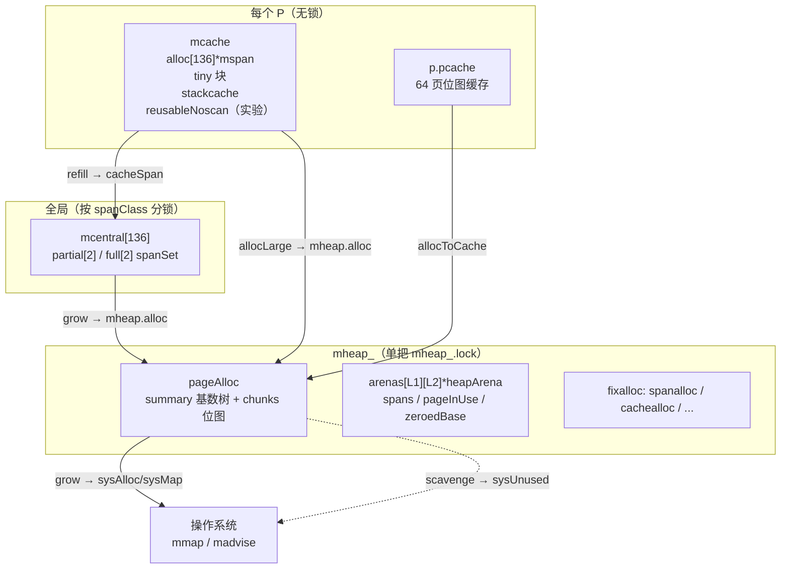
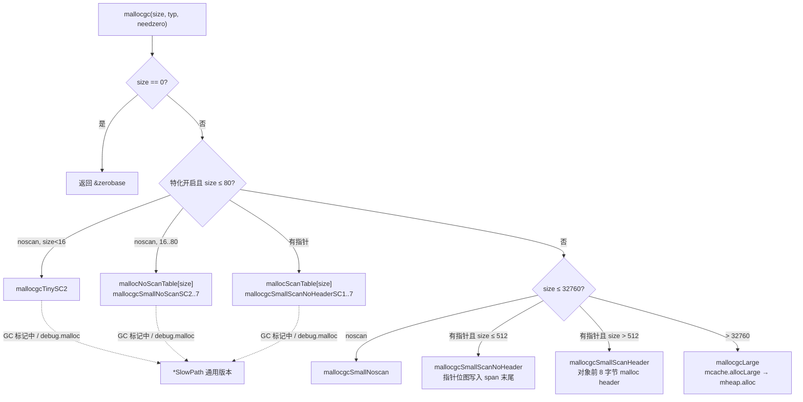
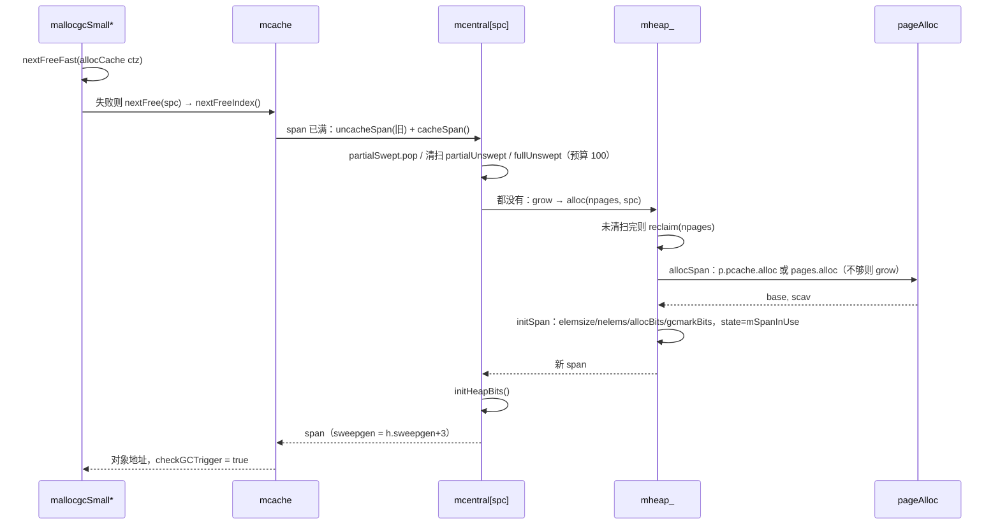
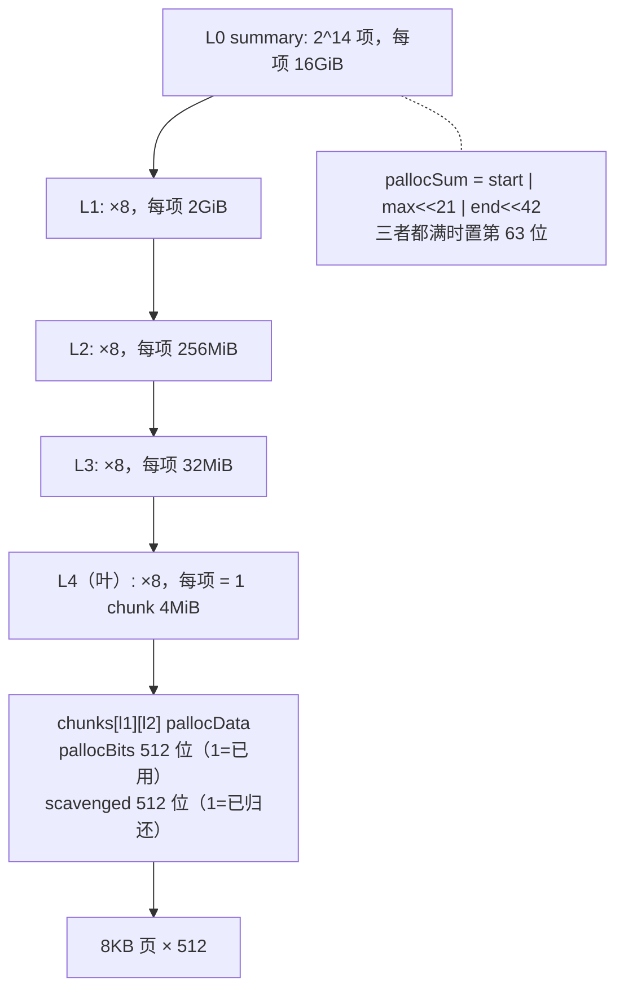
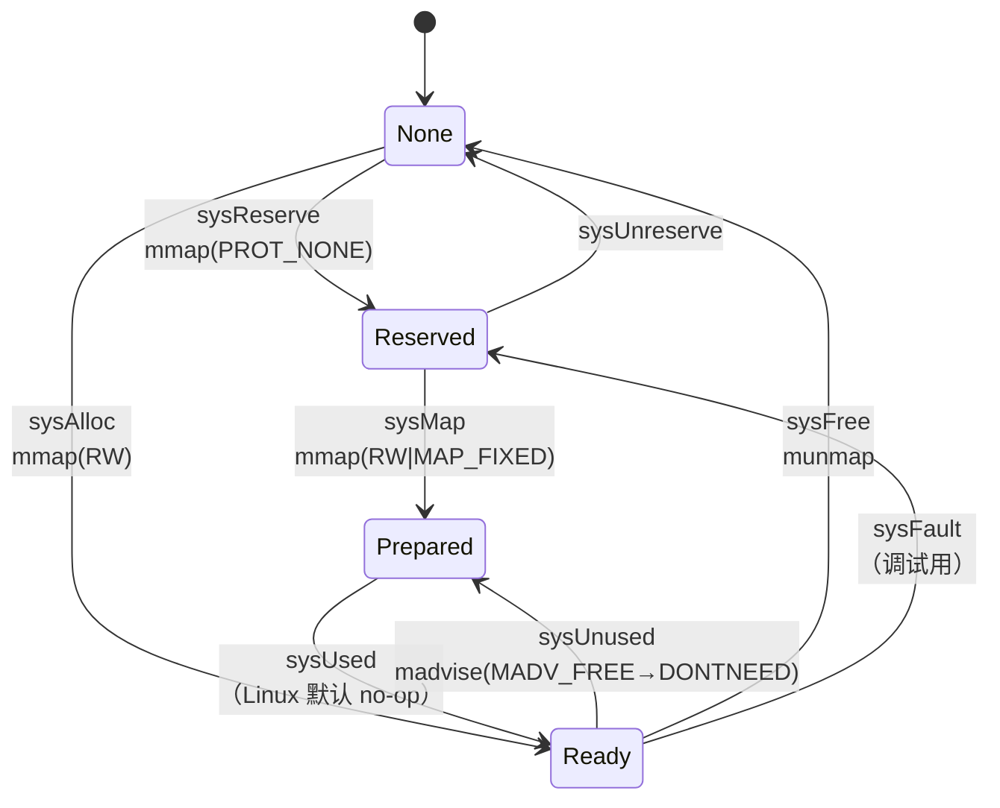

# Go 源码实现详解（九）：内存分配器

先说结论：

1. Go 的堆分配器脱胎于 TCMalloc，但已经"分道扬镳"很远。它把地址空间切成 64MB 的 arena，把 arena 切成 8KB 的页，把页组合成 `mspan`，再把 span 按 68 个 size class（外加 scan/noscan 两种口味，共 136 个 spanClass）分门别类。每个 P 有一个 `mcache` 缓存 span，全局每个 spanClass 有一个 `mcentral`，最底层是 `mheap` 和它内嵌的页分配器 `pageAlloc`。
2. `mallocgc` 早已不是一个大函数：当前 master 上它只是一个分发器，实际工作由 `mallocgcTiny`、`mallocgcSmallNoscan`、`mallocgcSmallScanNoHeader`、`mallocgcSmallScanHeader`、`mallocgcLarge` 五个函数完成。更进一步，对 80 字节以内的请求，运行时通过 `runtime/_mkmalloc` 工具把这些函数"按 size class 展开"成 `mallocgcSmallScanNoHeaderSC1`…`SC7`、`mallocgcSmallNoScanSC2`…`SC7`、`mallocgcTinySC2` 等常量特化版本，并用两张 81 项的函数表按字节数直接跳转。
3. 自 Go 1.22 起，堆位图不再集中存放在 arena 元数据里：小于等于 512 字节（64 位平台）的含指针对象，其指针位图内联在 span 末尾；更大的小对象在对象前额外放一个 8 字节的 malloc header 指向类型；大对象则把类型存进 `mspan.largeType`。
4. 页级分配使用一棵隐式基数树（`pageAlloc.summary`，5 层）配合每 chunk 512 页的位图做"地址有序首次适配"，每个 P 还有一个 64 页的 `pageCache` 做无锁快路径。
5. 归还内存由 scavenger 负责：后台 goroutine `bgscavenge` 以约 1% 的 CPU 预算把空闲页用 `MADV_FREE`/`MADV_DONTNEED` 还给内核，目标由 GC 目标（`retainExtraPercent`=10）和 `GOMEMLIMIT`（`reduceExtraPercent`=5）共同决定；分配路径上还会在堆增长或逼近内存上限时同步 scavenge。

下面按"自顶向下、由快到慢"的顺序展开。除非特别说明，本文所有代码均来自 golang/go master 提交 fdcd66b（Go 1.28 开发版），路径相对仓库根目录。

## 一、总体分层：从 TCMalloc 到四级缓存

### 1.1 设计注释里的四层结构

`src/runtime/malloc.go` 顶部有一段经典的设计注释，它是理解整个分配器的地图：

```go
// src/runtime/malloc.go（文件头注释）
// This was originally based on tcmalloc, but has diverged quite a bit.
//
// The main allocator works in runs of pages.
// Small allocation sizes (up to and including 32 kB) are
// rounded to one of about 70 size classes, each of which
// has its own free set of objects of exactly that size.
// Any free page of memory can be split into a set of objects
// of one size class, which are then managed using a free bitmap.
//
// The allocator's data structures are:
//
//	fixalloc: a free-list allocator for fixed-size off-heap objects,
//		used to manage storage used by the allocator.
//	mheap: the malloc heap, managed at page (8192-byte) granularity.
//	mspan: a run of in-use pages managed by the mheap.
//	mcentral: collects all spans of a given size class.
//	mcache: a per-P cache of mspans with free space.
//	mstats: allocation statistics.
```

注释接着描述小对象分配的四步爬升：先在本 P 的 `mcache` 里对应 spanClass 的 span 中扫位图找空槽（无锁）；没有就从 `mcentral` 拿一个有空位的 span（摊销一次锁）；`mcentral` 也没有就向 `mheap` 要一段页；`mheap` 也没有就向操作系统申请至少 1MB 的页。大对象（>32KB）直接绕过 `mcache`/`mcentral` 找 `mheap`。

值得一提的是，这段注释里"Each arena has an associated heapArena object that stores the metadata for that arena: the heap bitmap for all words in the arena and the span map"这句已经过时——Go 1.22 之后 `heapArena` 结构里不再有 `bitmap` 字段（见第六节），但"span map"（`spans` 数组）仍然在。



### 1.2 关键常量

这些常量散落在 `src/runtime/malloc.go` 与 `src/internal/runtime/gc/`（1.25 之后运行时与 GC 共享的常量和表被挪到了这个内部包）：

```go
// src/internal/runtime/gc/sizeclasses.go（由 mksizeclasses.go 生成）
const (
	MinHeapAlign       = 8
	MaxSmallSize       = 32768
	SmallSizeDiv       = 8
	SmallSizeMax       = 1024
	LargeSizeDiv       = 128
	NumSizeClasses     = 68
	PageShift          = 13
	MaxObjsPerSpan     = 1024
	MaxSizeClassNPages = 10
	TinySize           = 16
	TinySizeClass      = 2
)
```

`src/runtime/malloc.go` 里的 `maxSmallSize = gc.MaxSmallSize`、`pageSize = 1 << gc.PageShift`（8KB）、`_TinySize = gc.TinySize`（16B）都是从这里引用的。另一组是地址空间相关的：

```go
// src/runtime/malloc.go（const 块，删减）
	heapAddrBits = (_64bit*(1-goarch.IsWasm)*(1-goos.IsIos*goarch.IsArm64))*48 + ... // 64 位一般为 48
	maxAlloc = (1 << heapAddrBits) - (1-_64bit)*1
	heapArenaBytes = 1 << logHeapArenaBytes           // 64 位非 Windows: 64MB
	pagesPerArena = heapArenaBytes / pageSize         // 8192 页
	arenaL1Bits = 6 * (_64bit * goos.IsWindows)       // 多数 64 位平台为 0
	arenaL2Bits = heapAddrBits - logHeapArenaBytes - arenaL1Bits // 48-26-0 = 22
	arenaBaseOffset = 0xffff800000000000*goarch.IsAmd64 + 0x0a00000000000000*goos.IsAix
	minLegalPointer uintptr = 4096
```

注释里附了一张表：`*/64-bit` 是 48 位地址、64MB arena、L1 只有 1 项、L2 有 4M 项（占 32MB 虚拟空间）；`windows/64-bit` 用 4MB arena，L1 64 项、L2 1M 项。amd64 特别之处在于用户地址是 48 位符号扩展，所以用 `arenaBaseOffset = 1<<47` 的补码形式把"负地址"平移到从 0 开始的索引空间。

## 二、地址空间：arena、heapArena 与 arenaHint

### 2.1 mheap 与 heapArena

`src/runtime/mheap.go` 里的 `mheap` 是一个只允许放在堆外的巨型结构：

```go
// src/runtime/mheap.go  type mheap（删减）
type mheap struct {
	_ sys.NotInHeap
	lock mutex          // 只能在系统栈上获取，否则栈增长会自死锁
	pages pageAlloc     // page allocation data structure
	sweepgen uint32     // sweep generation, see comment in mspan; written during STW
	allspans []*mspan   // all spans out there
	pagesInUse atomic.Uintptr // 比例清扫相关，另有 pagesSwept / sweepPagesPerByte 等
	// ...
	arenas [1 << arenaL1Bits]*[1 << arenaL2Bits]*heapArena
	arenaHints *arenaHint
	heapArenas []arenaIdx
	curArena struct{ base, end uintptr }
	central [numSpanClasses]struct {
		mcentral mcentral
		pad      [(cpu.CacheLinePadSize - unsafe.Sizeof(mcentral{})%cpu.CacheLinePadSize) % cpu.CacheLinePadSize]byte
	}
	spanalloc  fixalloc // allocator for span
	cachealloc fixalloc // allocator for mcache
	specialfinalizeralloc fixalloc
	// ... 其他 special* fixalloc、arenaHintAlloc、userArena、cleanupID 等
}
var mheap_ mheap
```

三个关键点：`pages` 是内嵌的页分配器（第七节）；`central` 是按 spanClass 索引、按缓存行填充的 `mcentral` 数组；`arenas` 是二级数组，`arenaIndex(p)` 把地址换算成 `arenaIdx`，再用 `.l1()`/`.l2()` 定位到 `*heapArena`：

```go
// src/runtime/mheap.go  func arenaIndex / arenaBase
func arenaIndex(p uintptr) arenaIdx {
	return arenaIdx((p - arenaBaseOffset) / heapArenaBytes)
}
func arenaBase(i arenaIdx) uintptr {
	return uintptr(i)*heapArenaBytes + arenaBaseOffset
}
```

在 `arenaL1Bits == 0` 的平台上 `l1()` 永远返回 0，编译器会把这一层索引优化掉。`heapArena` 是每个 arena 的元数据，当前版本的字段如下：

```go
// src/runtime/mheap.go  type heapArena（删减注释）
type heapArena struct {
	_ sys.NotInHeap
	spans [pagesPerArena]*mspan            // 页号 -> *mspan
	pageInUse [pagesPerArena / 8]uint8     // 每个 span 首页一位：mSpanInUse
	pageMarks [pagesPerArena / 8]uint8     // 每个 span 首页一位：有被标记对象
	pageSpecials [pagesPerArena / 8]uint8  // 每个 span 首页一位：有 special 记录
	pageUseSpanInlineMarkBits [pagesPerArena / 8]uint8 // Green Tea GC：span 内联标记位
	checkmarks *checkmarksMap
	zeroedBase uintptr                     // 本 arena 内首个"从未用过、必然为零"的字节偏移
}
```

`spans` 就是 `spanOf(p)` 的查表依据；`zeroedBase` 配合页分配器的地址有序策略，让 `mheap.allocNeedsZero` 只用一次 CAS 就能判定新分配的页是否需要清零（这是 `mspan.needzero` 的来源）。

### 2.2 arenaHint 与堆基址

`mallocinit`（`src/runtime/malloc.go`）在 64 位平台上会预生成 128 个 `arenaHint`（结构只有 `addr`、`down`、`next` 三个字段）：

```go
// src/runtime/malloc.go  func mallocinit（删减）
		for i := 0x7f; i >= 0; i-- {
			var p uintptr
			switch {
			case raceenabled:
				// The TSAN runtime requires the heap to be in the range [0x00c000000000, 0x00e000000000).
				p = uintptr(i)<<32 | uintptrMask&(0x00c0<<32)
			case randomizeHeapBase:
				prefix := uintptr(randHeapBasePrefix+byte(i)) << (randHeapAddrBits - 8)
				p = prefix | (randHeapBase & randHeapBasePrefixMask)
			case GOARCH == "arm64":
				p = uintptr(i)<<40 | uintptrMask&(0x0040<<32)
			default:
				p = uintptr(i)<<40 | uintptrMask&(0x00c0<<32)
			}
			hintList := &mheap_.arenaHints
			if (!raceenabled && i > 0x3f) || (raceenabled && i > 0x5f) {
				hintList = &mheap_.userArena.arenaHints
			}
			hint := (*arenaHint)(mheap_.arenaHintAlloc.alloc())
			hint.addr = p
			hint.next, *hintList = *hintList, hint
		}
```

这就是 Go 堆地址常以 `0xc000...` 开头的由来：注释解释了 `0x00c0` 在小端下不是合法 UTF-8 序列、也远离常见字节 `0xff`，能降低保守扫描误判的概率。后一半的 hint（`i > 0x3f`）被留给了 user arena。

一个版本差异：当前 master 上 `randomizeHeapBase = goexperiment.RandomizedHeapBase64 && goarch.PtrSize == 8 && !isSbrkPlatform && !raceenabled && ...`，而 `src/internal/buildcfg/exp.go` 中 `RandomizedHeapBase64: true` 是默认开启的。也就是说在 64 位 Linux 上，Go 1.28 开发版默认会随机化堆基址：`mallocinit` 用 `bootstrapRand()` 生成种子，先随机化 arena 对齐的高位；`mheap.grow` 首次增长时再随机化 chunk 对齐的中位，并调用 `h.pages.markRandomPaddingPages` 把随机数量的页标记为"已分配且已 scavenge"，让最终的堆基址在页粒度上也是随机的。

真正向操作系统预留 arena 的是 `mheap.sysAlloc`：

```go
// src/runtime/malloc.go  func (h *mheap) sysAlloc（删减）
	n = alignUp(n, heapArenaBytes)
	// Try to grow the heap at a hint address.
	for *hintList != nil {
		hint := *hintList
		p := hint.addr
		if hint.down {
			p -= n
		}
		// ...
			v = sysReserve(unsafe.Pointer(p), n, "heap reservation")
		if p == uintptr(v) {
			// Success. Update the hint.
			if !hint.down {
				p += n
			}
			hint.addr = p
			size = n
			break
		}
		// Failed. Discard this hint and try the next.
		if v != nil {
			sysUnreserve(v, n)
		}
		*hintList = hint.next
		h.arenaHintAlloc.free(unsafe.Pointer(hint))
	}
	if size == 0 {
		v, size = sysReserveAligned(nil, n, heapArenaBytes, "heap") // 所有 hint 都失败，接受内核给的任意对齐地址
		// ... 为新区域创建向上、向下两个 hint
	}
```

拿到地址后，函数为覆盖到的每个 arena 索引分配 L2 数组（`sysAllocOS`，不计入统计）和 `heapArena` 对象（`persistentalloc`），并把 `arenaIdx` 追加到 `h.heapArenas`。注意 `sysAlloc` 返回的区域处于 Reserved 状态（`PROT_NONE`），要等到 `mheap.grow` 里 `sysMap` 才变成 Prepared（第八节）。

## 三、size class 表与按尺寸生成的分配函数

### 3.1 sizeclasses.go 已迁入 internal/runtime/gc

老读者的记忆里 size class 表在 `src/runtime/sizeclasses.go`。当前 master 上这个文件已经不存在，表在 `src/internal/runtime/gc/sizeclasses.go`，生成器则是 `src/runtime/_mkmalloc/mksizeclasses.go`（文件头 `//go:generate go -C ../../../runtime/_mkmalloc run mksizeclasses.go`）。生成器注释说明了设计目标：

```go
// src/runtime/_mkmalloc/mksizeclasses.go（文件头注释）
// The size classes are chosen so that rounding an allocation
// request up to the next size class wastes at most 12.5% (1.125x).
//
// Each size class has its own page count that gets allocated
// and chopped up when new objects of the size class are needed.
// That page count is chosen so that chopping up the run of
// pages into objects of the given size wastes at most 12.5% (1.125x)
// of the memory. It is not necessary that the cutoff here be
// the same as above.
//
// The two sources of waste multiply, so the worst possible case
// for the above constraints would be that allocations of some
// size might have a 26.6% (1.266x) overhead.
```

生成文件开头是一张 67 行的表（class 0 保留给大对象），摘几行感受一下：

```text
// class  bytes/obj  bytes/span  objects  tail waste  max waste  min align
//     1          8        8192     1024           0     87.50%          8
//     2         16        8192      512           0     43.75%         16
//     3         24        8192      341           8     29.24%          8
//    ...
//    26        512        8192       16           0      6.05%        512
//    35       1408       16384       11         896     14.00%        128
//    ...
//    67      32768       32768        1           0     12.50%       8192
```

表后面是四个数组：`SizeClassToSize`（class→字节）、`SizeClassToNPages`（class→span 页数，最大 10）、`SizeClassToDivMagic`（用乘法代替除法算对象下标）、以及两个查找表 `SizeToSizeClass8`（≤1024 字节按 8 字节一档）和 `SizeToSizeClass128`（1024～32768 按 128 字节一档）。`roundupsize` 展示了查表方式，也顺带揭示了 malloc header 的存在：

```go
// src/runtime/msize.go  func roundupsize
func roundupsize(size uintptr, noscan bool) (reqSize uintptr) {
	reqSize = size
	if reqSize <= maxSmallSize-gc.MallocHeaderSize {
		// Small object.
		if !noscan && reqSize > gc.MinSizeForMallocHeader { // !noscan && !heapBitsInSpan(reqSize)
			reqSize += gc.MallocHeaderSize
		}
		// (reqSize - size) is either mallocHeaderSize or 0. We need to subtract mallocHeaderSize
		// from the result if we have one, since mallocgc will add it back in.
		if reqSize <= gc.SmallSizeMax-8 {
			return uintptr(gc.SizeClassToSize[gc.SizeToSizeClass8[divRoundUp(reqSize, gc.SmallSizeDiv)]]) - (reqSize - size)
		}
		return uintptr(gc.SizeClassToSize[gc.SizeToSizeClass128[divRoundUp(reqSize-gc.SmallSizeMax, gc.LargeSizeDiv)]]) - (reqSize - size)
	}
	// Large object. Align reqSize up to the next page. Check for overflow.
	reqSize += pageSize - 1
	if reqSize < size {
		return size
	}
	return reqSize &^ (pageSize - 1)
}
```

注意"小对象"的上界是 `maxSmallSize - MallocHeaderSize`，即 32760 字节，因为带 header 的对象要留 8 字节。

### 3.2 spanClass：size class 乘二

每个 size class 有 scan 与 noscan 两个变体，合成一个 `spanClass`（`src/runtime/mheap.go`）：

```go
// src/runtime/mheap.go  spanClass
type spanClass uint8

const (
	numSpanClasses = gc.NumSizeClasses << 1
	tinySpanClass  = spanClass(tinySizeClass<<1 | 1)
)

func makeSpanClass(sizeclass uint8, noscan bool) spanClass {
	return spanClass(sizeclass<<1) | spanClass(bool2int(noscan))
}
func (sc spanClass) sizeclass() int8 { return int8(sc >> 1) }
func (sc spanClass) noscan() bool    { return sc&1 != 0 }
```

`tinySpanClass` 是 class 2（16 字节）的 noscan 版本，即 `spanClass(5)`。把 noscan 对象单独放进不同的 span，GC 扫描时就可以整段跳过。

### 3.3 mkmalloc：按 size class 展开的专用分配函数

这是当前版本相对 Go 1.22～1.25 最大的结构变化。`src/runtime/malloc_stubs.go` 的头注释解释了机制：

```go
// src/runtime/malloc_stubs.go（文件头注释）
// This file contains stub functions that are not meant to be called directly,
// but that will be assembled together using the inlining logic in runtime/_mkmalloc
// to produce a full mallocgc function that's specialized for a span class
// or specific size in the case of the tiny allocator.
//
// To generate the specialized mallocgc functions, do 'go run .' inside runtime/_mkmalloc.
//
// To assemble a mallocgc function, the mallocStub function is cloned, and the call to
// inlinedMalloc is replaced with the inlined body of smallStub or tinyStub,
// depending on the parameters being specialized.
//
// The size_ (for the tiny case) and elemsize_, sizeclass_, noscanint_, and isNoScan_ (for all
// three cases) identifiers are replaced with the value of the parameter in the specialized case.
```

`src/runtime/_mkmalloc/mkmalloc.go` 用 `go/ast` 做源码级内联：把 `mallocStub` 克隆一份，把 `elemsize_`、`sizeclass_` 等占位常量替换成具体值，把 `nextFreeFastStub`、`writeHeapBitsSmallStub` 等 stub 直接内联进去，写出 `src/runtime/malloc_generated.go`。`constants.go` 里的 `specializedMallocMax = 80` 决定了只为 80 字节以内（size class 1～7）生成特化版本，注释说更大尺寸"收益极小，有时反而更慢"。

生成结果有三类函数：`mallocgcSmallScanNoHeaderSC1`～`SC7`、`mallocgcSmallNoScanSC2`～`SC7`、`mallocgcTinySC2`，加上三个通用慢路径 `mallocgcTinySlowPath`、`mallocgcSmallScanSlowPath`、`mallocgcSmallNoScanSlowPath`。`src/runtime/malloc_tables_generated.go` 则是两张 81 项的跳转表 `mallocScanTable` 与 `mallocNoScanTable`，下标就是字节数（下标 0 是 `mallocPanic`，1～8 指向 `SC1`，9～16 指向 `SC2`，以此类推）。看一眼生成的 `mallocgcTinySC2`，所有 span 几何参数都变成了编译期常量，连 `nextFreeFast` 也被内联并用常量 `nelems` 做比较：

```go
// src/runtime/malloc_generated.go  func mallocgcTinySC2（删减）
	span := c.alloc[tinySpanClass]

	const nbytes = 8192
	const nelems = uint16((nbytes - unsafe.Sizeof(spanInlineMarkBits{})) / 16)
	var nextFreeFastResult gclinkptr
	if span.allocCache != 0 {
		theBit := sys.TrailingZeros64(span.allocCache)
		result := span.freeindex + uint16(theBit)
		if result < nelems {
			// ... 与 nextFreeFast 相同，只是 elemsize 是常量 16
			nextFreeFastResult = gclinkptr(uintptr(result)*16 + span.base())
		}
	}
	v := nextFreeFastResult
	if v == 0 {
		v, span, checkGCTrigger = c.nextFree(tinySpanClass)
	}
```

这个开关由 `sizeSpecializedMallocEnabled` 控制：`GOOS != "plan9" && !asanenabled && !raceenabled && !msanenabled && !valgrindenabled`（plan9 用 `malloc_tables_plan9.go` 替代）。

## 四、mallocgc：分发器与五条路径

### 4.1 分发逻辑

```go
// src/runtime/malloc.go  func mallocgc（删减）
//go:linkname mallocgc
func mallocgc(size uintptr, typ *_type, needzero bool) unsafe.Pointer {
	// Short-circuit zero-sized allocation requests.
	if size == 0 {
		return unsafe.Pointer(&zerobase)
	}
	if sizeSpecializedMallocEnabled && size < uintptr(len(mallocNoScanTable)) {
		if typ == nil || !typ.Pointers() {
			if size >= maxTinySize {
				return mallocNoScanTable[size](size, typ, needzero)
			}
			return mallocgcTinySC2(size, typ, needzero)
		} else {
			if !needzero {
				throw("objects with pointers must be zeroed")
			}
			return mallocScanTable[size](size, typ, needzero)
		}
	}
	lockRankMayQueueFinalizer()
	// ... debug.malloc 时 preMallocgcDebug；ASAN 红区；gcBlackenEnabled != 0 时 deductAssistCredit(size)
	var x unsafe.Pointer
	var elemsize uintptr
	if sizeSpecializedMallocEnabled {
		if size <= maxSmallSize-gc.MallocHeaderSize {
			if typ == nil || !typ.Pointers() {
				x, elemsize = mallocgcSmallNoscan(size, typ, needzero)
			} else if heapBitsInSpan(size) {
				x, elemsize = mallocgcSmallScanNoHeader(size, typ)
			} else {
				x, elemsize = mallocgcSmallScanHeader(size, typ)
			}
		} else {
			x, elemsize = mallocgcLarge(size, typ, needzero)
		}
	} else {
		// 未启用尺寸特化（sanitizer/plan9）：多一个 size < maxTinySize && gp.secret == 0 的 mallocgcTiny 分支
	}
	// ... race/msan/asan/valgrind 通知、按 elemsize-size 补扣 assist 债务、postMallocgcDebug
	return x
}
```

几点解读：

- `mallocgc` 头顶有一长串"hall of shame"注释：sonic、frugal、pebble 等库通过 `go:linkname` 直接调用它，因此签名被冻结（issue 67401）。
- 零长度分配统一返回 `&zerobase`，这就是为什么所有 `struct{}{}` 和空切片的底层数组地址相同。
- 特化路径命中后不再回到通用尾部，因为生成函数内部自己处理了 profiling、GC 触发等；而 `debug.malloc`、`gcBlackenEnabled != 0`（GC 标记进行中，需要辅助标记）或 `RuntimeSecret` 模式下，生成函数会把请求转交 `*SlowPath` 版本。
- 在未特化的分支里，tiny 分配增加了 `gp.secret == 0` 的条件：`runtime/secret` 实验要求 secret 对象释放后立刻清零，而 tiny 块会被邻居"续命"，所以避开 tiny 分配器（issue 76356）。



### 4.2 tiny 路径：16 字节块的拼装

```go
// src/runtime/malloc.go  func mallocgcTiny（删减）
	c := getMCache(mp)
	off := c.tinyoffset
	// Align tiny pointer for required (conservative) alignment.
	if size&7 == 0 {
		off = alignUp(off, 8)
	} else if goarch.PtrSize == 4 && size == 12 {
		off = alignUp(off, 8)
	} else if size&3 == 0 {
		off = alignUp(off, 4)
	} else if size&1 == 0 {
		off = alignUp(off, 2)
	}
	if off+size <= maxTinySize && c.tiny != 0 {
		// The object fits into existing tiny block.
		x := unsafe.Pointer(c.tiny + off)
		c.tinyoffset = off + size
		c.tinyAllocs++
		mp.mallocing = 0
		releasem(mp)
		return x, 0
	}
	// Allocate a new maxTinySize block.
	span := c.alloc[tinySpanClass]
	v := nextFreeFast(span)
	if v == 0 {
		v, span, checkGCTrigger = c.nextFree(tinySpanClass)
	}
	x := unsafe.Pointer(v)
	(*[2]uint64)(x)[0] = 0 // Always zero
	(*[2]uint64)(x)[1] = 0
	if !raceenabled && (size < c.tinyoffset || c.tiny == 0) {
		c.tiny = uintptr(x)
		c.tinyoffset = size
	}
```

函数内的长注释交代了取舍：块大小 16 字节意味着最坏 2 倍浪费（只剩一个子对象存活时整块无法回收），8 字节没有浪费但几乎无法合并，32 字节会到 4 倍。它的主要服务对象是小字符串和逃逸的独立变量，json 基准上减少约 12% 的分配次数、约 20% 的堆大小。tiny 块必须是 noscan，否则 GC 无法为其中一个子对象单独维护指针位图。命中已有块时返回的 `elemsize` 是 0，意味着这次分配不计入 GC 辅助债务。

### 4.3 小对象 noscan 与 scan 路径

三条小对象路径骨架完全一致：算 size class → 从 `c.alloc[spc]` 取 span → `nextFreeFast` → 失败则 `c.nextFree` → 视 `needzero && span.needzero != 0` 清零 → 写类型信息 → `publicationBarrier()` → GC 进行中则 `gcmarknewobject`（分配即黑）否则更新 `span.freeIndexForScan` → 采样 profiling → 检查 GC 触发。差别只在类型信息那一步：

```go
// src/runtime/malloc.go  func mallocgcSmallScanNoHeader（删减）
	sizeclass := gc.SizeToSizeClass8[divRoundUp(size, gc.SmallSizeDiv)]
	spc := makeSpanClass(sizeclass, false)
	span := c.alloc[spc]
	v := nextFreeFast(span)
	if v == 0 {
		v, span, checkGCTrigger = c.nextFree(spc)
	}
	x := unsafe.Pointer(v)
	if span.needzero != 0 {
		memclrNoHeapPointers(x, size)
	}
	if goarch.PtrSize == 8 && sizeclass == 1 {
		// initHeapBits already set the pointer bits for the 8-byte sizeclass
		// on 64-bit platforms.
		c.scanAlloc += 8
	} else {
		c.scanAlloc += heapSetTypeNoHeader(uintptr(x), size, typ, span)
	}
	size = uintptr(gc.SizeClassToSize[sizeclass])
```

`mallocgcSmallScanNoHeader` 只用 `SizeToSizeClass8` 查表——因为能走这条路的对象都不超过 512 字节。8 字节 class 1 的 scan span 更是在 `initHeapBits` 里一次性把位图全填 1（一个 8 字节含指针对象只能是指针本身），分配时无需再写。

`mallocgcSmallScanHeader` 则先 `size += gc.MallocHeaderSize` 再查 class（超过 1024 时用 `SizeToSizeClass128`），拿到槽位后执行 `header := (**_type)(x); x = add(x, gc.MallocHeaderSize)`，通过 `heapSetTypeSmallHeader` 把 `*_type` 写进槽位第一个字，再把后移 8 字节的指针返回给用户。这解释了为什么 `unsafe.Sizeof` 为 513～1024 字节的含指针结构体会占用 1152 字节的槽。

`mallocgcSmallNoscan` 多了一个 `runtimeFreegcEnabled && c.hasReusableNoscan(spc)` 的检查——这是 `GOEXPERIMENT=runtimefreegc` 实验：编译器在能证明对象已死时调用 `runtime.freegc(ptr, size, noscan)`，把对象挂到 `mcache.reusableNoscan[spc]` 链表，下一次同 spanClass 的 noscan 分配直接复用（`mallocgcSmallNoscanReuse`），不必等 GC。当前源码里 scan 对象的 freegc 仍是 `throw("... not yet implemented")`，且默认关闭，本文不展开。

### 4.4 大对象路径

```go
// src/runtime/malloc.go  func mallocgcLarge（删减）
	c := getMCache(mp)
	// For large allocations, keep track of zeroed state so that
	// bulk zeroing can be happen later in a preemptible context.
	span := c.allocLarge(size, typ == nil || !typ.Pointers())
	span.freeindex = 1
	span.allocCount = 1
	span.largeType = nil // Tell the GC not to look at this yet.
	size = span.elemsize
	x := unsafe.Pointer(span.base())
	publicationBarrier()
	// ... gcmarknewobject 或 freeIndexForScan、profilealloc、releasem、gcTrigger 检查
	// Objects can be zeroed late in a context where preemption can occur.
	if needzero && span.needzero != 0 {
		memclrNoHeapPointersChunked(size, x) // This is a possible preemption point: see #47302
	}
	mp = acquirem()
	if typ != nil && typ.Pointers() {
		getMCache(mp).scanAlloc += heapSetTypeLarge(uintptr(x), size, typ, span)
	}
	publicationBarrier()
	releasem(mp)
	return x, size
```

大对象的清零被推迟到可抢占的上下文里以 256KB 为块进行（`memclrNoHeapPointersChunked`），期间 `span.largeType == nil` 让 GC 把它当作 noscan 忽略；清零完成后再原子写入 `largeType`。`mcache.allocLarge` 把字节数换算成页数后直接 `mheap_.alloc(npages, makeSpanClass(0, noscan))`，并把 span 推入 `mcentral.fullSwept`，让后台清扫器能看见它。

## 五、mspan、mcache 与 mcentral

### 5.1 mspan 与位图分配

```go
// src/runtime/mheap.go  type mspan（删减）
type mspan struct {
	_    sys.NotInHeap
	next *mspan
	prev *mspan
	list *mSpanList
	startAddr uintptr // address of first byte of span aka s.base()
	npages    uintptr // number of pages in span
	manualFreeList gclinkptr // list of free objects in mSpanManual spans
	freeindex uint16
	nelems uint16 // number of object in the span.
	freeIndexForScan uint16
	allocCache uint64
	allocBits  *gcBits
	gcmarkBits *gcBits
	pinnerBits *gcBits
	sweepgen              uint32
	divMul                uint32        // for divide by elemsize
	allocCount            uint16        // number of allocated objects
	spanclass             spanClass     // size class and noscan (uint8)
	state                 mSpanStateBox // mSpanInUse etc; accessed atomically (get/set methods)
	needzero              uint8         // needs to be zeroed before allocation
	allocCountBeforeCache uint16
	elemsize              uintptr       // computed from sizeclass or from npages
	limit                 uintptr       // end of data in span
	specials              *special
	largeType             *_type        // malloc header for large objects.
	// ... isUserArenaChunk、speciallock、userArenaChunkFree
}
```

`state` 只有三个值：`mSpanDead`、`mSpanInUse`（GC 堆）、`mSpanManual`（栈、workbuf 等手动管理）。`allocBits` 是分配位图，`gcmarkBits` 是标记位图，清扫时二者角色互换（`allocBits = gcmarkBits`，再申请一块全零的新 `gcmarkBits`）。`sweepgen` 注释详细列出了五种状态：等于 `h.sweepgen-2` 需要清扫、`-1` 正在清扫、相等已清扫、`+1` 被缓存前尚未清扫、`+3` 已清扫且被 mcache 缓存。

分配的核心是 `allocCache`：把 `allocBits` 从 `freeindex` 起的 64 位取反后缓存，这样 `ctz` 指令直接给出下一个空槽：

```go
// src/runtime/malloc.go  func nextFreeFast
func nextFreeFast(s *mspan) gclinkptr {
	theBit := sys.TrailingZeros64(s.allocCache) // Is there a free object in the allocCache?
	if theBit < 64 {
		result := s.freeindex + uint16(theBit)
		if result < s.nelems {
			freeidx := result + 1
			if freeidx%64 == 0 && freeidx != s.nelems {
				return 0
			}
			s.allocCache >>= uint(theBit + 1)
			s.freeindex = freeidx
			s.allocCount++
			return gclinkptr(uintptr(result)*s.elemsize + s.base())
		}
	}
	return 0
}
```

快路径拒绝处理"刚好用完 64 位缓存"的情况，把它留给慢路径 `mspan.nextFreeIndex`（`src/runtime/mbitmap.go`）——那里会用 `refillAllocCache` 从 `allocBits` 取下 8 个字节、按位取反后重新装填，并循环跳过全为 1 的字。

### 5.2 mcache：每 P 的一层

```go
// src/runtime/mcache.go  type mcache（删减）
type mcache struct {
	_ sys.NotInHeap
	nextSample  int64   // trigger heap sample after allocating this many bytes
	memProfRate int     // cached mem profile rate, used to detect changes
	scanAlloc   uintptr // bytes of scannable heap allocated
	tiny       uintptr
	tinyoffset uintptr
	tinyAllocs uintptr
	alloc [numSpanClasses]*mspan
	reusableNoscan [numSpanClasses]gclinkptr
	stackcache [_NumStackOrders]stackfreelist
	flushGen atomic.Uint32
}
```

`alloc` 初始全部指向哨兵 `emptymspan`（`nelems == 0`），因此第一次分配必然进入 `nextFree` → `refill`：

```go
// src/runtime/mcache.go  func (c *mcache) refill（删减）
	s := c.alloc[spc]
	if s.allocCount != s.nelems {
		throw("refill of span with free space remaining")
	}
	if s != &emptymspan {
		if s.sweepgen != mheap_.sweepgen+3 {
			throw("bad sweepgen in refill")
		}
		mheap_.central[spc].mcentral.uncacheSpan(s)
		// ... 把 allocCount-allocCountBeforeCache 计入 smallAllocCount / totalAlloc
	}
	// Get a new cached span from the central lists.
	s = mheap_.central[spc].mcentral.cacheSpan()
	if s == nil {
		throw("out of memory")
	}
	// Indicate that this span is cached and prevent asynchronous
	// sweeping in the next sweep phase.
	s.sweepgen = mheap_.sweepgen + 3
	s.allocCountBeforeCache = s.allocCount
	usedBytes := uintptr(s.allocCount) * s.elemsize
	gcController.update(int64(s.npages*pageSize)-int64(usedBytes), int64(c.scanAlloc))
	c.scanAlloc = 0
	c.alloc[spc] = s
```

一个值得注意的细节：`refill` 把整个 span 的剩余空间一次性计入 `heapLive`（"we assume that all of its slots will get used, so this makes heapLive an overestimate"），等 `releaseAll` 归还 span 时再修正——这是 issue 53738 的结论，宁可高估让 GC 早触发。`releaseAll` 在每轮 GC 的 mark termination 和 `prepareForSweep` 中被调用，把所有缓存的 span 交回 `mcentral`，并清空 tiny 块和 `reusableNoscan` 链表。

### 5.3 mcentral：两代四个集合

```go
// src/runtime/mcentral.go  type mcentral
type mcentral struct {
	_         sys.NotInHeap
	spanclass spanClass
	// partial and full contain two mspan sets: one of swept in-use
	// spans, and one of unswept in-use spans. These two trade
	// roles on each GC cycle. ...
	partial [2]spanSet // list of spans with a free object
	full    [2]spanSet // list of spans with no free objects
}
```

`partialSwept(sg)` 返回 `partial[sg/2%2]`，`partialUnswept(sg)` 返回 `partial[1-sg/2%2]`，`sweepgen` 每轮加 2，两个集合自动轮换。`cacheSpan` 的查找顺序体现了"边分配边清扫"的设计：

```go
// src/runtime/mcentral.go  func (c *mcentral) cacheSpan（删减）
	spanBytes := uintptr(gc.SizeClassToNPages[c.spanclass.sizeclass()]) * pageSize
	deductSweepCredit(spanBytes, 0)
	// If we sweep spanBudget spans without finding any free
	// space, just allocate a fresh span. ... By setting this to 100, we limit the space overhead to 1%.
	spanBudget := 100
	// Try partial swept spans first.
	sg := mheap_.sweepgen
	if s = c.partialSwept(sg).pop(); s != nil {
		goto havespan
	}
	sl = sweep.active.begin()
	if sl.valid {
		// Now try partial unswept spans.
		for ; spanBudget >= 0; spanBudget-- {
			s = c.partialUnswept(sg).pop()
			if s == nil {
				break
			}
			if s, ok := sl.tryAcquire(s); ok {
				s.sweep(true)
				sweep.active.end(sl)
				goto havespan
			}
		}
		// ... 再试 fullUnswept：清扫后若有空位就用，否则推入 fullSwept
	}
	// We failed to get a span from the mcentral so get one from mheap.
	s = c.grow()
havespan:
	// ... refillAllocCache 并把 allocCache 对齐到 freeindex
```

`grow` 只有四行：查 `SizeClassToNPages` 得到页数，`mheap_.alloc(npages, c.spanclass)`，然后 `s.initHeapBits()`。至此，分配请求终于落到堆上。把整条小对象慢路径串起来：



## 六、堆位图与类型信息：span 内联 heapBits 与 malloc header

### 6.1 三种存放位置

`src/runtime/mbitmap.go` 的头注释给出了新的（1.22+）存储方案：

```go
// src/runtime/mbitmap.go（文件头注释，删减）
// The heap bitmap comprises 1 bit for each pointer-sized word in the heap,
// recording whether a pointer is stored in that word or not. This bitmap
// is stored at the end of a span for small objects and is unrolled at
// runtime from type metadata for all larger objects. Objects without
// pointers have neither a bitmap nor associated type metadata.
//
// For larger objects, if t is the type for the object starting at "start",
// within some span whose mspan is s, then the bitmap at t.GCData is "tiled"
// from "start" through "start+s.elemsize".
//
// For objects without their own span, the type metadata is stored in the first
// word before the object at the beginning of the allocation slot. For objects
// with their own span, the type metadata is stored in the mspan.
```

分界线是 `heapBitsInSpan`：

```go
// src/runtime/mbitmap.go  func heapBitsInSpan
//go:nosplit
func heapBitsInSpan(userSize uintptr) bool {
	// N.B. gc.MinSizeForMallocHeader is an exclusive minimum so that this function is
	// invariant under size-class rounding on its input.
	return userSize <= gc.MinSizeForMallocHeader
}
```

`gc.MinSizeForMallocHeader = goarch.PtrSize * goarch.PtrBits`，64 位上是 512，32 位上是 128。`src/internal/runtime/gc/malloc.go` 的注释算了一笔账：一页 8KB 的 span 内联位图需要 8192/8/8 = 128 字节；如果换成每对象 8 字节 header，512 字节的 class 正好也是 16 个对象 × 8 = 128 字节——这就是分界点选在 512 的原因，而且 `mallocinit` 会检查它必须恰好落在某个 size class 边界上，且这些 class 的 span 都只有一页。

对应地，`mheap.initSpan` 在计算 `nelems` 时会为位图预留空间（以及 Green Tea GC 的内联标记位）：

```go
// src/runtime/mheap.go  func (h *mheap) initSpan（删减）
			s.elemsize = uintptr(gc.SizeClassToSize[sizeclass])
			if goexperiment.GreenTeaGC {
				var reserve uintptr
				if gcUsesSpanInlineMarkBits(s.elemsize) {
					// Reserve space for the inline mark bits.
					reserve += unsafe.Sizeof(spanInlineMarkBits{})
				}
				if heapBitsInSpan(s.elemsize) && !s.spanclass.noscan() {
					// Reserve space for the pointer/scan bitmap at the end.
					reserve += nbytes / goarch.PtrSize / 8
				}
				s.nelems = uint16((nbytes - reserve) / s.elemsize)
			} else {
				// ...
			}
			s.divMul = gc.SizeClassToDivMagic[sizeclass]
```

`src/internal/buildcfg/exp.go` 中 `GreenTeaGC: true`，所以当前默认走上面这个分支，这也是为什么前面生成代码里 `nelems` 的常量表达式要减去 `unsafe.Sizeof(spanInlineMarkBits{})`。

### 6.2 写入与读取

```go
// src/runtime/mbitmap.go  func (span *mspan) writeHeapBitsSmall（删减）
	src0 := readUintptr(getGCMask(typ))
	// Create repetitions of the bitmap if we have a small slice backing store.
	src := src0
	if typ.Size_ == goarch.PtrSize {
		src = (1 << (dataSize / goarch.PtrSize)) - 1
		scanSize = dataSize
	} else {
		scanSize = typ.PtrBytes
		for i := typ.Size_; i < dataSize; i += typ.Size_ {
			src |= src0 << (i / goarch.PtrSize)
			scanSize += typ.Size_
		}
	}
	dstBase, _ := spanHeapBitsRange(span.base(), pageSize, span.elemsize)
	o := (x - span.base()) / goarch.PtrSize
	i := o / ptrBits
	j := o % ptrBits
	bits := span.elemsize / goarch.PtrSize
	if j+bits > ptrBits {
		// Two writes.
	} else {
		// One write.
		dst := (*uintptr)(add(unsafe.Pointer(dstBase), i*goarch.PtrSize))
		*dst = (*dst)&^(((1<<bits)-1)<<j) | (src << j)
	}
```

因为对象最多 512 字节 = 64 个字，位图最多 64 位，所以一次或两次字写入就够了。`typ.Size_ == PtrSize` 的特判处理的是 `[]*T` 这类"全是指针"的切片后备数组。读取端 `heapBitsSmallForAddr` 是镜像逻辑，它被 `typePointersOfUnchecked` 用来构造迭代器：

```go
// src/runtime/mbitmap.go  func (span *mspan) typePointersOfUnchecked（删减）
	spc := span.spanclass
	if spc.noscan() {
		return typePointers{}
	}
	if heapBitsInSpan(span.elemsize) {
		// Handle header-less objects.
		return typePointers{elem: addr, addr: addr, mask: span.heapBitsSmallForAddr(addr)}
	}
	// All of these objects have a header.
	var typ *_type
	if spc.sizeclass() != 0 {
		// Pull the allocation header from the first word of the object.
		typ = *(**_type)(unsafe.Pointer(addr))
		addr += gc.MallocHeaderSize
	} else {
		// Synchronize with allocator, in case this came from the conservative scanner.
		typ = (*_type)(atomic.Loadp(unsafe.Pointer(&span.largeType)))
		if typ == nil {
			return typePointers{} // Allow a nil type here for delayed zeroing. See mallocgc.
		}
	}
	gcmask := getGCMask(typ)
	return typePointers{elem: addr, addr: addr, mask: readUintptr(gcmask), typ: typ}
```

`typePointers` 是一个把类型的 `GCData` 位图"平铺"到整个槽位上的迭代器，`next`/`nextFast` 每次弹出一个指针地址，供 GC 扫描与批量写屏障（`bulkBarrierPreWrite`）使用。`heapSetTypeLarge` 对 `span.largeType` 用 `atomic.StorepNoWB`，函数里那段很长的注释解释了为什么普通 publication barrier 不够：保守扫描可能"凭空"产生指向大对象的指针，没有数据依赖可以利用，必须靠原子变量同步。

### 6.3 GC 程序（gcprog）

`runGCProg` 及其注释仍在 `src/runtime/mbitmap.go` 中，它是一个 Lempel-Ziv 风格的字节码解释器（`0nnnnnnn` 直接输出 n 位、`10000000 n c` 重复前 n 位 c 次），但注释明确指出："Currently, gc programs are only used for describing data and bss sections of the binary."——堆对象不再使用 gcprog，大数组类型的位图由 `typePointers` 的平铺算法在扫描时按需生成，这与 Go 1.21 之前需要 `runGCProg` 展开到 heap bitmap 的实现不同。

## 七、页分配器：基数树、chunk 位图与 per-P 页缓存

### 7.1 从 mheap.alloc 到 allocSpan

```go
// src/runtime/mheap.go  func (h *mheap) alloc
func (h *mheap) alloc(npages uintptr, spanclass spanClass) *mspan {
	var s *mspan
	systemstack(func() {
		// To prevent excessive heap growth, before allocating n pages
		// we need to sweep and reclaim at least n pages.
		if !isSweepDone() {
			h.reclaim(npages)
		}
		s = h.allocSpan(npages, spanAllocHeap, spanclass)
	})
	return s
}
```

`allocSpan` 是页分配的总入口，栈、workbuf 等通过 `allocManual` 也走这里（`spanAllocType` 区分）。它先尝试无锁的 per-P 页缓存，再退到堆锁：

```go
// src/runtime/mheap.go  func (h *mheap) allocSpan（删减）
	pp := gp.m.p.ptr()
	if !needPhysPageAlign && pp != nil && npages < pageCachePages/4 {
		c := &pp.pcache
		if c.empty() {
			lock(&h.lock)
			*c = h.pages.allocToCache()
			unlock(&h.lock)
		}
		base, scav = c.alloc(npages)
		if base != 0 {
			s = h.tryAllocMSpan()
			if s != nil {
				goto HaveSpan
			}
		}
	}
	lock(&h.lock)
	if base == 0 {
		base, scav = h.pages.alloc(npages)
		if base == 0 {
			growth, ok = h.grow(npages)   // 失败则 unlock 并返回 nil
			base, scav = h.pages.alloc(npages)
		}
	}
	if s == nil {
		s = h.allocMSpanLocked()
	}
	unlock(&h.lock)
HaveSpan:
	// ... 判断是否需要同步 scavenge（见第八节）
	h.initSpan(s, typ, spanclass, base, npages, scav)
	if scav != 0 {
		sysUsed(unsafe.Pointer(base), nbytes, scav)
		gcController.heapReleased.add(-int64(scav))
	}
	gcController.heapFree.add(-int64(nbytes - scav))
```

`pageCachePages/4 = 16` 页以内的请求才会尝试页缓存。`mspan` 结构本身也有 P 本地缓存（`p.mspancache`，`tryAllocMSpan`），不够时才在锁内用 `h.spanalloc`（fixalloc）分配；首次分配的 span 通过 `recordspan` 回调被追加到 `h.allspans`。

### 7.2 pageCache

```go
// src/runtime/mpagecache.go  type pageCache
const pageCachePages = 8 * unsafe.Sizeof(pageCache{}.cache)

type pageCache struct {
	base  uintptr // base address of the chunk
	cache uint64  // 64-bit bitmap representing free pages (1 means free)
	scav  uint64  // 64-bit bitmap representing scavenged pages (1 means scavenged)
}
```

一个 `pageCache` 代表 64 页（512KB）对齐的一段，`alloc(1)` 就是一次 `ctz`，`allocN` 用 `findBitRange64` 找连续位。`pageAlloc.allocToCache` 在锁内把 `searchAddr` 所在 chunk 的一整段 64 位位图"整块拿走"（`chunk.allocPages64`），然后把 `searchAddr` 推到这段末尾。P 被销毁或 GC 时 `flush` 把没用完的页还回去。

### 7.3 pageAlloc 与基数树

`src/runtime/mpagealloc.go` 的头注释描述了核心思想：位图按 chunk（512 页 = 4MB）分片，用 `chunks` 二级稀疏数组存放；其上是一棵隐式基数树 `summary`，每层是一个连续数组，每个节点是一个 `pallocSum`，打包了该区域"开头连续空闲页数 start、最大连续空闲页数 max、结尾连续空闲页数 end"三个 21 位计数：

```go
// src/runtime/mpagealloc.go  type pageAlloc（删减）
type pageAlloc struct {
	summary [summaryLevels][]pallocSum
	chunks [1 << pallocChunksL1Bits]*[1 << pallocChunksL2Bits]pallocData
	searchAddr offAddr      // 此地址之前的堆页保证全部已分配
	start, end chunkIdx
	inUse addrRanges
	scav struct {
		index scavengeIndex
		releasedBg, releasedEager atomic.Uintptr
	}
	mheapLock *mutex
	// ... sysStat、summaryMappedReady、chunkHugePages、test
}
```

64 位平台上 `summaryLevels = 5`，`summaryLevelBits = 3`（每个非根节点有 8 个孩子，8 个 8 字节的 summary 正好一条缓存行），根层 `summaryL0Bits = 48 - 22 - 4*3 = 14`，即根层 16384 项、每项覆盖 16GB。`pallocSum` 的打包方式：

```go
// src/runtime/mpagealloc.go  pallocSum
type pallocSum uint64

func packPallocSum(start, max, end uint) pallocSum {
	if max == maxPackedValue {
		return pallocSum(uint64(1 << 63))
	}
	return pallocSum((uint64(start) & (maxPackedValue - 1)) |
		((uint64(max) & (maxPackedValue - 1)) << logMaxPackedValue) |
		((uint64(end) & (maxPackedValue - 1)) << (2 * logMaxPackedValue)))
}
```



`pageAlloc.alloc` 先走一条快路径：如果 `searchAddr` 所在 chunk 的叶 summary 的 `max` 够用，直接在该 chunk 的位图里 `find`；否则调用 `find` 从根往下走：

```go
// src/runtime/mpagealloc.go  func (p *pageAlloc) alloc（删减）
	if chunkIndex(p.searchAddr.addr()) >= p.end {
		return 0, 0
	}
	searchAddr := minOffAddr
	if pallocChunkPages-chunkPageIndex(p.searchAddr.addr()) >= uint(npages) {
		i := chunkIndex(p.searchAddr.addr())
		if max := p.summary[len(p.summary)-1][i].max(); max >= uint(npages) {
			j, searchIdx := p.chunkOf(i).find(npages, chunkPageIndex(p.searchAddr.addr()))
			addr = chunkBase(i) + uintptr(j)*pageSize
			searchAddr = offAddr{chunkBase(i) + uintptr(searchIdx)*pageSize}
			goto Found
		}
	}
	addr, searchAddr = p.find(npages)
	if addr == 0 {
		if npages == 1 {
			p.searchAddr = maxSearchAddr() // 连一页都没有：堆已耗尽
		}
		return 0, 0
	}
Found:
	scav = p.allocRange(addr, npages)
	if p.searchAddr.lessThan(searchAddr) {
		p.searchAddr = searchAddr
	}
	return addr, scav
```

`find` 的注释解释了它在每层最多检查 `1 << levelBits[l]` 个 summary，利用 `start`/`end` 拼接相邻节点跨边界的空闲段；沿途还维护一个 `firstFree` 窗口，用来推导新的 `searchAddr`——这是"地址有序首次适配"的保证：`searchAddr` 之前的所有页都已分配，不必再搜。`allocRange` 除了置位还会调用 `p.update` 自底向上重算受影响的 summary，以及 `p.scav.index.alloc` 更新 chunk 密度统计。叶子层的 `pallocBits.summarize`（`src/runtime/mpallocbits.go`）是一段精巧的位运算：先用 `ctz`/`clz` 算出跨字的 start/end/cur，只有当 `most < 62` 时才进入"逐字内部找零段"的循环，且用"把所有零段缩短 max 位"的倍增技巧避免逐位扫描。

### 7.4 堆增长

```go
// src/runtime/mheap.go  func (h *mheap) grow（删减）
	// We must grow the heap in whole palloc chunks.
	ask := alignUp(npage, pallocChunkPages) * pageSize
	end := h.curArena.base + ask
	nBase := alignUp(end, physPageSize)
	if nBase > h.curArena.end || /* overflow */ end < h.curArena.base {
		av, asize := h.sysAlloc(ask, &h.arenaHints, &h.heapArenas)
		if av == nil {
			print("runtime: out of memory: cannot allocate ", ask, "-byte block (", inUse, " in use)\n")
			return 0, false
		}
		// ... 连续则延长 curArena.end；否则把旧 arena 剩余部分 sysMap 并交给 pages.grow，再切换
		nBase = alignUp(h.curArena.base+ask, physPageSize)
	}
	v := h.curArena.base
	h.curArena.base = nBase
	// Transition the space we're going to use from Reserved to Prepared.
	sysMap(unsafe.Pointer(v), nBase-v, &gcController.heapReleased, "heap")
	// The memory just allocated counts as both released and idle, even though it's not yet backed by spans.
	// ...
	h.pages.grow(v, nBase-v)
	totalGrowth += nBase - v
```

堆以 4MB chunk 为单位增长，`sysAlloc` 每次至少预留一个 64MB arena。新映射的内存在统计上被记为 `heapReleased`（已归还），因为它虽然 `PROT_READ|PROT_WRITE` 但从未被触碰过；`pageAlloc.grow` 也会把对应 chunk 的 `scavenged` 位全部置 1，首次分配到这些页时 `allocSpan` 会通过 `sysUsed` 把它们"收回"。

## 八、与操作系统的交互：四种状态与 scavenger

### 8.1 mem.go 的状态机

`src/runtime/mem.go` 定义了跨平台的抽象层，注释里给出四种状态：None、Reserved（`PROT_NONE` 占位、不计入进程内存）、Prepared（可读写但期望没有物理页）、Ready。状态转换函数及其 Linux 实现（`src/runtime/mem_linux.go`）：



`sysUnusedOS` 是 scavenger 的落脚点，它有一个自动降级链：

```go
// src/runtime/mem_linux.go  func sysUnusedOS（删减）
	advise := atomic.Load(&adviseUnused)
	if debug.madvdontneed != 0 && advise != madviseUnsupported {
		advise = _MADV_DONTNEED
	}
	switch advise {
	case _MADV_FREE:
		if madvise(v, n, _MADV_FREE) == 0 {
			break
		}
		atomic.Store(&adviseUnused, _MADV_DONTNEED)
		fallthrough
	case _MADV_DONTNEED:
		// MADV_FREE was added in Linux 4.5. Fall back on MADV_DONTNEED if it's not supported.
		if madvise(v, n, _MADV_DONTNEED) == 0 {
			break
		}
		atomic.Store(&adviseUnused, madviseUnsupported)
		fallthrough
	case madviseUnsupported:
		// Since Linux 3.18, support for madvise is optional. Fall back on mmap if it's not supported.
		p, err := mmap(v, n, _PROT_READ|_PROT_WRITE, _MAP_ANON|_MAP_FIXED|_MAP_PRIVATE, -1, 0)
		// ...
	}
	if debug.harddecommit > 0 {
		// ... 重新 mmap 为 PROT_NONE，强制解除提交
	}
```

一个与记忆可能不同的点：`var adviseUnused = uint32(_MADV_FREE)`，即当前 Linux 上默认优先使用 `MADV_FREE`（内核惰性回收，RSS 不会立刻下降），`GODEBUG=madvdontneed=1` 才切换到 `MADV_DONTNEED`。Go 1.12～1.15 曾把默认值改成 DONTNEED 又改回来，看 `extern.go` 里 `madvdontneed` 的说明即可确认当前语义。`needZeroAfterSysUnusedOS` 返回 `debug.madvdontneed == 0`：`MADV_FREE` 的页再次访问可能看到旧数据，所以 `initSpan` 对这类页仍需 `needzero`。

`sysMapOS` 在 `debug.disablethp != 0` 时对整段调用 `sysNoHugePageOS`；`sysHugePageOS` 只在 `physHugePageSize != 0` 且区间能对齐到大页时才 `MADV_HUGEPAGE`；`sysHugePageCollapseOS` 用 `MADV_COLLAPSE` 尝试立刻合并成大页，注释坦言它的错误码不可靠所以干脆不检查。

### 8.2 scavenger 的目标

`src/runtime/mgcscavenge.go` 头注释把世界分成"有没有设内存上限"两半：

```go
// src/runtime/mgcscavenge.go（文件头注释，删减）
// For the former, the goal is defined as:
//   (retainExtraPercent+100) / 100 * (heapGoal / lastHeapGoal) * lastHeapInUse
//
// If a memory limit is set, then we wish to pick a scavenge goal that maintains
// that memory limit. ... In this case, the goal is defined as:
//    (100-reduceExtraPercent) / 100 * memoryLimit
//
// We compute both of these goals, and check whether either of them have been met.
// The background scavenger continues operating as long as either one of the goals
// has not been met.
```

对应实现是每次 GC pacing 更新时调用的 `gcPaceScavenger`：

```go
// src/runtime/mgcscavenge.go  func gcPaceScavenger（删减）
	memoryLimitGoal := uint64(float64(memoryLimit) * (1 - reduceExtraPercent/100.0))
	mappedReady := gcController.mappedReady.Load()
	if mappedReady <= memoryLimitGoal {
		scavenge.memoryLimitGoal.Store(^uint64(0))
	} else {
		scavenge.memoryLimitGoal.Store(memoryLimitGoal)
	}
	if lastHeapGoal == 0 {
		scavenge.gcPercentGoal.Store(^uint64(0))
		return
	}
	goalRatio := float64(heapGoal) / float64(lastHeapGoal)
	gcPercentGoal := uint64(float64(memstats.lastHeapInUse) * goalRatio)
	gcPercentGoal += gcPercentGoal / (1.0 / (retainExtraPercent / 100.0))
	gcPercentGoal = (gcPercentGoal + uint64(physPageSize) - 1) &^ (uint64(physPageSize) - 1)
	heapRetainedNow := heapRetained()
	if heapRetainedNow <= gcPercentGoal || heapRetainedNow-gcPercentGoal < uint64(physPageSize) {
		scavenge.gcPercentGoal.Store(^uint64(0))
	} else {
		scavenge.gcPercentGoal.Store(gcPercentGoal)
	}
```

`heapRetained() = heapInUse + heapFree`，是堆对 RSS 贡献的估计；`GOMEMLIMIT` 一侧比较的则是 `gcController.mappedReady`——所有处于 Ready 状态的映射总量（`sysAlloc`/`sysUsed` 加、`sysUnused`/`sysFree` 减，见 mem.go），因为内存上限约束的是整个运行时而不只是堆。`retainExtraPercent = 10` 留出 10% 的缓冲避免频繁 page fault；`reduceExtraPercent = 5` 则反向多压 5%，让接近上限时 scavenger 更努力。

### 8.3 后台 scavenger 的节奏

```go
// src/runtime/mgcscavenge.go  func bgscavenge
func bgscavenge(c chan int) {
	scavenger.init()
	c <- 1
	scavenger.park()
	for {
		released, workTime := scavenger.run()
		if released == 0 {
			scavenger.park()
			continue
		}
		mheap_.pages.scav.releasedBg.Add(released)
		scavenger.sleep(workTime)
	}
}
```

它由 `gcenable`（`src/runtime/mgc.go`）与 `bgsweep` 一起启动。`run` 每次以 64KB 为 quantum 循环调用 `mheap_.pages.scavenge`，直到累计工作至少 1ms（`minScavWorkTime`）或 `shouldStop`（两个目标都已达成）为止；`sleep` 则用一个 PI 控制器（`piController`，`kp: 0.3375, ti: 3.2e6`）调节 `sleepRatio`，把 scavenger 的 CPU 占用维持在 `scavengePercent = 1`%。控制器失效时会退回保守值并冷却 5 秒。`sysmon` 也会在 scavenger 睡过头时通过 `sysmonWake` 把它叫醒。

### 8.4 scavengeIndex：只碰"不密集"的 chunk

`pageAlloc.scavenge` 从高地址向低地址找候选 chunk，靠的是 `scavengeIndex`：

```go
// src/runtime/mgcscavenge.go  func (sc scavChunkData) shouldScavenge
func (sc scavChunkData) shouldScavenge(currGen uint32, force bool) bool {
	if sc.isEmpty() {
		return false
	}
	if force {
		return true
	}
	if sc.gen == currGen {
		// In the current generation, if either the current or last generation
		// is dense, then skip scavenging. Inverting that, we should scavenge
		// if both the current and last generation were not dense.
		return sc.inUse < scavChunkHiOccPages && sc.lastInUse < scavChunkHiOccPages
	}
	return sc.inUse < scavChunkHiOccPages
}
```

每个 chunk 用一个打包的 `scavChunkData`（`inUse`、`lastInUse`、`gen`、标志位）记录占用率；`scavChunkHiOccFrac = 0.96875`（512 页里占了 496 页）即视为"密集"。密集 chunk 在本轮和下一轮 GC 中都不会被后台 scavenger 触碰——头注释解释这是因为堆是首次适配、标记结束时通常紧密排列，此时归还再取回不仅浪费而且会拆碎透明大页。`force == true`（`debug.FreeOSMemory` 或内存上限）时忽略这些启发式。

找到候选后 `scavengeOne` 的流程是：持锁 `findScavengeCandidate` → 先把这段页标记为已分配（防止并发分配者拿走）→ 放锁 → `sysUnused` → 更新 `heapReleased`/`heapFree` → 重新持锁 → 把页标回空闲并置 `scavenged` 位。

### 8.5 分配路径上的同步 scavenge

回到 `allocSpan` 的 `HaveSpan` 之后：

```go
// src/runtime/mheap.go  func (h *mheap) allocSpan（删减）
	bytesToScavenge := uintptr(0)
	forceScavenge := false
	if limit := gcController.memoryLimit.Load(); !gcCPULimiter.limiting() {
		inuse := gcController.mappedReady.Load()
		if uint64(scav)+inuse > uint64(limit) {
			bytesToScavenge = uintptr(uint64(scav) + inuse - uint64(limit))
			forceScavenge = true
		}
	}
	if goal := scavenge.gcPercentGoal.Load(); goal != ^uint64(0) && growth > 0 {
		// We just caused a heap growth, so scavenge down what will soon be used.
		if retained := heapRetained(); retained+uint64(growth) > goal {
			todo := growth
			if overage := uintptr(retained + uint64(growth) - goal); todo > overage {
				todo = overage
			}
			if todo > bytesToScavenge {
				bytesToScavenge = todo
			}
		}
	}
	if pp != nil && bytesToScavenge > 0 {
		released := h.pages.scavenge(bytesToScavenge, func() bool {
			return gcCPULimiter.limiting()
		}, forceScavenge)
		mheap_.pages.scav.releasedEager.Add(released)
		// ... limiterEventScavengeAssist 计时、scavenge.assistTime 累加
	}
```

两种触发：本次分配会让 `mappedReady` 超过 `GOMEMLIMIT`（强制）；或者本次分配导致了堆增长且 retained 超过 gcPercent 目标（把刚增长的量的等价碎片还回去）。二者都受 GC CPU limiter 约束，避免在 GC 已经吃满 CPU 时雪上加霜。`runtime/debug.FreeOSMemory` 则走 `mheap.scavengeAll`，持堆锁遍历全堆强制归还。

## 九、栈分配、span 复用与统计指标

### 9.1 栈也来自 mheap

`src/runtime/stack.go` 的 `stackalloc` 展示了 mspan 的第二种用法：

```go
// src/runtime/stack.go  func stackalloc（删减）
	if n < fixedStack<<_NumStackOrders && n < _StackCacheSize {
		order := uint8(0)
		n2 := n
		for n2 > fixedStack {
			order++
			n2 >>= 1
		}
		var x gclinkptr
		if stackNoCache != 0 || thisg.m.p == 0 || thisg.m.preemptoff != "" {
			lock(&stackpool[order].item.mu)
			x = stackpoolalloc(order)
			unlock(&stackpool[order].item.mu)
		} else {
			c := thisg.m.p.ptr().mcache
			x = c.stackcache[order].list
			if x.ptr() == nil {
				stackcacherefill(c, order)
				x = c.stackcache[order].list
			}
			c.stackcache[order].list = x.ptr().next
			c.stackcache[order].size -= uintptr(n)
		}
		v = unsafe.Pointer(x)
	} else {
		npage := uintptr(n) >> gc.PageShift
		log2npage := stacklog2(npage)
		// ... 先查 stackLarge.free[log2npage]，没有则 mheap_.allocManual(npage, spanAllocStack)
	}
```

2KB～16KB 的栈按 `_NumStackOrders = 4` 个 order 走 `mcache.stackcache` → 全局 `stackpool`（每个 order 一个 `mSpanList`，span 内用 `manualFreeList` 串起空闲栈）→ `mheap_.allocManual(_StackCacheSize>>PageShift, spanAllocStack)`；更大的栈走 `stackLarge.free[log2npage]` 或直接 `allocManual`。这些 span 的 `state` 是 `mSpanManual`，不参与 GC 清扫，释放时由 `freeManual` 归还 `mheap`。

### 9.2 span 的生命周期与复用

一个 span 从 `pageAlloc` 得到页、`initSpan` 设置 `mSpanInUse` 起，会在 `mcache` 与 `mcentral` 之间来回；GC 清扫时若 `allocCount == 0`，`mspan.sweep` 调用 `mheap.freeSpan` → `freeSpanLocked`：清掉 `heapArena.pageInUse` 位、`h.pages.free(s.base(), s.npages)` 把页还给位图、`s.state.set(mSpanDead)`、`h.freeMSpanLocked(s)` 把 `mspan` 结构还给 P 本地的 `mspancache` 或 `spanalloc`。页会被下一次任何 size class 的 span 复用——这就是为什么 Go 不需要 TCMalloc 那样的 span 级"中央页堆链表"，一张位图加 summary 树就够了。至于页面是否需要清零，靠 `heapArena.zeroedBase` 与 `mspan.needzero` 传递。

### 9.3 MemStats 与 runtime/metrics

`runtime.MemStats`（`src/runtime/mstats.go`）中与本篇最相关的字段：`HeapAlloc`（存活 + 未清扫对象字节数）、`HeapSys`（向 OS 申请的堆虚拟空间）、`HeapIdle`（空闲 span，`HeapIdle - HeapReleased` 是可以不经系统调用就复用的量）、`HeapInuse`（在用 span，`HeapInuse - HeapAlloc` 是 size class 内部碎片的估计）、`HeapReleased`（已 `sysUnused` 归还的字节数）、`Mallocs/Frees`、`StackInuse`、`MSpanInuse/MCacheInuse`。`ReadMemStats` 需要 STW，因此生产环境应优先用 `runtime/metrics`（`src/runtime/metrics.go`）：

| 指标 | 含义 |
| --- | --- |
| `/gc/heap/allocs-by-size:bytes` | 按 size class 分桶的分配直方图（桶边界就是 `SizeClassToSize`） |
| `/gc/heap/allocs:bytes`、`/gc/heap/frees:bytes` | 累计分配/释放字节 |
| `/gc/heap/tiny/allocs:objects` | tiny 分配器合并进已有块的次数（`mcache.tinyAllocs` 汇总） |
| `/gc/heap/live:bytes`、`/gc/heap/goal:bytes` | 存活堆与 GC 目标 |
| `/memory/classes/heap/objects:bytes` | 对应 `HeapAlloc` |
| `/memory/classes/heap/unused:bytes`、`/memory/classes/heap/free:bytes` | 在用 span 中的空槽、空闲页 |
| `/memory/classes/heap/released:bytes` | 对应 `HeapReleased` |
| `/memory/classes/heap/stacks:bytes`、`/memory/classes/os-stacks:bytes` | 栈占用 |
| `/memory/classes/metadata/mspan/inuse:bytes`、`/memory/classes/metadata/mcache/inuse:bytes` | 分配器自身元数据 |
| `/memory/classes/total:bytes` | 对应 `Sys` |

内部统计分两套：`memstats.heapStats` 是按 P 分片、通过 `acquire/release` 保证一致性的"consistent stats"，`gcController.heapLive/heapInUse/heapFree/heapReleased/mappedReady` 则是允许瞬时不一致的内部原子计数。

## 十、调试与观测

- **`GODEBUG=allocfreetrace=1` 已不存在。** 在当前源码里 grep 不到 `allocfreetrace`；它在 Go 1.23 被移除，替代品是 `GODEBUG=traceallocfree=1`（`src/runtime/runtime1.go` 中 `{name: "traceallocfree", atomic: &debug.traceallocfree}`），让执行跟踪（`runtime/trace`）记录每次堆对象和 span 的分配/释放事件，然后用 `go tool trace` 或 `internal/trace` 解析。
- **`GODEBUG=sbrk=1`**：用一个只增不减的线性分配器替换整个分配器和 GC（`preMallocgcDebug` 中的 `debug.sbrk` 分支），用于排查分配器本身的问题。
- **`GODEBUG=scavtrace=1`**：每轮 scavenge 打印归还量（`printScavTrace`，区分后台 `releasedBg` 与同步 `releasedEager`），`madvdontneed=1`、`harddecommit=1`、`disablethp=1` 分别改变 `sysUnusedOS` 的行为、强制 `PROT_NONE` 解除提交、关闭透明大页。
- **`GODEBUG=clobberfree=1`、`checkfinalizers=1`、`inittrace=1`**：后三者会把 `debug.malloc` 置为 true（`runtime1.go`：`debug.malloc = (debug.inittrace | debug.sbrk | debug.checkfinalizers) != 0`），所有分配退回慢路径。
- **pprof**：`go tool pprof -sample_index=alloc_space` 看累计分配，`inuse_space` 看存活；采样由 `runtime.MemProfileRate`（默认 512KB）驱动，实现是各分配路径末尾的 `c.nextSample -= int64(size)` 与 `profilealloc`——注意采样按槽位大小 `elemsize` 而非请求大小计数。
- **逃逸分析**：`go build -gcflags=-m` 输出 `moved to heap` / `escapes to heap` 的变量，正是那些最终调用 `newobject` → `mallocgc` 的对象；结合 `-gcflags=-m=2` 可看到原因链。减少逃逸、避免 513～1024 字节含指针结构（多付 8 字节 header 并跳到更大的 class）、把无指针字段聚合成 noscan 对象，都是从源码推导出的优化方向。

## 小结

- Go 分配器的层次是 `mcache`（per-P，无锁）→ `mcentral`（per-spanClass，spanSet）→ `mheap`（全局锁 + `pageAlloc`）→ 操作系统；数据单元是 8KB 页、`mspan`、64MB arena。
- `mallocgc` 在当前 master 上是分发器：80 字节以内的请求由 `_mkmalloc` 生成的常量特化函数（`mallocgcSmallScanNoHeaderSC1..7`、`mallocgcSmallNoScanSC2..7`、`mallocgcTinySC2`）通过两张 81 项跳转表处理，其余走 `mallocgcTiny`/`mallocgcSmallNoscan`/`mallocgcSmallScanNoHeader`/`mallocgcSmallScanHeader`/`mallocgcLarge`。
- 类型信息的三种存法：≤512B 内联在 span 尾部的位图、513B～32760B 的 8 字节 malloc header、大对象的 `mspan.largeType`；`typePointers` 迭代器把类型位图平铺到整个槽位。
- 页分配器用 5 层隐式基数树 + 每 chunk 512 位的位图做地址有序首次适配，`searchAddr` 与 per-P `pageCache` 提供快路径。
- 内存归还：`MADV_FREE` 优先的 `sysUnused`；后台 `bgscavenge` 以 1% CPU 预算追赶 `gcPercentGoal` 与 `memoryLimitGoal` 两个目标，跳过密集 chunk；分配路径在堆增长或逼近 `GOMEMLIMIT` 时同步 scavenge。
- 可观测性靠 `runtime/metrics` 与 `traceallocfree`；`allocfreetrace` 已被移除，`sizeclasses.go` 已迁至 `internal/runtime/gc`，堆基址随机化与 Green Tea GC 在此版本默认开启——这些都是与旧文档不同之处。

## 延伸阅读

- `src/runtime/malloc.go`：设计总注释、地址空间常量、`mallocinit`、`mheap.sysAlloc`、`mallocgc` 及五条路径、`nextFreeFast`、`freegc` 实验。
- `src/runtime/malloc_stubs.go`、`src/runtime/malloc_generated.go`、`src/runtime/malloc_tables_generated.go`、`src/runtime/_mkmalloc/`：尺寸特化分配函数的模板、生成物、跳转表与生成器（含 `mksizeclasses.go`）。
- `src/internal/runtime/gc/sizeclasses.go`、`src/internal/runtime/gc/malloc.go`：size class 表与 `MinSizeForMallocHeader`、`MallocHeaderSize` 等共享常量。
- `src/runtime/msize.go`：`roundupsize`。
- `src/runtime/mheap.go`：`mheap`、`heapArena`、`arenaHint`、`mspan`、`spanClass`、`arenaIndex`、`alloc`/`allocSpan`/`initSpan`/`grow`/`freeSpanLocked`。
- `src/runtime/mcache.go`、`src/runtime/mcentral.go`：per-P 缓存与中央 span 集合，`refill`/`cacheSpan`/`uncacheSpan`/`grow`。
- `src/runtime/mbitmap.go`：`heapBitsInSpan`、`writeHeapBitsSmall`、`heapBitsSmallForAddr`、`heapSetType*`、`typePointers`、`nextFreeIndex`、`runGCProg`。
- `src/runtime/mpagealloc.go`、`src/runtime/mpagealloc_64bit.go`、`src/runtime/mpallocbits.go`、`src/runtime/mpagecache.go`：基数树 summary、chunk 位图、`find`/`alloc`/`free`/`grow`、per-P 页缓存。
- `src/runtime/mem.go`、`src/runtime/mem_linux.go`：四状态内存抽象与 mmap/madvise 实现。
- `src/runtime/mgcscavenge.go`：scavenger 目标计算、`bgscavenge`、PI 控制器、`scavengeIndex` 与 chunk 密度启发式。
- `src/runtime/stack.go`、`src/runtime/mstats.go`、`src/runtime/metrics.go`、`src/runtime/extern.go`：栈分配、`MemStats`、`runtime/metrics` 指标与 GODEBUG 说明。

> 资料核对日期：2026-09-12，基于 golang/go master 提交 fdcd66b（Go 1.28 开发版）。
