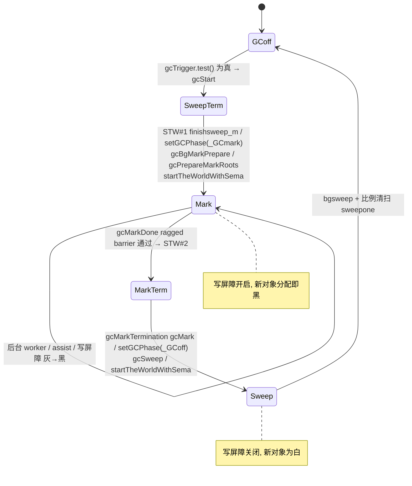
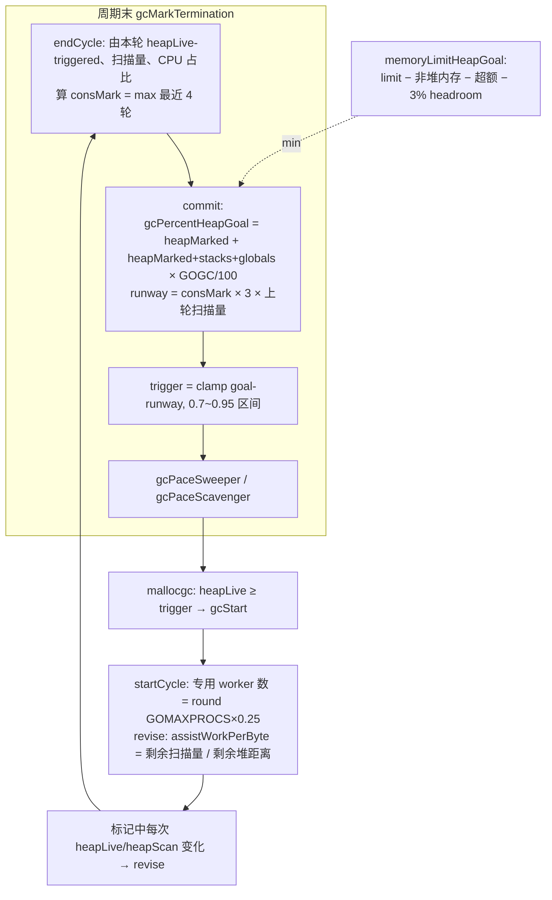

# Go 源码实现详解（十）：垃圾回收器

## 引言：先说结论

Go 的垃圾回收器是一个**并发、非分代、非压缩的三色标记-清扫收集器**，配合**Yuasa+Dijkstra 混合写屏障**保证并发标记的正确性。一次 GC 周期只有两次极短的 STW（sweep termination 与 mark termination），中间的标记阶段由后台 worker（目标占用 25% CPU）与分配时的**标记辅助（assist）**共同完成；清扫则完全并发，并按分配量"比例清扫"。什么时候启动 GC、启动后要给多少 runway，由 `mgcpacer.go` 中的 Pacer 依据 GOGC、GOMEMLIMIT 和上一轮测得的 cons/mark 比率计算。

在本文所基于的 golang/go master（提交 fdcd66b，Go 1.28 开发版）上，有几件与老资料不同、值得先点明的事：

1. **Green Tea GC 已经默认开启**。`src/internal/buildcfg/exp.go` 的 baseline 中 `GreenTeaGC: true`。它把"发现指针就把对象压入 workbuf 去扫描"改成"先在 span 内联位图里记一个 mark，把 span 入队，稍后按 span 批量扫描"，小对象的扫描局部性大幅改善，并在 amd64 上有 AVX-512 的 `ScanSpanPacked` 实现。
2. 编译器插入写屏障的 pass 已从 `cmd/compile/internal/ssa/writebarrier.go` 移到 **`cmd/compile/internal/ssacompile/writebarrier.go`**，前者只剩 `IsNewObject`、`ComputeZeroMap` 等辅助函数。
3. 标记阶段的终止检测（`gcMarkDone`）除了原有的 ragged barrier，还接入了 **goroutine 泄漏检测**（`work.goroutineLeak`），这是 `runtime/pprof` 新增能力，本文只在涉及处顺带说明。
4. `runtime.AddCleanup` 与 `weak.Pointer` 已经是正式 API，它们和 finalizer 一样以 span 的 **special 记录**实现，但清扫时的处理顺序有明确规范：weak handle 先清空，再排队 finalizer，cleanup 不会"复活"对象。

下面按照"周期 → STW → 标记 → worker 与辅助 → Green Tea → 写屏障 → 标记终止 → Pacer → 清扫 → special 与栈收缩 → 观测"的顺序展开。所有函数、字段、路径均已在上述提交的源码中核对。

## 一、总体设计：GC 周期与阶段

### 1.1 算法注释与四个步骤

`src/runtime/mgc.go` 的文件头是理解全貌的最佳入口。它把一个周期拆成四步（原文为英文，这里摘录要点）：

```go
// src/runtime/mgc.go（文件头注释，节选）
// 1. GC performs sweep termination.
//    a. Stop the world. This causes all Ps to reach a GC safe-point.
//    b. Sweep any unswept spans. ...
// 2. GC performs the mark phase.
//    a. Prepare for the mark phase by setting gcphase to _GCmark
//    (from _GCoff), enabling the write barrier, enabling mutator
//    assists, and enqueueing root mark jobs. ...
//    b. Start the world. From this point, GC work is done by mark
//    workers started by the scheduler and by assists performed as
//    part of allocation. ... Newly allocated objects are immediately marked black.
//    c. GC performs root marking jobs. ...
//    d. GC drains the work queue of grey objects, scanning each grey
//    object to black ...
//    e. ... GC uses a distributed termination algorithm to detect when
//    there are no more root marking jobs or grey objects (see gcMarkDone).
// 3. GC performs mark termination.
//    a. Stop the world.
//    b. Set gcphase to _GCmarktermination, and disable workers and assists.
//    c. Perform housekeeping like flushing mcaches.
// 4. GC performs the sweep phase.
//    a. Prepare for the sweep phase by setting gcphase to _GCoff,
//    setting up sweep state and disabling the write barrier.
//    b. Start the world. From this point on, newly allocated objects
//    are white, and allocating sweeps spans before use if necessary.
//    c. GC does concurrent sweeping in the background and in response
//    to allocation. ...
```

对应的全局相位变量只有三个取值，写屏障开关直接由相位推导：

```go
// src/runtime/mgc.go
var gcphase uint32

const (
	_GCoff             = iota // GC not running; sweeping in background, write barrier disabled
	_GCmark                   // GC marking roots and workbufs: allocate black, write barrier ENABLED
	_GCmarktermination        // GC mark termination: allocate black, P's help GC, write barrier ENABLED
)

//go:nosplit
func setGCPhase(x uint32) {
	atomic.Store(&gcphase, x)
	writeBarrier.enabled = gcphase == _GCmark || gcphase == _GCmarktermination
}
```

`writeBarrier` 是一个被编译器直接读取的结构体（`enabled bool` + 3 字节 pad + 8 字节对齐），编译器生成的代码用一条 32 位 load 检查它。另有 `gcBlackenEnabled uint32` 表示"辅助和后台 worker 现在可以把对象染黑"，只在 `_GCmark` 期间为 1。



### 1.2 触发条件：gcTrigger

启动 GC 的谓词是 `gcTrigger`，有三种来源：

```go
// src/runtime/mgc.go
type gcTrigger struct {
	kind gcTriggerKind
	now  int64  // gcTriggerTime: current time
	n    uint32 // gcTriggerCycle: cycle number to start
}

const (
	gcTriggerHeap gcTriggerKind = iota // 堆达到 pacer 计算出的 trigger
	gcTriggerTime                      // 距上次 GC 超过 forcegcperiod
	gcTriggerCycle                     // runtime.GC() 请求启动第 n 轮
)

func (t gcTrigger) test() bool {
	if !memstats.enablegc || panicking.Load() != 0 || gcphase != _GCoff {
		return false
	}
	switch t.kind {
	case gcTriggerHeap:
		trigger, _ := gcController.trigger()
		return gcController.heapLive.Load() >= trigger
	case gcTriggerTime:
		if gcController.gcPercent.Load() < 0 {
			return false
		}
		lastgc := int64(atomic.Load64(&memstats.last_gc_nanotime))
		return lastgc != 0 && t.now-lastgc > forcegcperiod
	case gcTriggerCycle:
		// t.n > work.cycles, but accounting for wraparound.
		return int32(t.n-work.cycles.Load()) > 0
	}
	return true
}
```

- `gcTriggerHeap` 在 `mallocgc` 的慢路径上检查：`if t := (gcTrigger{kind: gcTriggerHeap}); t.test() { gcStart(t) }`（`src/runtime/malloc.go`）。
- `gcTriggerTime` 由 `sysmon` 周期性检查并唤醒 `forcegchelper`（`src/runtime/proc.go`），`forcegcperiod` 为 2 分钟。
- `gcTriggerCycle` 由 `runtime.GC()` 使用：先 `gcWaitOnMark(n)` 等当前周期标记结束，再 `gcStart(gcTrigger{kind: gcTriggerCycle, n: n + 1})`，然后等第 n+1 轮标记结束并帮忙清扫到 `isSweepDone()`。

### 1.3 gcStart：从 _GCoff 到 _GCmark

`gcStart` 是唯一负责 `_GCoff → _GCmark` 转换的函数，用 `work.startSema` 串行化：

```go
// src/runtime/mgc.go
func gcStart(trigger gcTrigger) {
	mp := acquirem()
	if gp := getg(); gp == mp.g0 || mp.locks > 1 || mp.preemptoff != "" {
		releasem(mp)
		return // 不在系统栈 / 持锁 / 不可抢占的上下文里启动 GC
	}
	releasem(mp)
	// ...
	for trigger.test() && sweepone() != ^uintptr(0) {
	}                                  // 先并发地把上轮没扫完的 span 扫完
	semacquire(&work.startSema)
	if !trigger.test() {               // 拿到转换锁后重新检查
		semrelease(&work.startSema)
		return
	}
	// ...
	semacquire(&gcsema)
	semacquire(&worldsema)
	// ...
	gcBgMarkStartWorkers()             // 保证每个 P 都有一个后台标记 goroutine
	systemstack(gcResetMarkState)
	// ...
	systemstack(func() { stw = stopTheWorldWithSema(stwGCSweepTerm) })
	systemstack(func() { finishsweep_m() })
	clearpools()
	work.cycles.Add(1)
	gcController.startCycle(now, int(gomaxprocs), trigger)
	// ...
	setGCPhase(_GCmark)
	gcBgMarkPrepare()
	gcPrepareMarkRoots()
	gcMarkTinyAllocs()
	atomic.Store(&gcBlackenEnabled, 1)
	// ...
	systemstack(func() { now = startTheWorldWithSema(0, stw) /* ... */ })
	semrelease(&worldsema)
	// ...
	semrelease(&work.startSema)
}
```

几个细节：

- 在 STW 内先 `finishsweep_m()`，确保**所有 span 都已清扫**，否则标记位图会被上一轮残留的标记污染。
- `clearpools()` 清空 `sync.Pool` 与 `boring` 缓存，否则这些内存要等下一轮才能回收。
- `setGCPhase(_GCmark)` 必须在 STW 里完成——这样世界重启时，所有 P 都已经看到写屏障开启；而 `gcBlackenEnabled` 在 `gcPrepareMarkRoots` 之后才置 1，让辅助尽早可用又不至于在根准备好之前染黑对象。
- 若 Green Tea 开启，`gcStart` 还会为每个 P 的 `gcw.ptrBuf` 分配一页大小的临时指针缓冲。
- `debug.gcstoptheworld`（GODEBUG）为 1/2 时切换到 `gcForceMode`/`gcForceBlockMode`，整个 GC 变成 STW 执行。

`work`（类型 `workType`）是全局工作状态：`full`/`empty` 两个无锁 workbuf 栈、`spanqMask`（Green Tea 用的"哪些 P 有可窃取的 span 工作"位图）、`markrootNext`/`markrootJobs`、`nproc`/`nwait`（分布式终止计数）、`stackRoots`、`assistQueue`、`sweepWaiters`、`strongFromWeak` 等。

## 二、STW：stopTheWorldWithSema 与 P 的抢占

两次 STW 都通过 `src/runtime/proc.go` 的 `stopTheWorldWithSema` 完成。它并不"暂停线程"，而是**让每个 P 走到安全点并进入 `_Pgcstop`**：

```go
// src/runtime/proc.go
func stopTheWorldWithSema(reason stwReason) worldStop {
	casGToWaitingForSuspendG(getg().m.curg, _Grunning, waitReasonStoppingTheWorld)
	// ...
	lock(&sched.lock)
	start := nanotime()
	sched.stopwait = gomaxprocs
	sched.gcwaiting.Store(true)
	preemptall()                        // 给每个运行中的 P 发抢占请求

	// Stop current P.
	gp.m.p.ptr().status = _Pgcstop
	gp.m.p.ptr().gcStopTime = start
	sched.stopwait--

	// Try to retake all P's in syscalls.
	for _, pp := range allp {
		if thread, ok := setBlockOnExitSyscall(pp); ok {
			thread.gcstopP()
			thread.resume()
		}
	}
	// Stop idle Ps.
	for {
		pp, _ := pidleget(now)
		if pp == nil { break }
		pp.status = _Pgcstop
		pp.gcStopTime = nanotime()
		sched.stopwait--
	}
	wait := sched.stopwait > 0
	unlock(&sched.lock)

	if wait {
		for {
			if notetsleep(&sched.stopnote, 100*1000) { noteclear(&sched.stopnote); break }
			preemptall()               // 每 100µs 重发一次抢占
		}
	}
	// ...
	worldStopped()
	casgstatus(getg().m.curg, _Gwaiting, _Grunning)
	return worldStop{reason: reason, startedStopping: start, finishedStopping: finish, stoppingCPUTime: stoppingCPUTime}
}
```

三类 P 的处理方式不同：正在运行用户代码的 P 靠 `preemptone`（设置 `gp.preempt`、`stackguard0 = stackPreempt`，并在支持的平台上发信号做异步抢占）；处于系统调用中的 P 由 `setBlockOnExitSyscall` 直接夺走；空闲 P 直接从 idle 列表摘下。调用方自己先把 G 切到 `_Gwaiting`（`casGToWaitingForSuspendG`），是为了避免"我在等你停，你在等扫我的栈"的互相抢占死锁。

返回的 `worldStop` 记录 `startedStopping`/`finishedStopping`/`stoppingCPUTime`，`gcStart`/`gcMarkDone`/`gcMarkTermination` 用它们分别累计 `work.pauseNS` 与 `work.cpuStats`，这也是 `/sched/pauses/stopping/gc:seconds` 与 `/sched/pauses/total/gc:seconds` 两个指标的来源（前者只算"让所有 P 停下"的时间，后者是从决定停到重新启动世界的全长）。

`startTheWorldWithSema(now, w)` 则调用 `procresize`、清 `sched.gcwaiting`、唤醒 sysmon，并把 `newprocs`（`GOMAXPROCS` 调整）在这个时刻生效。

## 三、并发标记：根集合、扫描与工作队列

### 3.1 根集合：gcPrepareMarkRoots 与 markroot

标记的起点是一组编号的"根任务"。`gcPrepareMarkRoots`（STW 中执行）把根分成若干类并算出各类的基址：

```go
// src/runtime/mgcmark.go
const (
	fixedRootFinalizers = iota
	fixedRootFreeGStacks
	fixedRootCleanups
	fixedRootCount

	rootBlockBytes = 256 << 10   // 数据段/BSS 每个根任务扫 256KB
	maxObletBytes  = 128 << 10   // 大对象按 128KB 切成 oblet
	drainCheckThreshold = 100000
	pagesPerSpanRoot = min(512, pagesPerArena)
)

func gcPrepareMarkRoots() {
	assertWorldStopped()
	// ... 计算 work.nDataRoots / work.nBSSRoots（按 activeModules 的 data/bss 大小）
	mheap_.markArenas = mheap_.heapArenas[:len(mheap_.heapArenas):len(mheap_.heapArenas)]
	work.nSpanRoots = len(mheap_.markArenas) * (pagesPerArena / pagesPerSpanRoot)
	// ...
	work.stackRoots = allGsSnapshot()
	work.nMaybeRunnableStackRoots = len(work.stackRoots)
	work.nStackRoots = len(work.stackRoots)

	work.markrootNext.Store(0)
	work.markrootJobs.Store(uint32(fixedRootCount + work.nDataRoots + work.nBSSRoots + work.nSpanRoots + work.nMaybeRunnableStackRoots))

	work.baseData = uint32(fixedRootCount)
	work.baseBSS = work.baseData + uint32(work.nDataRoots)
	work.baseSpans = work.baseBSS + uint32(work.nBSSRoots)
	work.baseStacks = work.baseSpans + uint32(work.nSpanRoots)
	work.baseEnd = work.baseStacks + uint32(work.nStackRoots)
}
```

`markroot(gcw, i, flushBgCredit)` 按编号分派：

```go
// src/runtime/mgcmark.go
func markroot(gcw *gcWork, i uint32, flushBgCredit bool) int64 {
	switch {
	case work.baseData <= i && i < work.baseBSS:
		workCounter = &gcController.globalsScanWork
		for _, datap := range activeModules() {
			workDone += markrootBlock(datap.data, datap.edata-datap.data, datap.gcdatamask.bytedata, gcw, int(i-work.baseData))
		}
	case work.baseBSS <= i && i < work.baseSpans:
		// ... 同上，用 datap.bss / gcbssmask
	case i == fixedRootFinalizers:
		for fb := allfin; fb != nil; fb = fb.alllink {
			cnt := uintptr(atomic.Load(&fb.cnt))
			scanblock(uintptr(unsafe.Pointer(&fb.fin[0])), cnt*unsafe.Sizeof(fb.fin[0]), &finptrmask[0], gcw, nil)
		}
	case i == fixedRootFreeGStacks:
		systemstack(markrootFreeGStacks)
	case i == fixedRootCleanups:
		for cb := (*cleanupBlock)(gcCleanups.all.Load()); cb != nil; cb = cb.alllink {
			n := uintptr(atomic.Load(&cb.n))
			scanblock(uintptr(unsafe.Pointer(&cb.cleanups[0])), n*unsafe.Sizeof(cleanupFn{}), &cleanupBlockPtrMask[0], gcw, nil)
		}
	case work.baseSpans <= i && i < work.baseStacks:
		markrootSpans(gcw, int(i-work.baseSpans))    // 扫描 span 上的 special 记录
	default:
		workCounter = &gcController.stackScanWork
		gp := work.stackRoots[i-work.baseStacks]
		systemstack(func() {
			// ...
			stopped := suspendG(gp)
			if stopped.dead { gp.gcscandone = true; return }
			workDone += scanstack(gp, gcw)
			gp.gcscandone = true
			resumeG(stopped)
		})
	}
	// ...
}
```

所以根集合是：**数据段与 BSS**（用链接器生成的 `gcdatamask`/`gcbssmask` 指针位图，按 256KB 分片）、**已入队的 finalizer 与 cleanup**（它们是堆外内存，必须当根）、**所有 goroutine 栈**、以及 **span 上的 special 记录**（`markrootSpans` 通过 arena 的 `pageSpecials` 位图找有 special 的 span，对 finalizer special 扫描 `fn` 与被引用对象、对 weak handle special 只扫 `handle` 字段、对 cleanup special 扫 `cleanup`）。注意 `scanstack` 只会在 `suspendG` 把目标 G 停住后进行，扫完立即 `resumeG`。

### 3.2 栈扫描：stack map 与保守扫描

`scanstack` 用 unwinder 逐帧遍历，每帧交给 `scanframeworker`：

```go
// src/runtime/mgcmark.go
func scanframeworker(frame *stkframe, state *stackScanState, gcw *gcWork) {
	isAsyncPreempt := frame.fn.valid() && frame.fn.funcID == abi.FuncID_asyncPreempt
	isDebugCall := frame.fn.valid() && frame.fn.funcID == abi.FuncID_debugCallV2
	if state.conservative || isAsyncPreempt || isDebugCall {
		// 保守扫描：把帧内一切"看起来像指针"的字都当指针
		if frame.varp != 0 {
			size := frame.varp - frame.sp
			if size > 0 {
				// ...
				scanConservative(frame.sp, size, nil, gcw, state)
			}
		}
		if n := frame.argBytes(); n != 0 {
			scanConservative(frame.argp, n, nil, gcw, state)
		}
		if isAsyncPreempt || isDebugCall {
			state.conservative = true   // 被异步抢占的父帧也要保守扫
		} else {
			state.conservative = false
		}
		return
	}

	locals, args, objs := frame.getStackMap(false)
	if locals.n > 0 {
		size := uintptr(locals.n) * goarch.PtrSize
		scanblock(frame.varp-size, size, locals.bytedata, gcw, state)
	}
	if args.n > 0 {
		scanblock(frame.argp, uintptr(args.n)*goarch.PtrSize, args.bytedata, gcw, state)
	}
	// ... 把帧内的 stack object 加入 state，稍后按可达性精确扫描
}
```

正常帧用编译器生成的 **stack map**（`getStackMap` 返回 locals/args 的指针位图和 stack object 列表）做精确扫描；只有 `asyncPreempt` 帧及其直接父帧（被信号打断时寄存器已 spill 到栈上、没有精确位图）走 `scanConservative`。此外 `gp.sched.ctxt`、异步抢占保存的扩展寄存器（`xRegScan`）、`_defer` 链、`_panic` 也在这里处理。`scanstack` 开头还会顺手做**栈收缩**（见第十节）。

### 3.3 灰对象：scanObject 与 greyobject

对象扫描的经典路径是 `scanObject`（Green Tea 开启时它只用于不使用内联位图的 span，即 >512B 或 noscan 之外的大对象；关闭时用于所有对象）：

```go
// src/runtime/mgcmark_greenteagc.go
func scanObject(b uintptr, gcw *gcWork) {
	sys.Prefetch(b)
	s := spanOfUnchecked(b)
	n := s.elemsize
	// ...
	var tp typePointers
	if n > maxObletBytes {
		// Large object. Break into oblets for better parallelism and lower latency.
		if b == s.base() {
			for oblet := b + maxObletBytes; oblet < s.base()+s.elemsize; oblet += maxObletBytes {
				if !gcw.putObjFast(oblet) { gcw.putObj(oblet) }
			}
		}
		n = s.base() + s.elemsize - b
		n = min(n, maxObletBytes)
		tp = s.typePointersOfUnchecked(s.base())
		tp = tp.fastForward(b-tp.addr, b+n)
	} else {
		tp = s.typePointersOfUnchecked(b)
	}

	var scanSize uintptr
	for {
		var addr uintptr
		if tp, addr = tp.nextFast(); addr == 0 {
			if tp, addr = tp.next(b + n); addr == 0 { break }
		}
		scanSize = addr - b + goarch.PtrSize
		obj := *(*uintptr)(unsafe.Pointer(addr))
		if obj != 0 && obj-b >= n {
			if !tryDeferToSpanScan(obj, gcw) {
				if obj, span, objIndex := findObject(obj, b, addr-b); obj != 0 {
					greyobject(obj, b, addr-b, span, gcw, objIndex)
				}
			}
		}
	}
	gcw.bytesMarked += uint64(n)
	gcw.heapScanWork += int64(scanSize)
}
```

它依赖上一篇讲过的 `typePointers` 迭代器（堆位图/malloc header）找出对象里的指针槽；大于 128KB 的对象被切成 **oblet** 分批入队，避免单个扫描任务过长阻碍抢占。找到指向堆的指针后先试 `tryDeferToSpanScan`（Green Tea 路径），否则 `findObject` + `greyobject`：

```go
// src/runtime/mgcmark.go
func greyobject(obj, base, off uintptr, span *mspan, gcw *gcWork, objIndex uintptr) {
	mbits := span.markBitsForIndex(objIndex)
	if useCheckmark {
		// ...
	} else {
		// ...
		if mbits.isMarked() { return }      // 已标记（灰或黑），无事可做
		mbits.setMarked()
		arena, pageIdx, pageMask := pageIndexOf(span.base())
		if arena.pageMarks[pageIdx]&pageMask == 0 {
			atomic.Or8(&arena.pageMarks[pageIdx], pageMask)
		}
	}
	if span.spanclass.noscan() {           // 无指针对象直接染黑
		gcw.bytesMarked += uint64(span.elemsize)
		return
	}
	sys.Prefetch(obj)
	if !gcw.putObjFast(obj) { gcw.putObj(obj) }   // 入队 = 变灰
}
```

三色在实现上就是：**白 = 标记位为 0；灰 = 标记位为 1 且在工作队列中；黑 = 标记位为 1 且已出队扫描完**。`arena.pageMarks` 是页粒度的"本页有标记对象"位图，供清扫阶段的页回收器（`mheap_.reclaim`）快速跳过整页空闲的 span。`shade(b)` 是写屏障使用的包装：`tryDeferToSpanScan` 或 `findObject`+`greyobject`。

新分配的对象在标记期间由 `gcmarknewobject` 直接置标记位（Green Tea 下同时置 scanned 位）——即"分配即黑"，这是允许写屏障省略对新对象扫描的前提。

### 3.4 工作队列：gcWork 与 workbuf

每个 P 有一个 `gcWork`（`p.gcw`），是标记工作的生产/消费接口：

```go
// src/runtime/mgcwork.go
const _WorkbufSize = 2048 // in bytes; larger values result in less contention

type gcWork struct {
	id int32 // same ID as the parent P
	// wbuf1 是当前 push/pop 的缓冲，wbuf2 是下一个要丢弃的；两者构成一个
	// "带一格滞后的栈"，均摊了从全局列表取/放 workbuf 的开销
	wbuf1, wbuf2 *workbuf
	spanq spanQueue                              // Green Tea: 待扫描 span 队列
	ptrBuf *[pageSize / goarch.PtrSize]uintptr   // Green Tea: span 扫描临时缓冲
	bytesMarked uint64
	heapScanWork int64
	flushedWork bool     // 自上次 gcMarkDone 检查以来是否向全局列表刷过非空 buffer
	mayNeedWorker bool   // Green Tea: 提示 gcDrain 调用 enlistWorker
	stats [gc.NumSizeClasses]sizeClassScanStats
}

type workbufhdr struct {
	node lfnode // must be first
	nobj int
}

type workbuf struct {
	_ sys.NotInHeap
	workbufhdr
	obj [(_WorkbufSize - unsafe.Sizeof(workbufhdr{})) / goarch.PtrSize]uintptr
}
```

`putObj` 在 `wbuf1` 满时先与 `wbuf2` 互换；若两者都满，把一个 `putfull` 到全局 `work.full`（无锁栈 `lfstack`），再 `getempty` 一个新的，并置 `flushedWork = true`——这个标志是 `gcMarkDone` 终止检测的关键。`balance()` 在 `work.full` 为空时把本地一半工作交还全局，避免其他 worker 饿死。文件头注释还规定了取工作的优先顺序（本地对象 → 本地 span → 全局对象 → 全局 span → 窃取 span），理由是"先本地后全局"和"先扫单个对象、让 span 上多积累几个对象再批量扫"。

### 3.5 驱动循环：gcDrain 与 gcDrainN

`gcDrain` 是所有后台 worker 的主循环：

```go
// src/runtime/mgcmark.go
const (
	gcDrainUntilPreempt gcDrainFlags = 1 << iota
	gcDrainFlushBgCredit
	gcDrainIdle
	gcDrainFractional
)

func gcDrain(gcw *gcWork, flags gcDrainFlags) {
	// ...
	if work.markrootNext.Load() < work.markrootJobs.Load() {
		for !(gp.preempt && (preemptible || sched.gcwaiting.Load() || pp.runSafePointFn != 0)) {
			job, ok := gcNextMarkRoot()
			if !ok { break }
			markroot(gcw, job, flushBgCredit)
			// ...
		}
	}
	for !(gp.preempt && (preemptible || sched.gcwaiting.Load() || pp.runSafePointFn != 0)) {
		if work.full == 0 { gcw.balance() }
		var b uintptr
		var s objptr
		if b = gcw.tryGetObjFast(); b == 0 {
			if s = gcw.tryGetSpanFast(); s == 0 {
				if b = gcw.tryGetObj(); b == 0 {
					if s = gcw.tryGetSpan(); s == 0 {
						wbBufFlush()                 // 刷写屏障缓冲，可能产生新工作
						if b = gcw.tryGetObj(); b == 0 {
							if s = gcw.tryGetSpan(); s == 0 {
								s = gcw.tryStealSpan()
							}
						}
					}
				}
			}
		}
		if b != 0 { scanObject(b, gcw) } else if s != 0 { scanSpan(s, gcw) } else { break }
		// ...
		if gcw.heapScanWork >= gcCreditSlack {   // 每 2000 单位刷一次扫描量与后台信用
			gcController.heapScanWork.Add(gcw.heapScanWork)
			if flushBgCredit { gcFlushBgCredit(gcw.heapScanWork - initScanWork); initScanWork = 0 }
			// ... 每 drainCheckThreshold 做一次自抢占检查（idle/fractional 模式）
		}
	}
done:
	// ... 刷剩余信用
}
```

先做根任务（`gcNextMarkRoot` 原子递增 `markrootNext` 领取编号），再不断取对象/span 扫描；无论哪种模式，只要有人要 STW（`sched.gcwaiting`）或调 `forEachP`（`runSafePointFn`），都会退出。`gcDrainN(gcw, scanWork)` 是给标记辅助用的定量版本：做够 `scanWork` 单位就返回，且在 CPU 限制器开启时立即退出。

## 四、后台 worker 与标记辅助

### 4.1 三种 worker 模式

```go
// src/runtime/mgc.go
const (
	gcMarkWorkerNotWorker gcMarkWorkerMode = iota
	gcMarkWorkerDedicatedMode   // P 专用于标记，不可抢占
	gcMarkWorkerFractionalMode  // 分时 worker：补足 GOMAXPROCS*25% 的小数部分
	gcMarkWorkerIdleMode        // P 无事可做时顺便标记
)
```

`gcBgMarkStartWorkers` 在 `gcStart` 中保证 `gcBgMarkWorkerCount >= gomaxprocs`：逐个 `go gcBgMarkWorker(ready)` 并等 `<-ready`（一次一个是为了利用 `runnext` 在两者间来回弹跳，降低启动延迟）。每个 worker 把自己的 `gcBgMarkWorkerNode` 推进全局 `gcBgMarkWorkerPool`（`lfstack`），然后 `gopark`。它不由普通调度唤醒，而是由 `gcController.findRunnableGCWorker` 在 `findRunnable` 中按需拾取：

```go
// src/runtime/mgc.go
func gcBgMarkWorker(ready chan struct{}) {
	// ...
	for {
		gopark(func(g *g, nodep unsafe.Pointer) bool {
			node := (*gcBgMarkWorkerNode)(nodep)
			if mp := node.m.ptr(); mp != nil { releasem(mp) }
			gcBgMarkWorkerPool.push(&node.node)   // 归还到池
			return true
		}, unsafe.Pointer(node), waitReasonGCWorkerIdle, traceBlockSystemGoroutine, 0)

		node.m.set(acquirem())
		pp := gp.m.p.ptr()
		// ...
		gcBeginWork()                              // work.nwait--
		systemstack(func() {
			casGToWaitingForSuspendG(gp, _Grunning, waitReasonGCWorkerActive)
			switch pp.gcMarkWorkerMode {
			case gcMarkWorkerDedicatedMode:
				gcDrainMarkWorkerDedicated(&pp.gcw, true)
				if gp.preempt {                    // 被抢占：把本 P 的运行队列全踢到全局
					if drainQ := runqdrain(pp); !drainQ.empty() {
						lock(&sched.lock); globrunqputbatch(&drainQ); unlock(&sched.lock)
					}
				}
				gcDrainMarkWorkerDedicated(&pp.gcw, false)   // 再来一次，这次不可抢占
			case gcMarkWorkerFractionalMode:
				gcDrainMarkWorkerFractional(&pp.gcw)
			case gcMarkWorkerIdleMode:
				gcDrainMarkWorkerIdle(&pp.gcw)
			}
			casgstatus(gp, _Gwaiting, _Grunning)
		})
		// ... 记账：gcController.markWorkerStop、gcFractionalMarkTime、限制器事件
		pp.gcMarkWorkerMode = gcMarkWorkerNotWorker
		if gcEndWork() {                           // work.nwait++；若是最后一个且无工作
			releasem(node.m.ptr()); node.m.set(nil)
			gcMarkDone()
		}
	}
}
```

专用 worker 第一次 drain 允许抢占：如果被抢占说明有用户 goroutine 想跑，它就把本地队列交给全局，让其他 P 去执行，然后自己继续以不可抢占方式标记——这样既不让 P 被独占得太死，又保证标记进度。分时 worker 通过 `pollFractionalWorkerExit` 判断自己的运行占比是否超过 `1.2 * fractionalUtilizationGoal` 而自我让出；空闲 worker 通过 `pollWork` 在有其他工作时退出。

`work.nproc`/`work.nwait` 初始都设为 `^uint32(0)`（`gcBgMarkPrepare`）："假装有无穷多个 worker，几乎全在等待"。工作中 `nwait--`，结束 `nwait++`；`gcEndWork` 返回 `nwait == nproc && !gcMarkWorkAvailable()`，即"我是最后一个干活的且全局没有剩余工作"，这时才去 `gcMarkDone` 做正式的终止检测。

调度器侧的接入点在 `src/runtime/proc.go` 的 `findRunnable`：先 `if gcBlackenEnabled != 0 { gp, tnow := gcController.findRunnableGCWorker(pp, now) }`（专用/分时 worker），在完全找不到可运行 G 时再 `if gcBlackenEnabled != 0 && gcShouldScheduleWorker(pp) && gcController.addIdleMarkWorker()`（空闲 worker）。

### 4.2 标记辅助：gcAssistAlloc 与 assist credit

后台 worker 只占 25% CPU，若分配速度超过标记速度，堆会失控。因此在标记阶段，**每次分配都要"付费"**：

```go
// src/runtime/malloc_stubs.go
func deductAssistCredit(size uintptr) {
	assistG := getg()
	if assistG.m.curg != nil { assistG = assistG.m.curg }
	assistG.gcAssistBytes -= int64(size)
	if assistG.gcAssistBytes < 0 {
		gcAssistAlloc(assistG)
	}
}
```

`mallocgc` 在 `gcBlackenEnabled != 0` 时调用它。`gp.gcAssistBytes` 是每个 G 的"信用"，为负即"欠债"，需要通过 `gcAssistAlloc` 偿还：

```go
// src/runtime/mgcmark.go
func gcAssistAlloc(gp *g) {
	// ... 不在 g0 / 持锁 / 不可抢占时不辅助
retry:
	if gcCPULimiter.limiting() {
		// CPU 限制器开启时故意不辅助，减少 GC 占用
		return
	}
	assistWorkPerByte := gcController.assistWorkPerByte.Load()
	assistBytesPerWork := gcController.assistBytesPerWork.Load()
	debtBytes := -gp.gcAssistBytes
	scanWork := int64(assistWorkPerByte * float64(debtBytes))
	if scanWork < gcOverAssistWork {          // 至少做 64KB 的量，预付未来分配
		scanWork = gcOverAssistWork
		debtBytes = int64(assistBytesPerWork * float64(scanWork))
	}

	// 先从后台 worker 攒的信用里"偷"
	bgScanCredit := gcController.bgScanCredit.Load()
	stolen := int64(0)
	if bgScanCredit > 0 {
		// ... 偷 min(bgScanCredit, scanWork)，加到 gp.gcAssistBytes
		gcController.bgScanCredit.Add(-stolen)
		scanWork -= stolen
		if scanWork == 0 { /* 全部偷够，直接返回 */ }
	}
	// ...
	systemstack(func() { gcAssistAlloc1(gp, scanWork) })   // 真正做 gcDrainN
	completed := gp.param != nil
	gp.param = nil
	if completed { gcMarkDone() }

	if gp.gcAssistBytes < 0 {
		if gp.preempt { Gosched(); goto retry }
		if !gcParkAssist() { goto retry }     // 挂到 work.assistQueue，等后台信用
	}
	// ...
}
```

信用体系的三条路径：
- 后台 worker 每做 `gcCreditSlack`（2000）单位扫描就 `gcFlushBgCredit` 一次——若 `work.assistQueue` 里有被阻塞的辅助者，优先替它们还债并唤醒，剩余才加到 `gcController.bgScanCredit`。
- 辅助者先偷 `bgScanCredit`，不够再自己 `gcDrainN`。
- 还是不够（没有可做的工作）就 `gcParkAssist` 挂起，直到后台信用到账或周期结束（`gcMarkDone` 中 `gcWakeAllAssists`）。

`assistWorkPerByte` 是"每分配 1 字节需完成多少扫描工作"，由 Pacer 的 `revise()` 持续更新（第八节）。执行追踪里的 `GCMarkAssistBegin/End` 事件就在这里发出。

## 五、Green Tea GC：按 span 批量扫描

### 5.1 现状：默认开启

`src/internal/goexperiment/flags.go` 定义了 `GreenTeaGC bool`，`src/internal/buildcfg/exp.go` 的 baseline 把它设为 `true`，因此 **不加 `GOEXPERIMENT=nogreenteagc` 时构建出的运行时就是 Green Tea 版本**。两套实现按 build tag 分文件：`src/runtime/mgcmark_greenteagc.go`（`//go:build goexperiment.greenteagc`，约 1280 行）和 `src/runtime/mgcmark_nogreenteagc.go`（`//go:build !goexperiment.greenteagc`，约 236 行，大多是空实现或 `throw("unimplemented")` 的桩，以及经典版 `scanObject`/`gcMarkWorkAvailable`）。

### 5.2 思路

文件头注释把动机说得很清楚：

```go
// src/runtime/mgcmark_greenteagc.go（文件头注释，节选）
// The core idea behind Green Tea is simple: achieve better locality during
// mark/scan by delaying scanning so that we can accumulate objects to scan
// within the same span, then scan the objects that have accumulated on the
// span all together.
// ...
// The basic idea here is to have two sets of mark bits. One set is the
// regular set of mark bits ("marks"), while the other essentially says that the
// objects have been scanned already ("scans"). When we see a pointer for the first
// time we set its mark and enqueue its span. We track these spans in work queues
// with a FIFO policy, unlike workbufs which have a LIFO policy. ...
// Later, when we dequeue the span, we find both the union and intersection of the
// mark and scan bitsets. The union is then written back into the scan bits, while
// the intersection is used to decide which objects need scanning, such that the GC
// is still precise.
```

经典三色标记把每个灰对象单独入队、单独扫描，对小对象来说指针跳转极其随机、缓存命中率差。Green Tea 把"灰"的粒度从对象提升到 span：发现指针只置一个位并把 span 入队，出队时一次扫描该 span 上所有"已标记但未扫描"的对象。

### 5.3 内联标记位与 tryDeferToSpanScan

适用范围由 `gcUsesSpanInlineMarkBits(size)` 决定：`heapBitsInSpan(size) && size >= 16`，其中 `heapBitsInSpan` 即 `size <= gc.MinSizeForMallocHeader`（64 位下 512 字节）。也就是 **16B～512B、位图存放在 span 内部的小对象 span**。这类 span 的页尾放着一个 128 字节的 `spanInlineMarkBits`：

```go
// src/runtime/mgcmark_greenteagc.go
type spanInlineMarkBits struct {
	scans [63]uint8         // scanned bits.
	owned spanScanOwnership // see the comment on spanScanOwnership.
	marks [63]uint8         // mark bits.
	class spanClass
}

const (
	spanScanUnowned  spanScanOwnership = 0
	spanScanOneMark                    = 1 << iota // 相对 scans 只多了一个 mark
	spanScanManyMark                               // 可能多了多个
)

func spanInlineMarkBitsFromBase(base uintptr) *spanInlineMarkBits {
	return (*spanInlineMarkBits)(unsafe.Pointer(base + gc.PageSize - unsafe.Sizeof(spanInlineMarkBits{})))
}
```

`mspan.markBitsForIndex` 在这类 span 上直接返回内联 `marks`，而不是 `gcmarkBits`，因此 `greyobject`、`gcmarknewobject`、清扫等代码无需感知差异。发现指针时的入口是 `tryDeferToSpanScan`：

```go
// src/runtime/mgcmark_greenteagc.go
func tryDeferToSpanScan(p uintptr, gcw *gcWork) bool {
	if useCheckmark { return false }
	ha := heapArenaOf(p)
	if ha == nil { return false }
	pageIdx := ((p / pageSize) / 8) % uintptr(len(ha.pageInUse))
	pageMask := byte(1 << ((p / pageSize) % 8))
	if ha.pageUseSpanInlineMarkBits[pageIdx]&pageMask == 0 {
		return false            // 不是内联位图 span，走经典路径
	}
	base := alignDown(p, gc.PageSize)
	q := spanInlineMarkBitsFromBase(base)
	objIndex := uint16((uint64(p-base) * uint64(gc.SizeClassToDivMagic[q.class.sizeclass()])) >> 32)

	idx, mask := objIndex/8, uint8(1)<<(objIndex%8)
	if atomic.Load8(&q.marks[idx])&mask != 0 { return true }
	atomic.Or8(&q.marks[idx], mask)

	if q.class.noscan() {       // 无指针对象：记账后即黑
		gcw.bytesMarked += uint64(gc.SizeClassToSize[q.class.sizeclass()])
		return true
	}
	if q.tryAcquire() {         // 第一个标记者负责把 span 入队
		if gcw.spanq.put(makeObjPtr(base, objIndex)) {
			if gcphase == _GCmark {
				if !work.spanqMask.read(uint32(gcw.id)) { work.spanqMask.set(gcw.id) }
				gcw.mayNeedWorker = true
			}
			gcw.flushedWork = true
		}
	}
	return true
}
```

注意它**不需要访问 `mspan` 结构**：size class 存在内联位图的 `class` 字段里，对象索引用 `SizeClassToDivMagic` 的乘法魔数算出，整个过程只碰这一页尾部的 128 字节。`tryAcquire` 用 `owned` 字节做所有权协议：第一次标记者拿到所有权并入队；之后的标记者只置 mark 位并把 `owned` 升为 `ManyMark`，不会重复入队。

### 5.4 spanQueue 与窃取

每个 P 的 `gcw.spanq` 是一个 FIFO：本地 256 项环形缓冲 + 一条对其他 P 可见的 `spanSPMC`（单生产者多消费者无锁环）链：

```go
// src/runtime/mgcmark_greenteagc.go
type spanQueue struct {
	head, tail uint32
	ring       [256]objptr
	putsSinceDrain int
	chain struct {
		head *spanSPMC              // 生产者写入端
		tail atomic.UnsafePointer   // *spanSPMC，消费者窃取端
	}
}

type spanSPMC struct {
	_ sys.NotInHeap
	allnode listNodeManual          // work.spanSPMCs 全局链表节点
	dead atomic.Bool
	prev atomic.UnsafePointer       // *spanSPMC
	head atomic.Uint32
	tail atomic.Uint32
	cap  uint32
	ring *objptr
}
```

`put` 每 64 次调用（`spillPeriod`）检查一次：若本地积攒超过 8 个且 SPMC 链为空，就把一半（至多 16 个）溢出到链上以"制造并行度"；本地满了则溢出一半。`objptr` 把 span 基址与对象索引打包进一个 uintptr（低 13 位存索引）。全局 `work.spanqMask` 是 P 位图，`tryStealSpan` 按随机顺序遍历置位的 P 去 `steal`；这个位图故意允许竞态（可能被窃取者误清），正确性由 `gcMarkDone` 的 ragged barrier 兜底——`gcw.dispose()` 会把本地 spanq `flush` 并重新 `set` 自己的位。`spanSPMC` 是堆外内存，只在标记阶段使用，死掉的环由 `freeDeadSpanSPMCs` 在清扫期回收。

### 5.5 scanSpan：合并位图并批量扫描

```go
// src/runtime/mgcmark_greenteagc.go
func scanSpan(p objptr, gcw *gcWork) {
	spanBase := p.spanBase()
	imb := spanInlineMarkBitsFromBase(spanBase)
	spanclass := imb.class
	elemsize := uintptr(gc.SizeClassToSize[spanclass.sizeclass()])

	if imb.release() == spanScanOneMark {
		// 期间没人再标记别的对象：只需处理 p 这一个，走快路径
		objIndex := p.objIndex()
		// ... 置 scans 位
		scanObjectSmall(spanBase, spanBase+uintptr(objIndex)*elemsize, elemsize, gcw)
		return
	}
	// ... 由 divMagic 算 nelems
	var toScan gc.ObjMask
	objsMarked := spanSetScans(spanBase, nelems, imb, &toScan)   // scans |= marks; toScan = marks &^ scans
	if objsMarked == 0 { return }
	gcw.bytesMarked += uint64(objsMarked) * uint64(elemsize)

	if !scan.HasFastScanSpanPacked() || objsMarked < int(nelems/8) {
		scanObjectsSmall(spanBase, elemsize, nelems, gcw, &toScan)  // 稀疏：逐对象
		return
	}
	// 密集：SIMD 一次性抽取整页里所有待扫对象的指针
	nptrs := scan.ScanSpanPacked(unsafe.Pointer(spanBase), &gcw.ptrBuf[0], &toScan,
		uintptr(spanclass.sizeclass()), spanPtrMaskUnsafe(spanBase))
	gcw.heapScanWork += int64(objsMarked) * int64(elemsize)
	for _, p := range gcw.ptrBuf[:nptrs] {
		if !tryDeferToSpanScan(p, gcw) {
			if obj, span, objIndex := findObject(p, 0, 0); obj != 0 {
				greyobject(obj, 0, 0, span, gcw, objIndex)
			}
		}
	}
}
```

`spanSetScans` 以 uintptr 为单位遍历 `marks` 与 `scans`：`toScan = marks &^ scans`（新标记但未扫描的对象），再把并集原子写回 `scans`。这样即使标记期间有新的 mark 位并发出现，也只是"下次再扫"，精确性不受影响。密度判断（≥ 1/8 的对象需要扫描）决定走逐对象路径还是 `internal/runtime/gc/scan` 包里的 `ScanSpanPacked`——在 amd64 上是 AVX-512 汇编（`scan_amd64.s`），其它平台是 Go 实现的参考版本。`ScanSpanPacked` 直接把**已解引用的指针值**批量写入 `gcw.ptrBuf`，后续统一处理。

```mermaid
flowchart LR
    A[发现指针 p] --> B{span 有内联标记位?}
    B -- 否 --> C[findObject + greyobject<br/>压入 workbuf]
    B -- 是 --> D[atomic.Or8 marks 位]
    D --> E{noscan?}
    E -- 是 --> F[记 bytesMarked, 即黑]
    E -- 否 --> G{tryAcquire 拿到 span 所有权?}
    G -- 否 --> H[owned 升为 ManyMark, 返回]
    G -- 是 --> I[spanq.put objptr<br/>置 spanqMask 位]
    I --> J[gcDrain 取出 span → scanSpan]
    J --> K[spanSetScans:<br/>toScan = marks &^ scans<br/>scans |= marks]
    K --> L{密度 ≥ 1/8 且有 SIMD?}
    L -- 是 --> M[ScanSpanPacked 批量抽取指针到 ptrBuf]
    L -- 否 --> N[scanObjectsSmall 逐对象]
    M --> A
    N --> A
```

清扫时，`mspan.sweep` 通过 `moveInlineMarks(s.gcmarkBits)` 把内联 `marks` 合并到常规位图再翻转为 `allocBits`，并重新 `init` 内联位图。`GODEBUG=gctrace=2` 会额外打印 `dumpScanStats` 按 size class 统计的 sparse/dense 扫描次数，可以直接观察 Green Tea 的命中情况。

## 六、混合写屏障

### 6.1 算法：Yuasa 删除 + Dijkstra 插入

`src/runtime/mbarrier.go` 文件头给出了伪代码与正确性论证的要点：

```go
// src/runtime/mbarrier.go（文件头注释，节选）
// Go uses a hybrid barrier that combines a Yuasa-style deletion
// barrier—which shades the object whose reference is being
// overwritten—with Dijkstra insertion barrier—which shades the object
// whose reference is being written. The insertion part of the barrier
// is necessary while the calling goroutine's stack is grey. In
// pseudocode, the barrier is:
//
//     writePointer(slot, ptr):
//         shade(*slot)
//         if current stack is grey:
//             shade(ptr)
//         *slot = ptr
//
// 1. shade(*slot) prevents a mutator from hiding an object by moving
// the sole pointer to it from the heap to its stack. ...
// 2. shade(ptr) prevents a mutator from hiding an object by moving
// the sole pointer to it from its stack into a black object in the heap. ...
// 3. Once a goroutine's stack is black, the shade(ptr) becomes unnecessary. ...
```

这就是 Go 1.8 提案 17503 "eliminate STW stack re-scanning" 的成果：有了删除屏障，栈扫描一次即可，无需在 mark termination 重扫所有栈。实际实现里**并不判断"当前栈是否为灰"**，而是无条件把新旧两个指针都 shade——注释解释了原因："不做条件化，是因为在无内存屏障的情况下让 mutator 可靠地观察 slot 所在对象的颜色代价过高"。此外注释还强调两点：对全局变量的写也需要屏障（Go 不在终止阶段重扫全局）；屏障是"发布前"（pre-publication）的，即先 shade 再做 `*slot = ptr`。

`mbarrier.go` 本身只包含批量操作的入口：`typedmemmove`、`wbZero`、`wbMove`、`typedslicecopy`、`typedmemclr`、`memclrHasPointers` 等，它们内部调用 `bulkBarrierPreWrite`。单指针写的屏障在汇编中。

### 6.2 编译器插入：ssacompile/writebarrier.go

在此版本中，插入屏障的 SSA pass 位于 **`src/cmd/compile/internal/ssacompile/writebarrier.go`**（老版本在 `ssa/writebarrier.go`，那个文件现在只保留 `IsNewObject`、`IsStackAddr`、`ComputeZeroMap` 等辅助）。判定逻辑：

```go
// src/cmd/compile/internal/ssacompile/writebarrier.go
func needwb(v *ssa.Value, zeroes map[ssa.ID]ssa.ZeroRegion) bool {
	t, ok := v.Aux.(*types.Type)
	// ...
	if !t.HasPointers() { return false }
	dst := v.Args[0]
	if ssa.IsStackAddr(dst) {
		return false // writes into the stack don't need write barrier
	}
	if mightContainHeapPointer(dst, t.Size(), v.MemoryArg(), zeroes) {
		return true
	}
	switch v.Op {
	case ssaop.OpStore:
		if !mightBeHeapPointer(v.Args[1]) { return false }
	case ssaop.OpZero:
		return false // nil is not a heap pointer
	case ssaop.OpMove:
		if !mightContainHeapPointer(v.Args[1], t.Size(), v.Args[2], zeroes) { return false }
	}
	return true
}
```

pass 的注释给出了改写形态：

```go
// src/cmd/compile/internal/ssacompile/writebarrier.go（注释）
//	if writeBarrier.enabled {
//		buf := gcWriteBarrier2()	// Not a regular Go call
//		buf[0] = val
//		buf[1] = *ptr
//	}
//	*ptr = val
//
// A sequence of WB stores for many pointer fields of a single type will
// be emitted together, with a single branch.
```

`writebarrier(f)` 把需要屏障的 `Store/Move/Zero` 改成 `StoreWB/MoveWB/ZeroWB`，然后按块合并：一次分支、一次 `OpWB` 调用申请 N 个缓冲槽（`maxEntries = 8`，与 `wbMaxEntriesPerCall` 一致），再把新值与旧值成对写入。`needWBdst` 借助 `ComputeZeroMap` 识别"写入刚分配且已知为零的内存"，这种情况旧值必为 nil，可省掉一半工作。amd64 后端把 `OpAMD64LoweredWB` 降为 `CALL runtime·gcWriteBarrierN`（`src/cmd/compile/internal/amd64/ssa.go`，`ir.Syms.GCWriteBarrier[v.AuxInt-1]`）。

### 6.3 汇编快路径：gcWriteBarrier

```asm
// src/runtime/asm_amd64.s
// gcWriteBarrier does NOT follow the Go ABI. It accepts the
// number of bytes of buffer needed in R11, and returns a pointer
// to the buffer space in R11.
// It clobbers FLAGS. It does not clobber any general-purpose registers,
// but may clobber others (e.g., SSE registers).
TEXT gcWriteBarrier<>(SB),NOSPLIT,$112
	MOVQ	R12, 96(SP)
	MOVQ	R13, 104(SP)
retry:
	MOVQ	g_m(R14), R13
	MOVQ	m_p(R13), R13
	MOVQ	(p_wbBuf+wbBuf_next)(R13), R12	// original next position
	ADDQ	R11, R12			// new next position
	CMPQ	R12, (p_wbBuf+wbBuf_end)(R13)
	JA	flush
	MOVQ	R12, (p_wbBuf+wbBuf_next)(R13)
	SUBQ	R11, R12
	MOVQ	R12, R11
	MOVQ	96(SP), R12
	MOVQ	104(SP), R13
	RET
flush:
	// ... 保存全部通用寄存器
	CALL	runtime·wbBufFlush(SB)
	// ... 恢复寄存器
	JMP	retry
```

`runtime·gcWriteBarrier1`～`gcWriteBarrier8` 只是把 `R11` 设为 `8*N` 后跳到这个公共入口。快路径就是"在 per-P 的 `wbBuf` 上 bump 一个指针"，不破坏通用寄存器，所以编译器几乎不用为它 spill。

### 6.4 写屏障缓冲：wbBuf 与 wbBufFlush1

```go
// src/runtime/mwbbuf.go
type wbBuf struct {
	next uintptr            // 下一个空槽的地址（用 uintptr 是为了汇编快路径）
	end  uintptr
	buf  [wbBufEntries]uintptr
}

const (
	wbBufEntries = 512
	wbMaxEntriesPerCall = 8
)
```

缓冲满时进入 `wbBufFlush` → `systemstack(wbBufFlush1)`：

```go
// src/runtime/mwbbuf.go
func wbBufFlush1(pp *p) {
	start := uintptr(unsafe.Pointer(&pp.wbBuf.buf[0]))
	n := (pp.wbBuf.next - start) / unsafe.Sizeof(pp.wbBuf.buf[0])
	ptrs := pp.wbBuf.buf[:n]
	pp.wbBuf.next = 0                       // 毒化，防止处理期间再入队
	// ...
	gcw := &pp.gcw
	pos := 0
	for _, ptr := range ptrs {
		if ptr < minLegalPointer { continue }   // nil 与明显非堆指针
		if tryDeferToSpanScan(ptr, gcw) { continue }
		obj, span, objIndex := findObject(ptr, 0, 0)
		if obj == 0 { continue }
		mbits := span.markBitsForIndex(objIndex)
		if mbits.isMarked() { continue }
		mbits.setMarked()
		// ... 置 arena.pageMarks
		if span.spanclass.noscan() {
			gcw.bytesMarked += uint64(span.elemsize)
			continue
		}
		ptrs[pos] = obj                     // 复用缓冲存放真正需要入队的对象
		pos++
	}
	gcw.putObjBatch(ptrs[:pos])
	pp.wbBuf.reset()
}
```

它"部分重复了 `greyobject` 的逻辑"（源码注释语），目的是把 512 个指针的过滤、标记、入队做成一个紧凑循环。缓冲的存在意味着**写屏障记录的指针不会立刻变灰**，因此所有需要"确认没有灰对象"的地方（`gcDrain` 取不到工作时、`gcMarkDone` 的 ragged barrier、`gcMark`）都必须先 `wbBufFlush1`。

## 七、标记终止：gcMarkDone 与 gcMarkTermination

### 7.1 分布式终止检测

并发标记何时结束？`gcMarkDone` 用一个 **ragged barrier**（参差栅栏，即 `forEachP`）来确认：

```go
// src/runtime/mgc.go
func gcMarkDone() {
	semacquire(&work.markDoneSema)
top:
	if !(gcphase == _GCmark && gcIsMarkDone()) {   // nwait==nproc && 无全局工作
		semrelease(&work.markDoneSema)
		return
	}
	semacquire(&worldsema)
	work.strongFromWeak.block = true      // 暂停 weak→strong 转换，免得产生新工作

	gcMarkDoneFlushed = 0
	forEachP(waitReasonGCMarkTermination, func(pp *p) {
		wbBufFlush1(pp)                   // 刷写屏障缓冲 → 可能产生新灰对象
		pp.gcw.dispose()                  // 本地 workbuf/spanq 全部交给全局
		if pp.gcw.flushedWork {
			atomic.Xadd(&gcMarkDoneFlushed, 1)
			pp.gcw.flushedWork = false
		}
	})
	if gcMarkDoneFlushed != 0 {
		semrelease(&worldsema)
		goto top                           // 有 P 刷出了新工作，回去继续标记
	}
	// ...
	systemstack(func() { stw = stopTheWorldWithSema(stwGCMarkTerm) })

	restart := false
	systemstack(func() {
		for _, p := range allp {
			wbBufFlush1(p)
			if !p.gcw.empty() { restart = true; break }
		}
	})
	if restart || (work.goroutineLeak.enabled && !work.goroutineLeak.done) {
		// ... issue #27993：STW 后仍发现残留工作，start the world 回到并发标记
		goto top
	}
	gcComputeStartingStackSize()
	atomic.Store(&gcBlackenEnabled, 0)
	gcCPULimiter.startGCTransition(false, now)
	gcWakeAllAssists()
	work.strongFromWeak.block = false
	gcWakeAllStrongFromWeak()
	semrelease(&work.markDoneSema)
	schedEnableUser(true)
	gcController.endCycle(now, int(gomaxprocs))
	gcMarkTermination(stw)
}
```

`forEachP` 会让每个 P 在自己的安全点执行回调（正在运行用户代码的 P 被抢占后执行，空闲 P 由调用者代劳），这不需要 STW。只有当**一轮 forEachP 中没有任何 P 刷出新工作**，才能断言"没有灰对象且不可能再产生灰对象"。即便如此，从栅栏结束到 STW 完成之间，写屏障仍可能缓冲少量指针（issue #27993），所以 STW 后再检查一遍，若有残留就重启并发标记——这是"不幸但必要"的兜底。

当 `work.goroutineLeak.enabled` 时（`runtime/pprof` 请求的泄漏检测 GC），第一次到达不动点后会调用 `findGoroutineLeaks`：以"可达的同步对象"推断哪些阻塞的 goroutine 仍可能被唤醒，把它们的栈加入根集合再标记一轮，直到不动点稳定；剩下的就是泄漏的 goroutine（状态 `_Gleaked`）。

### 7.2 gcMarkTermination

```go
// src/runtime/mgc.go
func gcMarkTermination(stw worldStop) {
	setGCPhase(_GCmarktermination)       // 写屏障仍开启
	work.heap1 = gcController.heapLive.Load()
	// ...
	systemstack(func() { gcMark(startTime) })   // 校验队列为空、丢弃 wbBuf、dispose、resetLive
	var stwSwept bool
	systemstack(func() {
		work.heap2 = work.bytesMarked
		if debug.gccheckmark > 0 { runCheckmark(func(_ *gcWork) { gcPrepareMarkRoots() }) }
		// ...
		setGCPhase(_GCoff)               // 标记完成，关闭写屏障
		stwSwept = gcSweep(work.mode)    // 翻 sweepgen、唤醒 bgsweep
	})
	// ...
	systemstack(gcControllerCommit)      // 计算下一轮 trigger / goal，更新 sweeper、scavenger 步调
	// ... 更新 memstats.pause_ns / last_gc_* / numgc，唤醒 sweepWaiters
	systemstack(func() { /* ... */ startTheWorldWithSema(now, stw) })
	mProf_Flush()
	prepareFreeWorkbufs()
	systemstack(freeStackSpans)
	forEachP(waitReasonFlushProcCaches, func(pp *p) {
		pp.mcache.prepareForSweep()      // 让每个 P 的 mcache 里的 span 进入待清扫状态
		// ...
	})
	// ... 打印 gctrace（见第十一节）
	semrelease(&worldsema)
	semrelease(&gcsema)
}
```

`gcMark` 会断言 `work.full == 0` 且根任务全部完成，然后直接 `p.wbBuf.reset()` 丢弃写屏障缓冲——因为 ragged barrier 已保证所有可达对象都被标记，此后缓冲里的指针只能指向黑对象。`gcSweep` 把 `mheap_.sweepgen += 2`（所有 span 瞬间变为"未清扫"），重置 `sweep.active` 与 `pagesSwept`，然后唤醒 `bgsweep`；在 `gcForceBlockMode` 或 `concurrentSweep=false` 时改为在 STW 中同步扫完。`flushallmcaches` 这个老名字在当前源码中已由 `forEachP` 里的 `pp.mcache.prepareForSweep()` 取代——mcache 中缓存的 span 不在任何清扫列表里，必须通过这一步强制释放，否则它们会漏扫。

## 八、Pacer：何时触发、给多少 runway、辅助多重

### 8.1 gcControllerState 与关键常量

```go
// src/runtime/mgcpacer.go
const (
	gcGoalUtilization = gcBackgroundUtilization
	gcBackgroundUtilization = 0.25   // 后台标记的固定 CPU 目标：GOMAXPROCS 的 25%
	gcCreditSlack = 2000
	gcAssistTimeSlack = 5000
	gcOverAssistWork = 64 << 10
	defaultHeapMinimum = (goexperiment.HeapMinimum512KiBInt)*(512<<10) +
		(1-goexperiment.HeapMinimum512KiBInt)*(4<<20)   // 默认 4MB
	memoryLimitMinHeapGoalHeadroom = 1 << 20
	memoryLimitHeapGoalHeadroomPercent = 3
)

var gcController gcControllerState

type gcControllerState struct {
	gcPercent   atomic.Int32   // GOGC
	memoryLimit atomic.Int64   // GOMEMLIMIT
	heapMinimum uint64
	runway      atomic.Uint64  // 本轮希望给 GC 的分配跑道（字节）
	consMark    float64        // 估计的 cons/mark 比率：分配速率 / 扫描速率（每 CPU）
	lastConsMark [4]float64
	gcPercentHeapGoal   atomic.Uint64
	sweepDistMinTrigger atomic.Uint64
	triggered    uint64        // 本轮实际触发时的 heapLive
	lastHeapGoal uint64
	heapLive     atomic.Uint64 // GC 认为的存活堆：上轮标记量 + 之后分配量
	heapScan     atomic.Uint64
	lastHeapScan uint64
	lastStackScan atomic.Uint64
	maxStackScan  atomic.Uint64
	globalsScan   atomic.Uint64
	heapMarked    uint64       // 上轮标记的字节数
	heapScanWork, stackScanWork, globalsScanWork atomic.Int64
	bgScanCredit atomic.Int64
	assistTime, dedicatedMarkTime, fractionalMarkTime, idleMarkTime atomic.Int64
	// ...
	assistWorkPerByte  atomic.Float64
	assistBytesPerWork atomic.Float64
	fractionalUtilizationGoal float64
	// ...
}
```

设计文档是 golang/proposal 的 `44167-gc-pacer-redesign.md`（Go 1.18 重写）。核心思想：**用上一轮实测的 cons/mark 比率预测"标记要跑完需要 mutator 分配多少字节"，把 trigger 定在 goal 之前这么远的地方，使 GC 恰好在到达 goal 时结束、且尽量不需要辅助**。



### 8.2 堆目标与触发点：commit 与 trigger

```go
// src/runtime/mgcpacer.go
func (c *gcControllerState) commit(isSweepDone bool) {
	// ...
	if isSweepDone {
		c.sweepDistMinTrigger.Store(0)
	} else {
		c.sweepDistMinTrigger.Store(c.heapLive.Load() + sweepMinHeapDistance)  // 给清扫留 1MB 跑道
	}
	gcPercentHeapGoal := ^uint64(0)
	if gcPercent := c.gcPercent.Load(); gcPercent >= 0 {
		gcPercentHeapGoal = c.heapMarked + (c.heapMarked+c.lastStackScan.Load()+c.globalsScan.Load())*uint64(gcPercent)/100
	}
	if gcPercentHeapGoal < c.heapMinimum { gcPercentHeapGoal = c.heapMinimum }
	c.gcPercentHeapGoal.Store(gcPercentHeapGoal)

	c.runway.Store(uint64((c.consMark * (1 - gcGoalUtilization) / (gcGoalUtilization)) *
		float64(c.lastHeapScan+c.lastStackScan.Load()+c.globalsScan.Load())))
}
```

注意 goal 的公式：`heapMarked + (heapMarked + 栈 + 全局) × GOGC/100`。自 Go 1.18 起，栈和全局变量也计入"GC 工作量"，所以 GOGC=100 时 goal 略大于 2×live heap。`runway = consMark × (1−0.25)/0.25 × 上轮扫描总量`：cons/mark 是"每 CPU 秒分配字节 / 每 CPU 秒扫描字节"，乘以 mutator 与 GC 的 CPU 分配比（75%:25% = 3），再乘以预期扫描量，就是标记期间 mutator 会分配的字节数。

`heapGoalInternal` 取 `min(gcPercentHeapGoal, memoryLimitHeapGoal())`，并在非内存限制模式下用 `sweepDistMinTrigger` 和"至少比触发点高 64KB"做修正。最终触发点：

```go
// src/runtime/mgcpacer.go
const (
	triggerRatioDen    = 64
	minTriggerRatioNum = 45 // ~0.7
	maxTriggerRatioNum = 61 // ~0.95
)

func (c *gcControllerState) trigger() (uint64, uint64) {
	goal, minTrigger := c.heapGoalInternal()
	if c.heapMarked >= goal { return goal, goal }
	if minTrigger < c.heapMarked { minTrigger = c.heapMarked }
	triggerLowerBound := ((goal-c.heapMarked)/triggerRatioDen)*minTriggerRatioNum + c.heapMarked
	if minTrigger < triggerLowerBound { minTrigger = triggerLowerBound }
	maxTrigger := ((goal-c.heapMarked)/triggerRatioDen)*maxTriggerRatioNum + c.heapMarked
	if goal > defaultHeapMinimum && goal-defaultHeapMinimum > maxTrigger {
		maxTrigger = goal - defaultHeapMinimum
	}
	maxTrigger = max(maxTrigger, minTrigger)

	var trigger uint64
	runway := c.runway.Load()
	if runway > goal { trigger = minTrigger } else { trigger = goal - runway }
	trigger = max(trigger, minTrigger)
	trigger = min(trigger, maxTrigger)
	// ...
	return trigger, goal
}
```

即 `trigger = goal − runway`，再夹在 `[heapMarked + 0.7×(goal−heapMarked), heapMarked + 0.95×(goal−heapMarked)]` 之间（大堆时上界改为 `goal − 4MB`）。下界 0.7 是经验值：触发得太早会让 GC 几乎常开、"分配即黑"反而推高 RSS。

### 8.3 周期起止：startCycle、revise、endCycle

`startCycle` 决定 worker 数量：`dedicatedMarkWorkersNeeded = round(GOMAXPROCS × 0.25)`；若四舍五入误差超过 30%（GOMAXPROCS ≤ 3 或 = 6），减少一个专用 worker 并启用分时 worker 补足 `fractionalUtilizationGoal`。若是 `gcTriggerTime` 触发的周期性 GC，则把允许的空闲 worker 数压到 0（系统本来就闲，没必要全力标记）。

`revise()` 在 `heapLive`/`heapScan`/goal 变化时重新计算辅助比例：

```go
// src/runtime/mgcpacer.go
func (c *gcControllerState) revise() {
	// ...
	heapGoal := int64(c.heapGoal())
	scanWorkExpected := int64(c.lastHeapScan + c.lastStackScan.Load() + c.globalsScan.Load())
	maxScanWork := int64(scan + maxStackScan + c.globalsScan.Load())
	if work > scanWorkExpected {
		// 已做的扫描超出预期 → 堆在增长，按比例把 goal 外推，但不超过 hardGoal = (1+GOGC/100)×goal
		extHeapGoal := int64(float64(heapGoal-int64(c.triggered))/float64(scanWorkExpected)*float64(maxScanWork)) + int64(c.triggered)
		scanWorkExpected = maxScanWork
		hardGoal := int64((1.0 + float64(gcPercent)/100.0) * float64(heapGoal))
		if extHeapGoal > hardGoal { extHeapGoal = hardGoal }
		heapGoal = extHeapGoal
	}
	if int64(live) > heapGoal {
		const maxOvershoot = 1.1
		heapGoal = int64(float64(heapGoal) * maxOvershoot)
		scanWorkExpected = maxScanWork
	}
	scanWorkRemaining := scanWorkExpected - work
	if scanWorkRemaining < 1000 { scanWorkRemaining = 1000 }
	heapRemaining := heapGoal - int64(live)
	if heapRemaining <= 0 { heapRemaining = 1 }
	c.assistWorkPerByte.Store(float64(scanWorkRemaining) / float64(heapRemaining))
	c.assistBytesPerWork.Store(float64(heapRemaining) / float64(scanWorkRemaining))
}
```

含义直白：剩余扫描量除以剩余可分配字节数，就是"每分配 1 字节该做多少扫描"。堆增长时允许 goal 外推（这被称为"软目标"），是为了让辅助比例平稳而不是在堆意外增长时突然暴涨。

`endCycle` 计算本轮实测 cons/mark：分子是 `(heapLive − triggered) × (utilization + idleUtilization)`，分母是 `scanWork × (1 − utilization)`，其中 `utilization = 0.25 + assistTime/(assistDuration×procs)`。然后取**最近 4 轮的最大值**作为下轮的 `consMark`——偏向"多触发一点、少辅助一点"。`GODEBUG=gcpacertrace=1` 会在这两处打印 pacer 的输入输出。

### 8.4 GOMEMLIMIT 与 CPU 限制器

`memoryLimitHeapGoal` 把"总映射内存"换算成"堆目标"：

```go
// src/runtime/mgcpacer.go（注释中的公式）
//    goal := memoryLimit - ((mappedReady - heapFree - heapAlloc) + max(mappedReady - memoryLimit, 0))
//                    ^1                                    ^2
//    goal -= goal / 100 * memoryLimitHeapGoalHeadroomPercent
//    ^3
```

第 1 项是"非堆开销"（栈、元数据、堆外内存等，注意排除了未归还但可复用的 `heapFree`），第 2 项是已超出限制的部分（推动尽快回收），第 3 项留 3%（至少 1MB）余量给步调误差。若非堆内存本身就超过限制，goal 退化为 `heapMarked`，GC 会近乎连续运行——此时全靠 `gcCPULimiter` 兜底：

```go
// src/runtime/mgclimit.go（文件头注释，节选）
// gcCPULimiter is a mechanism to limit GC CPU utilization in situations
// where it might become excessive and inhibit application progress (e.g.
// a death spiral).
//
// The core of the limiter is a leaky bucket mechanism that fills with GC
// CPU time and drains with mutator time. Because the bucket fills and
// drains with time directly (i.e. without any weighting), this effectively
// sets a very conservative limit of 50%. ...
```

桶容量为 `capacityPerProc`（1 CPU 秒）× GOMAXPROCS。`updateLocked` 每 10ms 把"辅助时间 + 25% 的后台时间"作为 GC 时间、其余（扣掉 P 空闲时间）作为 mutator 时间灌入桶中；桶满则 `enabled = true`，此时 `gcAssistAlloc` 直接返回、`gcDrainN` 提前退出、空闲 worker 停止调度，宁可让堆超过 GOMEMLIMIT 也不让 GC 吃掉超过一半的 CPU。`/gc/limiter/last-enabled:gc-cycle` 指标记录最近一次限制器启用的周期号，是排查 OOM 时的重要线索。

### 8.5 运行时 API

`runtime/debug.SetGCPercent` 与 `SetMemoryLimit` 分别 linkname 到 `runtime.setGCPercent`/`setMemoryLimit`：在系统栈上持 `mheap_.lock` 修改 `gcController` 字段并调用 `gcControllerCommit()`——后者会 `commit`、若在标记中则 `revise`、并重新 `gcPaceSweeper`/`gcPaceScavenger`。`SetGCPercent(-1)` 还会 `gcWaitOnMark` 等当前标记结束，保证返回时没有 GC 在跑。初始值分别来自 `readGOGC()`（`GOGC=off` 即 -1）与 `readGOMEMLIMIT()`（支持 `KiB/MiB/GiB/TiB` 后缀，`off` 或未设置即 `math.MaxInt64`）。

## 九、清扫：并发、按需与比例清扫

### 9.1 两个回收器与 sweepgen

`src/runtime/mgcsweep.go` 文件头区分了两个算法：**对象回收器**（`mspan.sweep`，释放 span 内未标记的槽位，整 span 空闲时归还堆）和**页回收器**（`mheap_.reclaim`，顺序扫描 `pageMarks` 位图直接释放整段无标记的页，服务于新 span 分配）。两者最终都调用 `mspan.sweep`。

span 的清扫状态用 `s.sweepgen` 与 `mheap_.sweepgen` 的差表示（`src/runtime/mheap.go` 中 `mspan` 定义处的注释）：`== h.sweepgen` 已清扫；`== h.sweepgen-2` 未清扫；`== h.sweepgen-1` 正在清扫；`+1`/`+3` 表示缓存在 mcache 中的未清扫/已清扫 span。`gcSweep` 把 `mheap_.sweepgen += 2` 就让所有 span 一起变成"未清扫"。

### 9.2 后台清扫与 sweepone

```go
// src/runtime/mgcsweep.go
func bgsweep(c chan int) {
	sweep.g = getg()
	// ...
	for {
		const sweepBatchSize = 10
		nSwept := 0
		for sweepone() != ^uintptr(0) {
			nSwept++
			if nSwept%sweepBatchSize == 0 { goschedIfBusy() }   // 低优先级：忙时让出
		}
		for freeSomeWbufs(true) { goschedIfBusy() }
		freeDeadSpanSPMCs()
		lock(&sweep.lock)
		if !isSweepDone() { unlock(&sweep.lock); goschedIfBusy(); continue }
		sweep.parked = true
		goparkunlock(&sweep.lock, waitReasonGCSweepWait, traceBlockGCSweep, 1)
	}
}
```

`sweepone` 通过 `sweep.active.begin()` 注册为一个清扫者（`activeSweep.state` 的低 31 位是活跃清扫者计数，最高位 `sweepDrainedMask` 表示队列已空），从 `mheap_.nextSpanForSweep()` 按 `sweep.centralIndex` 顺序遍历各 mcentral 的 `partialUnswept`/`fullUnswept` 集合取 span，`tryAcquire` 成功（CAS `sweepgen` 从 `sg-2` 到 `sg-1`）后调用 `s.sweep(false)`。队列取空时最后一个清扫者调用 `scavenger.ready()` 唤醒 scavenger。`isSweepDone()` 即 `state == sweepDrainedMask`：队列已空且没有活跃清扫者。

### 9.3 mspan.sweep：special 处理与位图翻转

```go
// src/runtime/mgcsweep.go
func (sl *sweepLocked) sweep(preserve bool) bool {
	s := sl.mspan
	// ... 校验 state == mSpanInUse && s.sweepgen == sweepgen-1
	mheap_.pagesSwept.Add(int64(s.npages))

	// 处理 special 记录：见第十节
	hadSpecials := s.specials != nil
	siter := newSpecialsIter(s)
	for siter.valid() {
		objIndex := siter.s.offset / size
		mbits := s.markBitsForIndex(objIndex)
		if !mbits.isMarked() {
			// Pass 1: 有 finalizer 则复活对象（setMarkedNonAtomic）
			// Pass 2: 排队 finalizer、清空 weak handle；或对象真死则释放全部 special
			// ...
		} else { /* 对象存活，保留 special */ }
	}
	if hadSpecials && s.specials == nil { spanHasNoSpecials(s) }
	// ...
	if gcUsesSpanInlineMarkBits(s.elemsize) {
		s.moveInlineMarks(s.gcmarkBits)        // Green Tea：内联 marks 合并到 gcmarkBits
	}
	// ... 僵尸对象检查：gcmarkBits &^ allocBits != 0 说明标记了一个已释放的对象
	nalloc := uint16(s.countAlloc())
	nfreed := s.allocCount - nalloc
	s.allocCount = nalloc
	s.freeindex = 0
	s.freeIndexForScan = 0

	// gcmarkBits becomes the allocBits.
	// get a fresh cleared gcmarkBits in preparation for next GC
	s.allocBits = s.gcmarkBits
	s.gcmarkBits = newMarkBits(uintptr(s.nelems))
	// ...
	s.refillAllocCache(0)
	atomic.Store(&s.sweepgen, sweepgen)        // 序列化点：此后 span 可用于分配
	// ... 小对象 span：nalloc==0 → mheap_.freeSpan；否则回 partialSwept/fullSwept
	// ... 大对象 span：nfreed != 0 → freeSpan（debug.efence 时改为 sysFault）
}
```

清扫的本质是一次**位图翻转**：本轮的 `gcmarkBits`（标记即存活）直接成为下轮的 `allocBits`（分配器眼中"已占用"），未标记的槽位于是自动变为可分配，而 `gcmarkBits` 换成一块从 `gcBitsArena` 新取的全零位图。没有逐对象的"free"操作，释放的成本是 O(位图大小)。`newMarkBits`/`nextMarkBitArenaEpoch`（`src/runtime/mheap.go`）用按 epoch 轮转的 arena 管理这些位图，旧一代位图在下次 `finishsweep_m` 时整体回收。

### 9.4 按需清扫与比例清扫

除了后台 goroutine，分配路径也会清扫：
- `mcentral.cacheSpan` 从 mcentral 取 span 时先扫 `partialUnswept` 中的 span；
- `mheap.alloc` 分配大对象前先 `reclaim` 足够页数；
- 更重要的是 **比例清扫（proportional sweep）**：

```go
// src/runtime/mgcsweep.go
func deductSweepCredit(spanBytes uintptr, callerSweepPages uintptr) {
	if mheap_.sweepPagesPerByte == 0 { return }     // 清扫已完成或被禁用
	// ...
retry:
	sweptBasis := mheap_.pagesSweptBasis.Load()
	live := gcController.heapLive.Load()
	liveBasis := mheap_.sweepHeapLiveBasis
	newHeapLive := spanBytes
	if liveBasis < live { newHeapLive += uintptr(live - liveBasis) }
	pagesTarget := int64(mheap_.sweepPagesPerByte*float64(newHeapLive)) - int64(callerSweepPages)
	for pagesTarget > int64(mheap_.pagesSwept.Load()-sweptBasis) {
		if sweepone() == ^uintptr(0) { mheap_.sweepPagesPerByte = 0; break }
		if mheap_.pagesSweptBasis.Load() != sweptBasis { goto retry }  // 步调被重算
	}
	// ...
}
```

`gcPaceSweeper(trigger)`（在 `gcControllerCommit` 中调用）算出 `sweepPagesPerByte = 未清扫页数 / (trigger − heapLive − 1MB)`：目标是**在堆增长到下一次触发点之前把所有页扫完**。每次从 mcentral/mheap 拿 span（`mcentral.go`、`mcache.go` 各有一处调用 `deductSweepCredit`）都按分配量"扣信用"，欠了就当场 `sweepone`。这保证了 `gcStart` 里的 `finishsweep_m` 通常没有多少事可做。

## 十、栈收缩、finalizer、cleanup、weak 指针与 special 记录

### 10.1 栈收缩

`scanstack` 在扫描前调用 `isShrinkStackSafe(gp)`：不在系统调用中、不处于异步安全点、不在 `parkingOnChan` 窗口、不是仅为 `suspendG` 而挂起的 G。安全则立即 `shrinkstack`，否则置 `gp.preemptShrink = true` 留到下一个同步安全点：

```go
// src/runtime/stack.go
func shrinkstack(gp *g) {
	// ...
	if debug.gcshrinkstackoff > 0 { return }
	oldsize := gp.stack.hi - gp.stack.lo
	newsize := oldsize / 2
	if newsize < fixedStack { return }
	avail := gp.stack.hi - gp.stack.lo
	if used := gp.stack.hi - gp.sched.sp + stackNosplit; used >= avail/4 { return }
	copystack(gp, newsize)
}
```

只有使用量不足四分之一时才缩到一半。`gcMarkDone` 中的 `gcComputeStartingStackSize` 还会用本轮扫描到的平均栈大小（`p.scannedStackSize/p.scannedStacks`）决定新 goroutine 的初始栈大小（`GODEBUG=adaptivestackstart`）。

### 10.2 special 记录

finalizer、cleanup、weak handle、内存 profile、pin 计数等都以 **special** 挂在 span 上：

```go
// src/runtime/mheap.go
type special struct {
	_      sys.NotInHeap
	next   *special // linked list in span
	offset uintptr  // span offset of object
	kind   byte     // kind of special
}

const (
	_KindSpecialTinyBlock      = 1
	_KindSpecialFinalizer      = 2
	_KindSpecialWeakHandle     = 3
	_KindSpecialProfile        = 4
	_KindSpecialReachable      = 5
	_KindSpecialPinCounter     = 6
	_KindSpecialCleanup        = 7
	_KindSpecialCheckFinalizer = 8
	_KindSpecialBubble         = 9
	// _KindSpecialSecret ...
)
```

`addspecial` 先 `span.ensureSwept()`（清扫会无锁遍历 special 链表，必须先同步），再持 `span.speciallock` 按 offset/kind 有序插入，并置 arena 的 `pageSpecials` 位供 `markrootSpans` 快速定位。special 本身分配自 `fixalloc`（堆外），所以它们里面的堆指针必须由 `markrootSpans` 当根扫描。

### 10.3 finalizer

`runtime.SetFinalizer` 做完类型检查后 `createfing()` 确保 finalizer goroutine 存在，再 `addfinalizer` 挂上 `specialfinalizer{fn, nret, fint, ot}`。清扫时（`mspan.sweep` 的 Pass 1/2）：未标记但有 finalizer 的对象被 `setMarkedNonAtomic` **复活**一轮，其 finalizer special 通过 `freeSpecial` → `queuefinalizer` 放入 `finq` 块链，并 `fingStatus.Or(fingWake)` 唤醒 `runFinalizers` goroutine 逐个调用。`queuefinalizer` 断言 `gcphase == _GCoff`——finalizer 队列只在清扫期增长，所以 `markroot` 的 `fixedRootFinalizers` 用 `atomic.Load(&fb.cnt)` 扫描即可，无需写屏障。finalizer 串行执行、可以复活对象（因此对象至少多活一个周期），这也是它使用起来容易踩坑的根源。

### 10.4 cleanup

`runtime.AddCleanup(ptr, cleanup, arg)`（`src/runtime/mcleanup.go`）是更安全的替代：cleanup 函数**不接收对象本身**，只接收 `arg`，因此不会复活对象，也就没有"多活一轮"的问题。实现上：

- 参数装箱：`arg` 被复制到一个单独分配的盒子（若是 <16B 的无指针值，故意绕开 tiny allocator 以免生存期粘连），`specialCleanup{cleanup: cleanupFn{call, fn, arg}, id}` 挂到对象上；
- 检查 `arg == ptr`、`arg` 落在 `ptr` 对象内、闭包捕获了 `ptr` 三种"永远不会运行"的情况，直接 panic；
- 清扫时 `freeSpecial` 把 `cleanupFn` 放入 `gcCleanups`（`cleanupQueue`：全局无锁的 `full`/`free` 块栈 + per-P 本地块），由**多个** `runCleanups` goroutine 并发执行（`maxCleanupGs` 上限），cleanup 之间可以并发；
- 已排队未执行的 cleanup 块通过 `fixedRootCleanups` 根任务保活。

`Cleanup.Stop()` 通过 id 从 special 链表摘除，`GODEBUG=checkfinalizers=1` 会在每轮 GC 打印排队的 finalizer/cleanup 数量并检测常见误用。

### 10.5 weak 指针

`weak.Pointer[T]`（`src/weak/pointer.go`）只保存一个 `unsafe.Pointer u`，它指向运行时分配的 `atomic.Uintptr` 句柄。`weak.Make` → `runtime_registerWeakPointer` → `getOrAddWeakHandle`：

```go
// src/runtime/mheap.go
func getOrAddWeakHandle(p unsafe.Pointer) *atomic.Uintptr {
	// ... 先 getWeakHandle(p) 查找已有的（每个地址的句柄是唯一且规范的）
	lock(&mheap_.speciallock)
	s := (*specialWeakHandle)(mheap_.specialWeakHandleAlloc.alloc())
	unlock(&mheap_.speciallock)
	type weakHandleBox struct {
		h atomic.Uintptr
		_ [maxTinySize - unsafe.Sizeof(atomic.Uintptr{})]byte   // 避免与其它 tiny 对象同块（issue 76007）
	}
	handle := &(new(weakHandleBox).h)
	s.special.kind = _KindSpecialWeakHandle
	s.handle = handle
	handle.Store(uintptr(p))
	if addspecial(p, &s.special, false) {
		if gcphase != _GCoff {
			// 若 markrootSpans 可能已经跑过，这里补扫句柄本身
			// ...
			scanblock(uintptr(unsafe.Pointer(&s.handle)), goarch.PtrSize, &oneptrmask[0], gcw, nil)
		}
		KeepAlive(p); KeepAlive(handle)
		return handle
	}
	// ... 竞争失败：释放并重新查找
}
```

关键在于**句柄里存的是 `uintptr`**，GC 不会把它当指针，所以不会保活目标；而句柄本身是堆对象，由 `specialWeakHandle.handle` 经 `markrootSpans` 保活。对象死亡时 `freeSpecial` 执行 `sw.handle.Store(0)`，且在 `mspan.sweep` 中**先于 finalizer 排队**——这是 weak 包文档承诺的语义："对象有 finalizer 时，finalizer 一排队 `Value()` 就返回 nil"。

`Value()` → `runtime_makeStrongFromWeak`：若 `work.strongFromWeak.block` 为真（`gcMarkDone` 到 mark termination 之间）则 `gcParkStrongFromWeak` 挂起等待；随后 `span.ensureSwept()` 保证对象若已死一定已被清扫（此时句柄已清零，不会复活死对象）；最后若 `gcphase != _GCoff` 则 `shade(ptr)`——这与写屏障的 Yuasa 部分承担同样职责：我们可能刚刚在一条黑栈上凭空造出了指向白对象的唯一指针。

## 十一、观察 GC

### 11.1 GODEBUG=gctrace=1

`gcMarkTermination` 末尾在持有 `worldsema` 时打印（防止下一轮覆盖统计）：

```
gc # @#s #%: #+#+# ms clock, #+#/#/#+# ms cpu, #->#-># MB, # MB goal, # MB stacks, # MB globals, # P
```

逐字段对照源码：

| 字段 | 来源 | 含义 |
|---|---|---|
| `gc #` | `memstats.numgc` | GC 序号 |
| `@#s` | `(work.tSweepTerm − runtimeInitTime)/1e6` | 程序启动以来的秒数 |
| `#%` | `memstats.gc_cpu_fraction`（排除 idle 标记时间） | 启动以来 GC 占用 CPU 的百分比 |
| `A+B+C ms clock` | `tMark−tSweepTerm`、`tMarkTerm−tMark`、`tEnd−tMarkTerm` | STW sweep termination、并发标记、STW mark termination 的墙钟时间 |
| `D+E/F/G+H ms cpu` | `stwprocs×(tMark−tSweepTerm)`、`assistTime`、`dedicatedMarkTime+fractionalMarkTime`、`idleMarkTime`、`stwprocs×(tEnd−tMarkTerm)` | 两次 STW 的 CPU 时间，标记期按 辅助/后台/空闲 三分 |
| `X->Y->Z MB` | `work.heap0`、`work.heap1`、`work.heap2` | 标记开始时的 heapLive、标记结束时的 heapLive、实际标记的存活字节（`bytesMarked`） |
| `# MB goal` | `gcController.lastHeapGoal` | 本轮的堆目标 |
| `# MB stacks` | `gcController.lastStackScan` | 本轮扫描的栈字节数 |
| `# MB globals` | `gcController.globalsScan` | 可扫描的全局变量字节数 |
| `# P` | `work.maxprocs` | GOMAXPROCS |
| `(forced)` | `work.userForced` | 由 `runtime.GC()` 触发 |
| `(checking for goroutine leaks)` | `goroutineLeakDone` | 本轮做了 goroutine 泄漏检测 |

由 `sysmon` 触发的周期性 GC 之前还会多打一行 `GC forced`。典型的健康读数是：`Y` 略高于 `goal` 的一点点（说明 pacer 命中）、`E`（辅助）远小于 `F`（后台）、两段 STW 都在几百微秒量级。`gctrace=2` 附加 Green Tea 的按 size class 扫描统计。

### 11.2 runtime/metrics

`src/runtime/metrics/description.go` 中与 GC 直接相关且与上面字段一一对应的指标：

- `/gc/heap/goal:bytes`（goal）、`/gc/heap/live:bytes`（heapMarked）、`/gc/scan/heap:bytes`、`/gc/scan/stack:bytes`、`/gc/scan/globals:bytes`、`/gc/scan/total:bytes`；
- `/gc/cycles/automatic:gc-cycles`、`/gc/cycles/forced:gc-cycles`、`/gc/cycles/total:gc-cycles`；
- `/gc/gogc:percent`、`/gc/gomemlimit:bytes`、`/gc/limiter/last-enabled:gc-cycle`；
- `/sched/pauses/total/gc:seconds`（每次 GC STW 的完整暂停分布）与 `/sched/pauses/stopping/gc:seconds`（只算"让所有 P 停下来"的部分）；`/gc/pauses:seconds` 已标记为 Deprecated；
- `/gc/finalizers/queued:finalizers`、`/gc/finalizers/executed:finalizers`、`/gc/cleanups/queued:cleanups`、`/gc/cleanups/executed:cleanups`；
- `/memory/classes/heap/objects:bytes`、`/memory/classes/heap/free:bytes`、`/memory/classes/heap/released:bytes` 等，`SetMemoryLimit` 文档明确给出限制作用于 `/memory/classes/total:bytes − /memory/classes/heap/released:bytes`。

### 11.3 go tool trace 中的 GC 事件

运行时在以下位置发出 `src/internal/trace/tracev2/events.go` 定义的事件：

- `EvGCBegin`/`EvGCEnd`：`gcStart` 中的 `trace.GCStart()` 与 `gcMarkTermination` 中的 `trace.GCDone()`，带单调递增的 `seqGC`；
- `EvSTWBegin`/`EvSTWEnd`：`stopTheWorldWithSema`/`startTheWorldWithSema`，reason 字符串为 `"GC sweep termination"` 或 `"GC mark termination"`（`stwReason` 的 `String()`）；
- `EvGCMarkAssistBegin`/`EvGCMarkAssistEnd`：`gcAssistAlloc` 前后；
- `EvGCSweepBegin`/`EvGCSweepEnd`：`deductSweepCredit` 与 `sweepone` 路径，`GCSweepSpan` 累计扫过的字节；
- 后台 worker 以 goroutine 形式出现，`gcMarkWorkerModeStrings` 提供 `"GC (dedicated)"`、`"GC (fractional)"`、`"GC (idle)"` 三种标签，trace UI 会把它们与普通 goroutine 区分开。

其它有用的 GODEBUG：`gcpacertrace=1`（pacer 输入输出）、`gccheckmark=1`（mark termination 内做一次 STW 全量重标记校验）、`gcstoptheworld=1/2`（退化为 STW GC，用于排查并发相关问题）、`gcshrinkstackoff=1`、`checkfinalizers=1`。

## 小结

- Go GC 的周期是 **sweep termination（STW）→ 并发标记 → mark termination（STW）→ 并发清扫**，由 `gcStart`、`gcMarkDone`、`gcMarkTermination` 三个转换函数驱动，`work.startSema`/`markDoneSema` 保证每个转换只由一个线程执行。
- 标记以**三色不变式**为基础：标记位 + workbuf 队列表示颜色；根集合包括数据段/BSS、所有栈、finalizer/cleanup 队列与 span special；栈扫描精确依赖 stack map，仅异步抢占帧保守扫描。
- 标记的算力来自后台 worker（专用/分时/空闲三种模式，目标 25% CPU）与分配时的**标记辅助**，二者通过 `bgScanCredit` 与 `gp.gcAssistBytes` 的信用体系耦合；终止检测用 `nwait/nproc` 计数 + `forEachP` ragged barrier + STW 后复核。
- **Green Tea GC 已默认开启**：16～512B 小对象 span 使用页尾的内联 `marks/scans` 位图，指针发现只置位并把 span 入 FIFO 队列，出队时合并位图后批量扫描，密集时用 `ScanSpanPacked`（amd64 AVX-512）。
- **混合写屏障**无条件 shade 新旧两个指针，由编译器 `ssacompile/writebarrier.go` 插入、汇编 `gcWriteBarrier` 把指针塞进 per-P 的 512 项 `wbBuf`，`wbBufFlush1` 批量变灰。
- **Pacer** 以 `heapMarked + (heapMarked+栈+全局)×GOGC/100` 为目标，用最近 4 轮最大的 cons/mark 比率算 runway，得到 `trigger = goal − runway`（夹在 0.7～0.95 之间）；标记期用 `revise` 动态更新辅助比例；GOMEMLIMIT 通过 `memoryLimitHeapGoal` 压低目标，`gcCPULimiter` 用漏桶把 GC CPU 占用限制在约 50% 以内。
- **清扫**是 `gcmarkBits → allocBits` 的位图翻转，由 `bgsweep` 后台进行，并通过 `deductSweepCredit` 的比例清扫保证下一次触发前扫完。
- finalizer、cleanup、weak 指针都基于 span 的 **special 记录**：weak handle 先清零、finalizer 复活对象一轮并串行执行、cleanup 不复活对象且并发执行。

## 延伸阅读

- `src/runtime/mgc.go` —— GC 总体设计注释、相位与触发条件、`gcStart`/`gcMarkDone`/`gcMarkTermination`、后台 worker 主循环、gctrace 打印。
- `src/runtime/mgcmark.go` —— 根集合准备与 `markroot`、栈扫描（精确/保守）、`greyobject`、`gcDrain`/`gcDrainN`、标记辅助与信用。
- `src/runtime/mgcmark_greenteagc.go` / `src/runtime/mgcmark_nogreenteagc.go` —— Green Tea 内联标记位、`tryDeferToSpanScan`、`spanQueue`/`spanSPMC`、`scanSpan`，以及关闭实验时的经典 `scanObject`。
- `src/internal/runtime/gc/scan/` —— `ScanSpanPacked` 的 AVX-512 汇编与参考实现。
- `src/runtime/mgcwork.go` —— `gcWork`、`workbuf`、全局 full/empty 列表与取工作顺序。
- `src/runtime/mbarrier.go` / `src/runtime/mwbbuf.go` / `src/runtime/asm_amd64.s` —— 混合写屏障算法注释、per-P 写屏障缓冲与刷新、汇编快路径。
- `src/cmd/compile/internal/ssacompile/writebarrier.go` —— 编译器判定与插入写屏障的 SSA pass。
- `src/runtime/mgcpacer.go` / `src/runtime/mgclimit.go` —— Pacer（heap goal、trigger、runway、assist ratio、worker 数量）与 GC CPU 限制器。
- `src/runtime/mgcsweep.go` —— 后台清扫、`sweepone`、`mspan.sweep` 位图翻转、比例清扫。
- `src/runtime/mheap.go` / `src/runtime/mfinal.go` / `src/runtime/mcleanup.go` / `src/weak/pointer.go` —— special 记录、finalizer、cleanup、weak 指针。
- `src/runtime/proc.go` —— `stopTheWorldWithSema`/`startTheWorldWithSema`、`preemptone`、`forEachP`、调度器中 worker 的拾取点。
- `src/runtime/stack.go` —— `shrinkstack`、`isShrinkStackSafe`、`gcComputeStartingStackSize`。
- `src/runtime/extern.go` / `src/runtime/metrics/description.go` / `src/internal/trace/tracev2/events.go` —— gctrace 字段说明、GC 相关指标与执行追踪事件。
- `src/internal/goexperiment/flags.go` / `src/internal/buildcfg/exp.go` —— `GreenTeaGC` 实验开关及其默认值。

> 资料核对日期：2026-09-12，基于 golang/go master 提交 fdcd66b（Go 1.28 开发版）。
