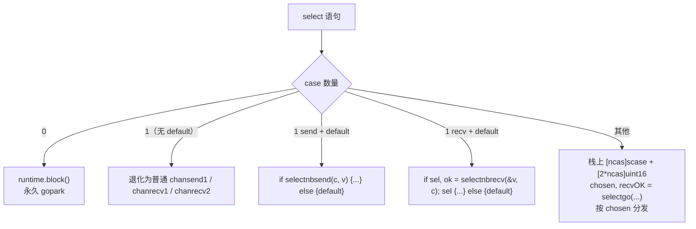
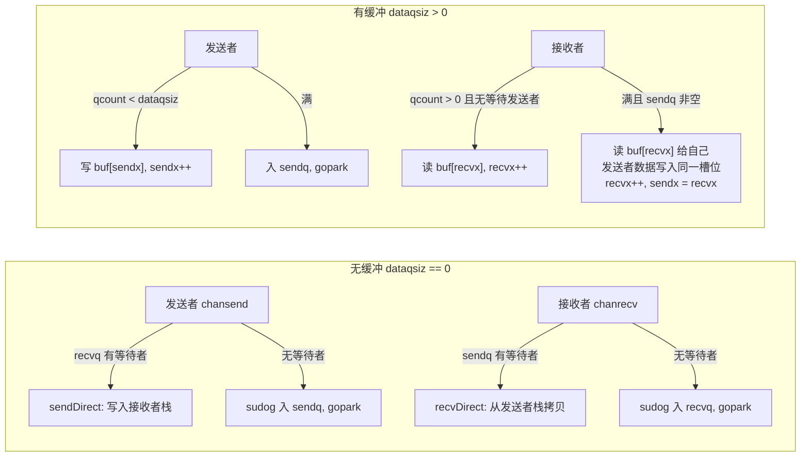

# Go 源码实现详解（十一）：channel 与 select

## 引言：先说结论

一个 channel 在 runtime 里就是一个带互斥锁的结构体 `hchan`：一个环形缓冲区、两个等待队列（`recvq`/`sendq`）和一把 `lock`。所有语言层面的 channel 语法在编译期都被降级成对 `runtime.chansend`/`chanrecv`/`closechan`/`selectgo` 等函数的调用，runtime 中没有任何"魔法"——只有锁、队列、`gopark`/`goready` 和少量精心注释过的无锁快速路径。

读完本篇你会看到：

1. **编译器把什么变成了什么**：`c <- v` 变成 `chansend1(c, &v)`，`v, ok := <-c` 变成 `chanrecv2(c, &v)`；`select` 有四条降级路径：0 case 调 `block()`，1 case 退化成普通收发，"单 case + default"变成 `selectnbsend`/`selectnbrecv`，其余才走 `selectgo`。
2. **`hchan` 的内存布局**由元素是否含指针决定：无缓冲/零长元素、无指针元素（一次分配 `hchan+buf`）、有指针元素（`buf` 单独分配，让 GC 能扫描）。
3. **发送与接收对称**：先无锁快速检查、加锁、优先与对面等待的 goroutine 直接交换数据（`sendDirect`/`recvDirect` 跨栈写入）、其次走缓冲、最后挂 `sudog` 到等待队列并 `gopark`。缓冲满时接收方会把队头给自己、把等待发送者的数据放到队尾——两者恰好是同一个槽位。
4. **`select` 的核心是两个顺序**：`pollorder` 用 `cheaprandn` 随机化（公平性），`lockorder` 按 `hchan` 地址堆排序（锁序、避免死锁）。三个 pass：轮询就绪、全部入队后 `gopark`、被唤醒后从其余 channel 上摘掉 `sudog`。多个 channel 同时想唤醒同一个 select 时，靠 `g.selectDone` 的 CAS 决出唯一赢家。
5. **定时器 channel 自 Go 1.23 起变了实现**：`time.Timer.C` 表面像无缓冲 channel（`len`/`cap` 恒为 0），底层是容量 1 的带缓冲 channel，通过 `hchan.timer` 与 runtime 定时器绑定；只有当有 goroutine 真的阻塞在它上面时，定时器才会进堆。

以下源码均来自 golang/go master（提交 fdcd66b，Go 1.28 开发版），路径相对仓库根目录。

## 一、编译器如何降级 channel 操作

### 1.1 make / send / recv / close

walk 阶段（`src/cmd/compile/internal/walk`）把 IR 节点改写成 runtime 调用。当前版本的 walk 函数都带一个 `walkstate *walkState` 参数（早期版本没有），逻辑与以前一致。

`make(chan T, n)` 由 `walkMakeChan` 处理，`n` 能放进 `int` 时用 `makechan`，否则用 `makechan64`：

```go
// src/cmd/compile/internal/walk/builtin.go — walkMakeChan
func walkMakeChan(walkstate *walkState, n *ir.MakeExpr, init *ir.Nodes) ir.Node {
	size := n.Len
	fnname := "makechan64"
	argtype := types.Types[types.TINT64]
	// ...
	if size.Type().IsKind(types.TIDEAL) || size.Type().Size() <= types.Types[types.TUINT].Size() {
		fnname = "makechan"
		argtype = types.Types[types.TINT]
	}
	return mkcall1(walkstate, chanfn(fnname, 1, n.Type()), n.Type(), init, reflectdata.MakeChanRType(base.Pos, n), typecheck.Conv(size, argtype))
}
```

发送语句 `c <- v`：先把 `v` 转成元素类型，再取地址传给 `chansend1`——runtime 始终通过指针收发元素，所以 `order.go` 的 `OSEND` 分支会先把被发送的值复制到可寻址的临时变量：

```go
// src/cmd/compile/internal/walk/expr.go — walkSend
func walkSend(walkstate *walkState, n *ir.SendStmt, init *ir.Nodes) ir.Node {
	n1 := n.Value
	n1 = typecheck.AssignConv(n1, n.Chan.Type().Elem(), "chan send")
	n1 = walkExpr(walkstate, n1, init)
	n1 = typecheck.NodAddr(n1)
	return mkcall1(walkstate, chanfn("chansend1", 2, n.Chan.Type()), nil, init, n.Chan, n1)
}
```

接收有三种形态，落到三个 runtime 入口：

| 源码形态 | IR 节点 | runtime 调用 | 处理函数 |
|---|---|---|---|
| `<-c`（丢弃值） | `ORECV` 语句 | `chanrecv1(c, nil)` | `walk/walk.go` `walkRecv` |
| `x = <-c` | `OAS` 右侧 `ORECV` | `chanrecv1(c, &x)` | `walk/assign.go` `walkAssign` |
| `x, ok = <-c` | `OAS2RECV` | `ok = chanrecv2(c, &x)` | `walk/assign.go` `walkAssignRecv` |

`walkAssignRecv` 里若左值是 `_`，元素指针传 `typecheck.NodNil()`，runtime 据此跳过数据拷贝。`close(c)` 由 `walkClose` 直接生成 `closechan(c)`。这些函数都通过 `chanfn(name, n, t)`（`walk/walk.go`）查找 runtime 符号，并把元素类型代入以实例化 `unsafe.Pointer` 参数。

### 1.2 select 的四条降级路径

类型检查阶段（`src/cmd/compile/internal/typecheck/stmt.go`）已把所有接收 case 统一改写成 `OSELRECV2`（`x, ok = <-c` 形式，缺省位置用 `_` 填充）。`order.go` 的 `OSELECT` 分支再把每个 case 的 channel 和发送值复制到临时变量，并把 `x, ok` 的赋值推迟到 case 体内。真正的降级在 `walkSelectCases`：

```go
// src/cmd/compile/internal/walk/select.go — walkSelectCases
func walkSelectCases(walkstate *walkState, cases []*ir.CommClause) []ir.Node {
	ncas := len(cases)
	// optimization: zero-case select
	if ncas == 0 {
		return []ir.Node{mkcallstmt(walkstate, "block")}
	}
	// optimization: one-case select: single op.
	if ncas == 1 {
		cas := cases[0]
		l := cas.Init()
		if cas.Comm != nil { // not default:
			n := cas.Comm
			// ...
			switch n.Op() {
			case ir.OSEND:
				// already ok
			case ir.OSELRECV2:
				r := n.(*ir.AssignListStmt)
				if ir.IsBlank(r.Lhs[0]) && ir.IsBlank(r.Lhs[1]) {
					n = r.Rhs[0]
					break
				}
				r.SetOp(ir.OAS2RECV)
			}
			l = append(l, n)
		}
		l = append(l, cas.Body...)
		l = append(l, ir.NewBranchStmt(base.Pos, ir.OBREAK, nil))
		return l
	}
```

- **0 个 case**：`select {}` 变成 `runtime.block()`，即永久 `gopark`，等待原因 `waitReasonSelectNoCases`（"select (no cases)"）。
- **1 个 case**：退化成普通收发语句；`OSELRECV2` 若两个左值都是 `_` 就用裸 `ORECV`，否则改成 `OAS2RECV`。只有一个 default 时（`cas.Comm == nil`）只剩 default 体。

接下来是"两个 case 且一个是 default"的非阻塞优化：

```go
// src/cmd/compile/internal/walk/select.go — walkSelectCases（续）
	// optimization: two-case select but one is default: single non-blocking op.
	if ncas == 2 && dflt != nil {
		cas := cases[0]
		if cas == dflt {
			cas = cases[1]
		}
		n := cas.Comm
		r := ir.NewIfStmt(base.Pos, nil, nil, nil)
		var cond ir.Node
		switch n.Op() {
		case ir.OSEND:
			// if selectnbsend(c, v) { body } else { default body }
			n := n.(*ir.SendStmt)
			ch := n.Chan
			cond = mkcall1(walkstate, chanfn("selectnbsend", 2, ch.Type()), types.Types[types.TBOOL], r.PtrInit(), ch, n.Value)
		case ir.OSELRECV2:
			n := n.(*ir.AssignListStmt)
			recv := n.Rhs[0].(*ir.UnaryExpr)
			ch := recv.X
			elem := n.Lhs[0]
			// ...
			fn := chanfn("selectnbrecv", 2, ch.Type())
			call := mkcall1(walkstate, fn, fn.Type().ResultsTuple(), r.PtrInit(), elem, ch)
			as := ir.NewAssignListStmt(r.Pos(), ir.OAS2, []ir.Node{cond, n.Lhs[1]}, []ir.Node{call})
			r.PtrInit().Append(typecheck.Stmt(as))
		}
		r.Cond = typecheck.Expr(cond)
		r.Body = cas.Body
		r.Else = append(dflt.Init(), dflt.Body...)
		return []ir.Node{r, ir.NewBranchStmt(base.Pos, ir.OBREAK, nil)}
	}
```

`selectnbsend`/`selectnbrecv` 在 runtime 里只是 `chansend`/`chanrecv` 带 `block=false` 的包装：

```go
// src/runtime/chan.go — selectnbsend / selectnbrecv
func selectnbsend(c *hchan, elem unsafe.Pointer) (selected bool) {
	return chansend(c, elem, false, sys.GetCallerPC())
}

func selectnbrecv(elem unsafe.Pointer, c *hchan) (selected, received bool) {
	return chanrecv(c, elem, false)
}
```

其余情况走通用路径。编译器在栈上准备两个数组：`selv [ncas]scase` 存每个 case 的 channel 和元素指针，`order [2*ncas]uint16` 留给 runtime 放 `pollorder`/`lockorder`（不初始化）。发送 case 从下标 0 往上排，接收 case 从末尾往下排，这样 `selectgo` 用 `casi < nsends` 就能判断方向：

```go
// src/cmd/compile/internal/walk/select.go — walkSelectCases（通用路径）
	selv := typecheck.TempAt(base.Pos, walkstate.curfunc, types.NewArray(scasetype(), int64(ncas)))
	init = append(init, typecheck.Stmt(ir.NewAssignStmt(base.Pos, selv, nil)))
	// No initialization for order; runtime.selectgo is responsible for that.
	order := typecheck.TempAt(base.Pos, walkstate.curfunc, types.NewArray(types.Types[types.TUINT16], 2*int64(ncas)))
	// ...
	for _, cas := range cases {
		// ...
		switch n.Op() {
		case ir.OSEND:
			n := n.(*ir.SendStmt)
			i = nsends
			nsends++
			c = n.Chan
			elem = n.Value
		case ir.OSELRECV2:
			n := n.(*ir.AssignListStmt)
			nrecvs++
			i = ncas - nrecvs
			recv := n.Rhs[0].(*ir.UnaryExpr)
			c = recv.X
			elem = n.Lhs[0]
		}
		casorder[i] = cas
		// ... setField("c", c); setField("elem", elem)
	}
	// run the select
	// ... chosen, recvOK = selectgo(&selv[0], &order[0], pc0, nsends, nrecvs, dflt == nil)
```

`scase` 结构必须与 runtime 保持同步（两边源码都有注释互相指向）：

```go
// src/runtime/select.go — scase
type scase struct {
	c    *hchan         // chan
	elem unsafe.Pointer // data element
}
```

最后生成 dispatch：若有 default，`chosen < 0` 走 default；其余按 `chosen == i` 逐个 `if`，最后一个 case 无条件执行。接收 case 若关心 `ok`，进 body 前先 `ok = recvOK`。



## 二、hchan、waitq 与 sudog

### 2.1 hchan 结构

```go
// src/runtime/chan.go — hchan
type hchan struct {
	qcount   uint           // total data in the queue
	dataqsiz uint           // size of the circular queue
	buf      unsafe.Pointer // points to an array of dataqsiz elements
	elemsize uint16
	closed   uint32
	timer    *timer // timer feeding this chan
	elemtype *_type // element type
	sendx    uint   // send index
	recvx    uint   // receive index
	recvq    waitq  // list of recv waiters
	sendq    waitq  // list of send waiters
	bubble   *synctestBubble

	// lock protects all fields in hchan, as well as several
	// fields in sudogs blocked on this channel.
	//
	// Do not change another G's status while holding this lock
	// (in particular, do not ready a G), as this can deadlock
	// with stack shrinking.
	lock mutex
}
```

- `qcount`/`dataqsiz`/`buf`/`sendx`/`recvx`：经典环形缓冲。`sendx` 是下一次写入位置，`recvx` 是下一次读取位置，到达 `dataqsiz` 时回绕到 0。`dataqsiz` 创建后不可变，无锁快速路径依赖这一点。
- `elemsize`/`elemtype`：元素大小和类型描述符。`elemsize` 是 `uint16`，所以 `makechan` 检查 `elem.Size_ >= 1<<16`。
- `closed`：被 `closechan` 置 1 后永不复位——"channel 不可重开"是快速路径正确性论证的基石。
- `recvq`/`sendq`：`waitq{first, last *sudog}` 双向链表。文件顶部的不变量：两者至少一个为空（除非一个 goroutine 通过 select 在同一个无缓冲 channel 上同时等收等发）；带缓冲时 `qcount > 0` 蕴含 `recvq` 为空，`qcount < dataqsiz` 蕴含 `sendq` 为空。
- `timer`：Go 1.23 起新增，指向喂这个 channel 的定时器（第七节）。
- `bubble`：`testing/synctest` 的气泡指针，跨气泡访问会 `fatal`，本篇不展开。
- `lock`：注释强调持锁期间不要 `goready` 其他 G，否则可能与栈收缩死锁——这解释了后面 `send`/`recv` 为什么先 `unlockf()` 再 `goready`。

### 2.2 makechan 的三种内存布局

```go
// src/runtime/chan.go — makechan
func makechan(t *chantype, size int) *hchan {
	elem := t.Elem
	// ... 大小、对齐、溢出检查
	mem, overflow := math.MulUintptr(elem.Size_, uintptr(size))
	if overflow || mem > maxAlloc-hchanSize || size < 0 {
		panic(plainError("makechan: size out of range"))
	}

	var c *hchan
	switch {
	case mem == 0:
		// Queue or element size is zero.
		c = (*hchan)(mallocgc(hchanSize, nil, true))
		// Race detector uses this location for synchronization.
		c.buf = c.raceaddr()
	case !elem.Pointers():
		// Elements do not contain pointers.
		// Allocate hchan and buf in one call.
		c = (*hchan)(mallocgc(hchanSize+mem, nil, true))
		c.buf = add(unsafe.Pointer(c), hchanSize)
	default:
		// Elements contain pointers.
		c = new(hchan)
		c.buf = mallocgc(mem, elem, true)
	}
	c.elemsize = uint16(elem.Size_)
	c.elemtype = elem
	c.dataqsiz = uint(size)
	// ...
	lockInit(&c.lock, lockRankHchan)
	return c
}
```

1. **`mem == 0`**：无缓冲，或元素是零大小类型（`chan struct{}`）。只分配一个 `hchan`，`buf` 指向 `&c.buf` 自身——一个永远不会真正解引用的占位地址，仅供 race detector 当同步点。
2. **元素不含指针**：`hchan` 和缓冲区一次 `mallocgc` 分配成一块，`typ` 传 `nil` 表示整块 noscan——`hchan` 里唯一的指针 `elemtype` 是持久的类型描述符，`sudog` 由拥有它的 goroutine 引用，所以 GC 不需要扫描这块内存。
3. **元素含指针**：`hchan` 用 `new` 分配，`buf` 单独 `mallocgc(mem, elem, true)` 并带上元素类型，GC 才能扫描缓冲区里的指针。

`hchanSize` 把 `hchan` 大小向上对齐到 `maxAlign = 8`，保证紧随其后的 `buf` 满足元素对齐（`elem.Align_ > maxAlign` 会被拒绝）。`chanbuf(c, i)` 就是 `c.buf + i*elemsize`，它带 `//go:linkname` 标注，因为被 `github.com/fjl/memsize` 等包偷用了。

### 2.3 sudog 与 per-P 缓存

`sudog`（pseudo-g）表示"某个 G 在某个等待队列里的一次等待"。G 和同步对象是多对多关系（一个 select 让一个 G 同时挂在多个 channel 上；一个 channel 上可能有多个 G 等待），所以需要中间结构：

```go
// src/runtime/runtime2.go — sudog
type sudog struct {
	// The following fields are protected by the hchan.lock of the
	// channel this sudog is blocking on. shrinkstack depends on
	// this for sudogs involved in channel ops.
	g *g

	next *sudog
	prev *sudog

	elem maybeTraceablePtr // data element (may point to stack)

	// The following fields are never accessed concurrently.
	// For channels, waitlink is only accessed by g.
	// ...
	acquiretime int64
	releasetime int64
	ticket      uint32

	// isSelect indicates g is participating in a select, so
	// g.selectDone must be CAS'd to win the wake-up race.
	isSelect bool

	// success indicates whether communication over channel c
	// succeeded. It is true if the goroutine was awoken because a
	// value was delivered over channel c, and false if awoken
	// because c was closed.
	success bool
	// ...
	waitlink *sudog             // g.waiting list or semaRoot
	c        maybeTraceableChan // channel
}
```

与早期版本的显著差异：`elem` 和 `c` 不再是裸的 `unsafe.Pointer`/`*hchan`，而是 `maybeTraceablePtr`/`maybeTraceableChan`。这个类型同时保存一份 `unsafe.Pointer`（供 GC 追踪）和一份 `uintptr`（真值），`set`/`get` 方法同时维护两者。用途是 goroutine 泄漏检测：`src/runtime/mgc.go` 的 `setSyncObjectsUntraceable` 在 STW 期间把所有阻塞 G 的 `sudog.elem`/`sudog.c` 临时藏起来（`setUntraceable` 把指针副本置 nil 但保留 `uintptr`），这样若某个 channel 只被阻塞在它上面的 goroutine 引用，GC 就能判定这些 goroutine 永远不会被唤醒；检测结束后 `gcRestoreSyncObjects` 用 `setTraceable` 恢复。对收发路径而言，`sg.elem.set(ep)`/`sg.elem.get()` 等价于原来的赋值和读取。

`sudog` 通过 `acquireSudog`/`releaseSudog` 分配，采用 per-P 缓存 + 全局中央缓存的两级结构：

```go
// src/runtime/proc.go — acquireSudog
func acquireSudog() *sudog {
	// Delicate dance: the semaphore implementation calls
	// acquireSudog, acquireSudog calls new(sudog),
	// new calls malloc, malloc can call the garbage collector,
	// and the garbage collector calls the semaphore implementation
	// in stopTheWorld.
	// Break the cycle by doing acquirem/releasem around new(sudog).
	mp := acquirem()
	pp := mp.p.ptr()
	if len(pp.sudogcache) == 0 {
		lock(&sched.sudoglock)
		// First, try to grab a batch from central cache.
		for len(pp.sudogcache) < cap(pp.sudogcache)/2 && sched.sudogcache != nil {
			s := sched.sudogcache
			sched.sudogcache = s.next
			s.next = nil
			pp.sudogcache = append(pp.sudogcache, s)
		}
		unlock(&sched.sudoglock)
		// If the central cache is empty, allocate a new one.
		if len(pp.sudogcache) == 0 {
			pp.sudogcache = append(pp.sudogcache, new(sudog))
		}
	}
	n := len(pp.sudogcache)
	s := pp.sudogcache[n-1]
	pp.sudogcache[n-1] = nil
	pp.sudogcache = pp.sudogcache[:n-1]
	// ...
}
```

`p.sudogcache` 的底层数组是 `p.sudogbuf [128]*sudog`（`src/runtime/runtime2.go`），在 `procresize` 里用 `pp.sudogcache = pp.sudogbuf[:0]` 初始化。本地空了就从 `sched.sudogcache`（用 `next` 串起的单链表）批量拿一半；`releaseSudog` 反之，本地满了就把一半搬回中央缓存。`releaseSudog` 开头有一串 `throw` 检查——`elem`、`isSelect`、`next`、`prev`、`waitlink`、`c` 必须全部清零，`gp.param` 必须为 nil——所以收发路径在释放前都要认真清理这些字段。

## 三、发送：chansend

编译器生成的 `chansend1(c, &v)` 是薄包装，逻辑在 `chansend(c, ep, block, callerpc)`，`block` 区分阻塞发送和 select 的非阻塞发送。

### 3.1 nil channel 与无锁快速路径

```go
// src/runtime/chan.go — chansend（开头）
func chansend(c *hchan, ep unsafe.Pointer, block bool, callerpc uintptr) bool {
	if c == nil {
		if !block {
			return false
		}
		gopark(nil, nil, waitReasonChanSendNilChan, traceBlockForever, 2)
		throw("unreachable")
	}
	// ...
	// Fast path: check for failed non-blocking operation without acquiring the lock.
	//
	// After observing that the channel is not closed, we observe that the channel is
	// not ready for sending. Each of these observations is a single word-sized read
	// (first c.closed and second full()).
	// Because a closed channel cannot transition from 'ready for sending' to
	// 'not ready for sending', even if the channel is closed between the two observations,
	// they imply a moment between the two when the channel was both not yet closed
	// and not ready for sending. We behave as if we observed the channel at that moment,
	// and report that the send cannot proceed.
	//
	// It is okay if the reads are reordered here: ...
	// However, nothing here guarantees forward progress. We rely on the side effects
	// of lock release in chanrecv() and closechan() to update this thread's view
	// of c.closed and full().
	if !block && c.closed == 0 && full(c) {
		return false
	}
```

向 nil channel 发送：阻塞模式直接 `gopark` 且永不返回（等待原因 "chan send (nil chan)"，trace 里是 forever 阻塞）；非阻塞返回 false，这就是 select 里 nil channel case 永远不会被选中的原因。

快速路径只在非阻塞时启用，做两次单字读取：`c.closed == 0` 和 `full(c)`。正确性关键在"已关闭的 channel 不可能从'不可发送'变回'可发送'"（关闭后发送只会 panic）。因此即便两次读取之间 channel 被关闭了，也一定存在一个瞬间它"既未关闭又满"，报告"发送失败"是合法的线性化结果。注释还承认这里不保证前进性，只依赖其他路径释放锁时的内存屏障来刷新视图。

```go
// src/runtime/chan.go — full
func full(c *hchan) bool {
	// c.dataqsiz is immutable (never written after the channel is created)
	// so it is safe to read at any time during channel operation.
	if c.dataqsiz == 0 {
		// Assumes that a pointer read is relaxed-atomic.
		return c.recvq.first == nil
	}
	// Assumes that a uint read is relaxed-atomic.
	return c.qcount == c.dataqsiz
}
```

### 3.2 加锁后的四条路

```go
// src/runtime/chan.go — chansend（加锁部分）
	lock(&c.lock)

	if c.closed != 0 {
		unlock(&c.lock)
		panic(plainError("send on closed channel"))
	}

	if sg := c.recvq.dequeue(); sg != nil {
		// Found a waiting receiver. We pass the value we want to send
		// directly to the receiver, bypassing the channel buffer (if any).
		send(c, sg, ep, func() { unlock(&c.lock) }, 3)
		return true
	}

	if c.qcount < c.dataqsiz {
		// Space is available in the channel buffer. Enqueue the element to send.
		qp := chanbuf(c, c.sendx)
		// ...
		typedmemmove(c.elemtype, qp, ep)
		c.sendx++
		if c.sendx == c.dataqsiz {
			c.sendx = 0
		}
		c.qcount++
		unlock(&c.lock)
		return true
	}

	if !block {
		unlock(&c.lock)
		return false
	}
```

优先级：已关闭 → panic；有等待接收者 → 绕过缓冲直接交付（有接收者在等意味着缓冲一定是空的，见不变量，所以不破坏 FIFO）；缓冲有空位 → 写 `sendx` 槽位；非阻塞 → false；否则阻塞。

### 3.3 直接交付：send 与 sendDirect

```go
// src/runtime/chan.go — send
func send(c *hchan, sg *sudog, ep unsafe.Pointer, unlockf func(), skip int) {
	// ... race detector 相关
	if sg.elem.get() != nil {
		sendDirect(c.elemtype, sg, ep)
		sg.elem.set(nil)
	}
	gp := sg.g
	unlockf()
	gp.param = unsafe.Pointer(sg)
	sg.success = true
	if sg.releasetime != 0 {
		sg.releasetime = cputicks()
	}
	goready(gp, skip+1)
}
```

把数据写到接收者 `sudog.elem` 指向的地址（接收者用 `_` 丢弃则 `elem` 为 nil，跳过）→ 清空 `elem` → **先解锁** → 通过 `gp.param` 把 `sudog` 传回被唤醒的 G → `success = true` → `goready`。先解锁再 `goready` 正是 `hchan.lock` 注释的要求。

`sendDirect` 是 runtime 里少有的"一个正在运行的 goroutine 写另一个 goroutine 的栈"的地方：

```go
// src/runtime/chan.go — sendDirect
// Sends and receives on unbuffered or empty-buffered channels are the
// only operations where one running goroutine writes to the stack of
// another running goroutine. The GC assumes that stack writes only
// happen when the goroutine is running and are only done by that
// goroutine. Using a write barrier is sufficient to make up for
// violating that assumption, but the write barrier has to work.
// typedmemmove will call bulkBarrierPreWrite, but the target bytes
// are not in the heap, so that will not help. We arrange to call
// memmove and typeBitsBulkBarrier instead.

func sendDirect(t *_type, sg *sudog, src unsafe.Pointer) {
	// src is on our stack, dst is a slot on another stack.

	// Once we read sg.elem out of sg, it will no longer
	// be updated if the destination's stack gets copied (shrunk).
	// So make sure that no preemption points can happen between read & use.
	dst := sg.elem.get()
	typeBitsBulkBarrier(t, uintptr(dst), uintptr(src), t.Size_)
	// No need for cgo write barrier checks because dst is always
	// Go memory.
	memmove(dst, src, t.Size_)
}
```

两个要点：

- **写屏障**：GC 假设栈只由其拥有者写。跨栈写入打破了假设，需要写屏障补偿；但 `typedmemmove` 内部的 `bulkBarrierPreWrite` 看到目标不在堆上会跳过，所以这里显式调用 `typeBitsBulkBarrier` + `memmove`。`recvDirect` 对称（源在另一个栈上）。
- **栈移动**：接收者阻塞期间它的栈可能被收缩（复制到新地址），`sudog.elem` 会被 `adjustsudogs` 修正；但一旦读出 `dst` 就不能再有抢占点。持有 `c.lock` 也是防护——`syncadjustsudogs`（`src/runtime/stack.go`）在收缩一个阻塞在 channel 上的 G 的栈前，会沿 `g.waiting` 链表逐个锁住相关 channel（用特殊的 `lockRankHchanLeaf` 锁等级）。

与此配套的是 G 上的两个标志：`activeStackChans`（有已解锁的 `sudog` 指向本 G 的栈，收缩栈必须先锁 channel）和 `parkingOnChan`（处于"入队但尚未 park 完成"的窗口，此时收缩不安全，`shrinkstack` 遇到会 `throw`）。`chansend` 在入队后、`gopark` 前 `gp.parkingOnChan.Store(true)`，由 `chanparkcommit` 在 park 的最后一步收尾：

```go
// src/runtime/chan.go — chanparkcommit
func chanparkcommit(gp *g, chanLock unsafe.Pointer) bool {
	// There are unlocked sudogs that point into gp's stack. Stack
	// copying must lock the channels of those sudogs.
	// Set activeStackChans here instead of before we try parking
	// because we could self-deadlock in stack growth on the
	// channel lock.
	gp.activeStackChans = true
	// Mark that it's safe for stack shrinking to occur now,
	// because any thread acquiring this G's stack for shrinking
	// is guaranteed to observe activeStackChans after this store.
	gp.parkingOnChan.Store(false)
	// Make sure we unlock after setting activeStackChans and
	// unsetting parkingOnChan. ...
	unlock((*mutex)(chanLock))
	return true
}
```

`gopark(unlockf, lock, ...)` 的语义是：切到 g0 栈、把 G 状态改为 `_Gwaiting` 之后再调用 `unlockf(gp, lock)`；返回 true 表示继续休眠。channel 锁一直持有到 G 完全脱离运行状态，避免"刚入队就被对方唤醒、自己还没 park"的竞争。

### 3.4 阻塞与唤醒

```go
// src/runtime/chan.go — chansend（阻塞部分）
	gp := getg()
	mysg := acquireSudog()
	// ... releasetime 采样
	// No stack splits between assigning elem and enqueuing mysg
	// on gp.waiting where copystack can find it.
	mysg.elem.set(ep)
	mysg.waitlink = nil
	mysg.g = gp
	mysg.isSelect = false
	mysg.c.set(c)
	gp.waiting = mysg
	gp.param = nil
	c.sendq.enqueue(mysg)
	gp.parkingOnChan.Store(true)
	// ...
	gopark(chanparkcommit, unsafe.Pointer(&c.lock), reason, traceBlockChanSend, 2)
	// Ensure the value being sent is kept alive until the
	// receiver copies it out. The sudog has a pointer to the
	// stack object, but sudogs aren't considered as roots of the
	// stack tracer.
	KeepAlive(ep)

	// someone woke us up.
	if mysg != gp.waiting {
		throw("G waiting list is corrupted")
	}
	gp.waiting = nil
	gp.activeStackChans = false
	closed := !mysg.success
	// ... blockevent 采样
	mysg.c.set(nil)
	releaseSudog(mysg)
	if closed {
		if c.closed == 0 {
			throw("chansend: spurious wakeup")
		}
		panic(plainError("send on closed channel"))
	}
	return true
```

`sudog.elem` 指向发送者栈上的值，发送者挂到 `sendq` 后休眠，由未来的接收者替它完成拷贝。`KeepAlive(ep)` 让编译器认为 `ep` 在 `gopark` 返回后仍然存活——`sudog` 不算栈扫描的根，没有它 GC 可能提前判定该栈槽死亡。

唤醒后由 `success` 区分两种情况：接收者取走了值正常返回；或者 channel 被关闭（`closechan` 设 `success = false`），先释放 `sudog` 再 panic——这就是"阻塞中的发送者在 close 时 panic"的实现。`releasetime`/`blockevent` 是 block profile 的采样点。

## 四、接收：chanrecv

### 4.1 快速路径为什么要两次原子读

```go
// src/runtime/chan.go — chanrecv（快速路径）
	if c.timer != nil {
		c.timer.maybeRunChan(c)
	}

	// Fast path: check for failed non-blocking operation without acquiring the lock.
	if !block && empty(c) {
		// After observing that the channel is not ready for receiving, we observe whether the
		// channel is closed.
		//
		// Reordering of these checks could lead to incorrect behavior when racing with a close.
		// For example, if the channel was open and not empty, was closed, and then drained,
		// reordered reads could incorrectly indicate "open and empty". To prevent reordering,
		// we use atomic loads for both checks, and rely on emptying and closing to happen in
		// separate critical sections under the same lock.  ...
		if atomic.Load(&c.closed) == 0 {
			// Because a channel cannot be reopened, the later observation of the channel
			// being not closed implies that it was also not closed at the moment of the
			// first observation. We behave as if we observed the channel at that moment
			// and report that the receive cannot proceed.
			return
		}
		// The channel is irreversibly closed. Re-check whether the channel has any pending data
		// to receive, which could have arrived between the empty and closed checks above.
		// Sequential consistency is also required here, when racing with such a send.
		if empty(c) {
			// The channel is irreversibly closed and empty.
			if ep != nil {
				typedmemclr(c.elemtype, ep)
			}
			return true, false
		}
	}
```

接收侧比发送侧复杂，因为多了一个可能结果："已关闭且空 → 立即返回零值"。发送侧只需回答"能否发送"，接收侧要区分"未关闭且空（返回不可接收）"和"已关闭且空（返回零值，`received = false`）"，两者都是可观察的最终结果，所以读取顺序不能乱：先 `empty(c)` 再 `atomic.Load(&c.closed)`；若已关闭，中间可能有一次发送恰好在关闭前塞进了缓冲，所以要**再** `empty(c)` 一次，仍为空才能返回零值。

```go
// src/runtime/chan.go — empty
func empty(c *hchan) bool {
	// c.dataqsiz is immutable.
	if c.dataqsiz == 0 {
		return atomic.Loadp(unsafe.Pointer(&c.sendq.first)) == nil
	}
	// c.timer is also immutable (it is set after make(chan) but before any channel operations).
	// All timer channels have dataqsiz > 0.
	if c.timer != nil {
		c.timer.maybeRunChan(c)
	}
	return atomic.Loaduint(&c.qcount) == 0
}
```

### 4.2 加锁后的路径

```go
// src/runtime/chan.go — chanrecv（加锁部分）
	lock(&c.lock)

	if c.closed != 0 {
		if c.qcount == 0 {
			unlock(&c.lock)
			if ep != nil {
				typedmemclr(c.elemtype, ep)
			}
			return true, false
		}
		// The channel has been closed, but the channel's buffer have data.
	} else {
		// Just found waiting sender with not closed.
		if sg := c.sendq.dequeue(); sg != nil {
			// Found a waiting sender. If buffer is size 0, receive value
			// directly from sender. Otherwise, receive from head of queue
			// and add sender's value to the tail of the queue (both map to
			// the same buffer slot because the queue is full).
			recv(c, sg, ep, func() { unlock(&c.lock) }, 3)
			return true, true
		}
	}

	if c.qcount > 0 {
		// Receive directly from queue
		qp := chanbuf(c, c.recvx)
		if ep != nil {
			typedmemmove(c.elemtype, ep, qp)
		}
		typedmemclr(c.elemtype, qp)
		c.recvx++
		// ... 回绕、qcount--、unlock
		return true, true
	}
```

与发送对称：已关闭且空 → 零值；未关闭且有等待发送者 → `recv`；缓冲有数据 → 取队头（`typedmemclr` 清空槽位，避免残留指针延长对象寿命）；非阻塞 → false；否则挂到 `recvq` 并 `gopark`，唤醒后返回 `(true, mysg.success)`。已关闭但缓冲仍有数据时走"缓冲有数据"分支——这就是"关闭后仍能读完缓冲里剩余值"的实现。阻塞前后多了 `blockTimerChan`/`unblockTimerChan` 的配对调用（第七节）。

### 4.3 recv 的换槽技巧

```go
// src/runtime/chan.go — recv
func recv(c *hchan, sg *sudog, ep unsafe.Pointer, unlockf func(), skip int) {
	// ...
	if c.dataqsiz == 0 {
		if ep != nil {
			// copy data from sender
			recvDirect(c.elemtype, sg, ep)
		}
	} else {
		// Queue is full. Take the item at the
		// head of the queue. Make the sender enqueue
		// its item at the tail of the queue. Since the
		// queue is full, those are both the same slot.
		qp := chanbuf(c, c.recvx)
		// copy data from queue to receiver
		if ep != nil {
			typedmemmove(c.elemtype, ep, qp)
		}
		// copy data from sender to queue
		typedmemmove(c.elemtype, qp, sg.elem.get())
		c.recvx++
		if c.recvx == c.dataqsiz {
			c.recvx = 0
		}
		c.sendx = c.recvx // c.sendx = (c.sendx+1) % c.dataqsiz
	}
	sg.elem.set(nil)
	gp := sg.g
	unlockf()
	gp.param = unsafe.Pointer(sg)
	sg.success = true
	// ...
	goready(gp, skip+1)
}
```

有发送者在 `sendq` 里等，说明缓冲已满（不变量），此时队头和队尾是同一个槽位（`sendx == recvx`）。接收者先把队头拷给自己，再把等待发送者的数据写进同一个槽位，然后同时推进 `recvx` 和 `sendx`——一次操作完成"出队 + 入队"，FIFO 顺序完好无损，也不多一次拷贝。



## 五、closechan

```go
// src/runtime/chan.go — closechan
func closechan(c *hchan) {
	if c == nil {
		panic(plainError("close of nil channel"))
	}
	// ...
	lock(&c.lock)
	if c.closed != 0 {
		unlock(&c.lock)
		panic(plainError("close of closed channel"))
	}
	// ...
	c.closed = 1

	var glist gList

	// release all readers
	for {
		sg := c.recvq.dequeue()
		if sg == nil {
			break
		}
		if sg.elem.get() != nil {
			typedmemclr(c.elemtype, sg.elem.get())
			sg.elem.set(nil)
		}
		// ...
		gp := sg.g
		gp.param = unsafe.Pointer(sg)
		sg.success = false
		glist.push(gp)
	}
	// release all writers (they will panic)
	// ... 同上：sg.elem.set(nil); sg.success = false; glist.push(gp)
```

```go
// src/runtime/chan.go — closechan（续）
	unlock(&c.lock)

	// Ready all Gs now that we've dropped the channel lock.
	for !glist.empty() {
		gp := glist.pop()
		gp.schedlink = 0
		goready(gp, 3)
	}
}
```

三条规则的落点：关闭 nil channel panic、重复关闭 panic、关闭后 `closed = 1` 永不复位。然后清空两个等待队列：接收者的目标地址被 `typedmemclr` 写零值，发送者只是被摘下来；所有人的 `success` 都设为 false，接收者据此返回 `received = false`，发送者据此 panic。

`gList` 批量收集再统一 `goready` 是为了遵守 `hchan.lock` 的"持锁不 ready"规则；`gp.schedlink = 0` 是因为 `gList.push` 借用了 `g.schedlink` 串链表。`dequeue` 在 `sendq`/`recvq` 上都会执行 `isSelect` 的 CAS 检查（第六节），所以 `closechan` 唤醒正在 select 的 G 时也会正确地和其他 channel 竞争。

## 六、selectgo

### 6.1 参数与栈上数组

```go
// src/runtime/select.go — selectgo（开头）
func selectgo(cas0 *scase, order0 *uint16, pc0 *uintptr, nsends, nrecvs int, block bool) (int, bool) {
	gp := getg()
	// NOTE: In order to maintain a lean stack size, the number of scases
	// is capped at 65536.
	cas1 := (*[1 << 16]scase)(unsafe.Pointer(cas0))
	order1 := (*[1 << 17]uint16)(unsafe.Pointer(order0))

	ncases := nsends + nrecvs
	scases := cas1[:ncases:ncases]
	pollorder := order1[:ncases:ncases]
	lockorder := order1[ncases:][:ncases:ncases]
	// NOTE: pollorder/lockorder's underlying array was not zero-initialized by compiler.
	// ...
```

`cas0`/`order0` 都指向调用方栈上的数组，被切成 `scases`、`pollorder`、`lockorder` 三个切片。返回 `(casi, recvOK)`：`casi` 是被选中 case 在 `scases` 里的下标（`-1` 表示 default），`recvOK` 仅对接收 case 有意义。

### 6.2 pollorder：随机化

```go
// src/runtime/select.go — selectgo（生成 pollorder）
	// generate permuted order
	norder := 0
	for i := range scases {
		cas := &scases[i]

		// Omit cases without channels from the poll and lock orders.
		if cas.c == nil {
			cas.elem = nil // allow GC
			continue
		}
		// ... synctest bubble 检查
		if cas.c.timer != nil {
			cas.c.timer.maybeRunChan(cas.c)
		}

		j := cheaprandn(uint32(norder + 1))
		pollorder[norder] = pollorder[j]
		pollorder[j] = uint16(i)
		norder++
	}
	pollorder = pollorder[:norder]
	lockorder = lockorder[:norder]
```

这是 inside-out 的 Fisher-Yates 洗牌：第 `norder` 个元素与 `[0, norder]` 中随机一个位置交换。`cheaprandn` 是 per-M 的廉价伪随机数。nil channel 的 case 在这里被直接剔除，既不轮询也不加锁——规范说"nil channel 上的通信永远阻塞"，实现上就是"当它不存在"。随机化的目的是公平性：多个 case 同时就绪时均匀选择，避免总偏向排在前面的 case。

### 6.3 lockorder：按地址堆排序

```go
// src/runtime/select.go — selectgo（生成 lockorder）
	// sort the cases by Hchan address to get the locking order.
	// simple heap sort, to guarantee n log n time and constant stack footprint.
	for i := range lockorder {
		j := i
		// Start with the pollorder to permute cases on the same channel.
		c := scases[pollorder[i]].c
		for j > 0 && scases[lockorder[(j-1)/2]].c.sortkey() < c.sortkey() {
			k := (j - 1) / 2
			lockorder[j] = lockorder[k]
			j = k
		}
		lockorder[j] = pollorder[i]
	}
	for i := len(lockorder) - 1; i >= 0; i-- {
		o := lockorder[i]
		c := scases[o].c
		lockorder[i] = lockorder[0]
		j := 0
		for {
			k := j*2 + 1
			if k >= i {
				break
			}
			// ... 选较大子节点，下沉
		}
		lockorder[j] = o
	}
```

`sortkey()` 就是 `uintptr(unsafe.Pointer(c))`。两个 goroutine 各自 select 同一组 channel 时，只要都按地址升序加锁就不会形成环形等待。选堆排序是因为它 O(n log n) 且不需要额外栈空间（runtime 不能依赖 `sort` 包）。

`sellock`/`selunlock` 沿 `lockorder` 逐个加锁/逆序解锁，同一个 channel 出现在多个 case 里时只锁一次。`selunlock` 的注释提醒：解开最后一把锁之后不能再碰 `sel`，因为对方可能已经把这个 G 唤醒并跑完了整个 select，栈帧都释放了。

### 6.4 pass 1：轮询就绪的 case

```go
// src/runtime/select.go — selectgo（pass 1）
	sellock(scases, lockorder)
	// ...
	// pass 1 - look for something already waiting
	for _, casei := range pollorder {
		casi = int(casei)
		cas = &scases[casi]
		c = cas.c

		if casi >= nsends {
			sg = c.sendq.dequeue()
			if sg != nil {
				goto recv
			}
			if c.qcount > 0 {
				goto bufrecv
			}
			if c.closed != 0 {
				goto rclose
			}
		} else {
			if c.closed != 0 {
				goto sclose
			}
			sg = c.recvq.dequeue()
			if sg != nil {
				goto send
			}
			if c.qcount < c.dataqsiz {
				goto bufsend
			}
		}
	}

	if !block {
		selunlock(scases, lockorder)
		casi = -1
		goto retc
	}
```

持有全部锁后按 `pollorder` 扫一遍，每个 case 的判断顺序与 `chansend`/`chanrecv` 一致。命中就 `goto` 对应标签（`recv`/`bufrecv`/`rclose`/`send`/`bufsend`/`sclose`），标签里的代码基本是 `chansend`/`chanrecv` 相应分支的复制，只是解锁用 `selunlock`。都没命中且有 default（`block == false`）就返回 -1。

### 6.5 pass 2：全部入队并 park

```go
// src/runtime/select.go — selectgo（pass 2）
	// pass 2 - enqueue on all chans
	nextp = &gp.waiting
	for _, casei := range lockorder {
		casi = int(casei)
		cas = &scases[casi]
		c = cas.c
		sg := acquireSudog()
		sg.g = gp
		sg.isSelect = true
		// No stack splits between assigning elem and enqueuing
		// sg on gp.waiting where copystack can find it.
		sg.elem.set(cas.elem)
		// ...
		sg.c.set(c)
		// Construct waiting list in lock order.
		*nextp = sg
		nextp = &sg.waitlink

		if casi < nsends {
			c.sendq.enqueue(sg)
		} else {
			c.recvq.enqueue(sg)
		}

		if c.timer != nil {
			blockTimerChan(c)
		}
	}

	// wait for someone to wake us up
	gp.param = nil
	gp.parkingOnChan.Store(true)
	gopark(selparkcommit, nil, waitReason, traceBlockSelect, 1)
	gp.activeStackChans = false
```

为每个 case 申请一个 `sudog`，`isSelect = true`，挂到对应 channel 的队列，并用 `waitlink` 把它们按 **lockorder** 串在 `gp.waiting` 上。为什么按锁序串？因为 `selparkcommit` 要在 park 的最后一步解锁所有 channel，而它运行在 g0 栈上、不能访问 `selectgo` 的栈帧（`scases`/`lockorder` 都在那里），只能顺着 `gp.waiting` 走：

```go
// src/runtime/select.go — selparkcommit
func selparkcommit(gp *g, _ unsafe.Pointer) bool {
	gp.activeStackChans = true
	gp.parkingOnChan.Store(false)
	// ...
	// This must not access gp's stack (see gopark). In
	// particular, it must not access the *hselect. That's okay,
	// because by the time this is called, gp.waiting has all
	// channels in lock order.
	var lastc *hchan
	for sg := gp.waiting; sg != nil; sg = sg.waitlink {
		if sg.c.get() != lastc && lastc != nil {
			// As soon as we unlock the channel, fields in
			// any sudog with that channel may change,
			// including c and waitlink. Since multiple
			// sudogs may have the same channel, we unlock
			// only after we've passed the last instance
			// of a channel.
			unlock(&lastc.lock)
		}
		lastc = sg.c.get()
	}
	if lastc != nil {
		unlock(&lastc.lock)
	}
	return true
}
```

"同一个 channel 的多个 sudog 只在越过最后一个之后才解锁"——解锁后对方就可能修改该 `sudog` 的 `c` 和 `waitlink`，再往下走就不安全了。

### 6.6 唤醒竞争：isSelect 与 selectDone

一个 G 同时挂在 N 个 channel 上，可能有多个对手同时想唤醒它。谁赢？答案在 `waitq.dequeue`：

```go
// src/runtime/chan.go — (*waitq).dequeue
func (q *waitq) dequeue() *sudog {
	for {
		sgp := q.first
		if sgp == nil {
			return nil
		}
		y := sgp.next
		if y == nil {
			q.first = nil
			q.last = nil
		} else {
			y.prev = nil
			q.first = y
			sgp.next = nil // mark as removed (see dequeueSudoG)
		}

		// if a goroutine was put on this queue because of a
		// select, there is a small window between the goroutine
		// being woken up by a different case and it grabbing the
		// channel locks. Once it has the lock
		// it removes itself from the queue, so we won't see it after that.
		// We use a flag in the G struct to tell us when someone
		// else has won the race to signal this goroutine but the goroutine
		// hasn't removed itself from the queue yet.
		if sgp.isSelect {
			if !sgp.g.selectDone.CompareAndSwap(0, 1) {
				// We lost the race to wake this goroutine.
				continue
			}
		}
		return sgp
	}
}
```

对 `isSelect` 的 `sudog`，出队者必须先在 `g.selectDone` 上 CAS 0→1 成功才算赢得这个 G；失败说明别的 channel 已经唤醒了它，这个 `sudog` 是即将被清理的残留，跳过继续找下一个。这样即使 select 的 G 还没来得及从其他队列摘掉自己，也不会被重复交付数据。被唤醒的 G 在 pass 3 开头 `gp.selectDone.Store(0)` 复位。

```mermaid
sequenceDiagram
    participant G as select goroutine
    participant A as chan A（发送者 Ga）
    participant B as chan B（发送者 Gb）
    G->>G: pass 1 无就绪；pass 2 在 A、B 上各挂一个 sudog(isSelect)
    G->>G: gopark(selparkcommit) 释放 A、B 锁
    par 两个发送者几乎同时到达
        A->>A: lock(A); recvq.dequeue()
        A->>G: CAS selectDone 0→1 成功
        A->>G: sendDirect, success=true, gp.param=sgA, goready(G)
    and
        B->>B: lock(B); recvq.dequeue()
        B->>G: CAS selectDone 失败，continue（视为队列空）
        B->>B: 写入缓冲或自己 gopark
    end
    G->>G: 被调度；sellock 全部锁；selectDone=0
    G->>G: pass 3 沿 lockorder 遍历：sg==gp.param 的是赢家；其余 dequeueSudoG
    G->>G: selunlock；返回 casi, recvOK
```

### 6.7 pass 3：清理与返回

```go
// src/runtime/select.go — selectgo（pass 3）
	sellock(scases, lockorder)

	gp.selectDone.Store(0)
	sg = (*sudog)(gp.param)
	gp.param = nil

	// pass 3 - dequeue from unsuccessful chans
	// otherwise they stack up on quiet channels
	// record the successful case, if any.
	// We singly-linked up the SudoGs in lock order.
	casi = -1
	sglist = gp.waiting
	// Clear all elem before unlinking from gp.waiting.
	for sg1 := gp.waiting; sg1 != nil; sg1 = sg1.waitlink {
		sg1.isSelect = false
		sg1.elem.set(nil)
		sg1.c.set(nil)
	}
	gp.waiting = nil

	for _, casei := range lockorder {
		k = &scases[casei]
		if k.c.timer != nil {
			unblockTimerChan(k.c)
		}
		if sg == sglist {
			// sg has already been dequeued by the G that woke us up.
			casi = int(casei)
			cas = k
			caseSuccess = sglist.success
		} else {
			c = k.c
			if int(casei) < nsends {
				c.sendq.dequeueSudoG(sglist)
			} else {
				c.recvq.dequeueSudoG(sglist)
			}
		}
		sgnext = sglist.waitlink
		sglist.waitlink = nil
		releaseSudog(sglist)
		sglist = sgnext
	}
```

唤醒后重新按 `lockorder` 锁住所有 channel，从 `gp.param` 拿到赢家 `sudog`。由于 `gp.waiting` 与 `lockorder` 顺序一致，可以一边遍历 `lockorder` 一边同步推进 `sglist`：等于 `sg` 的就是被选中的 case，其余用 `dequeueSudoG` 从各自队列摘掉（它处理了"已被 `dequeue` 摘过"的情况——`next`/`prev` 都为 nil 时用 `q.first` 区分）。不及时清理的话，`sudog` 会在安静的 channel 上越堆越多。

之后根据 `casi < nsends` 判断：发送 case 若 `caseSuccess == false` 说明被 close 唤醒，`goto sclose` panic；接收 case 则 `recvOK = caseSuccess`。

### 6.8 reflect.Select

`reflect.Select`（`src/reflect/value.go`）把 `[]SelectCase` 转成 `[]runtimeSelect`，再通过 linkname 调用 `runtime.reflect_rselect`。后者做的事和编译器一样：发送 case 排前、接收排后、找出 default，在堆上分配 `[]scase` 和 `order`，调用 `selectgo(&sel[0], &order[0], pc0, nsends, nrecvs, dflt == -1)`，最后把 `chosen` 翻译回调用者的下标。`reflect.Select` 对少量 case 做了栈分配优化（`stackAllocSelectCases`），但每次仍要构造 `Value` 并做类型检查，比编译期降级的 select 慢得多。

## 七、定时器 channel

### 7.1 Go 1.23 的语义变化

Go 1.23 之前，`time.NewTimer` 返回的 `C` 是一个普通的容量 1 channel，到期时由定时器代码往里非阻塞发送。这带来两个著名问题：`Stop`/`Reset` 后 channel 里可能残留旧值，用户必须写 `if !t.Stop() { <-t.C }` 这样的样板；未 Stop 的定时器在触发前不能被 GC 回收。

Go 1.23 起 channel 定时器改为"惰性"实现：`Stop`/`Reset` 返回后保证不会再收到旧值，`len(t.C)`/`cap(t.C)` 始终返回 0，未被引用的定时器可以被 GC。原本用 `GODEBUG=asynctimerchan=1` 可以切回旧行为，`src/internal/godebugs/table.go` 里该项标记为 `Removed: 27`，即 Go 1.27 起旧实现已彻底删除。

### 7.2 hchan.timer 与 newTimer

```go
// src/time/sleep.go — NewTimer
func NewTimer(d Duration) *Timer {
	c := make(chan Time, 1)
	t := newTimer(when(d), 0, sendTime, c, syncTimer(c))
	t.C = c
	return t
}
```

底层仍是 `make(chan Time, 1)`，但多传了一个 `syncTimer(c)`——就是 channel 的 `*hchan`。runtime 侧的 `newTimer` 建立双向关联：

```go
// src/runtime/time.go — newTimer
func newTimer(when, period int64, f func(arg any, seq uintptr, delay int64), arg any, c *hchan) *timeTimer {
	t := new(timeTimer)
	t.timer.init(nil, nil)
	// ...
	if c != nil {
		lockInit(&t.sendLock, lockRankTimerSend)
		t.isChan = true
		c.timer = &t.timer
		if c.dataqsiz == 0 {
			throw("invalid timer channel: no capacity")
		}
	}
	// ...
	t.modify(when, period, f, arg, 0)
	t.self = t
	return t
}
```

`c.timer = &t.timer` 是 `hchan.timer` 的唯一写入点；`t.isChan = true` 标记 channel 定时器（创建后不可变，可无锁读取）；`t.arg` 保存 channel 本身，`(*timer).hchan()` 通过 `efaceOf(&t.arg).data` 取回 `*hchan`。`chanlen`/`chancap` 看到 `c.timer != nil` 就返回 0，注释说得很直白：带缓冲的实现、无缓冲的外观，"这样我们可以在用户察觉不到的情况下撤销发送"。`NewTicker` 走同一条路，只是 `period > 0`。

### 7.3 惰性触发：maybeRunChan、blockTimerChan、needsAdd

核心思想：**channel 定时器平时不进定时器堆**，只有当某个 goroutine 真的阻塞在它的 channel 上时才进堆；非阻塞地查看 channel 时，由查看者自己检查是否到期并顺手触发。

`needsAdd` 决定定时器是否需要进堆，对 channel 定时器多了 `t.blocked > 0` 的条件：

```go
// src/runtime/time.go — (*timer).needsAdd
func (t *timer) needsAdd() bool {
	assertLockHeld(&t.mu)
	need := t.state&timerHeaped == 0 && t.when > 0 && (!t.isChan || t.blocked > 0)
	// ...
	return need
}
```

`blocked` 由 `blockTimerChan`/`unblockTimerChan` 维护，前者在 `chanrecv` 和 `selectgo` 把 `sudog` 入队之后调用（持有 channel 锁），后者在唤醒之后调用：

```go
// src/runtime/time.go — blockTimerChan / unblockTimerChan
func blockTimerChan(c *hchan) {
	t := c.timer
	// ...
	t.lock()
	t.blocked++
	// If this is the first enqueue after a recent dequeue,
	// the timer may still be in the heap but marked as a zombie.
	// Unmark it in this case, if the timer is still pending.
	if t.state&timerHeaped != 0 && t.state&timerZombie != 0 && t.when > 0 {
		t.state &^= timerZombie
		t.ts.zombies.Add(-1)
	}
	add := t.needsAdd()
	t.unlock()
	if add {
		t.maybeAdd()
	}
}

func unblockTimerChan(c *hchan) {
	t := c.timer
	t.lock()
	// ...
	t.blocked--
	if t.blocked == 0 && t.state&timerHeaped != 0 && t.state&timerZombie == 0 {
		// Last goroutine that was blocked on this timer.
		// Mark for removal from heap but do not clear t.when,
		// so that we know what time it is still meant to trigger.
		t.state |= timerZombie
		t.ts.zombies.Add(1)
	}
	t.unlock()
}
```

最后一个阻塞者离开时，定时器被标为 zombie 等待堆的惰性清理，但 `when` 保留——它"本该在那个时刻触发"这件事没变。

不阻塞的访问路径（`chanrecv` 开头、`empty()`、`selectgo` 的 pollorder 循环）都会调用 `maybeRunChan`：

```go
// src/runtime/time.go — (*timer).maybeRunChan
func (t *timer) maybeRunChan(c *hchan) {
	// ...
	if t.astate.Load()&timerHeaped != 0 {
		// If the timer is in the heap, the ordinary timer code
		// is in charge of sending when appropriate.
		return
	}

	t.lock()
	now := nanotime()
	// ...
	if t.state&timerHeaped != 0 || t.when == 0 || t.when > now {
		// Timer in the heap, or not running at all, or not triggered.
		t.unlock()
		return
	}
	systemstack(func() {
		t.unlockAndRun(now, c.bubble)
	})
}
```

先用原子读的 `astate` 快速排除"已在堆里"（堆里的定时器由 `timers.run` 负责），否则加锁看 `when` 是否已到，到了就当场在系统栈上 `unlockAndRun`，即调用 `sendTime` 往 channel 里非阻塞发送。这就是"非阻塞 `<-t.C` 也能及时收到值"的原因——值不是提前放进去的，而是接收者自己触发的。`sendTime` 用 `Now().Add(Duration(-delta))` 把时间"退回"到本该触发的时刻。

### 7.4 撤销陈旧的发送：seq、sendLock、isSending

`Stop`/`Reset` 的保证靠三个字段配合。`(*timer).stop` 在 `isChan` 时先拿 `sendLock` 再拿 `t.mu`，`t.seq++`，最后 `timerchandrain` 清空缓冲：

```go
// src/runtime/time.go — (*timer).stop（节选）
	if t.isChan {
		// Stop any future sends with stale values.
		// See timer.unlockAndRun.
		t.seq++

		// If there is currently a send in progress,
		// incrementing seq is going to prevent that
		// send from actually happening. That means
		// that we should return true: the timer was
		// stopped, even though t.when may be zero.
		if t.period == 0 && t.isSending.Load() > 0 {
			pending = true
		}
	}
	t.unlock()
	if t.isChan {
		unlock(&t.sendLock)
		if timerchandrain(t.hchan()) {
			pending = true
		}
	}
```

`unlockAndRun` 在持 `t.mu` 时拷贝一份 `seq`，解锁后再拿 `sendLock`，若发现 `t.seq != seq` 就把 `f` 换成空函数，跳过发送：

```go
// src/runtime/time.go — (*timer).unlockAndRun（节选）
	if t.isChan {
		lock(&t.sendLock)

		if t.period == 0 {
			// We are committed to possibly sending a value
			// based on seq, so no need to keep telling
			// stop/modify that we are sending.
			if t.isSending.Add(-1) < 0 {
				throw("mismatched isSending updates")
			}
		}

		if t.seq != seq {
			f = func(any, uintptr, int64) {}
		}
	}

	f(arg, seq, delay)

	if t.isChan {
		unlock(&t.sendLock)
	}
```

`sendLock` 贯穿整个发送过程，`Stop` 拿到它就意味着"要么发送已完成（`timerchandrain` 把值排掉并返回 true），要么发送还没开始（`seq` 已增，发送会被跳过）"。`isSending` 解决 `Stop` 返回值的准确性：定时器已出堆（`when == 0`）但发送尚未完成时，`Stop` 仍应返回 true。`timerchandrain`（`src/runtime/chan.go`）用 `typedmemclr` 逐个清掉缓冲槽位，不处理 `sendq`，因为定时器 channel 只会被非阻塞发送。

## 八、性能特征与观察

### 8.1 无缓冲 vs 有缓冲

- **无缓冲**：每次通信都需要收发双方会师。对方已在等待时，是一次加锁 + 跨栈 `memmove` + `goready`；否则是 `acquireSudog` + 入队 + `gopark`，之后由对方完成拷贝再 `goready`。一次成功的交换至少涉及一次 goroutine 切换。
- **有缓冲**：只要缓冲未满/未空，收发就是加锁 + 一次 `typedmemmove` + 解锁，不涉及调度。缓冲把"同步"变成了"排队"，代价是数据在缓冲区里多拷贝一次；`recv` 的换槽技巧保证即便缓冲满了也不会再多一次。
- **零大小元素**（`chan struct{}`）没有缓冲区内存，但仍有 `hchan` 和锁，`typedmemmove` 会被跳过。

### 8.2 锁竞争

每个 channel 一把 `mutex`，所有操作（除快速路径）都要拿它，所以单个 channel 的吞吐上限就是这把锁的吞吐上限；多生产者/多消费者共用一个 channel 时，`lock(&c.lock)` 会成为热点。`select` 更贵：每次要按序锁住**所有** case 的 channel，pass 1 没命中还要为每个 case 分配 `sudog`、入队，唤醒后再全部锁一遍清理——n 个 case 的 select 阻塞一次的开销是 O(n log n) 排序 + 2n 次加解锁 + n 个 `sudog`。

快速路径只对非阻塞操作（带 default 的 select、`selectnbsend`/`selectnbrecv`）生效，用来避免"注定失败"的操作去抢锁；阻塞操作总是直接加锁。

### 8.3 观测手段

- **等待原因**：`runtime.Stack`/goroutine profile 里看到的 `chan send`、`chan receive`、`select`、`select (no cases)`、`chan send (nil chan)`、`chan receive (nil chan)` 就是 `waitReason*` 的字符串（`src/runtime/runtime2.go`）。
- **go tool trace**：`gopark` 的 `traceBlockReason` 参数在 trace 中记为阻塞事件，`src/runtime/traceruntime.go` 里对应 `traceBlockChanSend`（"chan send"）、`traceBlockChanRecv`（"chan receive"）、`traceBlockSelect`（"select"）、`traceBlockForever`。trace UI 的 goroutine 视图里可以看到每次阻塞的起止和唤醒者。
- **block profile**：`blockprofilerate > 0` 时，`chansend`/`chanrecv`/`selectgo` 在阻塞前记 `t0`、唤醒时用 `releasetime` 计算并调用 `blockevent`，这就是 `pprof block` 里 channel 阻塞时间的来源。
- **goroutine 泄漏检测**：第二节提到的 `setSyncObjectsUntraceable` 机制利用 `sudog.c` 的可隐藏指针，让 GC 能识别"只被永远阻塞的 goroutine 引用的 channel"，是本版本 runtime 新增的能力。

## 小结

- 编译器把 channel 语法降级为 `makechan`/`chansend1`/`chanrecv1`/`chanrecv2`/`closechan`，把 select 按 case 数量分为 `block()`、普通收发、`selectnbsend`/`selectnbrecv`、`selectgo` 四条路径，并在栈上为 `selectgo` 准备 `[ncas]scase` 和 `[2*ncas]uint16`。
- `hchan` = 环形缓冲 + 两个 `sudog` 队列 + 一把锁；`makechan` 按"无缓冲/无指针元素/有指针元素"决定是否把缓冲区和 `hchan` 合并分配。
- `chansend`/`chanrecv` 对称：非阻塞快速路径靠"channel 不可重开"保证正确；加锁后优先与对面等待者直接交换（跨栈写入需 `typeBitsBulkBarrier`），其次走缓冲，最后挂 `sudog` 并通过 `chanparkcommit` 在 park 完成后解锁。`success` 字段区分"收到数据"和"被 close 唤醒"。
- `closechan` 用 `gList` 收集所有等待者，解锁后统一 `goready`；接收者得到零值，发送者 panic。
- `selectgo` 用 `cheaprandn` 随机化轮询顺序、按 `hchan` 地址堆排序确定锁序；三个 pass 分别是轮询、入队+park、清理；多个 channel 争抢唤醒同一个 select 时由 `waitq.dequeue` 里的 `g.selectDone` CAS 决出赢家。
- Go 1.23+ 的定时器 channel 通过 `hchan.timer` 与 runtime 定时器绑定，`maybeRunChan` 让接收者自己触发到期发送，`blockTimerChan`/`unblockTimerChan` 让定时器只在有人阻塞时才进堆，`seq`/`sendLock`/`isSending` 保证 `Stop`/`Reset` 后不再收到旧值；`asynctimerchan` 开关已在 Go 1.27 移除。

## 延伸阅读

- src/runtime/chan.go — `hchan`、`makechan`、`chansend`、`chanrecv`、`send`/`recv`、`sendDirect`/`recvDirect`、`closechan`、`waitq` 及 `selectnbsend`/`selectnbrecv`、`timerchandrain`。
- src/runtime/select.go — `scase`、`selectgo` 的三个 pass、`sellock`/`selunlock`、`selparkcommit`、`dequeueSudoG`、`reflect_rselect`。
- src/runtime/runtime2.go — `sudog`、`maybeTraceablePtr`、`g.waiting`/`g.selectDone`/`g.activeStackChans`/`g.parkingOnChan`、`waitReason` 字符串表。
- src/runtime/proc.go — `gopark`、`acquireSudog`/`releaseSudog` 的 per-P 与中央缓存。
- src/runtime/stack.go — `syncadjustsudogs`，栈收缩时对 `activeStackChans`/`parkingOnChan` 的检查。
- src/runtime/mgc.go — `setSyncObjectsUntraceable`/`gcRestoreSyncObjects`，goroutine 泄漏检测对 `sudog` 指针的处理。
- src/runtime/time.go — `timer.isChan`/`blocked`/`seq`/`sendLock`/`isSending`、`newTimer`、`maybeRunChan`、`blockTimerChan`/`unblockTimerChan`、`unlockAndRun`、`stop`、`needsAdd`。
- src/time/sleep.go、src/time/tick.go — `NewTimer`/`NewTicker`/`sendTime`/`syncTimer`。
- src/runtime/traceruntime.go — `traceBlockChanSend`/`traceBlockChanRecv`/`traceBlockSelect` 等 trace 阻塞原因。
- src/cmd/compile/internal/walk/select.go、expr.go、assign.go、builtin.go、walk.go、order.go — channel 与 select 语法的降级。
- src/reflect/value.go — `Select`/`select0`/`rselect`。
- src/internal/godebugs/table.go — `asynctimerchan` 的移除记录。

> 资料核对日期：2026-09-12，基于 golang/go master 提交 fdcd66b（Go 1.28 开发版）。
