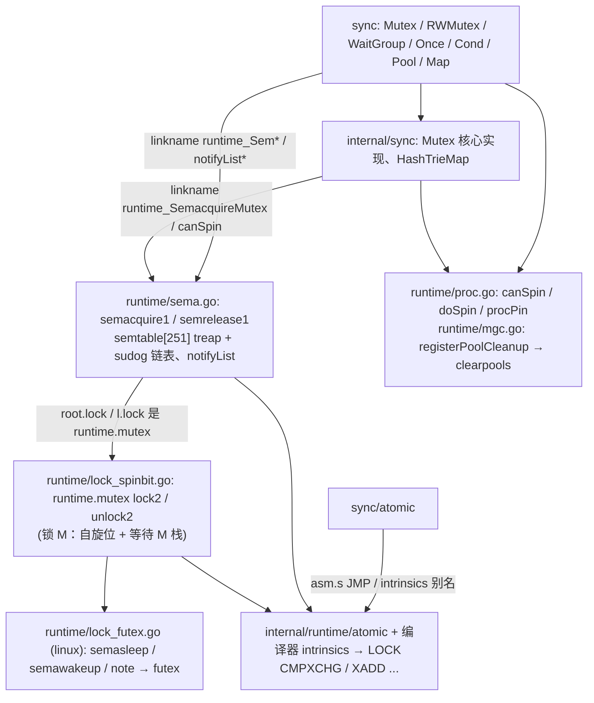
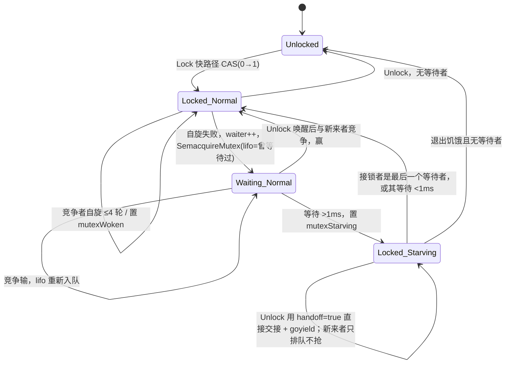

# Go 源码实现详解（十二）：同步原语与信号量

## 引言：一句话结论

Go 的同步原语是一个清晰的三层结构：

1. **最底层是 runtime 内部锁 `runtime.mutex`**，供调度器、内存分配器等 runtime 自身使用，锁的是 **M（OS 线程）**。在当前 master（Go 1.28 开发版）上，除 wasm 之外的所有平台统一使用 `src/runtime/lock_spinbit.go` 的 "spinbit" 实现；Linux 上 `src/runtime/lock_futex.go` 只负责 `note` 与 `semasleep`/`semawakeup` 这两个基于 futex 的睡眠/唤醒原语，早期版本里 `lock_futex.go` 内自带的 `lock2`/`unlock2` 已被移除。
2. **中间层是 `src/runtime/sema.go` 的信号量**：`semacquire1`/`semrelease1` 用一张 251 槽、按地址哈希的 `semtable` 管理睡眠中的 **G（goroutine）**，每个槽是一棵按地址排序的 treap，同一地址的等待者再挂成 sudog 链表。它是 sync 包"睡眠/唤醒"的唯一通道，同时也提供 `notifyList` 给 `sync.Cond`。
3. **最上层是 `sync` 包**：`Mutex` 的核心实现已经下沉到 `src/internal/sync/mutex.go`（供 `unique` 等内部包复用），`src/sync/mutex.go` 只是一个带 `noCopy` 的包装；`RWMutex`、`WaitGroup`、`Once`、`Cond`、`Pool` 仍在 `src/sync`；`sync.Map` 已经完全换成 `src/internal/sync/hashtriemap.go` 的无锁读 hash-trie，旧的 read/dirty 双 map 实现不复存在。

这三层之间靠 `//go:linkname` 桥接：`sync` 和 `internal/sync` 声明无函数体的 `runtime_Semacquire`、`runtime_SemacquireMutex`、`runtime_notifyListAdd` 等，runtime 在 `sema.go`、`proc.go`、`mgc.go` 里以 `sync_runtime_*` / `internal_sync_runtime_*` 之名给出实现。

而 `sync/atomic` 则完全不经过 runtime：`src/sync/atomic/asm.s` 把每个函数 `JMP` 到 `internal/runtime/atomic`，而编译器在 `src/cmd/compile/internal/ssagen/intrinsics.go` 里把两者都注册为 intrinsics，最终直接生成 `LOCK CMPXCHG` 之类的指令（`-race` 下例外）。

下面按从底到顶的顺序逐层展开。所有路径相对 golang/go 仓库根目录。



## 一、runtime 内部锁：`runtime.mutex` 与 spinbit 实现

### 1.1 Linux 到底用哪个文件

`runtime.mutex`（`src/runtime/runtime2.go`）的定义只有一个 `key uintptr` 字段（开启静态锁排序时多一个 `lockRankStruct`）；注释还保留着"futex 实现当 uint32 key 用、sema 实现当 `M*` 用"的历史说明。`src/runtime` 下的 `lock_*.go` 有五个：`lock_futex.go`（`dragonfly || freebsd || linux`）、`lock_sema.go`（`aix || darwin || netbsd || openbsd || plan9 || solaris || windows`）、`lock_spinbit.go`（`!wasm`）、`lock_js.go`、`lock_wasip1.go`。用 `grep 'func lock2'` 核实，非 wasm 平台上 `lock2`/`unlock2` **只**定义在 `lock_spinbit.go`。也就是说：

- `lock_futex.go` / `lock_sema.go` 现在只提供三组 OS 相关原语：一次性通知 `note`（`noteclear`/`notewakeup`/`notesleep`/`notetsleep`）以及 **每个 M 私有的信号量** `semacreate`/`semasleep`/`semawakeup`；
- `lock_spinbit.go` 在这些原语之上实现与平台无关的 `lock2`/`unlock2`。

这与很多读者记忆中的"Linux 用 futex 锁、Darwin 用 sema 锁"不同：spinbit 锁最初在 Go 1.24 以 GOEXPERIMENT 引入，现在的 master 里连实验开关都已经拿掉，`lock_spinbit.go` 的构建约束就是 `!wasm`。

Linux 上 M 私有信号量的实现就是 futex：

```go
// src/runtime/lock_futex.go
//go:nosplit
func semasleep(ns int64) int32 {
	mp := getg().m

	for v := atomic.Xadd(&mp.waitsema, -1); ; v = atomic.Load(&mp.waitsema) {
		if int32(v) >= 0 {
			return 0
		}
		futexsleep(&mp.waitsema, v, ns)
		if ns >= 0 {
			if int32(v) >= 0 {
				return 0
			} else {
				return -1
			}
		}
	}
}

//go:nosplit
func semawakeup(mp *m) {
	v := atomic.Xadd(&mp.waitsema, 1)
	if v == 0 {
		futexwakeup(&mp.waitsema, 1)
	}
}
```

`futexsleep`/`futexwakeup` 在 `src/runtime/os_linux.go` 中，分别调用 `futex(addr, _FUTEX_WAIT_PRIVATE, val, ...)` 与 `futex(addr, _FUTEX_WAKE_PRIVATE, cnt, ...)`。注意 futex 等待的地址是 `m.waitsema`，而**不是**锁本身的 `key` 字段——这是 spinbit 设计与旧 futex 锁的根本区别：等待者不再挤在同一个缓存行上被内核唤醒，而是各自睡在自己 M 的信号量上，由解锁方精确挑选一个 M 唤醒。

### 1.2 `key` 字段的位布局

`lock_spinbit.go` 把 `mutex.key` 这一个 uintptr 同时用作标志位和"最近一个睡眠 M 的指针"：

```go
// src/runtime/lock_spinbit.go
const (
	mutexLocked      = 0x001
	mutexSleeping    = 0x002
	mutexSpinning    = 0x100
	mutexStackLocked = 0x200
	mutexMMask       = 0x3FF
	mutexMOffset     = gc.MallocHeaderSize // alignment of heap-allocated Ms (those other than m0)

	mutexActiveSpinCount  = 4
	mutexActiveSpinSize   = 30
	mutexPassiveSpinCount = 1

	mutexTailWakePeriod = 16
	// ...
	mutexMLocksDelta = 16
)
```

- bit 0 `mutexLocked`：锁本身；bit 1 `mutexSleeping`：提示"高位指针非空，有 M 在睡"。快路径只对**低 8 位**做 `Xchg8`，因此 bit 2～7 保留不用。
- bit 8 `mutexSpinning`：一个"自旋许可"try-lock，同一时刻只允许一个等待 M 在 state 字上自旋，其他 M 尽量去睡，减少缓存行流量。这就是"spin bit"名字的由来。
- bit 9 `mutexStackLocked`：解锁方检查/弹出等待栈时持有的 try-lock。
- 高位：最近一次入睡的 M 的指针（去掉低 10 位）。睡眠 M 通过 `m.mWaitList.next` 连成一个栈。低位被标志覆盖后如何还原指针？`mutexWaitListHead` 依赖 M 结构体分配在特定 size class 上并带 `mutexMOffset` 的分配头偏移，`lockVerifyMSize` 在启动时校验这一点；`m0` 是静态变量，单独比较。

### 1.3 `lock2`：一字节交换的快路径，自旋位与等待栈的慢路径

```go
// src/runtime/lock_spinbit.go  func lock2
func lock2(l *mutex) {
	gp := getg()
	// ... gp.m.locks += mutexMLocksDelta（持锁期间禁止抢占）
	k8 := key8(&l.key)

	// Speculative grab for lock.
	v8 := atomic.Xchg8(k8, mutexLocked)
	if v8&mutexLocked == 0 {
		if v8&mutexSleeping != 0 {
			atomic.Or8(k8, mutexSleeping)
		}
		return
	}
	semacreate(gp.m)
	// ...
tryAcquire:
	for i := 0; ; i++ {
		// ... 锁空闲：自旋者用 CAS、非自旋者用 Xchg8 拿锁，成功则 return
		if !weSpin && v&mutexSpinning == 0 && atomic.Casuintptr(&l.key, v, v|mutexSpinning) {
			v |= mutexSpinning
			weSpin = true
		}
		if weSpin || atTail || mutexPreferLowLatency(l) {
			if i < spin { // 主动自旋 mutexActiveSpinCount 轮
				procyield(mutexActiveSpinSize)
				continue tryAcquire
			} else if i < spin+mutexPassiveSpinCount {
				osyield() // TODO: Consider removing this step. See https://go.dev/issue/69268.
				continue tryAcquire
			}
		}
		// Go to sleep
		// ... 把本 M 指针与标志位打包 CAS 进 l.key（压栈），然后 semasleep(-1)
	}
}
```

几个值得注意的点：

- `gp.m.locks += mutexMLocksDelta`：持有 runtime 锁期间 M 禁止抢占（`m.locks != 0` 时 `newstack` 不会真正抢占）。用 16 而不是 1 作为步长，是为了与 `acquirem`/`releasem` 的 +1 区分开，让 profiler 能分辨"正在释放最后一把 mutex"。
- 快路径是一条 8 位 `Xchg8`，无条件把低字节置为 `mutexLocked`；如果旧值里 `mutexSleeping` 被这一步清掉了，再用 `Or8` 补回去——因为 `Xchg8` 覆盖了整个低字节。
- 自旋条件：多核（`numCPUStartup > 1`）且我方持有 `mutexSpinning` 位（或者上次被唤醒时发现自己是等待栈尾 `atTail`，即有饿死风险；或者锁是 `sched.lock` 这类 `mutexPreferLowLatency` 的锁）。主动自旋 4 轮 `procyield(30)`，再 1 轮 `osyield()`。
- 睡眠路径：把自己的 M 指针（清低 10 位）与当前标志位、`mutexSleeping` 打包成新 key，CAS 成功即"压栈"，然后 `semasleep(-1)` 在自己的 `waitsema` 上睡。醒来后 `atTail = gp.m.mWaitList.next == 0` 判断自己是不是栈底（等最久的），并把 `i` 重置重新自旋。

### 1.4 `unlock2`：一字节归零，必要时挑一个 M 唤醒

```go
// src/runtime/lock_spinbit.go  func unlock2
func unlock2(l *mutex) {
	gp := getg()

	var prev8 uint8
	var haveStackLock bool
	var endTicks int64
	if !mutexSampleContention() {
		// Not collecting a sample for the contention profile, do the quick release
		prev8 = atomic.Xchg8(key8(&l.key), 0)
	} else {
		// ... 采样争用剖析时改用 CAS 顺便拿到 mutexStackLocked
	}
	if prev8&mutexLocked == 0 {
		throw("unlock of unlocked lock")
	}

	if prev8&mutexSleeping != 0 {
		unlock2Wake(l, haveStackLock, endTicks)
	}
	// ... gp.m.locks -= mutexMLocksDelta；若归零且 gp.preempt，恢复 stackguard0 = stackPreempt
}
```

`unlock2Wake` 的策略是：如果已有 M 在自旋（`mutexSpinning` 置位）并且这把锁不偏好低延迟，通常**不唤醒任何人**，让自旋者去抢；否则获取 `mutexStackLocked`，弹出栈顶 M 并 `semawakeup`。为了防止栈底的 M 饿死，每 `mutexTailWakePeriod = 16` 次解锁有 1/16 的概率（`cheaprandn(16) == 0`）改为 O(N) 遍历到栈底、唤醒等待最久的那个 M。这也是为什么 `lock2` 里醒来的 M 若发现自己 `atTail`，会获得临时的自旋权限。

争用剖析（`runtime.SetMutexProfileFraction`）对 runtime 锁的支持也在这里：采样时以栈顶与栈底 M 的 `mWaitList.startTicks` 平均值乘以等待数估算总延迟，与下文 `semrelease1` 对 `sync.Mutex` 的估算方式一致。

## 二、runtime 信号量：`sema.go`

`runtime.mutex` 锁的是 M；而 `sync.Mutex` 需要让 **goroutine** 睡眠，把 P 让给别人。这就是 `src/runtime/sema.go` 的职责。文件头注释说得很清楚：不要把它当成通用信号量，而是"每次 sleep 都恰好配对一次 wakeup，哪怕 wakeup 因竞争先于 sleep 发生"的睡眠/唤醒原语（Plan 9 信号量论文的思路）。

### 2.1 `semtable`：按地址哈希的 251 棵 treap

```go
// src/runtime/sema.go
type semaRoot struct {
	lock  mutex
	treap *sudog        // root of balanced tree of unique waiters.
	nwait atomic.Uint32 // Number of waiters. Read w/o the lock.
}

var semtable semTable

// Prime to not correlate with any user patterns.
const semTabSize = 251

type semTable [semTabSize]struct {
	root semaRoot
	pad  [cpu.CacheLinePadSize - unsafe.Sizeof(semaRoot{})]byte
}

func (t *semTable) rootFor(addr *uint32) *semaRoot {
	return &t[(uintptr(unsafe.Pointer(addr))>>3)%semTabSize].root
}
```

信号量本身就是用户结构体里的一个 `uint32`（`Mutex.sema`、`RWMutex.writerSem` 等），runtime 不为它分配任何东西。等待者按 `addr>>3 % 251` 落到某个 `semaRoot`，每个 root 独立加锁、缓存行对齐。root 内部是一棵 **treap**（键为地址，随机 `ticket` 作堆优先级），树上每个节点是一个 `sudog`，代表一个"独立地址"；同一地址的其他等待者通过 `sudog.waitlink`/`waittail` 挂成链表，链表操作 O(1)，树操作 O(log n)。这样一个 root 上即使有成千上万个 goroutine 等在少数几个地址上，也不会退化（issue 17953 记录了引入二级链表之前的病态案例）。

### 2.2 `semacquire1`：先试 CAS，再登记、再睡

```go
// src/runtime/sema.go  func semacquire1
func semacquire1(addr *uint32, lifo bool, profile semaProfileFlags, skipframes int, reason waitReason) {
	// ... 必须在用户 G 栈上调用
	// Easy case.
	if cansemacquire(addr) {
		return
	}
	// ...
	s := acquireSudog()
	root := semtable.rootFor(addr)
	// ... 剖析用的时间戳初始化
	for {
		lockWithRank(&root.lock, lockRankRoot)
		// Add ourselves to nwait to disable "easy case" in semrelease.
		root.nwait.Add(1)
		// Check cansemacquire to avoid missed wakeup.
		if cansemacquire(addr) {
			root.nwait.Add(-1)
			unlock(&root.lock)
			break
		}
		// Any semrelease after the cansemacquire knows we're waiting
		// (we set nwait above), so go to sleep.
		root.queue(addr, s, lifo)
		goparkunlock(&root.lock, reason, traceBlockSync, 4+skipframes)
		if s.ticket != 0 || cansemacquire(addr) {
			break
		}
	}
	// ...
	releaseSudog(s)
}
```

`cansemacquire` 是一个 `Load` + `Cas(v, v-1)` 循环。慢路径的关键是**先 `nwait.Add(1)` 再检查一次**：`semrelease1` 在 `Xadd(addr, 1)` 之后会读 `nwait`，只要它看到非零就一定会走加锁的唤醒路径，于是不会丢失唤醒。`goparkunlock` 把 G 挂起并释放 `root.lock`（这把锁是 `runtime.mutex`，也就是第一节的 spinbit 锁）。醒来后若 `s.ticket != 0`（直接交接）或再次 CAS 成功则返回，否则继续循环。

`lifo` 参数决定 `queue` 把新 sudog 插到同地址链表头还是尾——`sync.Mutex` 在"被唤醒但又没抢到"时以 `lifo=true` 重新入队，排在最前面。

### 2.3 `semrelease1`：唤醒一个，饥饿模式下直接交接并让出 P

```go
// src/runtime/sema.go  func semrelease1
func semrelease1(addr *uint32, handoff bool, skipframes int) {
	root := semtable.rootFor(addr)
	atomic.Xadd(addr, 1)
	// Easy case: no waiters?
	// This check must happen after the xadd, to avoid a missed wakeup
	// (see loop in semacquire).
	if root.nwait.Load() == 0 {
		return
	}
	// Harder case: search for a waiter and wake it.
	lockWithRank(&root.lock, lockRankRoot)
	// ... 锁内再查一次 nwait
	s, t0, tailtime := root.dequeue(addr)
	if s != nil {
		root.nwait.Add(-1)
	}
	unlock(&root.lock)
	if s != nil { // May be slow or even yield, so unlock first
		// ... 争用剖析：按 avg(head-wait, tail-wait)*N 记账，mutexevent(dt, ...)
		if handoff && cansemacquire(addr) {
			s.ticket = 1
		}
		readyWithTime(s, 5+skipframes)
		if s.ticket == 1 && getg().m.locks == 0 && getg() != getg().m.g0 {
			// Direct G handoff
			goyield()
		}
	}
}
```

`handoff=true` 是 `sync.Mutex` 饥饿模式专用的路径：释放方替被唤醒者把计数 CAS 掉（`s.ticket = 1`），被唤醒者醒来后无需再抢；随后 `readyWithTime` 把它放到当前 P 的 `runnext`，`goyield` 让出时间片，被唤醒者立刻运行。注释里解释了为什么只在饥饿模式做直接交接：正常模式下别的 goroutine 可能在我们让出的间隙把信号量抢走，交接就白做了（issue 33747）。

### 2.4 `notifyList`：`sync.Cond` 的票据队列

```go
// src/runtime/sema.go
type notifyList struct {
	wait atomic.Uint32 // 下一个等待者的票号，锁外原子递增
	notify uint32      // 下一个将被通知的票号，只在持锁时写
	lock mutex         // List of parked waiters.
	head *sudog
	tail *sudog
}
```

四个操作都以 `//go:linkname xxx sync.runtime_xxx` 导出：

- `notifyListAdd`：`l.wait.Add(1) - 1`，无锁领一张票。`Cond.Wait` 先领票、再释放用户锁、再 `notifyListWait`，因此"解锁"和"入睡"之间即便有 `Signal` 发生，也因为票号已经登记而不会丢。
- `notifyListWait(l, t)`：加锁后若 `less(t, l.notify)` 说明票已被叫到，立即返回；否则把 sudog 追加到 `head/tail` 链表，`goparkunlock`。
- `notifyListNotifyOne`：快路径 `wait == notify` 直接返回；否则 `notify++`，在链表里线性找 `ticket == t` 的 sudog 摘下并 `readyWithTime`。注释指出这个线性扫描几乎总是很快结束，因为领票与入链表的顺序只会有轻微错位。
- `notifyListNotifyAll`：把整条链表摘下来，`notify = wait`，锁外逐个唤醒。

`less(a, b)` 用 `int32(a-b) < 0` 处理 32 位回绕。`sync/runtime2.go` 里有一份 `notifyList` 的影子定义，`sync` 包的 `init` 通过 `runtime_notifyListCheck(unsafe.Sizeof(n))` 校验两边大小一致。

## 三、`sync` 与 runtime 之间的 linkname 桥

`src/sync/runtime.go` 只有声明没有函数体：

```go
// src/sync/runtime.go
func runtime_Semacquire(s *uint32)
func runtime_SemacquireWaitGroup(s *uint32, synctestDurable bool)
func runtime_SemacquireRWMutexR(s *uint32, lifo bool, skipframes int)
func runtime_SemacquireRWMutex(s *uint32, lifo bool, skipframes int)
func runtime_Semrelease(s *uint32, handoff bool, skipframes int)
func runtime_notifyListAdd(l *notifyList) uint32
// ... runtime_notifyListWait / NotifyAll / NotifyOne / Check
```

对应实现在 runtime 侧用 "push" 式 linkname 指向 `sync` 包：

```go
// src/runtime/sema.go
//go:linkname sync_runtime_Semacquire sync.runtime_Semacquire
func sync_runtime_Semacquire(addr *uint32) {
	semacquire1(addr, false, semaBlockProfile, 0, waitReasonSemacquire)
}

//go:linkname internal_sync_runtime_SemacquireMutex internal/sync.runtime_SemacquireMutex
func internal_sync_runtime_SemacquireMutex(addr *uint32, lifo bool, skipframes int) {
	semacquire1(addr, lifo, semaBlockProfile|semaMutexProfile, skipframes, waitReasonSyncMutexLock)
}
```

各个变体功能相同，区别只在 `waitReason`（决定 goroutine dump 里显示 `sync.Mutex.Lock` 还是 `sync.RWMutex.RLock`）以及是否参与 mutex profile。`internal/sync/runtime.go` 则用 "pull" 式 linkname（`//go:linkname runtime_SemacquireMutex` 单参数形式）声明 `runtime_SemacquireMutex`、`runtime_Semrelease`、`runtime_canSpin`、`runtime_doSpin`、`runtime_nanotime`、`throw`、`fatal`。

其它几座桥：`runtime_procPin`/`runtime_procUnpin`（`src/runtime/proc.go`，供 `sync.Pool` 与 `atomic.Value`）、`runtime_registerPoolCleanup`（`src/runtime/mgc.go`）、`runtime_randn`（`sync.Pool` 在 race 模式下随机丢弃）以及 `runtime_rand`（`HashTrieMap` 的哈希种子）。这些符号很多都带着 "hall of shame" 注释——gvisor、bytedance/gopkg 等第三方包直接 linkname 了它们，因此签名被冻结（issue 67401）。

## 四、`sync.Mutex`

### 4.1 两个包的分工

Go 1.24 起 `Mutex` 的实现从 `src/sync/mutex.go` 搬到了 `src/internal/sync/mutex.go`，原因是 `unique`、`internal/sync.HashTrieMap` 这些被 `sync` 依赖的内部包也需要一把锁，不能反向 import `sync`。现在：

```go
// src/sync/mutex.go
type Mutex struct {
	_ noCopy

	mu isync.Mutex
}

func (m *Mutex) Lock()         { m.mu.Lock() }
func (m *Mutex) TryLock() bool { return m.mu.TryLock() }
func (m *Mutex) Unlock()       { m.mu.Unlock() }
```

`noCopy` 是一个空结构体，带空的 `Lock`/`Unlock` 方法，只为触发 `go vet` 的 copylocks 检查。真正的状态在 `internal/sync`：

```go
// src/internal/sync/mutex.go
type Mutex struct {
	state int32
	sema  uint32
}

const (
	mutexLocked = 1 << iota // mutex is locked
	mutexWoken
	mutexStarving
	mutexWaiterShift = iota
	// ...
	starvationThresholdNs = 1e6
)
```

`state` 的低三位是 `mutexLocked`(1)、`mutexWoken`(2)、`mutexStarving`(4)，`state >> 3` 是等待者计数。`sema` 就是上一节信号量的那个 `uint32`。

### 4.2 `Lock` 快路径与 `TryLock`

```go
// src/internal/sync/mutex.go
func (m *Mutex) Lock() {
	// Fast path: grab unlocked mutex.
	if atomic.CompareAndSwapInt32(&m.state, 0, mutexLocked) {
		if race.Enabled {
			race.Acquire(unsafe.Pointer(m))
		}
		return
	}
	// Slow path (outlined so that the fast path can be inlined)
	m.lockSlow()
}

func (m *Mutex) TryLock() bool {
	old := m.state
	if old&(mutexLocked|mutexStarving) != 0 {
		return false
	}
	// There may be a goroutine waiting for the mutex, but we are
	// running now and can try to grab the mutex before that
	// goroutine wakes up.
	if !atomic.CompareAndSwapInt32(&m.state, old, old|mutexLocked) {
		return false
	}
	// ...
	return true
}
```

快路径就是一条 CAS(0 → 1)，`lockSlow` 被拆出去是为了让 `Lock` 能内联。`TryLock` 自 Go 1.18 加入（不是 1.25；1.24 之后的变化只是它随 `Mutex` 一起搬进了 `internal/sync`），它遇到饥饿模式直接返回 false，否则允许"插队"——即使有等待者，只要锁位是空的就抢。

### 4.3 `lockSlow`：自旋、正常模式与饥饿模式

```go
// src/internal/sync/mutex.go  func (m *Mutex) lockSlow
func (m *Mutex) lockSlow() {
	var waitStartTime int64
	starving := false
	awoke := false
	iter := 0
	old := m.state
	for {
		// Don't spin in starvation mode, ownership is handed off to waiters
		// so we won't be able to acquire the mutex anyway.
		if old&(mutexLocked|mutexStarving) == mutexLocked && runtime_canSpin(iter) {
			// Try to set mutexWoken flag to inform Unlock
			// to not wake other blocked goroutines.
			if !awoke && old&mutexWoken == 0 && old>>mutexWaiterShift != 0 &&
				atomic.CompareAndSwapInt32(&m.state, old, old|mutexWoken) {
				awoke = true
			}
			runtime_doSpin()
			iter++
			old = m.state
			continue
		}
		new := old
		// Don't try to acquire starving mutex, new arriving goroutines must queue.
		if old&mutexStarving == 0 {
			new |= mutexLocked
		}
		if old&(mutexLocked|mutexStarving) != 0 {
			new += 1 << mutexWaiterShift
		}
		// ... starving 且锁被持有时置 mutexStarving；awoke 时清 mutexWoken
```

自旋条件由 runtime 判定：

```go
// src/runtime/proc.go
//go:linkname internal_sync_runtime_canSpin internal/sync.runtime_canSpin
//go:nosplit
func internal_sync_runtime_canSpin(i int) bool {
	// sync.Mutex is cooperative, so we are conservative with spinning.
	// Spin only few times and only if running on a multicore machine and
	// GOMAXPROCS>1 and there is at least one other running P and local runq is empty.
	// As opposed to runtime mutex we don't do passive spinning here,
	// because there can be work on global runq or on other Ps.
	if i >= active_spin || numCPUStartup <= 1 || gomaxprocs <= sched.npidle.Load()+sched.nmspinning.Load()+1 {
		return false
	}
	if p := getg().m.p.ptr(); !runqempty(p) {
		return false
	}
	return true
}

//go:linkname internal_sync_runtime_doSpin internal/sync.runtime_doSpin
//go:nosplit
func internal_sync_runtime_doSpin() {
	procyield(active_spin_cnt)
}
```

`active_spin = 4`、`active_spin_cnt = 30` 定义在 `lock_spinbit.go`，注释明确写着"referenced in proc.go for sync.Mutex implementation"。也就是最多自旋 4 轮、每轮 30 条 `PAUSE`，且要求多核、有其它 P 在跑、本地运行队列为空——自旋者在等锁时把 `mutexWoken` 置上，告诉 `Unlock` 不必再唤醒别人。

CAS 成功后的后半段：

```go
// src/internal/sync/mutex.go  func (m *Mutex) lockSlow（续）
		if atomic.CompareAndSwapInt32(&m.state, old, new) {
			if old&(mutexLocked|mutexStarving) == 0 {
				break // locked the mutex with CAS
			}
			// If we were already waiting before, queue at the front of the queue.
			queueLifo := waitStartTime != 0
			if waitStartTime == 0 {
				waitStartTime = runtime_nanotime()
			}
			runtime_SemacquireMutex(&m.sema, queueLifo, 2)
			starving = starving || runtime_nanotime()-waitStartTime > starvationThresholdNs
			old = m.state
			if old&mutexStarving != 0 {
				// ... 饥饿模式下所有权已直接交给我们：置 mutexLocked、减一个等待者
				delta := int32(mutexLocked - 1<<mutexWaiterShift)
				if !starving || old>>mutexWaiterShift == 1 {
					// Exit starvation mode.
					delta -= mutexStarving
				}
				atomic.AddInt32(&m.state, delta)
				break
			}
			awoke = true
			iter = 0
		} // ... CAS 失败则重读 old
	}
}
```

两种模式的规则（源码注释是最权威的描述）：

- **正常模式**：等待者 FIFO 排队，但被唤醒者不拥有锁，要与新来的 goroutine 竞争；新来者正在 CPU 上、数量可能很多，所以被唤醒者容易输。输了就以 `lifo=true` 重新排到队首。如果某个等待者超过 `starvationThresholdNs = 1ms` 还没拿到锁，它在下一次入队时把锁切到饥饿模式。
- **饥饿模式**：`Unlock` 直接把所有权交给队首（`handoff=true`），新来者即使看到锁空闲也不抢、不自旋，直接排到队尾。拿到锁的等待者若发现自己是最后一个、或者自己等待时间不足 1ms，就把模式切回正常。



### 4.4 `Unlock` 与 `unlockSlow`

`Unlock` 的快路径是 `new := atomic.AddInt32(&m.state, -mutexLocked)`，结果非零才调用 `unlockSlow(new)`：

```go
// src/internal/sync/mutex.go  func (m *Mutex) unlockSlow
func (m *Mutex) unlockSlow(new int32) {
	if (new+mutexLocked)&mutexLocked == 0 {
		fatal("sync: unlock of unlocked mutex")
	}
	if new&mutexStarving == 0 {
		old := new
		for {
			// If there are no waiters or a goroutine has already
			// been woken or grabbed the lock, no need to wake anyone.
			if old>>mutexWaiterShift == 0 || old&(mutexLocked|mutexWoken|mutexStarving) != 0 {
				return
			}
			// Grab the right to wake someone.
			new = (old - 1<<mutexWaiterShift) | mutexWoken
			if atomic.CompareAndSwapInt32(&m.state, old, new) {
				runtime_Semrelease(&m.sema, false, 2)
				return
			}
			old = m.state
		}
	} else {
		// Starving mode: handoff mutex ownership to the next waiter, and yield
		// our time slice so that the next waiter can start to run immediately.
		runtime_Semrelease(&m.sema, true, 2)
	}
}
```

解锁已解锁的锁会 `fatal`（不可 recover）。正常模式下先用 CAS"抢到唤醒权"（等待者减一并置 `mutexWoken`），再 `Semrelease`；饥饿模式下不改 state，直接 `handoff=true` 交接——此时 `mutexLocked` 位是 0，但因为 `mutexStarving` 在，新来者不会去抢，被唤醒者负责补上 `mutexLocked`。

## 五、`sync.RWMutex`：负偏移 `rwmutexMaxReaders`

```go
// src/sync/rwmutex.go
type RWMutex struct {
	w           Mutex        // held if there are pending writers
	writerSem   uint32       // semaphore for writers to wait for completing readers
	readerSem   uint32       // semaphore for readers to wait for completing writers
	readerCount atomic.Int32 // number of pending readers
	readerWait  atomic.Int32 // number of departing readers
}

const rwmutexMaxReaders = 1 << 30
```

核心技巧：`readerCount` 平时是读者数；写者到来时一次性减去 `1<<30`，让它变成负数。读者只要看到负值就知道"有写者在等或在写"：

```go
// src/sync/rwmutex.go
func (rw *RWMutex) RLock() {
	// ...
	if rw.readerCount.Add(1) < 0 {
		// A writer is pending, wait for it.
		runtime_SemacquireRWMutexR(&rw.readerSem, false, 0)
	}
	// ...
}

func (rw *RWMutex) rUnlockSlow(r int32) { // RUnlock: readerCount.Add(-1) < 0 时调用
	if r+1 == 0 || r+1 == -rwmutexMaxReaders {
		race.Enable()
		fatal("sync: RUnlock of unlocked RWMutex")
	}
	// A writer is pending.
	if rw.readerWait.Add(-1) == 0 {
		// The last reader unblocks the writer.
		runtime_Semrelease(&rw.writerSem, false, 1)
	}
}
```

写者：

```go
// src/sync/rwmutex.go
func (rw *RWMutex) Lock() {
	// ...
	// First, resolve competition with other writers.
	rw.w.Lock()
	// Announce to readers there is a pending writer.
	r := rw.readerCount.Add(-rwmutexMaxReaders) + rwmutexMaxReaders
	// Wait for active readers.
	if r != 0 && rw.readerWait.Add(r) != 0 {
		runtime_SemacquireRWMutex(&rw.writerSem, false, 0)
	}
	// ...
}

func (rw *RWMutex) Unlock() {
	// ...
	r := rw.readerCount.Add(rwmutexMaxReaders)
	// ... r >= rwmutexMaxReaders 则 fatal("sync: Unlock of unlocked RWMutex")
	for i := 0; i < int(r); i++ {
		runtime_Semrelease(&rw.readerSem, false, 0)
	}
	rw.w.Unlock()
}
```

流程串起来：写者先用内嵌的 `w Mutex` 排除其它写者；再把 `readerCount` 减 `1<<30`，`r` 是此刻还活跃的读者数；把 `r` 加到 `readerWait` 上，等这些"存量读者"全部 `RUnlock`（最后一个把 `readerWait` 减到 0 并释放 `writerSem`）。在此期间新来的读者 `Add(1)` 得到负值，睡在 `readerSem` 上。写者 `Unlock` 时加回 `1<<30`，得到的 `r` 正好是期间被阻塞的读者数，逐个 `Semrelease(readerSem)`。

这个设计保证了**写者不会被源源不断的读者饿死**：一旦有写者宣告（`readerCount < 0`），后续读者一律排队；而 `readerWait` 单独计数"存量读者"，避免写者去等那些本就排在它后面的新读者。代价是不可重入：持有读锁的 goroutine 再次 `RLock`，若中间有写者插入就会死锁，文档对此有明确警告。

`TryLock`/`TryRLock` 是 CAS 版本：`TryLock` 先 `w.TryLock()`，再 `readerCount.CompareAndSwap(0, -rwmutexMaxReaders)`，任一步失败就回滚。`syscall_hasWaitingReaders` 用 linkname 导出给 `syscall` 包（`ForkLock` 相关）。

## 六、`sync.WaitGroup`：一个 64 位字打包计数与等待者

```go
// src/sync/waitgroup.go
type WaitGroup struct {
	noCopy noCopy

	// Bits (high to low):
	//   bits[0:32]  counter
	//   bits[32]    flag: synctest bubble membership
	//   bits[33:64] wait count
	state atomic.Uint64
	sema  uint32
}

// waitGroupBubbleFlag indicates that a WaitGroup is associated with a synctest bubble.
const waitGroupBubbleFlag = 0x8000_0000
```

高 32 位是任务计数，低 31 位是 `Wait` 的等待者数，第 31 位是 Go 1.25 引入 `testing/synctest` 后新增的 bubble 标志。`atomic.Uint64` 内含 `align64`，因此 32 位平台上的 8 字节对齐由类型自身保证，早期版本靠 `state1 [3]uint32` 手动对齐的写法已成历史。

```go
// src/sync/waitgroup.go  func (wg *WaitGroup) Add
func (wg *WaitGroup) Add(delta int) {
	// ... race 与 synctest 处理
	state := wg.state.Add(uint64(delta) << 32)
	// ...
	v := int32(state >> 32)
	w := uint32(state & 0x7fffffff)
	// ...
	if v < 0 {
		panic("sync: negative WaitGroup counter")
	}
	if w != 0 && delta > 0 && v == int32(delta) {
		panic("sync: WaitGroup misuse: Add called concurrently with Wait")
	}
	if v > 0 || w == 0 {
		return
	}
	// This goroutine has set counter to 0 when waiters > 0.
	// ... 再做一次廉价检查：state 若已变化则 panic misuse
	wg.state.Store(0)
	// ...
	for ; w != 0; w-- {
		runtime_Semrelease(&wg.sema, false, 0)
	}
}
```

`Done` 就是 `Add(-1)`。`Wait` 循环读 state：计数为 0 直接返回；否则 CAS 把等待者加一，然后 `runtime_SemacquireWaitGroup(&wg.sema, synctestDurable)`；醒来后如果 `state != 0`，说明在 `Wait` 返回前 WaitGroup 又被复用了，panic `"sync: WaitGroup is reused before previous Wait has returned"`。计数归零时 `Add` 把 state 整个写 0，并按等待者数逐个 `Semrelease`——每个 `Wait` 恰好消费一次。

Go 1.25 新增的 `WaitGroup.Go`：

```go
// src/sync/waitgroup.go
func (wg *WaitGroup) Go(f func()) {
	wg.Add(1)
	go func() {
		defer func() {
			if x := recover(); x != nil {
				// f panicked, which will be fatal because
				// this is a new goroutine.
				//
				// Calling Done will unblock Wait in the main goroutine,
				// allowing it to race with the fatal panic and
				// possibly even exit the process (os.Exit(0))
				// before the panic completes.
				// ...
				panic(x)
			}

			// f completed normally, or abruptly using goexit.
			// Either way, decrement the semaphore.
			wg.Done()
		}()
		f()
	}()
}
```

注意它并不是简单的 `defer wg.Done()`：当 `f` panic 时**故意不调用 `Done`**，以免 `Wait` 先返回、主 goroutine 抢在 panic 打印前 `os.Exit(0)`，把崩溃信息吞掉。文档因此写明 "The function f must not panic"。

## 七、`sync.Once` 与 `sync.Cond`

### 7.1 `Once`：一个原子布尔加一把互斥锁

```go
// src/sync/once.go
type Once struct {
	_ noCopy

	done atomic.Bool
	m    Mutex
}

func (o *Once) Do(f func()) {
	if !o.done.Load() {
		// Outlined slow-path to allow inlining of the fast-path.
		o.doSlow(f)
	}
}

func (o *Once) doSlow(f func()) {
	o.m.Lock()
	defer o.m.Unlock()
	if !o.done.Load() {
		defer o.done.Store(true)
		f()
	}
}
```

为什么不用 CAS(0→1) 然后调 `f`？因为那样两个并发的 `Do` 中失败的一方会在 `f` 完成前返回，违反"`f` 完成 synchronizes before 任何 `Do` 返回"的内存模型承诺（`doc/go_mem.html` Once 一节）。所以慢路径用 `Mutex` 串行化，`done` 只在 `f` 返回后（哪怕 `f` panic，`defer` 也会置位）才写 1。`Do` 的文档也因此说明：`f` panic 时 `Once` 视为已完成，后续 `Do` 不会再调用 `f`。

`src/sync/oncefunc.go` 的 `OnceFunc`/`OnceValue`/`OnceValues`（Go 1.21）在 `Once` 之上加了 panic 传播：`f` panic 时用 `recover` 把值存进 `d.p`，第一次调用重新 panic，之后每次调用都用同一个值再次 panic；`f` 成功后 `d.f = nil` 释放闭包引用。

### 7.2 `Cond`：`notifyList` 加拷贝检查

```go
// src/sync/cond.go
type Cond struct {
	noCopy noCopy
	// L is held while observing or changing the condition
	L Locker
	notify  notifyList
	checker copyChecker
}

func (c *Cond) Wait() {
	c.checker.check()
	t := runtime_notifyListAdd(&c.notify)
	c.L.Unlock()
	runtime_notifyListWait(&c.notify, t)
	c.L.Lock()
}

type copyChecker uintptr

func (c *copyChecker) check() {
	// ...
	if uintptr(*c) != uintptr(unsafe.Pointer(c)) &&
		!atomic.CompareAndSwapUintptr((*uintptr)(c), 0, uintptr(unsafe.Pointer(c))) &&
		uintptr(*c) != uintptr(unsafe.Pointer(c)) {
		panic("sync.Cond is copied")
	}
}
```

`copyChecker` 在第一次使用时把自己的地址 CAS 写进自己，之后每次比较"我存的地址是不是我现在的地址"，被拷贝后地址变了就 panic。这是 `Cond` 比其它原语更严格的地方：其它类型只靠 `vet` 静态检查，`Cond` 在运行期也拦。`Wait` 先领票再解锁的顺序，前面 `notifyList` 一节已说明。

## 八、`sync.Pool`：per-P 缓存、无锁双端队列与 victim

### 8.1 结构

```go
// src/sync/pool.go
type Pool struct {
	noCopy noCopy
	local     unsafe.Pointer // local fixed-size per-P pool, actual type is [P]poolLocal
	localSize uintptr        // size of the local array
	victim     unsafe.Pointer // local from previous cycle
	victimSize uintptr        // size of victims array
	New func() any
}

// Local per-P Pool appendix.
type poolLocalInternal struct {
	private any       // Can be used only by the respective P.
	shared  poolChain // Local P can pushHead/popHead; any P can popTail.
}

type poolLocal struct {
	poolLocalInternal
	// Prevents false sharing on widespread platforms with
	// 128 mod (cache line size) = 0 .
	pad [128 - unsafe.Sizeof(poolLocalInternal{})%128]byte
}
```

每个 P 一个 `poolLocal`，用 128 字节补齐避免伪共享。`private` 只有本 P 访问，不需要任何原子操作；`shared` 是一个 `poolChain`：本 P 从头部 push/pop，其它 P 只能从尾部偷。

### 8.2 `Get`/`Put` 与 `procPin`

```go
// src/sync/pool.go
func (p *Pool) Get() any {
	// ...
	l, pid := p.pin()
	x := l.private
	if x != nil {
		l.private = nil
	} else {
		// Try to pop the head of the local shard. We prefer
		// the head over the tail for temporal locality of
		// reuse.
		x, _ = l.shared.popHead()
		if x == nil {
			x = p.getSlow(pid)
		}
	}
	runtime_procUnpin()
	// ...
	if x == nil && p.New != nil {
		x = p.New()
	}
	return x
}
```

`pin` 调用 `runtime_procPin`（`src/runtime/proc.go` 中就是 `mp.locks++` 并返回当前 P 的 id）：禁止抢占，保证在 `procUnpin` 之前当前 goroutine 不会被迁移到别的 P，`private` 字段才可以无锁访问；随后以 `rtatomic.LoadAcquintptr(&p.localSize)`（load-acquire）读大小、再读 `p.local`，`pid < localSize` 就返回 `indexLocal(l, pid)`。`pinSlow` 处理首次使用或 `GOMAXPROCS` 变大的情况：先解 pin、拿全局 `allPoolsMu`、重新 pin，按 `runtime.GOMAXPROCS(0)` 分配新的 `[]poolLocal`，把 `p` 追加到 `allPools`，然后用 store-release 顺序先写 `local` 再写 `localSize`。`Pool` 是标准库里少数直接使用 `internal/runtime/atomic` 的 `LoadAcquintptr`/`StoreReluintptr` 的地方（`sync/atomic` 没有 acquire/release 变体）。

`getSlow` 的顺序：从其它 P 的 `shared` 尾部偷（`popTail`）→ 本 P 的 victim `private` → 各 P 的 victim `shared` 尾部 → 都没有则把 `victimSize` 置 0 让后来者跳过。

### 8.3 `poolqueue.go`：单生产者多消费者的无锁环形队列

```go
// src/sync/poolqueue.go
type poolDequeue struct {
	// headTail packs together a 32-bit head index and a 32-bit
	// tail index. Both are indexes into vals modulo len(vals)-1.
	// ...
	headTail atomic.Uint64
	// vals is a ring buffer of interface{} values stored in
	// this dequeue. The size of this must be a power of 2.
	// ...
	vals []eface
}

const dequeueBits = 32
const dequeueLimit = (1 << dequeueBits) / 4
```

`head`/`tail` 打包在一个 `uint64` 里，用单次 CAS 更新。`pushHead`（仅生产者）：检查 `typ` 槽为空后先写值再 `headTail.Add(1<<32)`；`popHead`（仅生产者）：CAS 把 head 减一，然后读槽；`popTail`（任意消费者）：CAS 把 tail 加一"占住"槽，读出值后先清 `val` 再 `atomic.StorePointer(&slot.typ, nil)`——`typ` 归零是把槽交还给生产者的信号，这就是为什么 `pushHead` 要先看 `typ`。nil 值用哨兵 `dequeueNil` 表示以区分"空槽"。

`poolChain` 把多个 `poolDequeue` 串成链表，容量从 8 开始逐级翻倍直到 `dequeueLimit`：

`poolChain{head *poolChainElt; tail atomic.Pointer[poolChainElt]}` 的 `head` 只被生产者访问、无需同步，`tail` 被消费者共享、必须原子；每个 `poolChainElt` 内嵌一个 `poolDequeue` 并带 `next`/`prev` 原子指针。`popTail` 从尾节点开始偷，空了就 CAS 把 `tail` 推进到 `next` 并把旧节点从链上摘掉，摘下的空节点由 GC 回收，链表永远不会无界增长。

### 8.4 victim cache 与 GC 钩子

```go
// src/sync/pool.go
func poolCleanup() {
	// This function is called with the world stopped, at the beginning of a garbage collection.
	// ...
	for _, p := range oldPools { // Drop victim caches from all pools.
		p.victim = nil
		p.victimSize = 0
	}
	for _, p := range allPools { // Move primary cache to victim cache.
		p.victim = p.local
		p.victimSize = p.localSize
		p.local = nil
		p.localSize = 0
	}
	oldPools, allPools = allPools, nil
}

func init() {
	runtime_registerPoolCleanup(poolCleanup)
}
```

runtime 侧的挂接点在 `src/runtime/mgc.go`：`sync_runtime_registerPoolCleanup`（`//go:linkname ... sync.runtime_registerPoolCleanup`）把函数存进包级变量 `poolcleanup`；`clearpools` 先调用它，再清理 boringcrypto 缓存、中央 sudog 缓存和中央 defer 池。`clearpools` 在 `gcStart` 里、STW 之后、并发标记之前调用（注释："clearpools before we start the GC. If we wait the memory will not be reclaimed until the next GC cycle."）。因此 Pool 中的对象至少能活过一轮 GC（先降级为 victim，下一轮才真正丢弃），避免 Go 1.13 之前"每次 GC 池子清空、之后突发分配"的抖动。

## 九、`sync.Map`：已经是 hash-trie

### 9.1 现状

`src/sync/map.go` 现在只有薄薄一层：

```go
// src/sync/map.go
type Map struct {
	_ noCopy

	m isync.HashTrieMap[any, any]
}

func (m *Map) Load(key any) (value any, ok bool) { return m.m.Load(key) }
func (m *Map) Store(key, value any)              { m.m.Store(key, value) }
func (m *Map) LoadOrStore(key, value any) (actual any, loaded bool) {
	return m.m.LoadOrStore(key, value)
}
// ... Clear / LoadAndDelete / Delete / Swap / CompareAndSwap / CompareAndDelete / Range
```

这个文件没有任何 build tag，也没有旧的 `read atomic.Pointer[readOnly]` + `dirty map[any]*entry` 字段。也就是说 Go 1.24 以 GOEXPERIMENT `synchashtriemap` 引入、默认开启的新实现，如今已经是唯一实现。它同时被 `src/unique/handle.go` 用作 `uniqueMaps isync.HashTrieMap[*abi.Type, any]`。

### 9.2 结构：16 叉 trie，叶子带溢出链

```go
// src/internal/sync/hashtriemap.go
type HashTrieMap[K comparable, V any] struct {
	inited   atomic.Uint32
	initMu   Mutex
	root     atomic.Pointer[indirect[K, V]]
	keyHash  hashFunc
	valEqual equalFunc
	seed     uintptr
}

// ... const nChildrenLog2 = 4; nChildren = 16; nChildrenMask = 15

// indirect is an internal node in the hash-trie.
type indirect[K comparable, V any] struct {
	node[K, V]
	dead     atomic.Bool
	mu       Mutex // Protects mutation to children and any children that are entry nodes.
	parent   *indirect[K, V]
	children [nChildren]atomic.Pointer[node[K, V]]
}

// entry is a leaf node in the hash-trie.
type entry[K comparable, V any] struct {
	node[K, V]
	overflow atomic.Pointer[entry[K, V]] // Overflow for hash collisions.
	key      K
	value    V
}
```

分叉数 `nChildren = 16`（`nChildrenLog2 = 4`），源码注释说这是读性能的最佳点：再小会损失 50% 以上 CPU 性能，再大（32）只有约 1% 的收益。`node` 只有一个 `isEntry bool`，`indirect` 与 `entry` 都把它内嵌在首位，通过 `unsafe.Pointer` 互转。`initSlow` 借 `abi.TypeOf(map[K]V).MapType()` 拿到编译器为 map 生成的 `Hasher` 和 `Elem.Equal`，因此它能复用内置 map 的哈希函数（包括 AES 硬件哈希）和随机种子 `runtime_rand()`。

### 9.3 无锁读

```go
// src/internal/sync/hashtriemap.go
func (ht *HashTrieMap[K, V]) Load(key K) (value V, ok bool) {
	ht.init()
	hash := ht.keyHash(abi.NoEscape(unsafe.Pointer(&key)), ht.seed)

	i := ht.root.Load()
	hashShift := 8 * goarch.PtrSize
	for hashShift != 0 {
		hashShift -= nChildrenLog2

		n := i.children[(hash>>hashShift)&nChildrenMask].Load()
		if n == nil {
			return *new(V), false
		}
		if n.isEntry {
			return n.entry().lookup(key)
		}
		i = n.indirect()
	}
	panic("internal/sync.HashTrieMap: ran out of hash bits while iterating")
}
```

从哈希的高 4 位开始逐层下钻，全程只有 `atomic.Pointer.Load`，没有锁、没有 CAS、没有写操作。64 位平台最多 16 层。叶子 `entry.lookup` 沿 `overflow` 链比较 `key == key`，只有完全哈希冲突才会有链。

### 9.4 写入与扩展

`LoadOrStore` 先无锁下钻找到插入点（空槽或某个 entry），然后锁住该 `indirect` 的 `mu`，**在锁内重新读一次槽**并检查 `!i.dead.Load()`——如果这期间节点被别的删除操作摘掉（`dead` 置位）或槽变成了 indirect，就解锁重来。确认后：

```go
// src/internal/sync/hashtriemap.go  func (ht *HashTrieMap[K, V]) expand
func (ht *HashTrieMap[K, V]) expand(oldEntry, newEntry *entry[K, V], newHash uintptr, hashShift uint, parent *indirect[K, V]) *node[K, V] {
	// Check for a hash collision.
	oldHash := ht.keyHash(unsafe.Pointer(&oldEntry.key), ht.seed)
	if oldHash == newHash {
		newEntry.overflow.Store(oldEntry)
		return &newEntry.node
	}
	// We have to add an indirect node. Worse still, we may need to add more than one.
	newIndirect := newIndirectNode(parent)
	top := newIndirect
	for {
		// ... hashShift == 0 则 panic：哈希位耗尽
		hashShift -= nChildrenLog2 // hashShift is for the level parent is at. We need to go deeper.
		oi := (oldHash >> hashShift) & nChildrenMask
		ni := (newHash >> hashShift) & nChildrenMask
		if oi != ni {
			newIndirect.children[oi].Store(&oldEntry.node)
			newIndirect.children[ni].Store(&newEntry.node)
			break
		}
		nextIndirect := newIndirectNode(newIndirect)
		newIndirect.children[oi].Store(&nextIndirect.node)
		newIndirect = nextIndirect
	}
	return &top.node
}
```

槽位已被另一个 key 占用时，新建一条足够深的 indirect 链，直到两者的哈希前缀分叉，再把整条子树用一次 `slot.Store` 发布——读者要么看到旧 entry，要么看到完整的新子树，不会看到半成品。删除（`LoadAndDelete`）则反向收缩：摘掉 entry 后若 indirect 变空，就锁住父节点、把自己标为 `dead`、从父节点的 `children` 中清除，逐层向上，保证 trie 不会因反复插删而残留空壳。

对比旧实现：read/dirty 双 map 在写多的场景需要频繁提升 dirty，`Range` 也可能触发整表拷贝；hash-trie 的锁粒度是单个 indirect 节点（16 个槽），读路径纯无锁，且 `Range` 只是 DFS 遍历，不阻塞任何写。代价是每个 key 一次堆分配，以及 `any` 键的哈希开销。

## 十、原子操作：从 `sync/atomic` 到机器指令

### 10.1 三层 API

- `sync/atomic`：公开 API。函数式的 `AddInt32`/`CompareAndSwapPointer` 等定义在 `src/sync/atomic/doc.go`（只有声明），Go 1.19 起的类型化 API `atomic.Int32`/`Int64`/`Uint32`/`Uint64`/`Uintptr`/`Bool`/`Pointer[T]` 在 `src/sync/atomic/type.go`，`atomic.Value` 在 `value.go`。Go 1.23 又补了 `And`/`Or`。
- `internal/runtime/atomic`：runtime 自用，命名沿袭 Plan 9 风格：`Cas`、`Cas64`、`Xadd`、`Xchg`、`Xchg8`、`Load`/`Loadp`/`LoadAcq`、`Store`/`StoreRel`/`StorepNoWB`、`And8`/`Or8` 等，每个架构一对 `atomic_<arch>.go` + `.s`。
- 编译器 intrinsics：`src/cmd/compile/internal/ssagen/intrinsics.go`。

类型化 API 的价值除了可读性，还有对齐保证：

```go
// src/sync/atomic/type.go
type Int64 struct {
	_ noCopy
	_ align64
	v int64
}

func (x *Int64) Load() int64 { return LoadInt64(&x.v) }
func (x *Int64) Store(val int64) { StoreInt64(&x.v, val) }
func (x *Int64) Add(delta int64) (new int64) { return AddInt64(&x.v, delta) }
```

`align64` 是编译器识别的特殊空类型，让含它的结构体在 32 位平台上也 8 字节对齐；裸用 `int64` 字段配合 `AddInt64` 在 386/arm 上对齐不对会直接崩溃。

### 10.2 汇编转发与 intrinsics

`src/sync/atomic/asm.s` 把公开函数一一 `JMP` 到 runtime 内部实现：

```asm
// src/sync/atomic/asm.s
TEXT ·SwapInt32(SB),NOSPLIT,$0
	JMP	internal∕runtime∕atomic·Xchg(SB)

TEXT ·CompareAndSwapInt32(SB),NOSPLIT,$0
	JMP	internal∕runtime∕atomic·Cas(SB)

TEXT ·AddInt32(SB),NOSPLIT,$0
	JMP	internal∕runtime∕atomic·Xadd(SB)
```

而 amd64 上 `Cas` 本身就是一条 `LOCK CMPXCHGL`：

```asm
// src/internal/runtime/atomic/atomic_amd64.s
TEXT ·Cas(SB),NOSPLIT,$0-17
	MOVQ	ptr+0(FP), BX
	MOVL	old+8(FP), AX
	MOVL	new+12(FP), CX
	LOCK
	CMPXCHGL	CX, 0(BX)
	SETEQ	ret+16(FP)
	RET
```

不过正常编译时这些汇编几乎不会被调用到。`intrinsics.go` 先为 `internal/runtime/atomic` 的每个函数注册 SSA 生成器：

```go
// src/cmd/compile/internal/ssagen/intrinsics.go  func initIntrinsics
	/******** internal/runtime/atomic ********/
	// ...
	addF("internal/runtime/atomic", "Cas",
		func(s *state, n *ir.CallExpr, args []*ssa.Value) *ssa.Value {
			v := s.newValue4(ssaop.OpAtomicCompareAndSwap32, types.NewTuple(types.Types[types.TBOOL], types.TypeMem), args[0], args[1], args[2], s.mem())
			s.vars[memVar] = s.newValue1(ssaop.OpSelect1, types.TypeMem, v)
			return s.newValue1(ssaop.OpSelect0, types.Types[types.TBOOL], v)
		},
		sys.AMD64, sys.MIPS, sys.MIPS64, sys.PPC64, sys.RISCV64, sys.S390X)
```

（arm64 与 loong64 的 `Cas` 另有带运行时特性检测的 guarded 版本注册。）

然后把 `sync/atomic` 的函数**别名**到它们：

```go
// src/cmd/compile/internal/ssagen/intrinsics.go  func initIntrinsics
	/******** sync/atomic ********/

	// Note: these are disabled by flag_race in findIntrinsic below.
	alias("sync/atomic", "LoadInt32", "internal/runtime/atomic", "Load", all...)
	alias("sync/atomic", "LoadPointer", "internal/runtime/atomic", "Loadp", all...)
	// ...
	// Note: not StorePointer, that needs a write barrier.  Same below for {CompareAnd}Swap.
	alias("sync/atomic", "StoreUint32", "internal/runtime/atomic", "Store", all...)
	// ...
	alias("sync/atomic", "CompareAndSwapInt32", "internal/runtime/atomic", "Cas", all...)
```

两处细节：`StorePointer`/`SwapPointer`/`CompareAndSwapPointer` 不做 intrinsic，因为指针写需要 GC 写屏障，它们走 `src/runtime/atomic_pointer.go` 里带屏障的版本；arm64 上有 `makeAtomicGuardedIntrinsicARM64`，运行时检测 `ARM64.HasATOMICS`（LSE 扩展）后在 `LDADDAL`/`CASAL` 和 LL/SC 循环之间二选一。`findIntrinsic` 在 `base.Flag.Race && pkg == "sync/atomic"` 时返回 nil，于是 `-race` 编译下这些调用变成真实的函数调用，由 `src/sync/atomic/race.s` 转到 `runtime/race_amd64.s` 中带 TSan 记录的版本。

### 10.3 内存模型要点

`doc/go_mem.html` 与 `src/sync/atomic/doc.go` 对原子操作的定义是：若原子操作 A 的效果被原子操作 B 观察到，则 A "synchronizes before" B；此外**程序中所有原子操作表现得如同以某个顺序一致（sequentially consistent）的全序执行**——与 C++ 的 seq_cst 和 Java 的 volatile 等价。这意味着 Go 没有暴露 relaxed/acquire/release 变体（`internal/runtime/atomic` 的 `LoadAcq`/`StoreRel` 仅供 runtime 内部使用）。

对锁的规定：对任意 `sync.Mutex`/`RWMutex` 变量 `l` 与 n < m，第 n 次 `l.Unlock()` synchronizes before 第 m 次 `l.Lock()` 返回；`RLock` 与第 n 次 `Unlock`、`RUnlock` 与第 n+1 次 `Lock` 同理；成功的 `TryLock` 等价于 `Lock`，失败的 `TryLock` 没有任何同步效果，且"就内存模型而言，`TryLock` 可以在锁其实空闲时也返回 false"。`Once`：`f()` 的完成 synchronizes before 任何 `once.Do(f)` 的返回。`WaitGroup.Go`：`f` 的返回 synchronizes before 它所解除阻塞的 `Wait` 返回。存在数据竞争的程序，实现可以"报告竞争并终止程序"——这正是 `-race` 的依据。

## 十一、选型建议与 `-race`

| 场景 | 建议 | 依据 |
| --- | --- | --- |
| 短临界区、无争用或低争用 | `sync.Mutex` | 快路径一条 CAS；`Lock`/`Unlock` 可内联 |
| 读远多于写、临界区较长 | `sync.RWMutex` | 读锁快路径一条 `Add`；但每次 `RLock`/`RUnlock` 都写同一缓存行，读极短时不一定比 `Mutex` 快 |
| 键集合基本稳定、读多写少的并发 map（缓存、注册表） | `sync.Map` | hash-trie 读路径无锁；键频繁变化则 GC 与分配开销更高，考虑分片 `map+Mutex` |
| 计数器、标志位、指针发布 | `sync/atomic` 类型化 API | 单条指令；`atomic.Pointer[T]` 天然类型安全 |
| 临时对象复用（buffer、编码器） | `sync.Pool` | per-P 无锁；注意对象至少活过一轮 GC，不要放大对象或带外部引用的对象 |
| 一组 goroutine 的 fan-out/fan-in | `WaitGroup.Go` | 1.25+ 免去手写 `Add`/`Done`；`f` 不能 panic |
| 需要"条件满足再继续"且不能用 channel 表达 | `sync.Cond` | 记得 `for !cond { c.Wait() }` 循环，`Signal` 可能有虚假唤醒或先于 Wait |

竞争检测：`go build -race` 时 `internal/race.Enabled` 为 true，本文引用的每个原语里都有 `race.Acquire`/`race.Release`/`race.ReleaseMerge` 调用，把锁的 happens-before 边告诉 ThreadSanitizer；`race.Disable`/`race.Enable` 包住原语内部对共享字段的访问，避免误报。`Pool.Put` 在 race 模式下用 `runtime_randn(4) == 0` 随机丢弃四分之一的对象，以暴露"Put 之后仍在使用"的 bug。`-race` 会关闭 `sync/atomic` 的 intrinsics，性能约下降 2～10 倍、内存翻数倍，只应在测试与预发环境启用。

## 小结

1. runtime 内部锁在当前 master 上统一为 `lock_spinbit.go`：一个 uintptr 同时编码锁位、睡眠提示、自旋许可、栈锁与等待 M 栈指针；快路径 `Xchg8` 一字节；同一时刻只放一个 M 自旋，其余 M 睡在各自 `m.waitsema`（Linux 上是 futex）；解锁方精确唤醒一个 M，并以 1/16 概率唤醒栈底防饿死。`lock_futex.go` 已不再包含 `lock2`。
2. `sema.go` 用 251 个缓存行对齐的 `semaRoot`（treap + 同地址 sudog 链）管理睡眠 goroutine；`semacquire1` 通过"先加 `nwait` 再检查"避免丢唤醒；`semrelease1` 的 `handoff` 路径配合 `goyield` 实现饥饿模式的直接交接。`notifyList` 用票号解决 `Cond.Wait` 解锁与入睡之间的窗口。
3. `sync.Mutex` 实现在 `internal/sync/mutex.go`：3 个标志位 + 等待计数；自旋由 `runtime_canSpin`（≤4 轮、多核、有其它 P、本地队列空）控制；等待超 1ms 进入饥饿模式，解锁直接交接；`TryLock`（1.18 起）不参与饥饿模式。
4. `RWMutex` 用 `readerCount -= 1<<30` 宣告写者并用 `readerWait` 只等存量读者；`WaitGroup` 把 counter/bubble 标志/waiters 打包进一个 `atomic.Uint64`，`Go` 方法在 `f` panic 时故意不 `Done`；`Once` 用 `atomic.Bool` + `Mutex` 保证 `f` 完成后 `Do` 才返回；`Cond` 在运行期用 `copyChecker` 拦截拷贝。
5. `Pool` 是 per-P `private` + 单生产者多消费者 `poolChain`（CAS 打包 head/tail 的环形队列链）+ victim 两代缓存，`poolCleanup` 经 `runtime_registerPoolCleanup` 挂在 `gcStart` 的 `clearpools` 上。
6. `sync.Map` 已完全由 `internal/sync.HashTrieMap` 实现：16 叉 hash-trie，读无锁，写锁单个 indirect 节点，`expand` 一次性发布子树，删除逐层收缩。
7. `sync/atomic` 经 `asm.s` 转发到 `internal/runtime/atomic`，并被编译器在 `intrinsics.go` 中别名为同一组 SSA 原子操作，直接生成 `LOCK CMPXCHG` 等指令；`-race` 下关闭 intrinsics 走 TSan 记录版本。内存模型规定 Go 原子操作是顺序一致的。

## 延伸阅读

- src/runtime/lock_spinbit.go —— 非 wasm 平台统一的 runtime 内部锁：位布局、`lock2`/`unlock2`/`unlock2Wake`、`active_spin` 常量。
- src/runtime/lock_futex.go —— Linux/FreeBSD/DragonFly 上基于 futex 的 `note` 与 M 私有信号量 `semasleep`/`semawakeup`。
- src/runtime/os_linux.go —— `futexsleep`/`futexwakeup` 对 `futex(2)` 的封装。
- src/runtime/sema.go —— goroutine 级信号量 `semacquire1`/`semrelease1`、`semtable`/`semaRoot` treap、`notifyList`，以及全部 `sync_runtime_*` linkname 实现。
- src/runtime/proc.go —— `internal_sync_runtime_canSpin`/`doSpin`、`procPin`/`procUnpin` 及其 linkname 导出。
- src/runtime/mgc.go —— `sync_runtime_registerPoolCleanup` 与 `clearpools` 在 GC 开始时的调用点。
- src/internal/sync/mutex.go —— `Mutex` 的真正实现：state 位、`lockSlow`、`unlockSlow`、`TryLock`、饥饿模式。
- src/internal/sync/runtime.go —— `internal/sync` 侧的 pull 式 linkname 声明。
- src/internal/sync/hashtriemap.go —— `sync.Map` 与 `unique` 共用的 `HashTrieMap`。
- src/sync/mutex.go、src/sync/map.go —— 对 `internal/sync` 的薄包装。
- src/sync/runtime.go、src/sync/runtime2.go —— `sync` 侧 linkname 声明与 `notifyList` 影子定义。
- src/sync/rwmutex.go、src/sync/waitgroup.go、src/sync/once.go、src/sync/oncefunc.go、src/sync/cond.go —— 其余原语。
- src/sync/pool.go、src/sync/poolqueue.go —— `Pool` 与无锁双端队列。
- src/sync/atomic/type.go、src/sync/atomic/doc.go、src/sync/atomic/asm.s、src/sync/atomic/value.go —— 公开原子 API 及其转发。
- src/internal/runtime/atomic/atomic_amd64.s、src/internal/runtime/atomic/stubs.go、src/internal/runtime/atomic/xchg8.go —— runtime 内部原子操作。
- src/cmd/compile/internal/ssagen/intrinsics.go —— 原子操作 intrinsics 注册、`sync/atomic` 别名、`findIntrinsic` 的 `-race` 关闭逻辑。
- src/internal/race/race.go、src/internal/race/norace.go —— 各原语中 `race.Acquire`/`Release` 的开关。
- doc/go_mem.html —— Go 内存模型：锁、Once、原子操作的 synchronizes-before 规定。

> 资料核对日期：2026-09-12，基于 golang/go master 提交 fdcd66b（Go 1.28 开发版）。
