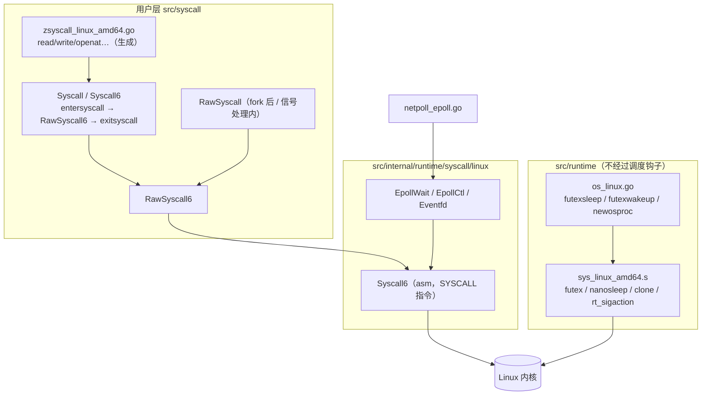
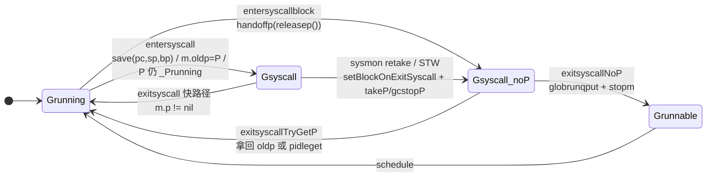
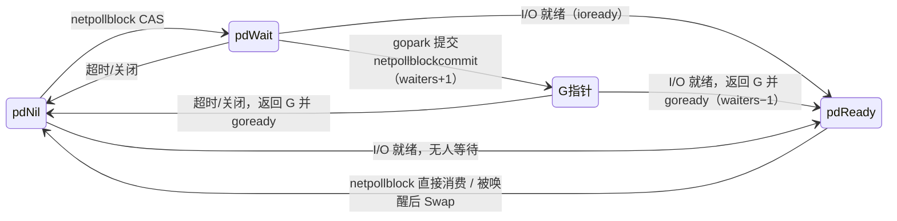
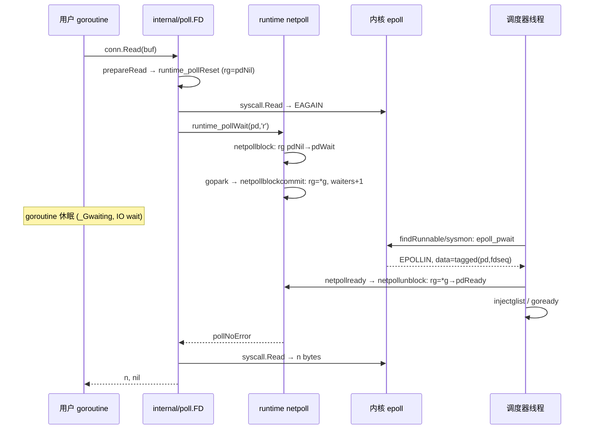

# Go 源码实现详解（十三）：系统调用、netpoll 与定时器

## 引言

先给结论：

1. **系统调用有三层封装**。`src/syscall` 面向用户（`Syscall`/`RawSyscall`），`src/internal/runtime/syscall/linux` 提供 runtime 自用的 `Syscall6` 汇编，`src/runtime/sys_linux_amd64.s` 里还有一批不经过任何调度钩子的裸调用（`futex`、`nanosleep`、`clone`……）。只有第一层会通知调度器。
2. **进入系统调用不再有 `_Psyscall` 状态**。当前版本（Go 1.28 开发版）里，G 切到 `_Gsyscall` 后 P 仍挂在 M 上、状态保持 `_Prunning`；sysmon、STW 或返回的 G 要"拿走"这个 P，统一通过 `setBlockOnExitSyscall` 抢占 G 的 `_Gscan` 位来同步。这与 Go 1.25 及之前的实现有本质不同。
3. **netpoll 是一个"把 fd 就绪转换为 goroutine 就绪"的桥**。`pollDesc.rg/wg` 是三态（`pdNil`/`pdReady`/`pdWait`）加 G 指针的状态机；Linux 上使用 `epoll` 边沿触发，`eventfd` 负责把阻塞在 `epoll_pwait` 的线程叫醒。
4. **定时器住在每个 P 的四叉堆里**，只有需要真正阻塞的 goroutine 才会把 timer channel 加入堆（`isChan` 与 `blocked` 计数），堆顶时间通过 `timers.wakeTime` 直接变成 `netpoll(delay)` 的超时参数。
5. **信号处理是"信号栈 → 位图 → note 唤醒"三段式**：`sigtramp` 汇编进入 `sigtrampgo`/`sighandler`，`sigsend` 在信号处理函数里只做原子位操作，`os/signal` 的常驻 goroutine 靠 `signal_recv` 取走信号。

本篇按"系统调用封装 → 调度器配合 → netpoll → net/os 到 runtime 的调用链 → 谁在轮询 → 定时器 → 信号 → 观察与调优"的顺序展开。所有路径相对仓库根目录。

## 一、系统调用的三层封装

### 1.1 syscall 包：用户可见的入口

`src/syscall/syscall_linux.go` 定义了四个核心函数，区别只在于是否通知调度器：

```go
// src/syscall/syscall_linux.go — RawSyscall6 / Syscall
//go:uintptrkeepalive
//go:nosplit
//go:norace
//go:linkname RawSyscall6
func RawSyscall6(trap, a1, a2, a3, a4, a5, a6 uintptr) (r1, r2 uintptr, err Errno) {
	var errno uintptr
	r1, r2, errno = linux.Syscall6(trap, a1, a2, a3, a4, a5, a6)
	err = Errno(errno)
	return
}

//go:uintptrkeepalive
//go:nosplit
//go:linkname Syscall
func Syscall(trap, a1, a2, a3 uintptr) (r1, r2 uintptr, err Errno) {
	runtime_entersyscall()
	// ...
	r1, r2, err = RawSyscall6(trap, a1, a2, a3, 0, 0, 0)
	runtime_exitsyscall()
	return
}
```

`runtime_entersyscall`/`runtime_exitsyscall` 通过 `//go:linkname` 指向 `runtime.entersyscall`/`runtime.exitsyscall`。几个编译指令值得注意：

- `//go:nosplit`：`entersyscall` 会把调用者的 PC/SP 记录进 `g.sched`，中间不能发生栈增长，否则记录的地址会失效。
- `//go:uintptrkeepalive`：`a1..a6` 里可能是 `unsafe.Pointer` 转来的整数，需要让编译器把原对象保活到调用结束。
- `//go:norace`：`RawSyscall` 可能在 `fork` 之后或信号处理函数中调用，那时没有 P，不能触发 race 插桩。

`src/syscall/zsyscall_linux_amd64.go` 由 `mksyscall.pl -tags linux,amd64 syscall_linux.go syscall_linux_amd64.go` 生成，每个 libc 风格的封装（如 `read`）都是"取切片首地址 → `Syscall(SYS_READ, ...)` → `errnoErr(e1)`"三步。`src/syscall/asm_linux_amd64.s` 现在只剩三段汇编：`rawVforkSyscall`（fork 路径，需要在 `SYSCALL` 前 `POPQ` 返回地址，因为子进程与父进程共享栈）、`rawSyscallNoError`（不需要 errno 的调用）和走 vDSO 的 `gettimeofday`。通用的 `Syscall6` 已经下沉到 runtime 内部包。

### 1.2 internal/runtime/syscall/linux：真正的 `SYSCALL` 指令

```
// src/internal/runtime/syscall/linux/asm_linux_amd64.s — Syscall6
// arg | ABIInternal | Syscall
// num | AX          | AX
// a1  | BX          | DI
// a4  | SI          | R10   （C ABI 用 CX，但 SYSCALL 指令会破坏 RCX）
TEXT ·Syscall6<ABIInternal>(SB),NOSPLIT,$0
	MOVQ	SI, R10 // a4
	MOVQ	DI, DX  // a3
	MOVQ	CX, SI  // a2
	MOVQ	BX, DI  // a1
	SYSCALL
	CMPQ	AX, $0xfffffffffffff001
	JLS	ok
	NEGQ	AX
	MOVQ	AX, CX  // errno
	MOVQ	$-1, AX // r1
	MOVQ	$0, BX  // r2
	RET
ok:
	MOVQ	DX, BX // r2
	MOVQ	$0, CX // errno
	RET
```

内核返回值落在 `-4095..-1` 视为错误，`NEGQ` 后作为 errno 返回。同目录 `syscall_linux.go` 在此之上提供 runtime 需要的类型化封装：`EpollCreate1`、`EpollWait`（实际用 `SYS_EPOLL_PWAIT`）、`EpollCtl`、`Eventfd`、`Open`、`Close`、`Read` 等，netpoll 的 epoll 实现直接调用它们。

### 1.3 runtime 自用的裸系统调用

`src/runtime/sys_linux_amd64.s` 里有几十段 `TEXT runtime·xxx`：`exit`、`write1`、`read`、`usleep`（`nanosleep`）、`futex`、`clone`、`rt_sigaction`、`sigaltstack`、`sysMmap`、`madvise` 等。它们**不经过 `entersyscall`**，因为调用者本身就是调度器，或正运行在 g0/信号栈上。`src/runtime/os_linux.go` 在其上包装出 M 休眠的基础原语：

```go
// src/runtime/os_linux.go — futexsleep
//go:nosplit
func futexsleep(addr *uint32, val uint32, ns int64) {
	// ...
	if ns < 0 {
		futex(unsafe.Pointer(addr), _FUTEX_WAIT_PRIVATE, val, nil, nil, 0)
		return
	}

	var ts timespec
	ts.setNsec(ns)
	futex(unsafe.Pointer(addr), _FUTEX_WAIT_PRIVATE, val, &ts, nil, 0)
}
```

`futexwakeup` 则是 `_FUTEX_WAKE_PRIVATE`。`note`、runtime `mutex` 与 `stopm` → `notesleep` 都建立在它们之上。



## 二、调度器如何配合系统调用

### 2.1 reentersyscall：保存现场、切到 _Gsyscall

`entersyscall` 只是取调用者的 PC/SP/FP（`sys.GetCallerPC()`、`sys.GetCallerSP()`、`getcallerfp()`）后转发给 `reentersyscall`，后者也是 cgo 回调路径的入口：

```go
// src/runtime/proc.go — reentersyscall（骨干）
//go:nosplit
func reentersyscall(pc, sp, bp uintptr) {
	gp := getg()
	gp.m.locks++
	// ...
	gp.stackguard0 = stackPreempt
	gp.throwsplit = true

	// Copy the syscalltick over so we can identify if the P got stolen later.
	gp.m.syscalltick = gp.m.p.ptr().syscalltick

	pp := gp.m.p.ptr()
	// ...
	gp.m.oldp.set(pp)

	// Leave SP around for GC and traceback.
	save(pc, sp, bp)
	gp.syscallsp = sp
	gp.syscallpc = pc
	gp.syscallbp = bp
	// ...
	if sched.gcwaiting.Load() {
		systemstack(func() { entersyscallHandleGCWait(trace) })
		save(pc, sp, bp)
	}
	if gp.bubble != nil || !gp.atomicstatus.CompareAndSwap(_Grunning, _Gsyscall) {
		casgstatus(gp, _Grunning, _Gsyscall)
	}
	// ... sched.sysmonwait 为真则 entersyscallWakeSysmon
	gp.m.locks--
}
```

要点：

- `stackguard0 = stackPreempt` 与 `throwsplit = true` 是"防呆"：系统调用期间任何栈增长都会直接 `throw`，因为无法判断 `uintptr` 参数里哪些是栈指针。
- `save` 把 PC/SP/BP 写进 `g.sched`，同时复制到 `g.syscallsp/syscallpc/syscallbp`，GC 扫描与 traceback 靠它们找到栈顶。每次 `systemstack` 调用后都要重新 `save`，因为 `systemstack` 会覆盖 `gp.sched`。
- **P 没有被释放**：只有 `gp.m.oldp` 记住了它，P 的状态仍是 `_Prunning`。注释明确写着"As soon as we switch to `_Gsyscall`, we are in danger of losing our P. We must not touch it after this point."
- 若此刻有 STW 在等（`sched.gcwaiting`），`entersyscallHandleGCWait` 会主动把 P 置为 `_Pgcstop` 并递减 `sched.stopwait`。
- 若 sysmon 正在深度睡眠（`sched.sysmonwait`），唤醒它，让它开始计时以便必要时抢回 P。

### 2.2 版本差异：`_Psyscall` 已被移除

`src/runtime/runtime2.go` 中 P 的状态枚举现在是 `_Pidle`、`_Prunning`、`_Psyscall_unused`、`_Pgcstop`、`_Pdead`，其中：

```go
// src/runtime/runtime2.go — P status（节选）
	// _Psyscall_unused is a now-defunct state for a P. A P is
	// identified as "in a system call" by looking at the goroutine's
	// state.
	_Psyscall_unused
```

Go 1.25 及之前，`entersyscall` 会把 P 原子地改为 `_Psyscall`，sysmon 通过 `CAS(_Psyscall → _Pidle)` 抢走 P，`exitsyscallfast` 通过 `CAS(_Psyscall → _Prunning)` 抢回。当前版本删除了这一状态：P 是否"处于系统调用中"完全由其所挂 G 的状态决定，所有"拿走 P"的操作统一走 `setBlockOnExitSyscall`：

```go
// src/runtime/proc.go — setBlockOnExitSyscall（节选）
func setBlockOnExitSyscall(pp *p) (syscallingThread, bool) {
	if pp.status != _Prunning {
		return syscallingThread{}, false
	}
	mp := pp.m.ptr()
	// ... mp == nil 或 mp.curg == nil → false
	gp := mp.curg
	status := readgstatus(gp) &^ _Gscan

	// A goroutine is considered in a syscall, and may have a corresponding
	// P, if it's in _Gsyscall *or* _Gdeadextra. In the latter case, it's an
	// extra M goroutine.
	if status != _Gsyscall && status != _Gdeadextra {
		return syscallingThread{}, false
	}
	if !castogscanstatus(gp, status, status|_Gscan) {
		return syscallingThread{}, false
	}
	if gp.m != mp || gp.m.p.ptr() != pp {
		casfrom_Gscanstatus(gp, status|_Gscan, status)
		return syscallingThread{}, false
	}
	return syscallingThread{gp, mp, pp, status}, true
}
```

同步原语是 G 的 `_Gscan` 位：一旦拿到 `_Gsyscall|_Gscan`，`exitsyscall` 里的 `CompareAndSwap(_Gsyscall, _Grunning)` 就会失败、退化为 `casgstatus` 自旋等待，从而"冻结"在系统调用出口。之后 `takeP()` 把 P 解绑并置为 `_Pidle`（STW 用 `gcstopP()` 置为 `_Pgcstop`），二者都经由 `releaseP`：

```go
// src/runtime/proc.go — syscallingThread.releaseP
func (s syscallingThread) releaseP(state uint32) {
	// ...
	trace := traceAcquire()
	s.pp.m = 0
	s.mp.p = 0
	atomic.Store(&s.pp.status, state)
	if trace.ok() {
		trace.ProcSteal(s.pp)
		traceRelease(trace)
	}
	addGSyscallNoP(s.mp)
	s.pp.syscalltick++
}
```

`resume()` 用 `casfrom_Gscanstatus` 归还 scan 位。`addGSyscallNoP` 递增 `sched.nGsyscallNoP`（"在系统调用里且没有 P 的 goroutine 数"），供 `runtime/metrics` 的 `/sched/goroutines/not-in-go:goroutines` 使用。

### 2.3 entersyscallblock：已知会阻塞就直接交出 P

runtime 内部有些调用注定阻塞很久，典型的是 `src/runtime/lock_futex.go` 的 `notetsleepg`（`os/signal` 接收 goroutine 等所有在用户 G 上等待 `note` 的场景），它的主体就是 `entersyscallblock(); notetsleep_internal(n, ns); exitsyscall()`。`entersyscallblock` 与 `reentersyscall` 的差别是**在切换状态前就 `handoffp`**：

```go
// src/runtime/proc.go — entersyscallblock（节选）
//go:linkname entersyscallblock
//go:nosplit
func entersyscallblock() {
	gp := getg()

	gp.m.locks++ // see comment in entersyscall
	gp.throwsplit = true
	gp.stackguard0 = stackPreempt // see comment in entersyscall
	gp.m.syscalltick = gp.m.p.ptr().syscalltick
	gp.m.p.ptr().syscalltick++

	addGSyscallNoP(gp.m) // We're going to give up our P.
	// ... save pc/sp/bp 到 gp.sched 与 gp.syscallsp/pc/bp
	trace := traceAcquire()
	systemstack(func() {
		if trace.ok() {
			trace.GoSysCall()
		}
		handoffp(releasep())
	})
	// Caution: we're in a small window where we are in _Grunning without a P.
	casgstatus(gp, _Grunning, _Gsyscall)
	// ...
	gp.m.locks--
}
```

`handoffp` 决定这个 P 的去向：本地/全局队列有工作、有 GC mark 工作、或没有自旋 M 时都 `startm` 起新 M 接管；否则 `pidleput` 放回空闲列表，并把 `pp.timers.wakeTime()` 交给 `wakeNetPoller`，确保这个 P 上的定时器不会被遗忘。

### 2.4 exitsyscall：快路径与慢路径

```go
// src/runtime/proc.go — exitsyscall（骨干）
//go:nosplit
//go:nowritebarrierrec
//go:linkname exitsyscall
func exitsyscall() {
	gp := getg()
	gp.m.locks++
	// ...
	if gp.bubble != nil || !gp.atomicstatus.CompareAndSwap(_Gsyscall, _Grunning) {
		casgstatus(gp, _Gsyscall, _Grunning)
	}

	// Grab and clear our old P.
	oldp := gp.m.oldp.ptr()
	gp.m.oldp.set(nil)

	pp := gp.m.p.ptr()
	if pp != nil {
		// Fast path: we still have our P. Just emit a syscall exit event.
		// ...
	} else {
		// Slow path: we lost our P. Try to get another one.
		systemstack(func() {
			if pp := exitsyscallTryGetP(oldp); pp != nil {
				acquirepNoTrace(pp)
				// ... trace.ProcStart / GoSysExit(true) / GoStart
			}
		})
		pp = gp.m.p.ptr()
	}
	if pp != nil {
		// ... pp.syscalltick++; gp.syscallsp = 0; 恢复 stackguard0 / throwsplit
		return
	}
	// Slowest path: We couldn't get a P, so call into the scheduler.
	gp.m.locks--
	mcall(exitsyscallNoP)
	// ...
}
```

三条路径：

1. **最快**：`gp.m.p` 仍非空，说明没人来抢，直接恢复运行。这里靠 `pp.syscalltick == gp.m.syscalltick` 判断 trace 上是否要"假装"丢过 P（`dropm` 等场景会篡改 `syscalltick`）。
2. **次快**：P 被拿走了，`exitsyscallTryGetP` 先对 `oldp` 做一次 `setBlockOnExitSyscall` + `takeP`（处理 `oldp` 恰好被另一个还在 syscall 的线程持有的情况），再从 `sched.pidle` 取一个空闲 P，成功后 `decGSyscallNoP`。
3. **最慢**：`exitsyscallNoP` 在 g0 上执行 `casgstatus(_Grunning → _Grunnable)`，把 G 放进全局队列（`globrunqput`），然后 `stopm` 让 M 睡眠，G 由其他 M 稍后调度。

对比 Go 1.25 及之前的 `exitsyscallfast`/`exitsyscall0`：功能对应关系一样（抢回原 P → 取空闲 P → 放弃 M），只是实现从 `CAS(_Psyscall)` 变成了先切 G 状态、再看 `m.p` 是否还在。

### 2.5 sysmon 的 retake

sysmon 每轮都会遍历 `allp`，只看 `_Prunning` 的 P：

```go
// src/runtime/proc.go — retake（节选）
		pd := &pp.sysmontick
		sysretake := false
		schedt := int64(pp.schedtick)
		if int64(pd.schedtick) != schedt {
			pd.schedtick = uint32(schedt)
			pd.schedwhen = now
		} else if pd.schedwhen+forcePreemptNS <= now {
			preemptone(pp)
			// If pp is in a syscall, preemptone doesn't work. ...
			sysretake = true
		}
		unlock(&allpLock)
		incidlelocked(-1)

		thread, ok := setBlockOnExitSyscall(pp)
		if !ok {
			goto done
		}
		// Retake the P if it's there for more than 1 sysmon tick (at least 20us).
		if syst := int64(pp.syscalltick); !sysretake && int64(pd.syscalltick) != syst {
			pd.syscalltick = uint32(syst)
			pd.syscallwhen = now
			thread.resume()
			goto done
		}
		if runqempty(pp) && sched.nmspinning.Load()+sched.npidle.Load() > 0 && pd.syscallwhen+10*1000*1000 > now {
			thread.resume()
			goto done
		}
		thread.takeP()
		thread.resume()
		n++
		handoffp(pp)
```

回收条件与老版本一致：(a) 这个 P 在同一个 `syscalltick` 上至少经历了一个 sysmon 周期（20µs 起，随空闲指数退避到 10ms）；(b) 或者 P 的本地队列非空、或没有其他空闲/自旋 M、或已经卡了超过 10ms。满足后 `takeP` + `handoffp` 让别的 M 接管这个 P。`stopTheWorldWithSema` 走同一套机制：对所有 P 尝试 `setBlockOnExitSyscall`，成功则 `gcstopP()` + `resume()`。

### 2.6 trace 视角

`src/runtime/traceruntime.go` 中，`GoSysCall` 写出 `EvGoSyscallBegin` 并把当前 M 的 `procid` 记进 `pp.trace.mSyscallID`；`GoSysExit(lostP)` 在没丢 P 时写 `EvGoSyscallEnd`，丢过 P 时写 `EvGoSyscallEndBlocked`；`ProcSteal` 记录 P 被谁从谁那里偷走。trace 层保留了 `ProcSyscall` 这个 P 状态——`src/runtime/tracestatus.go` 的注释说"A P is considered to be in a syscall if its attached G is... this is now the default since `_Psyscall` no longer exists"——这正是 Go 1.24/1.25 的执行跟踪器把系统调用建模为 P 状态、而 runtime 之后又删掉 `_Psyscall` 留下的历史痕迹。



## 三、netpoll：把 fd 就绪转换为 goroutine 就绪

### 3.1 pollDesc 与状态机

```go
// src/runtime/netpoll.go — pollDesc（节选）
type pollDesc struct {
	_     sys.NotInHeap
	link  *pollDesc      // in pollcache, protected by pollcache.lock
	fd    uintptr        // constant for pollDesc usage lifetime
	fdseq atomic.Uintptr // protects against stale pollDesc
	atomicInfo atomic.Uint32 // atomic pollInfo

	// rg, wg are accessed atomically and hold g pointers.
	rg atomic.Uintptr // pdReady, pdWait, G waiting for read or pdNil
	wg atomic.Uintptr // pdReady, pdWait, G waiting for write or pdNil

	lock    mutex // protects the following fields
	closing bool
	rrun    bool      // whether rt is running
	wrun    bool      // whether wt is running
	rseq    uintptr   // protects from stale read timers
	rt      timer     // read deadline timer
	rd      int64     // read deadline (a nanotime in the future, -1 when expired)
	wseq    uintptr   // protects from stale write timers
	wt      timer     // write deadline timer
	wd      int64     // write deadline (a nanotime in the future, -1 when expired)
	self    *pollDesc // storage for indirect interface. See (*pollDesc).makeArg.
}
```

`pollDesc` 标记为 `sys.NotInHeap`，由 `pollCache.alloc` 用 `persistentalloc` 按 `pollBlockSize`（4KB）一块批量分配、永不释放。原因写在注释里："we can get ready notification from epoll/kqueue after the descriptor is closed/reused"——内核可能在 fd 关闭后仍然投递事件，所以 `pollDesc` 必须类型稳定，用 `fdseq` 识别陈旧通知。`makeArg` 把 `&pd.self` 塞进 `eface`，让 `NotInHeap` 的指针能作为 timer 的 `arg any` 传递而不分配。

`rg`/`wg` 的取值只有四种：`pdNil = 0`、`pdReady = 1`、`pdWait = 2`，以及等待中的 `*g` 指针。`atomicInfo` 是把 `closing`、`rd`/`wd` 是否过期、`eventErr` 位打包成一个原子字（`pollInfo`），由 `publishInfo` 在持锁修改后发布，`netpollcheckerr` 无锁读取并翻译成 `pollErrClosing`/`pollErrTimeout`/`pollErrNotPollable`。

### 3.2 打开与阻塞

`poll_runtime_pollOpen`（linkname 给 `internal/poll.runtime_pollOpen`）从 `pollcache` 取一个 `pollDesc`，复位 `closing`、`rd/wd`、`rg/wg`，递增 `rseq/wseq`，`publishInfo` 后调用平台层的 `netpollopen(fd, pd)` 注册到 epoll/kqueue。`poll_runtime_pollWait` 先 `netpollcheckerr`，再循环调用 `netpollblock`：

```go
// src/runtime/netpoll.go — netpollblock
func netpollblock(pd *pollDesc, mode int32, waitio bool) bool {
	gpp := &pd.rg
	if mode == 'w' {
		gpp = &pd.wg
	}

	// set the gpp semaphore to pdWait
	for {
		// Consume notification if already ready.
		if gpp.CompareAndSwap(pdReady, pdNil) {
			return true
		}
		if gpp.CompareAndSwap(pdNil, pdWait) {
			break
		}
		if v := gpp.Load(); v != pdReady && v != pdNil {
			throw("runtime: double wait")
		}
	}

	// need to recheck error states after setting gpp to pdWait
	if waitio || netpollcheckerr(pd, mode) == pollNoError {
		gopark(netpollblockcommit, unsafe.Pointer(gpp), waitReasonIOWait, traceBlockNet, 5)
	}
	// be careful to not lose concurrent pdReady notification
	old := gpp.Swap(pdNil)
	if old > pdWait {
		throw("runtime: corrupted polldesc")
	}
	return old == pdReady
}
```

`gopark` 的回调 `netpollblockcommit` 在 G 已经切到 `_Gwaiting` 之后才把 `pdWait` 换成 `*g`，并 `netpollAdjustWaiters(1)`。中间这段 `pdWait` 状态是给并发的就绪通知或超时看的："有人准备睡，但还没睡下"。

`netpollunblock` 是唤醒方，一次 CAS 决定三件事：

```go
// src/runtime/netpoll.go — netpollunblock
func netpollunblock(pd *pollDesc, mode int32, ioready bool, delta *int32) *g {
	gpp := &pd.rg
	if mode == 'w' {
		gpp = &pd.wg
	}

	for {
		old := gpp.Load()
		if old == pdReady {
			return nil
		}
		if old == pdNil && !ioready {
			// Only set pdReady for ioready. runtime_pollWait
			// will check for timeout/cancel before waiting.
			return nil
		}
		new := pdNil
		if ioready {
			new = pdReady
		}
		if gpp.CompareAndSwap(old, new) {
			if old == pdWait {
				old = pdNil
			} else if old != pdNil {
				*delta -= 1
			}
			return (*g)(unsafe.Pointer(old))
		}
	}
}
```

- I/O 就绪（`ioready=true`）：无论原来是 `pdNil`/`pdWait`/`*g`，都写成 `pdReady`；若原值是 G 指针则返回它，并让 `netpollWaiters` 减一。
- 超时或关闭（`ioready=false`）：只把 `pdWait`/`*g` 清成 `pdNil`，不留下 `pdReady`，因为 `poll_runtime_pollWait` 会在下一轮 `netpollcheckerr` 中看到过期/关闭标志。

`netpollready(toRun *gList, pd, mode)` 对 `'r'`、`'w'` 或 `'r'+'w'` 分别调用 `netpollunblock(…, true, &delta)`，把返回的 G 推入 `gList` 并返回 delta——这就是 `netpoll` 的返回值。



### 3.3 截止时间：两个 timer 与 seq

`poll_runtime_pollSetDeadline` 把绝对时间写进 `pd.rd/pd.wd`，用内嵌的 `pd.rt`/`pd.wt` 挂到当前 P 的定时器堆：

```go
// src/runtime/netpoll.go — poll_runtime_pollSetDeadline（节选）
	combo := pd.rd > 0 && pd.rd == pd.wd
	rtf := netpollReadDeadline
	if combo {
		rtf = netpollDeadline
	}
	if !pd.rrun {
		if pd.rd > 0 {
			// Copy current seq into the timer arg.
			pd.rt.modify(pd.rd, 0, rtf, pd.makeArg(), pd.rseq)
			pd.rrun = true
		}
	} else if pd.rd != rd0 || combo != combo0 {
		pd.rseq++ // invalidate current timers
		if pd.rd > 0 {
			pd.rt.modify(pd.rd, 0, rtf, pd.makeArg(), pd.rseq)
		} else {
			pd.rt.stop()
			pd.rrun = false
		}
	}
	// ... wt 同理；随后若 rd/wd < 0 立即 netpollunblock(…, false, …)
```

读写 deadline 相同时只用一个 timer（`combo`）。`rseq/wseq` 随每次修改递增并作为 timer 的 `seq` 传入；回调 `netpolldeadlineimpl` 先比对 `seq`，不匹配说明 deadline 已被重设或 fd 已复用，直接忽略；匹配则把 `rd/wd` 置 `-1`、`publishInfo`，再 `netpollunblock(ioready=false)` 叫醒等待的 G，G 在 `poll_runtime_pollWait` 的循环里读到 `pollErrTimeout`。`poll_runtime_pollUnblock`（对应 `internal/poll` 的 `evict`，`Close` 时调用）把 `closing` 置真、递增两个 seq、停掉两个 timer，并唤醒两个方向的等待者。

### 3.4 Linux：epoll 边沿触发与 eventfd

```go
// src/runtime/netpoll_epoll.go — netpollinit / netpollopen（节选）
func netpollinit() {
	var errno uintptr
	epfd, errno = linux.EpollCreate1(linux.EPOLL_CLOEXEC)
	// ...
	efd, errno := linux.Eventfd(0, linux.EFD_CLOEXEC|linux.EFD_NONBLOCK)
	// ...
	ev := linux.EpollEvent{
		Events: linux.EPOLLIN,
	}
	netpollPackData(&ev, nil, 0)
	errno = linux.EpollCtl(epfd, linux.EPOLL_CTL_ADD, efd, &ev)
	// ...
	netpollEventFd = uintptr(efd)
}

func netpollopen(fd uintptr, pd *pollDesc) uintptr {
	var ev linux.EpollEvent
	ev.Events = linux.EPOLLIN | linux.EPOLLOUT | linux.EPOLLRDHUP | linux.EPOLLET
	netpollPackData(&ev, pd, pd.fdseq.Load())
	return linux.EpollCtl(epfd, linux.EPOLL_CTL_ADD, int32(fd), &ev)
}
```

三个设计点：

- **`EPOLLET` 边沿触发**，且一次性同时注册读写。runtime 不需要在每次等待前 `EPOLL_CTL_MOD`，代价是用户态必须把 fd 读到 `EAGAIN` 为止——这正是 `internal/poll.FD.Read` 循环的由来。
- **`epoll_event.data` 存的是 tagged pointer**：`netpollPackData` 用 `taggedPointerPack` 把 `*pollDesc` 与 `fdseq` 打包进 64 位 data 字段，`netpoll` 取出后比对 `pd.fdseq.Load() == tag` 才认可事件；`pd == nil` 代表 eventfd。
- **eventfd 用于唤醒**：`netpollBreak` 先 `netpollWakeSig.CompareAndSwap(0, 1)` 去重，然后向 eventfd `write` 一个 8 字节的 1；`netpoll` 读到 `pd == nil` 的事件即知是唤醒信号，若是阻塞调用则 `read` 掉计数并把 `netpollWakeSig` 清零。

```go
// src/runtime/netpoll_epoll.go — netpoll（节选）
func netpoll(delay int64) (gList, int32) {
	if epfd == -1 {
		return gList{}, 0
	}
	var waitms int32
	if delay < 0 {
		waitms = -1
	} else if delay == 0 {
		waitms = 0
	} else if delay < 1e6 {
		waitms = 1
	} else if delay < 1e15 {
		waitms = int32(delay / 1e6)
	} else {
		waitms = 1e9 // ~11.5 days
	}
	var events [128]linux.EpollEvent
retry:
	n, errno := linux.EpollWait(epfd, events[:], int32(len(events)), waitms)
	// ... EINTR：定时等待直接返回空列表让调用者重算 delay，否则 goto retry
	var toRun gList
	delta := int32(0)
	for i := int32(0); i < n; i++ {
		// ... 解包 pd/tag；EPOLLIN|EPOLLRDHUP|EPOLLHUP|EPOLLERR → 'r'，EPOLLOUT|EPOLLHUP|EPOLLERR → 'w'
		if pd.fdseq.Load() == tag {
			pd.setEventErr(ev.Events == linux.EPOLLERR, tag)
			delta += netpollready(&toRun, pd, mode)
		}
	}
	return toRun, delta
}
```

`delay` 的三种含义在 `netpoll.go` 文件头统一约定：负数无限阻塞、0 只轮询、正数最多阻塞 delay 纳秒。小于 1ms 的 delay 会被向上取整为 1ms——这是 epoll 的毫秒精度限制，也是 `time.Sleep(100µs)` 在无其他工作时会睡到 1ms 量级的原因之一。

### 3.5 kqueue 与 IOCP 简述

- `src/runtime/netpoll_kqueue.go`：`netpollopen` 一次性注册 `EVFILT_READ` 和 `EVFILT_WRITE` 两个 kevent，标志 `EV_ADD|EV_CLEAR`（`EV_CLEAR` 即边沿触发）；64 位平台同样在 `udata` 里塞 tagged pointer。唤醒在 darwin/freebsd/dragonfly 上用 `EVFILT_USER`（`netpoll_kqueue_event.go`，ident 是魔数 `0xee1eb9f4`），其他 BSD 退回管道（`netpoll_kqueue_pipe.go`）。
- `src/runtime/netpoll_windows.go`：基于 IOCP，`netpollinit` 调用 `CreateIoCompletionPort`，`netpollopen` 把句柄挂到完成端口，`netpoll` 用 `GetQueuedCompletionStatusEx` 批量取完成包，`netpollBreak` 用 `PostQueuedCompletionStatus` 投递空包。Windows 是"发起异步操作 → 等完成"的 proactor 模型，`internal/poll/fd_windows.go` 与 unix 的 `EAGAIN` 循环有本质区别。
- Solaris/illumos/AIX/wasip1 是水平触发，`poll_runtime_pollWait` 会先调用 `netpollarm` 单独武装一个方向；Linux 上 `netpollarm` 直接 `throw("runtime: unused")`。

## 四、从 net/os 到 runtime 的调用链

### 4.1 internal/poll：一层薄薄的 linkname

```go
// src/internal/poll/fd_poll_runtime.go — pollDesc 与 wait（节选）
func runtime_pollServerInit()
func runtime_pollOpen(fd uintptr) (uintptr, int)
func runtime_pollWait(ctx uintptr, mode int) int
func runtime_pollSetDeadline(ctx uintptr, d int64, mode int)
func runtime_pollUnblock(ctx uintptr)

type pollDesc struct {
	runtimeCtx uintptr
}

func (pd *pollDesc) init(fd *FD) error {
	serverInit.Do(runtime_pollServerInit)
	ctx, errno := runtime_pollOpen(uintptr(fd.Sysfd))
	if errno != 0 {
		return errnoErr(syscall.Errno(errno))
	}
	pd.runtimeCtx = ctx
	return nil
}

func (pd *pollDesc) wait(mode int, isFile bool) error {
	if pd.runtimeCtx == 0 {
		return errors.New("waiting for unsupported file type")
	}
	res := runtime_pollWait(pd.runtimeCtx, mode)
	return convertErr(res, isFile)
}
```

`internal/poll.pollDesc` 只有一个 `uintptr` 字段，指向 runtime 侧的 `*pollDesc`（因为它 `NotInHeap`，所以以整数形式持有）。`convertErr` 把 runtime 的四个错误码翻译成 `ErrDeadlineExceeded`、`ErrNotPollable` 或 `errClosing`。`FD.SetDeadline`/`SetReadDeadline`/`SetWriteDeadline` 经 `setDeadlineImpl` 调用 `runtime_pollSetDeadline`，mode 分别是 `'r'+'w'`、`'r'`、`'w'`。

### 4.2 FD.Read 的 EAGAIN 循环

```go
// src/internal/poll/fd_unix.go — FD.Read
func (fd *FD) Read(p []byte) (int, error) {
	if err := fd.readLock(); err != nil {
		return 0, err
	}
	defer fd.readUnlock()
	if len(p) == 0 {
		return 0, nil
	}
	if err := fd.pd.prepareRead(fd.isFile); err != nil {
		return 0, err
	}
	if fd.IsStream && len(p) > maxRW {
		p = p[:maxRW]
	}
	for {
		n, err := ignoringEINTRIO(syscall.Read, fd.Sysfd, p)
		if err != nil {
			n = 0
			if err == syscall.EAGAIN && fd.pd.pollable() {
				if err = fd.pd.waitRead(fd.isFile); err == nil {
					continue
				}
			}
		}
		err = fd.eofError(n, err)
		return n, err
	}
}
```

流程是"先试着读，`EAGAIN` 再去等"。这与边沿触发的语义严丝合缝：每次 `waitRead` 返回意味着 epoll 报告过一次就绪，接下来读到 `EAGAIN` 才会再次进入等待，不会漏掉已缓冲的数据。`prepareRead` 对应 `runtime_pollReset`，把 `rg` 复位为 `pdNil` 并检查关闭/超时。`FD.Write` 结构相同，只是把 `waitRead` 换成 `waitWrite`。

`src/net/fd_posix.go` 的 `netFD.Read` 只是 `fd.pfd.Read(p)` 外加 `runtime.KeepAlive(fd)` 与 `wrapSyscallError`；`net.Conn.Read` → `netFD.Read` → `poll.FD.Read` → `syscall.Read` → `runtime_pollWait` 就是一条完整的路径。

### 4.3 os.File 何时进 poller

`src/os/file_unix.go` 的 `newFile` 通过 `kind` 决定是否注册到 netpoll。四种 `kind`：`kindOpenFile`（`OpenFile` 打开）、`kindPipe`（`os.Pipe`）、`kindSock`（`net` 包转来的 socket）、`kindNoPoll`（`os.NewFile` 传入的阻塞 fd）：

```go
// src/os/file_unix.go — newFile（节选）
	pollable := kind == kindOpenFile || kind == kindPipe || kind == kindSock || nonBlocking

	if kind == kindOpenFile {
		switch runtime.GOOS {
		case "darwin", "ios", "dragonfly", "freebsd", "netbsd", "openbsd":
			// ... Fstat：普通文件与目录不加入 kqueue；darwin 上 FIFO 也不加入
		}
	}

	clearNonBlock := false
	if pollable {
		if nonBlocking {
			if kind == kindSock {
				f.nonblock = true // tell Fd to return blocking descriptor
			}
		} else if err := syscall.SetNonblock(fd, true); err == nil {
			f.nonblock = true
			clearNonBlock = true
		} else {
			pollable = false
		}
	}
```

Linux 上普通文件也会尝试 `EPOLL_CTL_ADD`，内核对 regular file 返回 `EPERM`，`pd.init` 失败后 `pollable` 被清掉，读写退化为直接系统调用——此时是阻塞调用，只能靠 `entersyscall` 与 sysmon 的 `retake` 保护调度。



## 五、谁在调用 netpoll

`netpoll` 有四个调用点，每个的 `delay` 参数都不同：

| 调用点 | 函数 | delay | 目的 |
|---|---|---|---|
| 调度快路径 | `proc.go` `findRunnable` | 0 | 偷工作之前先非阻塞看一眼，`sched.pollingNet.Swap(1)` 保证同一时刻只有一个线程这样做 |
| 调度慢路径 | `proc.go` `findRunnable` | `pollUntil - now` 或 -1 | 没有任何工作时，一个 M 放弃 P、阻塞在 `epoll_pwait` 直到下一个定时器或 I/O |
| sysmon | `proc.go` `sysmon` | 0 | 超过 10ms 没人轮询就补一次，防止所有 M 都在忙时 I/O 饿死 |
| STW 结束 | `proc.go` `startTheWorldWithSema` | 0 | 重启世界前把已就绪的网络 goroutine 注入运行队列 |

阻塞路径的核心：

```go
// src/runtime/proc.go — findRunnable（阻塞 netpoll 节选）
	if netpollinited() && (netpollAnyWaiters() || pollUntil != 0) && sched.lastpoll.Swap(0) != 0 {
		sched.pollUntil.Store(pollUntil)
		if mp.p != 0 {
			throw("findRunnable: netpoll with p")
		}
		if mp.spinning {
			throw("findRunnable: netpoll with spinning")
		}
		delay := int64(-1)
		if pollUntil != 0 {
			// ... delay = pollUntil - now，负数截断为 0
		}
		list, delta := netpoll(delay) // block until new work is available
		now = nanotime()
		sched.pollUntil.Store(0)
		sched.lastpoll.Store(now)
		// ... pidleget 后 acquirep 并返回 list 里的第一个 G，否则 injectglist
	} else if pollUntil != 0 && netpollinited() {
		pollerPollUntil := sched.pollUntil.Load()
		if pollerPollUntil == 0 || pollerPollUntil > pollUntil {
			netpollBreak()
		}
	}
	stopm()
```

三个全局变量串起了整个协议：

- `sched.lastpoll`：非零表示"没有线程阻塞在 netpoll 里"，其值是上次轮询时间；`Swap(0)` 成功的线程成为唯一的阻塞轮询者。sysmon 用 `lastpoll+10*1000*1000 < now` 判断是否该补一次轮询。
- `sched.pollUntil`：阻塞轮询者承诺的最晚醒来时间。其他线程发现自己知道更早的定时器时调用 `netpollBreak` 把它叫醒，`wakeNetPoller` 就是这个逻辑的封装：`lastpoll == 0` 且 `pollUntil` 太晚 → `netpollBreak()`；没人在轮询 → `wakep()` 起一个 M。
- `netpollWaiters`：有多少 G 在 `pollDesc` 上等待（`netpollblockcommit` 加、`netpollunblock` 减）。`netpollAnyWaiters()` 为假且没有定时器时，`findRunnable` 直接 `stopm`，连 `epoll_pwait` 都不调。

`handoffp` 的最后一段与此呼应：当这是最后一个运行中的 P 且没人在轮询（`sched.npidle.Load() == gomaxprocs-1 && sched.lastpoll.Load() != 0`），必须 `startm` 起一个 M 去轮询网络，否则 I/O 事件将无人接收。sysmon 注入 netpoll 结果前后要 `incidlelocked(-1)`/`incidlelocked(+1)`，避免 `checkdead` 在 M 尚未启动的窗口误报死锁。

## 六、定时器

### 6.1 timer 与每 P 的 timers

```go
// src/runtime/time.go — timer（节选）
type timer struct {
	mu mutex

	astate atomic.Uint8 // atomic copy of state bits at last unlock
	state  uint8        // state bits
	isChan bool         // timer has a channel; immutable; can be read without lock
	isFake bool         // timer is using fake time; immutable; can be read without lock

	blocked uint32 // number of goroutines blocked on timer's channel
	rand    uint32 // randomizes order of timers at same instant; only set when isFake

	when   int64
	period int64
	f      func(arg any, seq uintptr, delay int64)
	arg    any
	seq    uintptr

	// If non-nil, the timers containing t.
	ts *timers

	// sendLock protects sends on the timer's channel.
	sendLock mutex
	isSending atomic.Int32
}
```

状态位只有三个：

```go
// src/runtime/time.go — timer state
const (
	// timerHeaped is set when the timer is stored in some P's heap.
	timerHeaped uint8 = 1 << iota
	// timerModified is set when t.when has been modified
	// but the heap's heap[i].when entry still needs to be updated.
	timerModified
	// timerZombie is set when the timer has been stopped
	// but is still present in some P's heap.
	timerZombie
)
```

Go 1.22 及之前那套 `timerWaiting/timerRunning/timerDeleted/timerModifiedEarlier/...` 十态机已不存在。现在的原则是：修改与删除都**懒惰**地打标记，真正的堆调整推迟到 `timers.adjust`/`timers.run` 时再做。

```go
// src/runtime/time.go — timers（节选）
type timers struct {
	mu mutex
	// heap is the set of timers, ordered by heap[i].when.
	heap []timerWhen
	// len is an atomic copy of len(heap).
	len atomic.Uint32
	// zombies is the number of timers in the heap that are marked for removal.
	zombies atomic.Int32
	// minWhenHeap is the minimum heap[i].when value (= heap[0].when).
	minWhenHeap atomic.Int64
	// minWhenModified is a lower bound on the minimum
	// heap[i].when over timers with the timerModified bit set.
	minWhenModified atomic.Int64
}

type timerWhen struct {
	timer *timer
	when  int64
}
```

`p.timers` 内嵌一个 `timers`。堆元素是 `timerWhen` 而不是 `*timer`——`when` 的副本让 `siftUp/siftDown` 不用逐个加锁读 `t.when`，也让"修改过但堆里还是旧值"这种状态可以被表达（`t.when != heap[i].when` 即 `timerModified`）。

### 6.2 四叉堆

```go
// src/runtime/time.go — siftUp
const timerHeapN = 4

func (ts *timers) siftUp(i int) {
	heap := ts.heap
	if i >= len(heap) {
		badTimer()
	}
	tw := heap[i]
	if tw.when <= 0 {
		badTimer()
	}
	for i > 0 {
		p := int(uint(i-1) / timerHeapN) // parent
		if !tw.less(heap[p]) {
			break
		}
		heap[i] = heap[p]
		i = p
	}
	if heap[i].timer != tw.timer {
		heap[i] = tw
	}
}
```

四叉堆比二叉堆更矮（高度 log₄n），`siftDown` 每层最多比较 4 个孩子（`heap[leftChild:min(leftChild+timerHeapN, n)]`），缓存友好。`timerWhen.less` 在 `when` 相等时用 `timer.rand` 打破平局，但只有 `synctest` 假时间的定时器会设置 `rand`。`deleteMin` 把末元素换到堆顶后 `siftDown(0)` 并 `updateMinWhenHeap`。

### 6.3 modify / stop / maybeAdd

`time.NewTimer`、`Reset`、`AfterFunc` 以及 netpoll 的 deadline 最终都走 `timer.modify`：

```go
// src/runtime/time.go — modify（节选）
func (t *timer) modify(when, period int64, f func(arg any, seq uintptr, delay int64), arg any, seq uintptr) bool {
	// ... isChan 先 lock(&t.sendLock)
	t.lock()
	oldPeriod := t.period
	t.period = period
	if f != nil {
		t.f = f
		t.arg = arg
		t.seq = seq
	}
	wake := false
	pending := t.when > 0
	t.when = when
	if t.state&timerHeaped != 0 {
		t.state |= timerModified
		if t.state&timerZombie != 0 {
			t.ts.zombies.Add(-1)
			t.state &^= timerZombie
		}
		if min := t.ts.minWhenModified.Load(); min == 0 || when < min {
			wake = true
			t.astate.Store(t.state)
			t.ts.updateMinWhenModified(when)
		}
	}
	add := t.needsAdd()
	// ... isChan: t.seq++，处理 isSending，timerchandrain
	t.unlock()
	if add {
		t.maybeAdd()
	}
	if wake {
		wakeNetPoller(when)
	}
	return pending
}
```

- 已在堆里：只改 `t.when`、打 `timerModified`，把 `minWhenModified` 拉低。若新时间比当前已知最早时间还早，`wakeNetPoller(when)` 叫醒阻塞轮询者。
- 不在堆里且需要加入（`needsAdd`：`!timerHeaped && when > 0 && (!isChan || blocked > 0)`）：`maybeAdd` 先 `acquirem` 固定当前 P，把 timer 加入**当前 P** 的堆（`ts.addHeap` → `siftUp`），并在它成为新的最早时间时 `wakeNetPoller`。

`stop` 更简单：若在堆里就打 `timerModified|timerZombie` 并给 `ts.zombies` 加一，`t.when = 0`；真正从堆里摘除是 `adjust`、`cleanHead` 或 `run` 的事。

### 6.4 check / run：谁来跑到期的定时器

```go
// src/runtime/time.go — check（节选）
func (ts *timers) check(now int64, bubble *synctestBubble) (rnow, pollUntil int64, ran bool) {
	next := ts.wakeTime()
	if next == 0 {
		return now, 0, false
	}
	if now == 0 {
		now = nanotime()
	}
	zombies := ts.zombies.Load()
	force := ts == &getg().m.p.ptr().timers && int(zombies) > int(ts.len.Load())/4

	if now < next && !force {
		return now, next, false
	}

	ts.lock()
	if len(ts.heap) > 0 {
		ts.adjust(now, false)
		for len(ts.heap) > 0 {
			if tw := ts.run(now, bubble); tw != 0 {
				if tw > 0 {
					pollUntil = tw
				}
				break
			}
			ran = true
		}
		// ... zombies 超过 1/4 时 ts.adjust(now, true) 清理
	}
	ts.unlock()
	return now, pollUntil, ran
}
```

`check` 是 `schedule` → `findRunnable` 的第一步（`pp.timers.check(0, nil)`），也是 `stealWork` 偷别的 P 时顺手做的事（`p2.timers.check(now, nil)`，受 `timerpMask` 位图保护，避免无谓地锁一个没有定时器的 P）。它先用两个原子值 `minWhenHeap`/`minWhenModified` 判断"有没有可能到期"，大多数时候无锁返回。`adjust(now, force)` 仅当 `minWhenModified` 已到期或强制清理时才扫描整个堆，把 `timerModified` 落地、`timerZombie` 删除。

`run` 检查堆顶：

```go
// src/runtime/time.go — run（节选）
func (ts *timers) run(now int64, bubble *synctestBubble) int64 {
Redo:
	if len(ts.heap) == 0 {
		return -1
	}
	tw := ts.heap[0]
	t := tw.timer
	// ...
	if t.astate.Load()&(timerModified|timerZombie) == 0 && tw.when > now {
		// Fast path: not ready to run.
		return tw.when
	}

	t.lock()
	if t.updateHeap() {
		t.unlock()
		goto Redo
	}
	// ...
	if t.when > now {
		t.unlock()
		return t.when
	}

	t.unlockAndRun(now, bubble)
	return 0
}
```

`updateHeap` 是把懒标记落地的地方：`timerZombie` → `deleteMin`，`timerModified` → 更新 `heap[0].when` 后 `siftDown`。`unlockAndRun` 为周期定时器计算下一次触发 `next = t.when + t.period*(1+delay/t.period)`（跳过错过的周期），然后在**释放 timer 与 timers 锁之后**、在系统栈上调用 `t.f(arg, seq, delay)`。所以 `time.AfterFunc` 的回调 `goFunc` 只做 `go arg.(func())()`——不允许在这里阻塞。

### 6.5 time.Sleep、AfterFunc 与 timer channel

```go
// src/runtime/time.go — timeSleep（节选）
//go:linkname timeSleep time.Sleep
func timeSleep(ns int64) {
	if ns <= 0 {
		return
	}
	gp := getg()
	t := gp.timer
	if t == nil {
		t = new(timer)
		t.init(goroutineReady, gp)
		// ...
		gp.timer = t
	}
	// ... when = now + ns，溢出则 maxWhen
	gp.sleepWhen = when
	// ...
	gopark(resetForSleep, nil, waitReasonSleep, traceBlockSleep, 1)
}

func resetForSleep(gp *g, _ unsafe.Pointer) bool {
	gp.timer.reset(gp.sleepWhen, 0)
	return true
}
```

每个 goroutine 复用自己的 `g.timer`，回调 `goroutineReady` 就是 `goready(arg.(*g), 0)`。`reset` 放在 `gopark` 的回调里执行，避免极短睡眠时 timer 在 G 还没 park 好之前就触发。

`time.NewTimer` 与 `AfterFunc` 都经 `time.newTimer` linkname 到 `runtime.newTimer`：

```go
// src/time/sleep.go — NewTimer / AfterFunc
func NewTimer(d Duration) *Timer {
	c := make(chan Time, 1)
	t := newTimer(when(d), 0, sendTime, c, syncTimer(c))
	t.C = c
	return t
}

func AfterFunc(d Duration, f func()) *Timer {
	return newTimer(when(d), 0, goFunc, f, nil)
}
```

带 channel 的定时器（`c != nil`）在 runtime 里标记 `isChan = true`，并把 `c.timer = &t.timer` 反向挂到 `hchan` 上。这带来两条特殊规则：

1. **不在堆里也能触发**。`src/runtime/chan.go` 的 `chanrecv`、`empty`、`chanlen` 遇到 `c.timer != nil` 时先调用 `t.maybeRunChan(c)`：若 timer 不在堆里但 `when <= now`，就地 `unlockAndRun` 完成发送。也就是说 `<-timer.C` 在没人阻塞时是"惰性求值"，堆里根本没有这个 timer——这是 Go 1.23 起未引用 timer 可被 GC 回收的基础。
2. **只有有人阻塞时才入堆**。`chanrecv` 决定阻塞前调用 `blockTimerChan(c)`，`t.blocked++` 并 `maybeAdd`；被唤醒后 `unblockTimerChan` 让 `blocked--`，归零时把 timer 标为 `timerZombie` 从堆里懒删除（但保留 `t.when`，因为它仍然"应该"在那个时刻触发）。

`sendLock`/`seq`/`isSending` 三件套解决 `Stop`/`Reset` 与正在进行的发送之间的竞争：`stop` 与 `modify` 都在同时持有 `t.mu` 和 `t.sendLock` 时递增 `t.seq`；`unlockAndRun` 在发送前重新拿 `sendLock` 并比对 `seq`，不一致就把 `f` 换成空函数。`timerchandrain` 则在 `Stop`/`Reset` 之后清空 channel 里已经发出的旧值，从而实现 Go 1.23 的"Stop/Reset 之后不会再收到过期值"语义。`sendTime` 发送的是 `Now().Add(Duration(-delta))`，把惰性触发造成的延迟从时间戳里减掉。

版本差异：`GODEBUG=asynctimerchan=1` 曾用于回退到 Go 1.22 之前的异步 timer channel 行为。`src/internal/godebugs/table.go` 中该项标记为 `Removed: 27`，即从 Go 1.27 起这个开关已被删除，当前源码里 `src/time` 与 `src/runtime/time.go` 均不再引用它。

### 6.6 wakeTime 与 netpoll 的联动、定时器被窃取

```go
// src/runtime/time.go — wakeTime
func (ts *timers) wakeTime() int64 {
	nextWhen := ts.minWhenModified.Load()
	when := ts.minWhenHeap.Load()
	if when == 0 || (nextWhen != 0 && nextWhen < when) {
		when = nextWhen
	}
	return when
}
```

`wakeTime` 无锁地给出该 P 最早可能到期的时间。`findRunnable` 收集所有 P 的这个值（本地 `check` 返回 `pollUntil`，`stealWork` 与 `checkTimersNoP` 取最小），最终变成 `netpoll(delay)` 的超时。`pidleput` 在 `pp.timers.len.Load() == 0` 时清掉 `timerpMask` 位，`timers.unlock` 每次更新 `ts.len`，两者保证空闲 P 上的定时器仍然会被别的 M 在 `stealWork` 时检查、运行。`addHeap` 还会在首次加入定时器时调用 `netpollGenericInit`，因为定时器完全依赖 netpoll 的等待机制。

`timers.take(src)` 只在 `procresize` 收缩 `GOMAXPROCS`、销毁 P 时使用（要求 STW），把被销毁 P 的堆整体搬到当前 P，顺手丢弃 zombie。日常"窃取"定时器不搬堆，而是 `stealWork` 直接在别的 P 的堆上 `check`。

## 七、信号处理

### 7.1 从信号栈到 Go 代码

`initsig` 在启动时为每个信号调用 `setsig`，把处理函数注册为 `sigtramp`。`src/runtime/sys_linux_amd64.s` 的 `sigtramp` 用 `PUSH_REGS_HOST_TO_ABI0` 从 C ABI 切到 Go ABI，从 TLS 取出 g 放进 R14，然后把 `sig/info/ctx` 搬到 AX/BX/CX 调用 `sigtrampgo<ABIInternal>`。`sigtrampgo` 做三件事：先问 `sigfwdgo` 是否应转发给 cgo 注册的非 Go 处理器；`sigFetchG` 找到当前 G（没有 G 说明是非 Go 线程，走 `badsignal`）；然后 `setg(gp.m.gsignal)` 切到信号 goroutine、`adjustSignalStack`，最后进入 `sighandler`：

```go
// src/runtime/signal_unix.go — sighandler（节选）
func sighandler(sig uint32, info *siginfo, ctxt unsafe.Pointer, gp *g) {
	gsignal := getg()
	mp := gsignal.m
	c := &sigctxt{info, ctxt}
	// ...
	if sig == _SIGPROF {
		if !delayedSignal && validSIGPROF(mp, c) {
			sigprof(c.sigpc(), c.sigsp(), c.siglr(), gp, mp)
		}
		return
	}
	// ...
	if sig == sigPreempt && debug.asyncpreemptoff == 0 && !delayedSignal {
		// Might be a preemption signal.
		doSigPreempt(gp, c)
	}

	flags := int32(_SigThrow)
	if sig < uint32(len(sigtable)) {
		flags = sigtable[sig].flags
	}
	// ... _SigPanic：c.preparePanic(sig, gp) 把栈改造成对 sigpanic 的调用
	if c.sigFromUser() || flags&_SigNotify != 0 {
		if sigsend(sig) {
			return
		}
	}
	// ... _SigKill → dieFromSignal；_SigThrow → 打印 traceback 并 crash
}
```

`sighandler` 是 runtime 里"什么都得管"的分发点：SIGPROF 采样、SIGURG 异步抢占（`doSigPreempt` 修改上下文让 G 回到用户态时跳进 `asyncPreempt`）、SIGSEGV/SIGBUS 变 panic、以及 `os/signal` 关心的通知类信号。

### 7.2 sigsend / signal_recv：信号处理函数与 goroutine 的握手

信号处理函数内不能加锁、不能分配，`src/runtime/sigqueue.go` 设计了一个只用原子操作的三态协议。全局 `sig` 结构里有 `mask`（待投递位图）、`wanted`（`Notify` 注册过的信号）、`ignored`、`recv`（接收方的本地副本）、`state`（`sigIdle`/`sigReceiving`/`sigSending`）与一个 `note`：

```go
// src/runtime/sigqueue.go — sigsend（节选）
func sigsend(s uint32) bool {
	bit := uint32(1) << uint(s&31)
	// ...
	if w := atomic.Load(&sig.wanted[s/32]); w&bit == 0 {
		return false
	}
	for {
		mask := sig.mask[s/32]
		if mask&bit != 0 {
			return true // signal already in queue
		}
		if atomic.Cas(&sig.mask[s/32], mask, mask|bit) {
			break
		}
	}
Send:
	for {
		switch sig.state.Load() {
		case sigIdle:
			if sig.state.CompareAndSwap(sigIdle, sigSending) {
				break Send
			}
		case sigSending:
			break Send
		case sigReceiving:
			if sig.state.CompareAndSwap(sigReceiving, sigIdle) {
				notewakeup(&sig.note)
				break Send
			}
		}
	}
	return true
}
```

同一信号多次到达会合并成一个位。接收方是 `os/signal` 包在 `init` 时通过 `watchSignalLoop = loop` 注册、第一次 `Notify` 时启动的 goroutine，它循环调用 `signal_recv`：

```go
// src/runtime/sigqueue.go — signal_recv（节选）
//go:linkname signal_recv os/signal.signal_recv
func signal_recv() uint32 {
	for {
		// Serve any signals from local copy.
		for i := uint32(0); i < _NSIG; i++ {
			if sig.recv[i/32]&(1<<(i&31)) != 0 {
				sig.recv[i/32] &^= 1 << (i & 31)
				return i
			}
		}
	Receive:
		for {
			switch sig.state.Load() {
			case sigIdle:
				if sig.state.CompareAndSwap(sigIdle, sigReceiving) {
					notetsleepg(&sig.note, -1)
					noteclear(&sig.note)
					break Receive
				}
			case sigSending:
				if sig.state.CompareAndSwap(sigSending, sigIdle) {
					break Receive
				}
			}
		}
		for i := range sig.mask {
			sig.recv[i] = atomic.Xchg(&sig.mask[i], 0)
		}
	}
}
```

`notetsleepg` 内部就是第二节的 `entersyscallblock` + `futex` 等待：这个 goroutine 阻塞时会主动交出 P。`os/signal.Notify` → `signal_enable` 设置 `sig.wanted` 位并调用 `sigenable` 安装处理器；`process` 把收到的信号分发到各 `Notify` 注册的 channel（非阻塞发送，channel 满则丢弃）。

## 八、观察与调优

### 8.1 strace 里看到的东西

一个空闲的 Go 服务在 `strace -f` 下通常只有三类系统调用反复出现，它们分别对应本文的三个机制：

- `epoll_pwait(epfd, ..., timeout)`：唯一的阻塞轮询线程在 `findRunnable` 里等 I/O，`timeout` 就是最近定时器算出的 `delay`（毫秒；无定时器时为 -1）。
- `futex(addr, FUTEX_WAIT_PRIVATE, ...)`：其余 M 在 `stopm` → `notesleep` 里睡眠，或 sysmon 在 `sysmonnote` 上深度睡眠；`FUTEX_WAKE_PRIVATE` 对应 `wakep`/`startm`。
- `nanosleep({tv_nsec=20000..10000000})`：sysmon 的 `usleep(delay)`，从 20µs 指数退避到 10ms。

`write(eventfd, "\1\0\0\0\0\0\0\0", 8)` 则是 `netpollBreak`——每当有更早的定时器加入、或有 goroutine 需要唤醒阻塞的轮询者时出现。大量这种写说明定时器在频繁"插队"。

### 8.2 go tool trace

执行跟踪里与本文相关的事件：`GoSyscallBegin`/`GoSyscallEnd`/`GoSyscallEndBlocked`（后者表示这次调用期间丢过 P），`ProcSteal`（sysmon 或 STW 把 P 从系统调用中抢走），以及 P 的 `ProcSyscall` 状态。goroutine 视图里 "Syscall" 段过长且伴随 `ProcSteal`，通常意味着某个阻塞系统调用（磁盘 I/O、无法进 poller 的 fd、cgo 调用）占住了线程；"Network wait" 段对应 `waitReasonIOWait`，"Sleep" 对应 `time.Sleep`。

### 8.3 GODEBUG 与其他旋钮

- `GODEBUG=asyncpreemptoff=1`：关闭基于 SIGURG 的异步抢占，`sighandler` 中 `debug.asyncpreemptoff == 0` 的分支不再执行。调试信号相关问题时偶尔有用，生产不建议。
- `GODEBUG=schedtrace=1000,scheddetail=1`：每秒打印调度器状态，可以看到每个 P 的 `syscalltick`、空闲 M 数、以及是否有线程在 netpoll。
- `runtime/metrics` 中 `/sched/goroutines/not-in-go:goroutines` 由 `sched.nGsyscallNoP` 贡献，是观察"多少 goroutine 卡在没有 P 的系统调用里"的直接指标。
- `asynctimerchan` 已在 Go 1.27 移除；若代码依赖旧的 timer channel 语义（`Stop` 后仍可能收到值），只能改代码，不能再靠环境变量回退。
- 定时器精度受 `netpoll` 的毫秒取整影响。`timers.check` 本身是纳秒精度，但只有当某个 P 保持忙碌（不断经过 `findRunnable`）时才体现出来；全员空闲时下限是 `epoll_pwait` 的 1ms。

## 小结

- 系统调用分三层：`syscall.Syscall` 通知调度器，`RawSyscall` 与 `internal/runtime/syscall/linux.Syscall6` 只负责执行 `SYSCALL` 指令，`sys_linux_amd64.s` 里的 runtime 私有调用绕开一切钩子。
- 进入系统调用时 G 切到 `_Gsyscall`，P 留在 M 上不改状态；当前版本没有 `_Psyscall`。sysmon 的 `retake`、STW 与 `exitsyscall` 通过 `setBlockOnExitSyscall` 抢 `_Gscan` 位来互斥地转移 P。`exitsyscall` 依次尝试保留原 P、拿回 `oldp` 或空闲 P、最后放弃 M。
- netpoll 用 `pollDesc.rg/wg` 的 `pdNil/pdWait/pdReady/*g` 状态机把"fd 就绪"与"G 就绪"对接，Linux 上是 `EPOLLET` 边沿触发 + `eventfd` 唤醒，`fdseq`/`rseq`/`wseq` 过滤陈旧事件与陈旧超时。
- 从 `net.Conn.Read` 到 runtime 只有 `internal/poll.FD.Read` 的 `EAGAIN → waitRead` 循环这一层逻辑；`os.File` 用 `kind` 决定是否加入 poller。
- `netpoll` 的调用者是 `findRunnable`（非阻塞与阻塞两处）、sysmon 与 STW 结束；`sched.lastpoll`/`sched.pollUntil`/`netpollWaiters` 三个变量协调"谁去阻塞轮询、睡多久、要不要叫醒"。
- 定时器是每 P 的四叉堆，`timerHeaped/timerModified/timerZombie` 三个懒标记把修改和删除推迟到 `adjust`/`run`；timer channel 只在有 goroutine 阻塞时才入堆，`seq`+`sendLock` 保证 `Stop`/`Reset` 之后不再有过期发送；堆顶时间经 `wakeTime` 变成 `netpoll` 的超时。
- 信号从 `sigtramp` 汇编进入 `sigtrampgo`/`sighandler`，通知类信号经 `sigsend` 的原子位图与三态协议交给 `signal_recv`，`os/signal` 的常驻 goroutine 用 `notetsleepg`（即 `entersyscallblock`）等待。

## 延伸阅读

- `src/syscall/syscall_linux.go`：`Syscall`/`RawSyscall` 系列与 `entersyscall`/`exitsyscall` 的 linkname 声明；`src/syscall/zsyscall_linux_amd64.go` 是 `mksyscall.pl` 生成的胶水层；`src/syscall/asm_linux_amd64.s` 只剩 `rawVforkSyscall`、`rawSyscallNoError` 与 vDSO `gettimeofday`。
- `src/internal/runtime/syscall/linux/asm_linux_amd64.s`、`syscall_linux.go`：`Syscall6` 汇编及 runtime 用的 `EpollCreate1`/`EpollWait`/`EpollCtl`/`Eventfd` 封装。
- `src/runtime/sys_linux_amd64.s`、`src/runtime/os_linux.go`：runtime 私有系统调用汇编（`futex`、`usleep`、`clone`、`sigtramp`）与 `futexsleep`/`futexwakeup`。
- `src/runtime/proc.go`：`reentersyscall`、`entersyscallblock`、`exitsyscall`、`exitsyscallTryGetP`、`exitsyscallNoP`、`setBlockOnExitSyscall`、`syscallingThread`、`retake`、`handoffp`、`findRunnable`、`stealWork`、`wakeNetPoller`、`sysmon`。
- `src/runtime/runtime2.go`：P 状态枚举（含 `_Psyscall_unused`）与 `sched.nGsyscallNoP`；`src/runtime/lock_futex.go`：`notetsleepg`。
- `src/runtime/netpoll.go`：`pollDesc`、`pdNil/pdReady/pdWait`、`poll_runtime_pollOpen/Wait/SetDeadline/Unblock`、`netpollblock`/`netpollunblock`/`netpollready`、`netpollWaiters`。
- `src/runtime/netpoll_epoll.go`：`netpollinit`、`netpollopen`（`EPOLLET`）、`netpollBreak`（eventfd）、`netpoll(delay)`；`netpoll_kqueue.go`、`netpoll_kqueue_event.go`、`netpoll_windows.go` 是 kqueue 与 IOCP 后端。
- `src/internal/poll/fd_poll_runtime.go`、`src/internal/poll/fd_unix.go`：`internal/poll.pollDesc` 与 `runtime_poll*` linkname，`FD.Read`/`FD.Write` 的 `EAGAIN` 循环。
- `src/net/fd_posix.go`、`src/os/file_unix.go`：`netFD.Read` 的转发，`newFile` 中 `kind` 与 `pollable` 的判定。
- `src/runtime/time.go`：`timer`/`timers` 结构、状态位、四叉堆、`modify`/`stop`/`maybeAdd`/`adjust`/`check`/`run`/`unlockAndRun`、`timeSleep`、`newTimer`、`maybeRunChan`/`blockTimerChan`/`unblockTimerChan`。
- `src/time/sleep.go`、`src/runtime/chan.go`：`NewTimer`/`AfterFunc`/`sendTime`/`goFunc`，以及 `hchan.timer` 字段与 timer channel 的惰性触发钩子。
- `src/runtime/signal_unix.go`、`src/runtime/sigqueue.go`、`src/os/signal/signal_unix.go`：`sigtrampgo`、`sighandler`、`doSigPreempt`、`sigsend`、`signal_recv`、`signal_enable` 与 `loop`。
- `src/runtime/traceruntime.go`、`src/runtime/tracestatus.go`、`src/internal/trace/tracev2/events.go`：`GoSyscallBegin/End/EndBlocked`、`ProcSteal` 与 `ProcSyscall` 状态。
- `src/internal/godebugs/table.go`：`asynctimerchan` 的 `Removed: 27` 记录。

> 资料核对日期：2026-09-12，基于 golang/go master 提交 fdcd66b（Go 1.28 开发版）。
