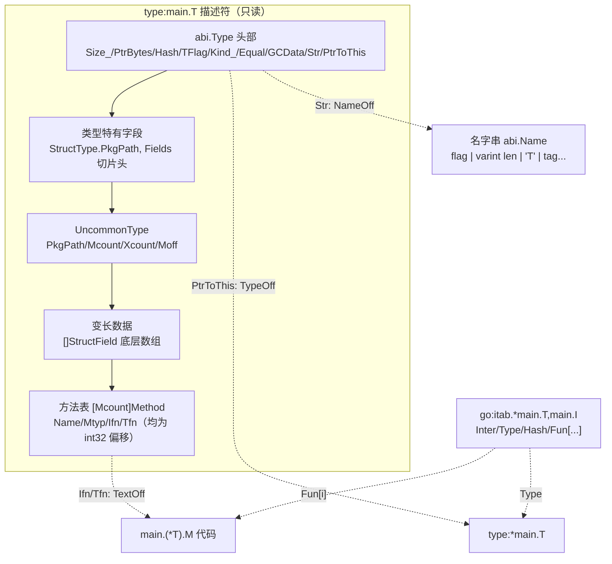
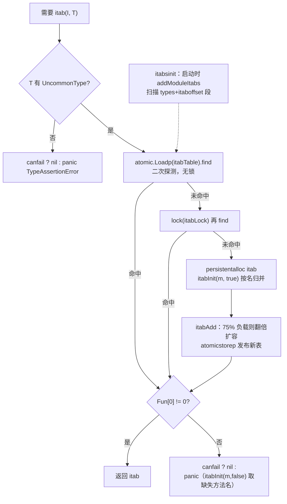

# Go 源码实现详解（十四）：接口、类型元数据与反射

## 引言：先给结论

Go 的接口、类型断言、类型开关和反射，本质上都建立在同一份数据之上：**编译器为每个需要运行时表示的类型生成的只读描述符 `abi.Type`**。围绕它，整条实现链可以压缩成几句话：

1. **类型描述符是静态数据。** 编译器（`cmd/compile/internal/reflectdata`）为每个类型写出一个 `type:<linkstring>` 符号，内容按 `abi.Type` + 类型特有字段 + `UncommonType` + 方法表排布；名字用 `abi.Name` 的变长编码；类型之间用相对 `types` 段的 32 位偏移（`NameOff`/`TypeOff`/`TextOff`）互相引用。链接器把带 typelink 标记的描述符按类型字符串排序放到 `types` 段开头，运行时按 `DescriptorSize` 顺序扫描就得到 typelinks——这一版已经**没有独立的 `runtime.typelink` 表**。
2. **接口值就是两个字。** `eface{_type, data}` 与 `iface{tab, data}`。第二个字要么直接放指针形状的值（`TFlagDirectIface`），要么指向副本；`convT*` 系列和编译器的 `dataWord` 用 `zeroVal`、`staticuint64s`、只读全局、栈临时等手段尽量避免分配。
3. **itab 是 (接口, 具体类型) 对的缓存。** 编译期已知的配对由 `writeITab` 静态生成，`itabsinit` 启动时从 moduledata 加载进全局哈希表；未知配对由 `getitab` 在一个二次探测、无锁读、写时扩容的 `itabTable` 中查找，或用 `itabInit` 按方法名有序归并构造。
4. **类型断言分两类。** 断言到具体类型是一条指针比较；断言到非空接口要调用 `typeAssert`，但 Go 1.22 起编译器为每个断言点分配 `abi.TypeAssert` 描述符，运行时把结果写进 `TypeAssertCache`，热路径由生成代码内联查表。类型开关同理：具体类型按 `Hash` 二分或跳转表，接口类型合并成一次 `interfaceSwitch` 调用并共享 `InterfaceSwitchCache`。
5. **方法调用是 `itab.Fun[i]` 的间接调用。** 编译器能静态确定具体类型时会 devirtualize 成直接调用并可内联；值接收者方法进 itab 时用自动生成的 `(*T).M` wrapper。
6. **反射不是另一套系统。** `reflect.rtype` 只是对 `abi.Type` 的封装；`Value` 用 `flag` 低 5 位存 Kind、高位存 RO/Indir/Addr/Method；`Value.Call` 通过 `funcLayout` 算出栈帧与寄存器分配，再经 `//go:linkname` 调进汇编 `reflectcall`，按帧大小分派到 `call16`…`call1073741824`。`StructOf`/`FuncOf` 造出的堆上类型通过 `addReflectOff` 注册进 runtime 偏移表。

下文按这个顺序展开，所有函数名、字段名均以 golang/go master（提交 fdcd66b，Go 1.28 开发版）为准，并在与旧版本差异较大处点出。

## 一、类型元数据：`abi.Type` 与它的扩展

### 1.1 `Type` 的固定头部

所有类型描述符共享一个固定头部，定义在 `internal/abi`，runtime 通过 `type _type = abi.Type` 直接使用：

```go
// src/internal/abi/type.go  type Type
type Type struct {
	Size_       uintptr
	PtrBytes    uintptr // number of (prefix) bytes in the type that can contain pointers
	Hash        uint32  // hash of type; avoids computation in hash tables
	TFlag       TFlag   // extra type information flags
	Align_      uint8   // alignment of variable with this type
	FieldAlign_ uint8   // alignment of struct field with this type
	Kind_       Kind    // what kind of type this is (string, int, ...)
	// function for comparing objects of this type
	// (ptr to object A, ptr to object B) -> ==?
	Equal func(unsafe.Pointer, unsafe.Pointer) bool
	// ...
	GCData    *byte
	Str       NameOff // string form
	PtrToThis TypeOff // type for pointer to this type, may be zero
}
```

- `Hash` 是编译期算好的类型哈希（`types.TypeHash` 对 LinkString 做哈希取前 4 字节），类型开关和 itab 表直接用它。
- `Equal == nil` 表示类型不可比较，`interhash`/`efaceeq` 据此 panic（第八章）。
- `GCData` 通常指向指针位图；置 `TFlagGCMaskOnDemand` 时它是 `**byte`，位图由运行时按需生成。
- `Str`、`PtrToThis` 是 `int32` 偏移而非指针，描述符因此不含需要重定位的绝对地址，可放只读段并跨模块复用。

`Kind_` 直接是 `abi.Kind`。旧版本 kind 字节高位还塞着 `KindDirectIface`/`KindGCProg` 标志，这一版已全部搬到 `TFlag`，只留下一条给 dlv 的"面包屑"：

```go
// src/internal/abi/type.go  const TFlag...
	TFlagUncommon TFlag = 1 << 0
	TFlagExtraStar TFlag = 1 << 1
	TFlagNamed TFlag = 1 << 2
	TFlagRegularMemory TFlag = 1 << 3
	TFlagGCMaskOnDemand TFlag = 1 << 4
	// TFlagDirectIface means that a value of this type is stored directly
	// in the data field of an interface, instead of indirectly.
	// This flag is just a cached computation of Size_ == PtrBytes == goarch.PtrSize.
	TFlagDirectIface TFlag = 1 << 5

	// Leaving this breadcrumb behind for dlv. It should not be used, and no
	// Kind should be big enough to set this bit.
	KindDirectIface Kind = 1 << 5
```

`TFlagExtraStar` 是省内存技巧：编译器写类型 `T` 的名字时实际写 `"*T"`，`T` 的 `Str` 指向它并置此标志，运行时取名字跳过首字节，`T` 与 `*T` 共享同一份字符串。

### 1.2 `UncommonType`、`Method` 与 `Imethod`

有名字或有方法的类型在类型特有字段之后追加 `UncommonType`：

```go
// src/internal/abi/type.go  type UncommonType / Method / Imethod
type UncommonType struct {
	PkgPath NameOff // import path; empty for built-in types like int, string
	Mcount  uint16  // number of methods
	Xcount  uint16  // number of exported methods
	Moff    uint32  // offset from this uncommontype to [mcount]Method
	_       uint32  // unused
}

type Method struct {
	Name NameOff // name of method
	Mtyp TypeOff // method type (without receiver)
	Ifn  TextOff // fn used in interface call (one-word receiver)
	Tfn  TextOff // fn used for normal method call
}

type Imethod struct {
	Name NameOff // name of method
	Typ  TypeOff // .(*FuncType) underneath
}
```

`Method` 有两个入口：`Ifn` 是接收者恰好一个字（即通过接口调用）时的入口，`Tfn` 是普通方法调用入口。值接收者方法的 `Ifn` 指向自动生成的 `(*T).M` wrapper（第六章）。方法表按名字排序且导出方法在前，`reflect.Type.NumMethod` 只需读 `Xcount`。`Type.Uncommon()` 按 `Kind` 做不同偏移计算，因为 `UncommonType` 紧跟在 `PtrType`/`FuncType`/`StructType` 等各自结构之后。

### 1.3 `InterfaceType`、`StructType`、`FuncType`

```go
// src/internal/abi/type.go  type InterfaceType / StructType / StructField / FuncType
type InterfaceType struct {
	Type
	PkgPath Name      // import path
	Methods []Imethod // sorted by hash
}

type StructType struct {
	Type
	PkgPath Name
	Fields  []StructField
}

type StructField struct {
	Name   Name    // name is always non-empty
	Typ    *Type   // type of field
	Offset uintptr // byte offset of field
}

type FuncType struct {
	Type
	InCount  uint16
	OutCount uint16 // top bit is set if last input parameter is ...
}
```

`InterfaceType.Methods` 注释写 "sorted by hash"，但实际排序键是方法名——编译器 `imethods`/`writeITab` 与 runtime `itabInit` 都依赖"按名字排序"做线性归并。`FuncType` 的参数类型数组紧跟结构体（若有 `UncommonType` 则在其后），`InSlice`/`OutSlice` 用两个计数切出来。

### 1.4 `Name` 的编码

类型名、字段名、方法名统一用 `abi.Name`：首字节是标志位，随后 varint 长度 + 名字，可选 varint 长度 + tag，可选 4 字节包路径 `NameOff`：

```go
// src/internal/abi/type.go  type Name（注释节选）与 ReadVarint / Name
// The first byte is a bit field containing:
//	1<<0 the name is exported
//	1<<1 tag data follows the name
//	1<<2 pkgPath nameOff follows the name and tag
//	1<<3 the name is of an embedded (a.k.a. anonymous) field
type Name struct {
	Bytes *byte
}

func (n Name) ReadVarint(off int) (int, int) {
	v := 0
	for i := 0; ; i++ {
		x := *n.DataChecked(off+i, "read varint")
		v += int(x&0x7f) << (7 * i)
		if x&0x80 == 0 {
			return i + 1, v
		}
	}
}

func (n Name) Name() string {
	if n.Bytes == nil {
		return ""
	}
	i, l := n.ReadVarint(1)
	return unsafe.String(n.DataChecked(1+i, "non-empty string"), l)
}
```

`Name()` 返回的字符串直接引用只读段内存，不做拷贝。

### 1.5 `ITab`

```go
// src/internal/abi/iface.go  type ITab
type ITab struct {
	Inter *InterfaceType
	Type  *Type
	Hash  uint32     // copy of Type.Hash. Used for type switches.
	Fun   [1]uintptr // variable sized. fun[0]==0 means Type does not implement Inter.
}

func (it *ITab) Size() int {
	size := int(unsafe.Sizeof(ITab{}))
	if it.Fun[0] == 0 {
		return size
	}
	return size + (len(it.Inter.Methods)-1)*goarch.PtrSize
}
```

`Fun` 声明长度 1，实际按接口方法数变长；`Fun[0] == 0` 是"不实现"哨兵。`Hash` 复制 `Type.Hash`，让类型开关少一次解引用。runtime 用 `type itab = abi.ITab`（`src/runtime/runtime2.go`）别名它。



## 二、编译器如何生成这些数据

### 2.1 `writeType`：一个类型一个符号

`cmd/compile/internal/reflectdata/reflect.go` 的 `writeType` 是入口。它先去重（`s.Siggen()`），再按 `NeedEmit` 决定本包写出还是引用别包符号，然后按注释中的布局逐段写入：

```go
// src/cmd/compile/internal/reflectdata/reflect.go  func writeType（布局注释）
	// Type layout                          Written by               Marker
	// +--------------------------------+                            - 0
	// | abi/internal.Type              |   dcommontype
	// +--------------------------------+                            - A
	// | additional type-dependent      |   code in the switch below
	// | fields, e.g.                   |
	// | abi/internal.ArrayType.Len     |
	// +--------------------------------+                            - B
	// | internal/abi.UncommonType      |   dextratype
	// | This section is optional,      |
	// | if type has a name or methods  |
	// +--------------------------------+                            - C
	// | variable-length data           |   code in the switch below
	// | referenced by                  |
	// | type-dependent fields, e.g.    |
	// | abi/internal.StructType.Fields |
	// +--------------------------------+                            - D
	// | method list, if any            |   dextratype
	// +--------------------------------+                            - E
	extra := t.Sym() != nil || len(methods(t)) != 0
```

写完后决定符号属性。未命名类型、泛型实例化类型和 shape 类型可能被多个包同时生成，必须标 `DUPOK`；同时决定是否进入 typelink：

```go
// src/cmd/compile/internal/reflectdata/reflect.go  func writeType（尾部）
	dupok := 0
	if tbase.Sym() == nil || tbase.IsFullyInstantiated() || tbase.HasShape() {
		dupok = obj.DUPOK
	}
	objw.Global(lsym, int32(E), int16(dupok|obj.RODATA))

	keep := base.Ctxt.Flag_dynlink
	if !keep && t.Sym() == nil {
		// For an unnamed type, we only need the link if the type can
		// be created at run time by reflect.PointerTo and similar
		// functions. ...
		switch t.Kind() {
		case types.TPTR, types.TARRAY, types.TCHAN, types.TFUNC, types.TMAP, types.TSLICE, types.TSTRUCT:
			keep = true
		}
	}
	// Do not put Noalg types in typelinks.  See issue #22605.
	if types.TypeHasNoAlg(t) {
		keep = false
	}
	lsym.Set(obj.AttrMakeTypelink, keep)
```

**默认只有未命名复合类型进 typelink**，目的是让 `reflect.PointerTo`/`SliceOf`/`StructOf` 等能先按字符串查到已有描述符，避免同一类型出现两份。

### 2.2 `dcommontype` 与 `dextratype`

```go
// src/cmd/compile/internal/reflectdata/reflect.go  func dcommontype（节选）
	eqfunc := geneq(t)
	sptrWeak := true
	var sptr *obj.LSym
	if !t.IsPtr() || t.IsPtrElem() {
		tptr := types.NewPtr(t)
		if t.Sym() != nil || methods(tptr) != nil {
			sptrWeak = false
		}
		sptr = writeType(tptr)
	}
	gcsym, onDemand, ptrdata := dgcsym(t, true, true)
	// ...
	c.Field("Size_").WriteUintptr(uint64(t.Size()))
	c.Field("PtrBytes").WriteUintptr(uint64(ptrdata))
	c.Field("Hash").WriteUint32(types.TypeHash(t))
	// ...
	c.Field("TFlag").WriteUint8(uint8(t.TFlag()))
	c.Field("Kind_").WriteUint8(uint8(ABIKindOfType(t)))
	c.Field("Equal").WritePtr(eqfunc)
	c.Field("GCData").WritePtr(gcsym)
	nsym := dname(p, "", nil, exported, false)
	c.Field("Str").WriteSymPtrOff(nsym, false)
	c.Field("PtrToThis").WriteSymPtrOff(sptr, sptrWeak)
```

`rttype.Cursor` 用 `internal/abi` 的真实结构体布局按字段名定位偏移，避免手写魔数。`PtrToThis` 用 weak 引用：若 `*T` 未被程序用到，链接器可丢弃它并把偏移写 0。`TFlag` 由 `types.(*Type).TFlag` 计算（`src/cmd/compile/internal/types/tflag.go`），其中 `TFlagDirectIface` 就是 `IsDirectIface(t)`，即 `Size() == PtrSize && PtrDataSize(t) == PtrSize`。

方法表由 `dextratype` 写出：

```go
// src/cmd/compile/internal/reflectdata/reflect.go  func dextratype（节选）
	m := methods(t)
	// ...
	xcount := sort.Search(mcount, func(i int) bool { return !types.IsExported(m[i].name.Name) })
	c.Field("Mcount").WriteUint16(uint16(mcount))
	c.Field("Xcount").WriteUint16(uint16(xcount))
	c.Field("Moff").WriteUint32(uint32(dataAdd))

	array := rttype.NewArrayCursor(lsym, off+int64(dataAdd), rttype.Method, mcount)
	for i, a := range m {
		// ...
		e := array.Elem(i)
		e.Field("Name").WriteSymPtrOff(nsym, false)
		dmethodptrOff(e.Field("Mtyp"), writeType(a.mtype))
		dmethodptrOff(e.Field("Ifn"), a.isym)
		dmethodptrOff(e.Field("Tfn"), a.tsym)
	}
```

`methods(t)` 为每个方法准备 `isym = methodWrapper(t, f, true)`（接口入口）和 `tsym = methodWrapper(t, f, false)`（直接入口）。`dmethodptrOff` 写出 `R_METHODOFF` 重定位，链接器据此做死方法消除（7.7 节）。名字则由 `dnameData` 按 1.4 节的格式写出：`bits` 依次置 exported/tag/pkgPath/embedded 位，`binary.PutUvarint` 写长度，`pkg != nil` 时末尾追加 4 字节 `dgopkgpathOff`。

### 2.3 静态 itab：`itabLsym` 与 `writeITab`

只要编译器看到 `T` 到非空接口 `I` 的转换（或断言/开关中出现 `(I, T)` 对），就生成 `go:itab.T,I` 符号：

```go
// src/cmd/compile/internal/reflectdata/reflect.go  func writeITab（节选）
	sigs := iface.AllMethods()
	entries := make([]*obj.LSym, 0, len(sigs))

	// both sigs and methods are sorted by name,
	// so we can find the intersection in a single pass
	for _, m := range methods(typ) {
		if m.name == sigs[0].Sym {
			entries = append(entries, m.isym)
			sigs = sigs[1:]
			if len(sigs) == 0 {
				break
			}
		}
	}
	completeItab := len(sigs) == 0
	if !allowNonImplement && !completeItab {
		base.Fatalf("incomplete itab")
	}
	c := rttype.NewCursor(lsym, 0, rttype.ITab)
	c.Field("Inter").WritePtr(writeType(iface))
	c.Field("Type").WritePtr(writeType(typ))
	c.Field("Hash").WriteUint32(types.TypeHash(typ)) // copy of type hash
	// ... Fun[i] = entries[i]（WritePtrWeak），或 Fun[0] = 0
	objw.Global(lsym, int32(rttype.ITab.Size()+delta), int16(obj.DUPOK|obj.RODATA))
	lsym.Set(obj.AttrContentAddressable, true)
```

`itabLsym` 以 `typ.LinkString() + "," + iface.LinkString()` 在 `ir.Pkgs.Itab` 中查找符号，首次出现才写。静态 itab 是 `DUPOK` + content-addressable，多个包生成的同一 `go:itab.T,I` 会被链接器合并。`allowNonImplement` 用于泛型：断言目标是类型参数时编译期无法保证实现关系，允许写出 `Fun[0] = 0` 的空 itab。

### 2.4 符号命名、链接器排序与 typelink

类型符号放在伪包 `type`（`types.typepkg`），itab 放在 `ir.Pkgs.Itab`（`Prefix = "go:itab"`）。`base.PkgLinksym` 对这两个保留前缀用 `:` 作分隔符，所以最终符号名形如 `type:main.T`、`type:*main.T`、`go:itab.*main.T,main.I`。`go tool nm -type ./prog | grep 'type:main\|go:itab'` 可以看到它们，`R` 表示只读数据。

链接器 `dodataSect`（`src/cmd/link/internal/ld/data.go`）对 `STYPE` 段做特殊排序：

```go
// src/cmd/link/internal/ld/data.go  func (state *dodataState) dodataSect（case sym.STYPE，节选）
		// Sort type descriptors with the typelink flag first,
		// sorted by type string. The reflect package will use
		// this to ensure that type descriptor pointers are unique.
		// Sort itabs after type descriptors.
		// ...
				if iIsTypelink && jIsTypelink {
					// typelink symbols sort by type string
					return sl[i].typeStr < sl[j].typeStr
				} else if iIsTypelink {
					// typelink < non-typelink
					return true
				}
		// ...
		// Store the length of the typelink descriptors
		// in the typedesclen field of moduledata.
			su := ldr.MakeSymbolUpdater(ctxt.Moduledata)
			su.SetUint(ctxt.Arch, ctxt.moduledataTypeDescOffset, uint64(typeLinkSize))
```

于是 `types` 段布局为 `[typelink 描述符（按类型串排序）][其他类型描述符][itab]`，moduledata 只记录 `types, typedesclen, etypes` 与 `itaboffset, itabsize`。运行时 `moduleTypelinks` 扫描前 `typedesclen` 字节：

```go
// src/runtime/type.go  func moduleTypelinks（节选）
	td := md.types
	// ...
	td += goarch.PtrSize
	etypedesc := md.types + md.typedesclen
	for td < etypedesc {
		td = alignUp(td, goarch.PtrSize)
		typ := (*_type)(unsafe.Pointer(td))
		ret = append(ret, typ)
		td += uintptr(typ.DescriptorSize())
	}
```

这是与 Go 1.24 及更早版本的显著差异：那时链接器生成 `runtime.typelink`（`[]int32` 偏移表）与 `runtime.itablink`，moduledata 有 `typelinks`/`itablinks` 字段。现在都改为段内顺序扫描，`abi.(*Type).DescriptorSize` 就是为此新增的。老的 `reflect.typelinks` linkname 仍保留，新代码走 `reflect_compiledTypelinks`（`//go:linknamestd`，返回 `[]*abi.Type`）。

调试手段：`-gcflags=-d=typeassert` 打印 "type assertion inlined/not inlined"（`base.Debug.TypeAssert`）；`-gcflags='-m -d=escapedebug=1'` 让 `dataWord` 的 `diagnose` 打印 "using global/stack temporary for interface value"。

## 三、接口值表示与转换

### 3.1 `iface` 与 `eface`

```go
// src/runtime/runtime2.go  type iface / eface
type iface struct {
	tab  *itab
	data unsafe.Pointer
}

type eface struct {
	_type *_type
	data  unsafe.Pointer
}
```

`internal/abi` 对应 `NonEmptyInterface{ITab, Data}` 和 `EmptyInterface{Type, Data}`。空接口第一个字直接是 `*Type`，非空接口需再读 `itab.Type`。`data` 的含义由 `TFlagDirectIface` 决定：指针形状（指针、chan、map、func、unsafe.Pointer 及只含一个此类字段的结构体/数组）直接存值，否则存指向副本的指针。

### 3.2 编译器的 `walkConvInterface` 与 `dataWord`

`OCONVIFACE` 由 `walkConvInterface`（`src/cmd/compile/internal/walk/convert.go`）处理。非接口到接口的转换拆成两半：类型字由 `reflectdata.ConvIfaceTypeWord` 给出（空接口是 `type:T` 地址，非空接口是 `go:itab.T,I` 地址），数据字由 `dataWord` 计算，组装成 `OMAKEFACE`。接口到接口（I2I）则复用 `ODOTTYPE2` 的路径并分配 `TypeAssert` 描述符。`dataWord` 是"避免分配"技巧的集中地：

```go
// src/cmd/compile/internal/walk/convert.go  func dataWord（节选）
	// If it's a pointer, it is its own representation.
	if types.IsDirectIface(fromType) {
		return n
	}
	// ...
	switch {
	case fromType.Size() == 0:
		// n is zero-sized. Use zerobase.
		value = ir.NewLinksymExpr(base.Pos, ir.Syms.Zerobase, types.Types[types.TUINTPTR])
	case isBool || isInteger && (fromType.Size() == 1 || isConst):
		// n is a bool, a single-byte integer, or a compile-time constant in [0, 255].
		// Use staticuint64s[n * 8] on little-endian and staticuint64s[n * 8 + 7] on big-endian.
		// ...
		xe := ir.NewIndexExpr(base.Pos, staticuint64s, index)
		xe.SetBounded(true)
		value = xe
	case n.Op() == ir.OLINKSYMOFFSET && n.(*ir.LinksymOffsetExpr).Linksym == ir.Syms.ZeroVal && n.(*ir.LinksymOffsetExpr).Offset_ == 0:
		// n is using zeroVal, so we can use n directly.
		value = n
	case n.Op() == ir.ONAME && n.(*ir.Name).Class == ir.PEXTERN && n.(*ir.Name).Readonly():
		// n is a readonly global; use it directly.
		value = n
	case conv.Esc() == ir.EscNone && fromType.Size() <= 1024:
		// n does not escape. Use a stack temporary initialized to n.
		value = typecheck.TempAt(base.Pos, walkstate.curfunc, fromType)
		init.Append(typecheck.Stmt(ir.NewAssignStmt(base.Pos, value, n)))
	}
	if value != nil {
		return typecheck.Expr(typecheck.NodAddr(value))
	}
```

五条不分配路径：零大小类型指向 `runtime.zerobase`；bool、单字节整数和 [0,255] 内常量直接索引只读数组 `runtime.staticuint64s`；已是 `zeroVal` 的表达式原样使用；只读全局取地址；不逃逸且 ≤ 1024 字节的值放栈临时。

都不满足时才调 runtime，`dataWordFuncName` 按类型形状选函数：

```go
// src/cmd/compile/internal/walk/convert.go  func dataWordFuncName
	switch {
	case from.Size() == 2 && uint8(from.Alignment()) == 2:
		return "convT16", types.Types[types.TUINT16], false
	case from.Size() == 4 && uint8(from.Alignment()) == 4 && !from.HasPointers():
		return "convT32", types.Types[types.TUINT32], false
	case from.Size() == 8 && uint8(from.Alignment()) == uint8(types.Types[types.TUINT64].Alignment()) && !from.HasPointers():
		return "convT64", types.Types[types.TUINT64], false
	}
	if sc := from.SoleComponent(); sc != nil {
		switch {
		case sc.IsString():
			return "convTstring", types.Types[types.TSTRING], false
		case sc.IsSlice():
			return "convTslice", types.NewSlice(types.Types[types.TUINT8]), false // the element type doesn't matter
		}
	}
	if from.HasPointers() {
		return "convT", types.Types[types.TUNSAFEPTR], true
	}
	return "convTnoptr", types.Types[types.TUNSAFEPTR], true
```

第三个返回值 `needsaddr` 为 true 时按地址传参（`convT`/`convTnoptr` 需要 `*_type` 与源地址），否则按值传（`convT64(val uint64)`），省掉取地址和 `typedmemmove`。`SoleComponent` 让 `struct{ s string }` 这类单字段包装也能走 `convTstring`。

### 3.3 runtime 侧的 `convT*`

```go
// src/runtime/iface.go  func convT / convT64 / convTstring / convTslice（节选）
func convT(t *_type, v unsafe.Pointer) unsafe.Pointer {
	// ... race/msan/asan 钩子
	x := mallocgc(t.Size_, t, true)
	typedmemmove(t, x, v)
	return x
}

func convT64(val uint64) (x unsafe.Pointer) {
	if val < uint64(len(staticuint64s)) {
		x = unsafe.Pointer(&staticuint64s[val])
	} else {
		x = mallocgc(8, uint64Type, false)
		*(*uint64)(x) = val
	}
	return
}

func convTstring(val string) (x unsafe.Pointer) {
	if val == "" {
		x = unsafe.Pointer(&zeroVal[0])
	} else {
		x = mallocgc(unsafe.Sizeof(val), stringType, true)
		*(*string)(x) = val
	}
	return
}
```

`convTslice` 同理，以 `array == nil` 判断零值。两个只读"共享池"：`staticuint64s [256]uint64` 在汇编中定义为只读数据且 `staticuint64s[i] == i`，`convT16`/`convT32`/`convT64` 中小于 256 的值直接指向它（大端机器加偏移 6/4）；`zeroVal [abi.ZeroValSize]byte`（`src/runtime/runtime.go`，1024 字节全零）供空字符串、nil 切片与编译器识别的零值使用。`convT16` 用的 `uint16Type`/`stringType` 描述符是把命名类型零值塞进 `any` 再取 `_type` 得到的，只为让 `mallocgc` 知道大小与是否含指针。

## 四、itab 的查找与构造

### 4.1 `getitab` 与无锁读取

```go
// src/runtime/iface.go  func getitab（节选）
	// easy case
	if typ.TFlag&abi.TFlagUncommon == 0 {
		if canfail {
			return nil
		}
		name := toRType(&inter.Type).nameOff(inter.Methods[0].Name)
		panic(&TypeAssertionError{nil, typ, &inter.Type, name.Name()})
	}
	var m *itab
	// First, look in the existing table to see if we can find the itab we need.
	// This is by far the most common case, so do it without locks.
	t := (*itabTableType)(atomic.Loadp(unsafe.Pointer(&itabTable)))
	if m = t.find(inter, typ); m != nil {
		goto finish
	}
	// Not found.  Grab the lock and try again.
	lock(&itabLock)
	if m = itabTable.find(inter, typ); m != nil {
		unlock(&itabLock)
		goto finish
	}
	// Entry doesn't exist yet. Make a new entry & add it.
	m = (*itab)(persistentalloc(unsafe.Sizeof(itab{})+uintptr(len(inter.Methods)-1)*goarch.PtrSize, 0, &memstats.other_sys))
	m.Inter = inter
	m.Type = typ
	m.Hash = 0
	itabInit(m, true)
	itabAdd(m)
	unlock(&itabLock)
finish:
	if m.Fun[0] != 0 {
		return m
	}
	if canfail {
		return nil
	}
	panic(&TypeAssertionError{concrete: typ, asserted: &inter.Type, missingMethod: itabInit(m, false)})
```

没有 `UncommonType` 的类型必然没有方法，直接失败；动态 itab 用 `persistentalloc` 分配在非 GC 内存，永不释放；`m.Hash = 0` 是因为动态 itab 从不参与类型开关（编译器为开关中出现的配对生成静态 itab）；负结果（`Fun[0] == 0`）也会缓存，再次以非 `canfail` 方式失败时重新调 `itabInit(m, false)` 只为拿到缺失方法名（`firstTime=false` 保证不改写 `Fun`，见 issue 65962）。`getitab` 本身带 `//go:linkname`，因为 sonic 等库直接引用它。

### 4.2 `itabTableType`：二次探测的开放寻址表

```go
// src/runtime/iface.go  type itabTableType / func (t *itabTableType) find
type itabTableType struct {
	size    uintptr             // length of entries array. Always a power of 2.
	count   uintptr             // current number of filled entries.
	entries [itabInitSize]*itab // really [size] large
}

func itabHashFunc(inter *interfacetype, typ *_type) uintptr {
	// compiler has provided some good hash codes for us.
	return uintptr(inter.Type.Hash ^ typ.Hash)
}

func (t *itabTableType) find(inter *interfacetype, typ *_type) *itab {
	// Implemented using quadratic probing.
	// Probe sequence is h(i) = h0 + i*(i+1)/2 mod 2^k.
	// We're guaranteed to hit all table entries using this probe sequence.
	mask := t.size - 1
	h := itabHashFunc(inter, typ) & mask
	for i := uintptr(1); ; i++ {
		p := (**itab)(add(unsafe.Pointer(&t.entries), h*goarch.PtrSize))
		m := (*itab)(atomic.Loadp(unsafe.Pointer(p)))
		if m == nil {
			return nil
		}
		if m.Inter == inter && m.Type == typ {
			return m
		}
		h += i
		h &= mask
	}
}
```

初始大小 `itabInitSize = 512`。探测序列 `h, h+1, h+3, h+6, …`（三角数）在 2 的幂大小表上能遍历所有槽位。`itabAdd` 在负载因子达 75%（`t.count >= 3*(t.size/4)`）时翻倍：`mallocgc` 新表（谎称无指针，因为 itab 都在非堆内存）、`iterate_itabs(t2.add)` 重插、`atomicstorep` 发布。扩容期间无锁读者可能查不到刚插入的项，但会接着加锁重查。`add` 遇到已存在的 `(inter, typ)`（plugin 的重复副本）直接返回，保证类型开关比较的 itab 指针唯一；写入用 `atomic.StorepNoWB`，读者看到非 nil 指针时字段必已初始化。

### 4.3 `itabInit`：按名字有序归并

```go
// src/runtime/iface.go  func itabInit（节选）
	ni := len(inter.Methods)
	nt := int(x.Mcount)
	xmhdr := unsafe.Slice((*abi.Method)(add(unsafe.Pointer(x), uintptr(x.Moff))), nt)
	j := 0
	methods := unsafe.Slice(&m.Fun[0], ni)
	var fun0 unsafe.Pointer
imethods:
	for k := 0; k < ni; k++ {
		i := &inter.Methods[k]
		itype := toRType(&inter.Type).typeOff(i.Typ)
		name := toRType(&inter.Type).nameOff(i.Name)
		iname := name.Name()
		// ...
		for ; j < nt; j++ {
			t := &xmhdr[j]
			rtyp := toRType(typ)
			tname := rtyp.nameOff(t.Name)
			if rtyp.typeOff(t.Mtyp) == itype && tname.Name() == iname {
				// ... 检查导出性或同包
					ifn := rtyp.textOff(t.Ifn)
					if k == 0 {
						fun0 = ifn // we'll set m.Fun[0] at the end
					} else if firstTime {
						methods[k] = uintptr(ifn)
					}
					continue imethods
			}
		}
		// didn't find method
		return iname
	}
	if firstTime {
		m.Fun[0] = uintptr(fun0)
	}
	return ""
```

两张表都按名字排序，`j` 单调前进，复杂度 O(ni+nt)。匹配条件是"方法类型描述符指针相等且名字相等"，前者成立依赖链接器对类型符号的去重。`Fun[0]` 最后才写，因为它是"已初始化"的发布标志。写入的是 `Ifn`，所以值接收者方法进 itab 的一定是 wrapper。函数标 `//go:nowritebarrier` 且用 `uintptr` 切片存储：这些是代码指针，wasm 上若被当成堆指针会让 GC 崩溃（issue 80472）。

### 4.4 `itabsinit`：加载编译期 itab

```go
// src/runtime/iface.go  func itabsinit / addModuleItabs
func itabsinit() {
	lockInit(&itabLock, lockRankItab)
	lock(&itabLock)
	for _, md := range activeModules() {
		addModuleItabs(md)
	}
	unlock(&itabLock)
}

func addModuleItabs(md *moduledata) {
	p := md.types + md.itaboffset
	end := p + md.itabsize
	for p < end {
		itab := (*itab)(unsafe.Pointer(p))
		itabAdd(itab)
		p += uintptr(itab.Size())
	}
}
```

启动时把 `types` 段尾部的静态 itab 全部插入哈希表，之后 `getitab` 对这些配对总能无锁命中。旧版本这里遍历 `md.itablinks []*itab`，现在同样改为扫描段。



## 五、类型断言与类型开关

### 5.1 断言到具体类型：一次指针比较

`x.(T)`（T 非接口）不需要运行时调用。`ssagen.(*state).dottype1` 取接口第一个字与目标比较：源是空接口时比 `type:T` 地址，源是非空接口时比 `go:itab.T,I` 地址：

```go
// src/cmd/compile/internal/ssagen/ssa.go  func (s *state) dottype1（具体类型分支，节选）
	direct := types.IsDirectIface(dst)
	itab := s.newValue1(ssaop.OpITab, byteptr, iface) // type word of interface
	var wantedFirstWord *ssa.Value
	if src.IsEmptyInterface() {
		// Looking for pointer to target type.
		wantedFirstWord = target
	} else {
		// Looking for pointer to itab for target type and source interface.
		wantedFirstWord = targetItab
	}
	// ...
	cond := s.newValue2(ssaop.OpEqPtr, types.Types[types.TBOOL], itab, wantedFirstWord)
	// ...
	if !commaok {
		// on failure, panic by calling panicdottype
		if src.IsEmptyInterface() {
			s.rtcall(ir.Syms.PanicdottypeE, false, nil, itab, target, taddr)
		} else {
			s.rtcall(ir.Syms.PanicdottypeI, false, nil, itab, target, taddr)
		}
```

失败时 `runtime.panicdottypeE`/`panicdottypeI` 构造 `TypeAssertionError`。比较之所以成立，靠的是不变量：每个类型描述符和每个 (I, T) itab 在进程内地址唯一。

### 5.2 断言到非空接口：`TypeAssert` 描述符与缓存

`x.(I)`（I 非空接口）需要 `getitab`。Go 1.22 之前编译器直接调 `assertE2I`/`assertE2I2`（仍保留，用于泛型字典等动态目标类型）；现在 walk 阶段为每个断言点分配 `abi.TypeAssert` 描述符：

```go
// src/cmd/compile/internal/walk/expr.go  func makeTypeAssertDescriptor
func makeTypeAssertDescriptor(target *types.Type, canFail bool) *obj.LSym {
	lsym := types.LocalPkg.Lookup(fmt.Sprintf(".typeAssert.%d", typeAssertGen)).LinksymABI(obj.ABI0)
	typeAssertGen++
	c := rttype.NewCursor(lsym, 0, rttype.TypeAssert)
	c.Field("Cache").WritePtr(typecheck.LookupRuntimeVar("emptyTypeAssertCache"))
	c.Field("Inter").WritePtr(reflectdata.TypeLinksym(target))
	c.Field("CanFail").WriteBool(canFail)
	objw.Global(lsym, int32(rttype.TypeAssert.Size()), obj.LOCAL)
	lsym.Gotype = reflectdata.TypeLinksym(rttype.TypeAssert)
	return lsym
}
```

```go
// src/internal/abi/switch.go  type TypeAssert / TypeAssertCache / TypeAssertCacheEntry
type TypeAssert struct {
	Cache   *TypeAssertCache
	Inter   *InterfaceType
	CanFail bool
}
type TypeAssertCache struct {
	Mask    uintptr
	Entries [1]TypeAssertCacheEntry
}
type TypeAssertCacheEntry struct {
	// type of source value (a *runtime._type)
	Typ uintptr
	// itab to use for result (a *runtime.itab)
	// nil if CanFail is set and conversion would fail.
	Itab uintptr
}
```

`dottype1` 生成的代码先 `OpAtomicLoadPtr` 加载 `Cache`，以 `Type.Hash & Mask` 为起点线性探测：命中 `Typ == typ` 直接取 `Itab`，碰到 `Typ == 0` 才调 `runtime.typeAssert`。这段 SSA 由编译器手工构造（`loopHead`/`cacheHit`/`cacheMiss` 块），只在 `abi.UseInterfaceSwitchCache(arch)` 为 true 的架构（amd64、arm64、loong64、mips、mips64、ppc64、riscv64、s390x）启用，因为它要求原子加载指令。

运行时侧：

```go
// src/runtime/iface.go  func typeAssert
func typeAssert(s *abi.TypeAssert, t *_type) *itab {
	var tab *itab
	if t == nil {
		if !s.CanFail {
			panic(&TypeAssertionError{nil, nil, &s.Inter.Type, ""})
		}
	} else {
		tab = getitab(s.Inter, t, s.CanFail)
	}
	if !abi.UseInterfaceSwitchCache(goarch.ArchFamily) {
		return tab
	}
	// Maybe update the cache, so the next time the generated code
	// doesn't need to call into the runtime.
	if cheaprand()&1023 != 0 {
		// Only bother updating the cache ~1 in 1000 times.
		return tab
	}
	oldC := (*abi.TypeAssertCache)(atomic.Loadp(unsafe.Pointer(&s.Cache)))
	if cheaprand()&uint32(oldC.Mask) != 0 {
		// As cache gets larger, choose to update it less often
		// so we can amortize the cost of building a new cache.
		return tab
	}
	newC := buildTypeAssertCache(oldC, t, tab)
	// Update cache. Use compare-and-swap so if multiple threads
	// are fighting to update the cache, at least one of their
	// updates will stick.
	atomic_casPointer((*unsafe.Pointer)(unsafe.Pointer(&s.Cache)), unsafe.Pointer(oldC), unsafe.Pointer(newC))
	return tab
}
```

设计要点：缓存是**不可变对象 + CAS 替换**，读者无需加锁；约千分之一的未命中才触发重建，且缓存越大重建概率越低，避免为冷断言点浪费内存；`buildTypeAssertCache` 把容量取为条目数两倍再向上取 2 的幂，保证至少 50% 空槽（探测必然终止）。它被称为"PGO 友好"，是因为热断言点的开销被压到几条内联指令，不再依赖运行时哈希表。

### 5.3 类型开关：哈希分派 + 接口开关缓存

`walkSwitchType`（`src/cmd/compile/internal/walk/switch.go`）先做 nil 检查，然后用 `typeHashFieldOf` 从接口第一个字取类型哈希（按空/非空接口选 `rttype.Type.OffsetOf("Hash")` 或 `rttype.ITab.OffsetOf("Hash")`）。具体类型 case 交给 `typeSwitch.flush`：

```go
// src/cmd/compile/internal/walk/switch.go  func (s *typeSwitch) flush（节选）
	slices.SortFunc(cc, func(a, b typeClause) int { return cmp.Compare(a.hash, b.hash) })
	// Combine adjacent cases with the same hash.
	merged := cc[:1]
	for _, c := range cc[1:] {
		last := &merged[len(merged)-1]
		if last.hash == c.hash {
			last.body.Append(c.body.Take()...)
		} else {
			merged = append(merged, c)
		}
	}
	cc = merged
	if s.tryJumpTable(walkstate, cc, compiled) {
		return
	}
	binarySearch(len(cc), compiled,
		func(i int) ir.Node {
			return ir.NewBinaryExpr(base.Pos, ir.OLE, s.hashName, ir.NewInt(base.Pos, int64(cc[i-1].hash)))
		},
		func(i int, nif *ir.IfStmt) {
			c := cc[i]
			nif.Cond = ir.NewBinaryExpr(base.Pos, ir.OEQ, s.hashName, ir.NewInt(base.Pos, int64(c.hash)))
			nif.Body.Append(c.body.Take()...)
		},
	)
```

≥ 5 个 case 且架构支持时 `tryJumpTable` 从哈希中挑若干位构造无冲突跳转表；否则对哈希二分（`binarySearchMin = 4`，更少则顺序比较）。哈希相等后每个 case 体内仍是一次 `_, ok = x.(T)` 指针比较，碰撞只影响性能。

接口类型 case 无法用哈希分派，编译器把连续的接口 case 合并为一个 `abi.InterfaceSwitch` 描述符和一次运行时调用：

```go
// src/cmd/compile/internal/walk/switch.go  func walkSwitchType（接口 case 部分，节选）
			lsym := types.LocalPkg.Lookup(fmt.Sprintf(".interfaceSwitch.%d", interfaceSwitchGen)).LinksymABI(obj.ABI0)
			interfaceSwitchGen++
			c := rttype.NewCursor(lsym, 0, rttype.InterfaceSwitch)
			c.Field("Cache").WritePtr(typecheck.LookupRuntimeVar("emptyInterfaceSwitchCache"))
			c.Field("NCases").WriteInt(int64(len(interfaceCases)))
			array, sizeDelta := c.Field("Cases").ModifyArray(len(interfaceCases))
			for i, c := range interfaceCases {
				array.Elem(i).WritePtr(reflectdata.TypeLinksym(c.typ.Type()))
			}
			// ...
			// case, itab = runtime.interfaceSwitch(&descriptor, typeof(arg))
			caseVar := typecheck.TempAt(base.Pos, walkstate.curfunc, types.Types[types.TINT])
			isw := ir.NewInterfaceSwitchStmt(base.Pos, caseVar, s.itabName, typeArg, dotHash, lsym)
```

`case any` 被剥离单独处理。运行时 `interfaceSwitch` 按顺序对每个 case 调 `getitab(c, t, true)`，返回首个匹配的 case 序号与 itab，缓存策略与 `typeAssert` 相同，只是 `InterfaceSwitchCacheEntry` 多了一个 `Case int` 字段：

```go
// src/internal/abi/switch.go  type InterfaceSwitch / InterfaceSwitchCacheEntry
type InterfaceSwitch struct {
	Cache  *InterfaceSwitchCache
	NCases int
	// Array of NCases elements.
	// Each case must be a non-empty interface type.
	Cases [1]*InterfaceType
}

type InterfaceSwitchCacheEntry struct {
	// type of source value (a *Type)
	Typ uintptr
	// case # to dispatch to
	Case int
	// itab to use for resulting case variable (a *runtime.itab)
	Itab uintptr
}
```

### 5.4 `TypeAssertionError`

```go
// src/runtime/error.go  type TypeAssertionError / func (e *TypeAssertionError) Error（节选）
type TypeAssertionError struct {
	_interface    *_type
	concrete      *_type
	asserted      *_type
	missingMethod string // one method needed by Interface, missing from Concrete
}

func (e *TypeAssertionError) Error() string {
	// ...
	if e.concrete == nil {
		return "interface conversion: " + inter + " is nil, not " + as
	}
	cs := toRType(e.concrete).string()
	if e.missingMethod == "" {
		msg := "interface conversion: " + inter + " is " + cs + ", not " + as
		if cs == as {
			if toRType(e.concrete).pkgpath() != toRType(e.asserted).pkgpath() {
				msg += " (types from different packages)"
			} else {
				msg += " (types from different scopes)"
			}
		}
		return msg
	}
	return "interface conversion: " + cs + " is not " + as +
		": missing method " + e.missingMethod
}
```

"types from different packages/scopes" 专门针对同名不同类型（两个包各自定义 `Error`，或函数内局部类型）的困惑场景。

## 六、方法调用：动态派发、去虚化与 wrapper

### 6.1 通过 itab 的间接调用

`OCALLINTER` 在 SSA 生成时拆成三步：取 itab、按方法序号加载函数指针、把 data 字作为接收者：

```go
// src/cmd/compile/internal/ssagen/ssa.go  func (s *state) getClosureAndRcvr
func (s *state) getClosureAndRcvr(fn *ir.SelectorExpr) (*ssa.Value, *ssa.Value) {
	i := s.expr(fn.X)
	itab := s.newValue1(ssaop.OpITab, types.Types[types.TUINTPTR], i)
	s.nilCheck(itab)
	itabidx := fn.Offset() + rttype.ITab.OffsetOf("Fun")
	closure := s.newValue1I(ssaop.OpOffPtr, s.f.Config.Types.UintptrPtr, itabidx, itab)
	rcvr := s.newValue1(ssaop.OpIData, s.f.Config.Types.BytePtr, i)
	return closure, rcvr
}
```

`fn.Offset()` 是方法在接口方法表中的序号乘指针大小，加 `Fun` 偏移即 `&itab.Fun[i]`；随后 `codeptr = s.load(...)` 读出地址执行 `CALL`。无分支无运行时调用，代价是一次加载和一次间接跳转。`MarkUsedIfaceMethod` 同时给该调用点打 `R_USEIFACEMETHOD` 标记供链接器保留方法。

### 6.2 静态去虚化 `devirtualize.StaticCall`

若编译器能证明接口变量的动态类型唯一，就把间接调用改写成直接调用，进而允许内联。Go 1.26 起的分析（`go126ImprovedConcreteTypeAnalysis`）跟踪赋值链而不只看紧邻的 `OCONVIFACE`：

```go
// src/cmd/compile/internal/devirtualize/devirtualize.go  func StaticCall（节选）
	if call.GoDefer {
		return
	}
	if call.Op() != ir.OCALLINTER {
		return
	}
	sel := call.Fun.(*ir.SelectorExpr)
	typ = concreteType(s, sel.X)
	if typ == nil {
		return
	}
	if !typecheck.Implements(typ, sel.X.Type()) {
		return
	}
	// ... shape 类型 / shaped 接口直接放弃
	dt := ir.NewTypeAssertExpr(sel.Pos(), sel.X, typ)
	dt.UseNilPanic = true
	dt.SetPos(call.Pos())
	x := typecheck.XDotMethod(sel.Pos(), dt, sel.Sel, true)
	switch x.Op() {
	case ir.ODOTMETH:
		call.SetOp(ir.OCALLMETH)
		call.Fun = x
	case ir.ODOTINTER:
		// Promoted method from embedded interface-typed field (#42279).
		call.SetOp(ir.OCALLINTER)
		call.Fun = x
	}
```

改写方式是把 `v.M()` 变成 `v.(*Impl).M()`：断言只是指针比较，而 `OCALLMETH` 随后能被内联器处理。`go`/`defer` 中的调用被排除，因为 wrapper 内可能 panic 的表达式会被提前到语句处执行。`-gcflags=-m` 打印 "devirtualizing v.M to *Impl"。PGO 去虚化（`pgo.go`）是另一条路径：对热调用点插入"itab 等于期望值则直接调用，否则回退间接调用"的守卫。

### 6.3 自动生成的 wrapper

`reflectdata.methodWrapper` 这一版只计算符号名（注释："Unified IR creates its own wrappers"），函数体由 `noder` 生成：

```go
// src/cmd/compile/internal/noder/reader.go  func methodWrapper（节选）
	wrapper := tbase
	for i := 0; i < derefs; i++ {
		wrapper = types.NewPtr(wrapper)
	}
	wrappee := method.Type.Recv().Type
	if types.Identical(wrapper, wrappee) ||
		!types.IsMethodApplicable(wrapper, method) ||
		!reflectdata.NeedEmit(tbase) {
		return
	}
	// ...
	fn := newWrapperFunc(pos, sym, wrapper, method)
	var recv ir.Node = fn.Nname.Type().Recv().Nname.(*ir.Name)
	// For simple *T wrappers around T methods, panicwrap produces a
	// nicer panic message.
	if wrapper.IsPtr() && types.Identical(wrapper.Elem(), wrappee) {
		cond := ir.NewBinaryExpr(pos, ir.OEQ, recv, types.BuiltinPkg.Lookup("nil").Def.(ir.Node))
		then := []ir.Node{ir.NewCallExpr(pos, ir.OCALL, typecheck.LookupRuntime("panicwrap"), nil)}
		fn.Body.Append(ir.NewIfStmt(pos, cond, then, nil))
	}
	// ...
	addTailCall(pos, fn, recv, method)
	finishWrapperFunc(fn, target)
```

`MakeWrappers` 对每个类型的每个方法调 `methodWrapper(0, …)` 与 `methodWrapper(1, …)`，生成 `T.M` 与 `(*T).M` 中缺失的那一种（not-in-heap 类型还要 `**T`）。`(*T).M` 包装值接收者方法时先检查 nil 并调 `runtime.panicwrap`（"value method main.T.M called using nil *T pointer" 的来源），再解引用做尾调用。itab 的 `Ifn` 要求接收者恰好一个字，所以值接收者方法通过接口调用时总走这个 wrapper。方法值 `t.M`（`OMETHVALUE`）由 `wrapMethodValue` 生成带 `-fm` 后缀的闭包包装。

## 七、反射：同一份元数据的另一种视图

### 7.1 `rtype`、`TypeOf`、`TypeFor`

```go
// src/reflect/type.go  type rtype / func TypeOf / TypeFor / toType
type rtype struct {
	t abi.Type
}

func TypeOf(i any) Type {
	return toType(abi.TypeOf(i))
}

func TypeFor[T any]() Type {
	// toRType is safe to use here; type is never nil as T is statically known.
	return toRType(abi.TypeFor[T]())
}

func toType(t *abi.Type) Type {
	if t == nil {
		return nil
	}
	return toRType(t)
}
```

`rtype` 是 `abi.Type` 的零开销包装；`abi.TypeOf` 直接读 `EmptyInterface.Type` 并用 `NoEscape` 阻止参数逃逸；`abi.TypeFor[T]` 的实现是 `TypeOf((*T)(nil))` 再取 `PtrType.Elem`，这样即使 T 是接口类型也能拿到接口自身的描述符。

### 7.2 `Value` 与 `flag`

```go
// src/reflect/value.go  type Value / const flag...
type Value struct {
	typ_ *abi.Type
	ptr unsafe.Pointer
	flag
}

const (
	flagKindWidth      = 5 // there are 27 kinds
	flagKindMask  flag = 1<<flagKindWidth - 1
	flagStickyRO  flag = 1 << 5
	flagEmbedRO   flag = 1 << 6
	flagIndir     flag = 1 << 7
	flagAddr      flag = 1 << 8
	flagMethod    flag = 1 << 9
	flagRO        flag = flagStickyRO | flagEmbedRO
)
```

低 5 位复制 Kind，省一次解引用；`flagIndir` 表示 `ptr` 指向数据而非数据本身（非 `DirectIface` 类型必然置位）；`flagAddr` 对应 `CanAddr`/`CanSet`；两个 RO 位区分"经未导出字段获得"与"经未导出嵌入字段获得"，后者继续取字段时可清除；`flagMethod` 置位时方法序号存在 flag 高位。

`unpackEface`/`packEfaceData` 是 `ValueOf` 与 `Interface()` 的核心：

```go
// src/reflect/value.go  func unpackEface / packEfaceData（节选）
func unpackEface(i any) Value {
	e := (*abi.EmptyInterface)(unsafe.Pointer(&i))
	t := e.Type
	if t == nil {
		return Value{}
	}
	f := flag(t.Kind())
	if !t.IsDirectIface() {
		f |= flagIndir
	}
	return Value{t, e.Data, f}
}

func packEfaceData(v Value) unsafe.Pointer {
	t := v.typ()
	switch {
	case !t.IsDirectIface():
		ptr := v.ptr
		if v.flag&flagAddr != 0 {
			c := unsafe_New(t)
			typedmemmove(t, c, ptr)
			ptr = c
		}
		return ptr
	case v.flag&flagIndir != 0:
		return *(*unsafe.Pointer)(v.ptr)
	default:
		return v.ptr
	}
}
```

可寻址的 `Value` 调 `Interface()` 必须拷贝一份，否则接口会指向可变内存——这是反射取接口有时会分配的原因。`Elem` 对指针把 `flagIndir | flagAddr` 一起打开，对接口则先打包成 `any` 再 `unpackEface`；`Field` 则是 `ptr + field.Offset` 加上权限位继承：

```go
// src/reflect/value.go  func (v Value) Field（节选）
	field := &tt.Fields[i]
	typ := field.Typ
	// Inherit permission bits from v, but clear flagEmbedRO.
	fl := v.flag&(flagStickyRO|flagIndir|flagAddr) | flag(typ.Kind())
	// Using an unexported field forces flagRO.
	if !field.Name.IsExported() {
		if field.Embedded() {
			fl |= flagEmbedRO
		} else {
			fl |= flagStickyRO
		}
	}
	// ...
	ptr := add(v.ptr, field.Offset, "same as non-reflect &v.field")
	return Value{typ, ptr, fl}
```

### 7.3 `Value.Call` 到 `reflectcall`

`Value.call` 的流程：解析函数指针（方法值走 `methodReceiver`）、校验并补齐变参、调 `funcLayout` 获得帧类型与 ABI 描述、把参数写进栈帧或 `abi.RegArgs`、调 `call`，最后从栈帧/寄存器读回结果：

```go
// src/reflect/value.go  func (v Value) call（节选）
	// Register argument space.
	var regArgs abi.RegArgs
	// Compute frame type.
	frametype, framePool, abid := funcLayout(t, rcvrtype)
	// ...（按 abid.call.stepsForValue(i) 把 in[i] 写入 stackArgs 或 regArgs.Ints/Floats/Ptrs）
	regArgs.ReturnIsPtr = abid.outRegPtrs
	// ...
	call(frametype, fn, stackArgs, uint32(frametype.Size()), uint32(abid.retOffset), uint32(frameSize), &regArgs)
```

`funcLayout` 用 `newAbiDesc`（`src/reflect/abi.go`）模拟寄存器 ABI 的分配算法，为每个参数记录"放哪个整数/浮点寄存器或栈偏移"的步骤序列，并合成一个只描述栈帧指针位图的假 `abi.Type` 供 GC 扫描，按 `(funcType, rcvr)` 缓存在 `layoutCache`：

```go
// src/reflect/type.go  func funcLayout（节选）
	abid = newAbiDesc(t, rcvr)
	// build dummy rtype holding gc program
	x := &abi.Type{
		Align_: goarch.PtrSize,
		Size_:    align(abid.retOffset+abid.ret.stackBytes, goarch.PtrSize),
		PtrBytes: uintptr(abid.stackPtrs.n) * goarch.PtrSize,
	}
	if abid.stackPtrs.n > 0 {
		x.GCData = &abid.stackPtrs.data[0]
	}
```

`call` 通过 `//go:linkname call runtime.reflectcall` 指向汇编。Go 汇编没有变长栈帧，所以 `reflectcall` 用一串固定帧大小的函数编码尺寸：

```
// src/runtime/asm_amd64.s  TEXT ·reflectcall / CALLFN 宏（节选）
#define DISPATCH(NAME,MAXSIZE)		\
	CMPQ	CX, $MAXSIZE;		\
	JA	3(PC);			\
	MOVQ	$NAME(SB), AX;		\
	JMP	AX

TEXT ·reflectcall(SB), NOSPLIT, $0-48
	MOVLQZX frameSize+32(FP), CX
	DISPATCH(runtime·call16, 16)
	DISPATCH(runtime·call32, 32)
	// ... 直到 call1073741824
	MOVQ	$runtime·badreflectcall(SB), AX
	JMP	AX

#define CALLFN(NAME,MAXSIZE)			\
TEXT NAME(SB), WRAPPER, $MAXSIZE-48;		\
	NO_LOCAL_POINTERS;			\
	/* copy arguments to stack */		\
	MOVQ	stackArgs+16(FP), SI;		\
	MOVLQZX stackArgsSize+24(FP), CX;		\
	MOVQ	SP, DI;				\
	REP;MOVSB;				\
	/* set up argument registers */		\
	MOVQ    regArgs+40(FP), R12;		\
	CALL    ·unspillArgs(SB);		\
	/* call function */			\
	MOVQ	f+8(FP), DX;			\
	MOVQ	(DX), R12;			\
	CALL	R12;				\
	/* copy register return values back */		\
	MOVQ    regArgs+40(FP), R12;		\
	CALL    ·spillArgs(SB);		\
	/* ... */				\
	CALL	callRet<>(SB);			\
	RET
```

`callN` 先把 `stackArgs` 复制到自己的帧底，`unspillArgs` 把 `RegArgs.Ints/Floats` 装入 RAX…R11 和 X0…X14，闭包上下文放 DX 后间接调用；返回后 `spillArgs` 把寄存器结果存回 `RegArgs`，`callRet` 调 `reflectcallmove` 把栈上结果带写屏障拷回调用者的帧。`RegArgs.Ptrs` 与 `Ints` 平行存放同样的值但类型为 `unsafe.Pointer`，加上 `ReturnIsPtr` 位图，让 GC 在 `reflectcall` 帧内能看见寄存器中的指针。

### 7.4 `MakeFunc` 与 `makeFuncStub`

`MakeFunc` 走反方向：造一个代码半边固定为汇编 `makeFuncStub`、数据半边为 `makeFuncImpl` 的函数值：

```go
// src/reflect/makefunc.go  func MakeFunc（节选）
	ftyp := (*funcType)(unsafe.Pointer(t))
	code := abi.FuncPCABI0(makeFuncStub)
	// makeFuncImpl contains a stack map for use by the runtime
	_, _, abid := funcLayout(ftyp, nil)
	impl := &makeFuncImpl{
		makeFuncCtxt: makeFuncCtxt{
			fn:      code,
			stack:   abid.stackPtrs,
			argLen:  abid.stackCallArgsSize,
			regPtrs: abid.inRegPtrs,
		},
		ftyp: ftyp,
		fn:   fn,
	}
	return Value{t, unsafe.Pointer(impl), flag(Func)}
```

`makeFuncStub`（`src/reflect/asm_amd64.s`，`$312` 字节帧，`WRAPPER` 标志）被以任意签名调用时，把寄存器参数 spill 到帧内的 `RegArgs`，然后调 `callReflect(ctxt, frame, &retValid, regs)`；后者用 `abid` 把参数解码成 `[]Value`，调用用户 `fn`，再把结果编码回栈帧和寄存器。runtime 栈扫描对这种帧有特殊处理：从函数值的 `makeFuncCtxt.stack` 取指针位图（`NO_LOCAL_POINTERS` 注释里承认"这是个谎言"）。`Value.Method(i)` 用同一框架：`methodValue` 前三个字与 `makeFuncImpl` 布局一致，代码半边是 `methodValueCall`。

### 7.5 运行时创建类型：`StructOf`/`FuncOf`

反射构造的类型必须遵守"描述符地址唯一"的不变量，因此每个 `XxxOf` 都是三步：算哈希查本包缓存；用类型字符串在编译期 typelinks 里 `typesByString` 查找；都没有才在堆上构造并注册。以 `FuncOf` 为例：

```go
// src/reflect/type.go  func FuncOf（节选）
	var hash uint32
	for _, in := range in {
		t := in.(*rtype)
		args = append(args, t)
		hash = fnv1(hash, byte(t.t.Hash>>24), byte(t.t.Hash>>16), byte(t.t.Hash>>8), byte(t.t.Hash))
	}
	if variadic {
		hash = fnv1(hash, 'v')
	}
	hash = fnv1(hash, '.')
	// ... out 同理
	ft.Hash = hash
	// Look in cache.
	if ts, ok := funcLookupCache.m.Load(hash); ok {
		// ... haveIdenticalUnderlyingType 逐个比对
	}
	// Look in known types for the same string representation.
	str := funcStr(ft)
	for _, tt := range typesByString(str) {
		if haveIdenticalUnderlyingType(&ft.Type, tt, true) {
			return addToCache(tt)
		}
	}
	// Populate the remaining fields of ft and store in cache.
	ft.Str = resolveReflectName(newName(str, "", false, false))
```

`typesByString` 对 `compiledTypelinks()` 返回的按字符串排序的切片做二分，这正是链接器排序 typelink 的用途。堆上类型的 `Str`、方法的 `Mtyp` 本应是相对 `types` 段的偏移，但堆地址没有段可言，于是 `resolveReflectName`/`resolveReflectType` 调 `addReflectOff` 把指针注册进 runtime 的 `reflectOffs` 表换取一个从 -1 递减的 id：

```go
// src/runtime/runtime1.go  func reflect_addReflectOff（节选）
//go:linkname reflect_addReflectOff reflect.addReflectOff
func reflect_addReflectOff(ptr unsafe.Pointer) int32 {
	reflectOffsLock()
	if reflectOffs.m == nil {
		reflectOffs.m = make(map[int32]unsafe.Pointer)
		reflectOffs.minv = make(map[unsafe.Pointer]int32)
		reflectOffs.next = -1
	}
	id, found := reflectOffs.minv[ptr]
	if !found {
		id = reflectOffs.next
		// ...
	}
```

`resolveTypeOff`（`src/runtime/type.go`）在所有 moduledata 的 `[types, etypes)` 范围里找不到基址时回退查 `reflectOffs.m`；找到模块时还会经 `md.typemap` 把 plugin 模块中的重复类型映射回主模块描述符（`typelinksinit` 用 `typesEqual` 结构化比较建立该映射）。`StructOf` 更复杂：要为嵌入字段合并方法集、生成 `Equal` 与 GC 位图。

### 7.6 reflect 与 runtime 之间的 linkname

reflect 无法 import runtime 的私有函数，两者通过 `//go:linkname` 拼接。本篇涉及的主要有：

| reflect 侧符号 | runtime 侧实现 | 用途 |
|---|---|---|
| `reflect.typelinks` | `reflect_typelinks`（`src/runtime/runtime1.go`） | 旧接口，返回 `types` 段基址与偏移表，已标 obsolete |
| `reflect.compiledTypelinks` | `reflect_compiledTypelinks` | 新接口，返回 `[]*abi.Type` |
| `reflect.resolveNameOff/TypeOff/TextOff` | `reflect_resolve*Off` | 把 `NameOff/TypeOff/TextOff` 转成指针 |
| `reflect.addReflectOff` | `reflect_addReflectOff` | 注册堆上类型/名字 |
| `reflect.ifaceE2I` | `reflect_ifaceE2I`（`src/runtime/iface.go`） | `Value.Set`/`Convert` 到非空接口时构造 `iface` |
| `reflect.typehash` | `reflect_typehash`（`src/runtime/alg.go`） | `MapOf` 生成的 map 的键哈希 |
| `reflect.unsafe_New`、`typedmemmove`、`mapaccess` | `reflect_unsafe_New` 等 | 分配与带写屏障的拷贝 |
| `runtime.reflectcall` | 汇编 `·reflectcall` | `Value.Call` 的调用入口 |

其中不少带着 "hall of shame" 注释——`getitab`、`convT64`、`convTstring`、`strhash`、`typesByString` 被 sonic、reflect2、goarista 等第三方库 linkname 引用，Go 团队承诺不改签名（go.dev/issue/67401）。标准库内部新增函数改用 `//go:linknamestd`，只允许标准库之间引用。

### 7.7 `Type.Method` 与链接器死代码消除

链接器 `deadcode` 默认删掉从未被直接调用、也不满足任何可达接口的方法。但 `reflect.Type.Method(i)`/`Value.Method(i)` 可按序号取任意导出方法，静态分析无从判断。编译器在 walk 阶段用 `usemethod` 识别这类调用：

```go
// src/cmd/compile/internal/walk/expr.go  func usemethod（尾部）
	if ir.IsConst(targetName, constant.String) {
		name := constant.StringVal(targetName.Val())
		walkstate.curfunc.LSym.AddRel(base.Ctxt, obj.Reloc{
			Type: objabi.R_USENAMEDMETHOD,
			Sym:  staticdata.StringSymNoCommon(name),
		})
	} else {
		walkstate.curfunc.LSym.Set(obj.AttrReflectMethod, true)
	}
```

`MethodByName("常量")` 只生成一条 `R_USENAMEDMETHOD` 重定位，链接器保留可达类型中同名的方法；而 `Method(i)` 或参数非常量的 `MethodByName` 把整个函数标为 `AttrReflectMethod`。链接器在可达集合中遇到一个这样的函数就放弃精确分析：

```go
// src/cmd/link/internal/ld/deadcode.go  func (d *deadcodePass) flood / deadcode（节选）
		// Methods may be called via reflection. Give up on static analysis,
		// and mark all exported methods of all reachable types as reachable.
		d.reflectSeen = d.reflectSeen || d.ldr.IsReflectMethod(symIdx)
	// ...
		for _, m := range d.markableMethods {
			if (d.reflectSeen && (m.isExported() || d.dynlink)) || d.ifaceMethod[m.m] || d.genericIfaceMethod[m.m.name] {
				d.markMethod(m)
			} else {
				rem = append(rem, m)
			}
		}
```

依赖 `Method(i)` 的库会让二进制里所有可达类型的全部导出方法都无法裁剪。`reflect` 包自身的 `(*rtype).Method` 等函数被 `usemethod` 特判排除，否则 itab 引用它们就会污染所有程序。相对地，`reflect.TypeFor` 只取描述符，不触发标记；类型被转换成接口才让编译器打 `R_USEIFACE`（`MarkTypeUsedInInterface`），进而保留该类型满足可达接口的方法。

## 八、hash 与 equal：接口作为 map 键和 `==` 操作数

接口值可以做 map 键、可以用 `==` 比较，但动态类型未必可比较。`src/runtime/alg.go` 统一处理：

```go
// src/runtime/alg.go  func interhash / efaceeq（节选）
func interhash(p unsafe.Pointer, h uintptr) uintptr {
	a := (*iface)(p)
	tab := a.tab
	if tab == nil {
		return h
	}
	t := tab.Type
	if t.Equal == nil {
		// Check hashability here. ... we want to report the topmost type in
		// the error text (e.g. in a struct with a field of slice type
		// we want to report the struct, not the slice).
		panic(errorString("hash of unhashable type " + toRType(t).string()))
	}
	if t.IsDirectIface() {
		return trimHash(c1 * typehash(t, unsafe.Pointer(&a.data), h^c0^uintptr(t.Hash)))
	} else {
		return trimHash(c1 * typehash(t, a.data, h^c0^uintptr(t.Hash)))
	}
}

func efaceeq(t *_type, x, y unsafe.Pointer) bool {
	if t == nil {
		return true
	}
	eq := t.Equal
	if eq == nil {
		panic(errorString("comparing uncomparable type " + toRType(t).string()))
	}
	if t.IsDirectIface() {
		return x == y
	}
	return eq(x, y)
}
```

`ifaceeq(tab *itab, x, y)` 与 `efaceeq` 逻辑相同，只是从 `tab.Type` 取类型。`Type.Equal == nil` 就是"不可比较"的运行时判据，"hash of unhashable type" 和 "comparing uncomparable type" 两条 panic 由此而来。`interequal`/`nilinterequal` 先比较类型字（itab 或 `_type` 指针）再调 `ifaceeq`/`efaceeq`，不同动态类型的接口值不会调用 `Equal`。哈希把 `t.Hash` 混入种子，保证同一底层值在不同类型下哈希不同。

`typehash` 是通用（较慢）的哈希，只用于接口内部值和 `reflect.MapOf` 生成的 map；普通 map 用编译器为具体类型生成的 hash 函数或固定的 `memhash32/64`、`strhash`：

```go
// src/runtime/alg.go  func memhash / strhash / typehash（节选）
func memhash(p unsafe.Pointer, h, s uintptr) uintptr {
	return maps.MemHash(p, h, s)
}

//go:linkname strhash
func strhash(p unsafe.Pointer, h uintptr) uintptr {
	return maps.StrHash(*(*string)(p), h)
}

func typehash(t *_type, p unsafe.Pointer, h uintptr) uintptr {
	if t.TFlag&abi.TFlagRegularMemory != 0 {
		// Handle ptr sizes specially, see issue 37086.
		switch t.Size_ {
		case 4:
			return memhash32(p, h)
		case 8:
			return memhash64(p, h)
		default:
			return memhash(p, h, t.Size_)
		}
	}
	switch t.Kind() {
	case abi.Float32:
		return f32hash(p, h)
	// ... Float64/Complex/String/Interface/Array/Struct 递归
	}
}
```

`TFlagRegularMemory`（编译器 `t.alg == AMEM` 时置位）表示"逐字节比较/哈希即可"，是快速路径；浮点数因 NaN 与 ±0 语义需要专用函数（NaN 得到随机哈希，避免长链）。哈希实现本体已迁到 `internal/runtime/maps`（Swiss table 的产物），`alg.go` 只是薄封装。

## 小结

- **一份元数据，多套消费者。** 编译器写出的 `abi.Type`/`UncommonType`/`Method`/`ITab` 同时服务于接口转换、类型断言/开关、GC（`GCData`/`PtrBytes`）、map（`Equal`/`Hash`）和反射。所有跨类型引用都是相对 `types` 段的 32 位偏移，描述符因此是纯只读、可去重、可跨模块共享的数据。
- **地址唯一是核心不变量。** 断言到具体类型只是指针比较，类型开关比完哈希仍是指针比较，`itabInit` 匹配方法靠方法类型指针相等。编译器用 `DUPOK`、链接器用内容寻址与 typelink 排序、runtime 用 `typelinksinit`/`typemap` 与 `typesByString`+`addReflectOff` 分别在三个阶段维护它。
- **热路径尽量不进 runtime。** 接口转换用 `zeroVal`/`staticuint64s`/栈临时避免分配；静态 itab 让 `getitab` 无锁命中；`TypeAssertCache`/`InterfaceSwitchCache` 用不可变缓存 + CAS 把断言和接口开关压成内联查表；devirtualize 直接把间接调用变成可内联的直接调用。
- **反射没有魔法。** `rtype` 是 `abi.Type` 的包装，`Value.flag` 用 5 位 Kind + 几个权限位描述 `(type, ptr)` 对；`Value.Call` 的复杂度全部来自寄存器 ABI——`funcLayout` 在 Go 里模拟 ABI 分配，`reflectcall` 在汇编里按帧大小分派并 spill/unspill 寄存器。
- **版本差异。** 本版移除了 `runtime.typelink`/`itablink` 独立表（改为扫描 `types` 段并用 `DescriptorSize` 步进），`Kind` 字节不再携带 `DirectIface`/`GCProg` 标志（移到 `TFlag`），wrapper 生成移到 `noder`，去虚化采用 Go 1.26 的赋值链分析。阅读旧文章时请留意。

## 延伸阅读

- `src/internal/abi/type.go`：`Type`、`TFlag`、`UncommonType`、`Method`/`Imethod`、`InterfaceType`/`StructType`/`FuncType`、`Name` 编码、`TypeOf`/`TypeFor`、`DescriptorSize`。
- `src/internal/abi/iface.go`：`ITab` 与 `EmptyInterface`/`NonEmptyInterface` 布局。
- `src/internal/abi/switch.go`：`TypeAssert`/`TypeAssertCache`、`InterfaceSwitch`/`InterfaceSwitchCache`、`UseInterfaceSwitchCache`。
- `src/runtime/iface.go`：`getitab`、`itabTableType.find/add`、`itabAdd`、`itabInit`、`itabsinit`、`convT*`、`typeAssert`、`interfaceSwitch` 及缓存构建、`reflect_ifaceE2I`、`staticuint64s`。
- `src/runtime/runtime2.go`：`iface`/`eface` 与 `itab` 别名。
- `src/runtime/type.go`、`src/runtime/runtime1.go`：`resolveNameOff/TypeOff/TextOff`、`typelinksinit`、`moduleTypelinks`、`reflect_typelinks`/`reflect_compiledTypelinks`、`reflect_addReflectOff`。
- `src/runtime/error.go`：`TypeAssertionError` 与错误消息拼装。
- `src/runtime/alg.go`：`memhash`/`strhash`/`interhash`/`typehash`、`efaceeq`/`ifaceeq` 与不可比较类型 panic。
- `src/runtime/asm_amd64.s`：`reflectcall` 的 `DISPATCH`/`CALLFN` 宏、`spillArgs`/`unspillArgs`、`callRet`。
- `src/cmd/compile/internal/reflectdata/reflect.go`：`writeType`、`dcommontype`、`dextratype`、`dnameData`、`itabLsym`/`writeITab`、`MarkTypeUsedInInterface`。
- `src/cmd/compile/internal/walk/convert.go`：`walkConvInterface`、`dataWord`、`dataWordFuncName`。
- `src/cmd/compile/internal/walk/switch.go`、`src/cmd/compile/internal/walk/expr.go`：`walkSwitchType`、`typeSwitch.flush`/`tryJumpTable`、`makeTypeAssertDescriptor`、`usemethod`。
- `src/cmd/compile/internal/ssagen/ssa.go`：`dottype1`（断言内联与缓存查表）、`getClosureAndRcvr`（接口方法调用）。
- `src/cmd/compile/internal/devirtualize/devirtualize.go`：`StaticCall` 静态去虚化。
- `src/cmd/compile/internal/noder/reader.go`：`MakeWrappers`、`methodWrapper`、`wrapMethodValue`。
- `src/cmd/link/internal/ld/data.go`、`src/cmd/link/internal/ld/deadcode.go`：`STYPE` 段排序与 `typedesclen`、`R_METHODOFF`/`R_USEIFACE`/`ReflectMethod` 驱动的死方法消除。
- `src/reflect/type.go`、`src/reflect/value.go`、`src/reflect/makefunc.go`、`src/reflect/abi.go`：`rtype`、`Value`/`flag`、`Elem`/`Field`/`Call`、`funcLayout`/`newAbiDesc`、`MakeFunc`、`FuncOf`/`StructOf`、`typesByString`。

> 资料核对日期：2026-09-12，基于 golang/go master 提交 fdcd66b（Go 1.28 开发版）。
