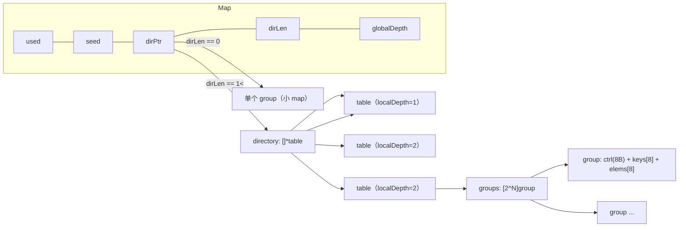
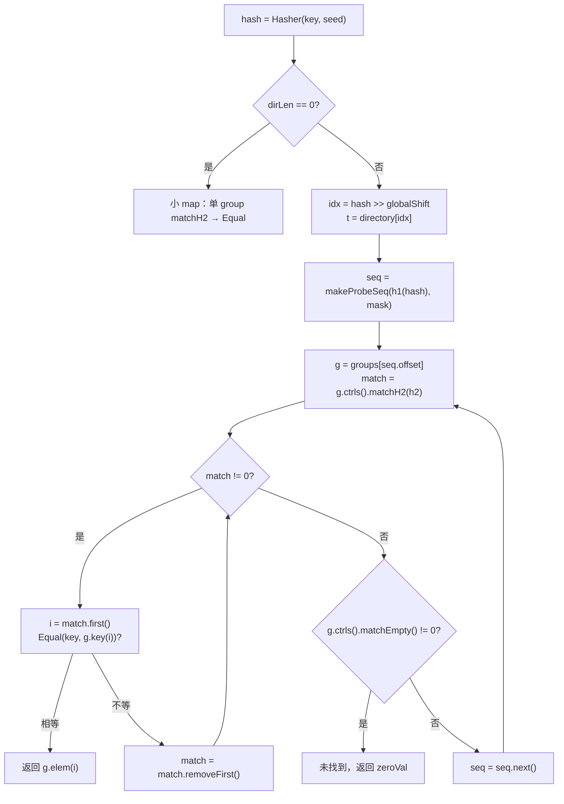
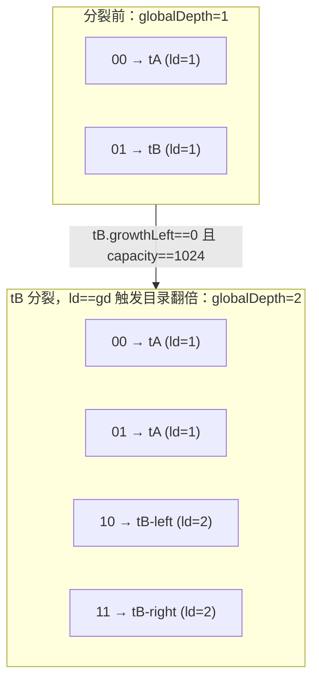
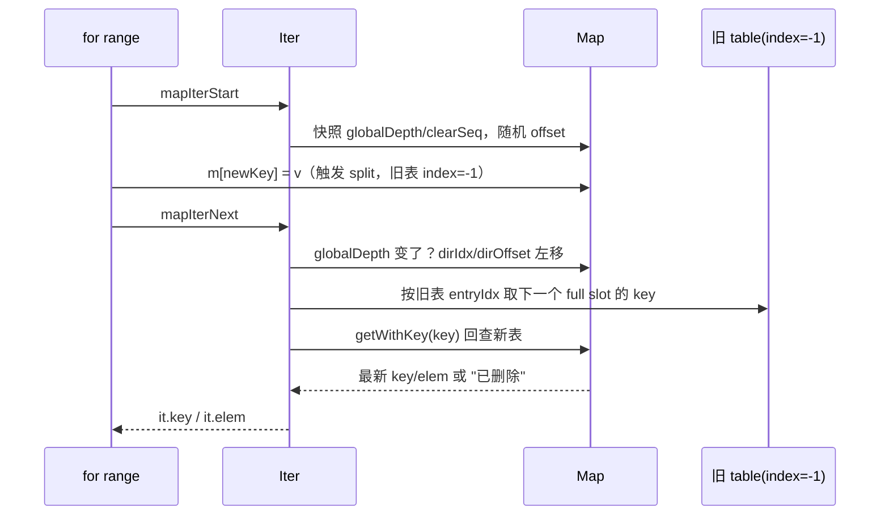

# Go 源码实现详解（十五）：map 与 Swiss Table

## 引言：先说结论

在本文核对的源码快照（golang/go master，提交 fdcd66b，Go 1.28 开发版）上，Go 内置 map 的实现可以用几句话概括：

1. **实现只剩一套。** `src/runtime/map.go`、`map_fast32.go`、`map_fast64.go`、`map_faststr.go` 已经退化为几十行到三百行的薄封装，真正的逻辑全部在 `src/internal/runtime/maps` 包里。旧的 bucket + overflow 链实现（Go 1.24 之前的 `hmap`/`bmap`）以及 Go 1.24 引入时用于回退的 `GOEXPERIMENT=noswissmap` 开关，在这个仓库里已经完全不存在；`src/internal/goexperiment/flags.go` 中与 map 相关的实验开关只剩一个新的 `MapSplitGroup`，用于切换组内 key/elem 的排布方式（默认开启）。
2. **类型名已回归。** 编译器和运行时之间共享的类型是 `internal/abi.MapType`（不再叫 `SwissMapType`），编译器侧对应 `cmd/compile/internal/reflectdata/map.go` 里的 `MapType()`、`MapGroupType()`、`MapIterType()`。
3. **数据结构是三层的。** `Map` 持有一个目录（directory），目录里的每一项指向一张 `table`，每张 `table` 是一个完整的 Swiss Table：由若干 **组（group）** 组成，每组 8 个槽（slot）外加一个 8 字节的 **控制字（control word）**。控制字的每个字节记录对应槽是空、已删除还是已占用，占用时还存放哈希低 7 位（H2）。查找时用 SWAR 位运算（AMD64 上则是 `PCMPEQB`/`PMOVMSKB` 内建指令）一次比较 8 个槽。
4. **扩容是增量的。** 单张 table 最多 1024 个槽（`maxTableCapacity`）。table 满了先原地翻倍；到达上限后按哈希最高位 **分裂** 成两张，并用可扩展哈希（extendible hashing）的目录来索引，目录在需要时翻倍。因此一次扩容最多只搬 1024 个槽，而不是整个 map。
5. **迭代是最复杂的部分。** 为了满足 Go 规范"迭代期间可增删、不得重复、删除的不返回、修改的返回新值"的要求，`Iter` 会抓住被替换掉的旧 table 决定"返回哪些 key"，再回到新 table 里查一遍取最新值；目录翻倍时通过左移 `dirIdx`/`dirOffset` 保持位置。
6. **哈希与安全。** 每个 map 一个随机 `seed`；在 x86/arm64 上按长度阈值选择 AES 指令哈希或 wyhash 风格的标量哈希；map 清空或被删空时重置 seed，降低哈希碰撞攻击的可持续性。
7. **并发写检测** 依靠 `Map.writing` 标志的 XOR 翻转，触发 `fatal("concurrent map writes")`；这不是同步机制，只是一个尽力而为的探测器。

下面按结构、探测、增删、扩容、迭代、哈希、编译器接口、并发、性能的顺序展开，所有代码均取自上述提交。

## 一、背景：旧实现去哪了

### 1.1 目录现状

先看事实。`src/runtime/` 下与 map 相关的非测试文件只有四个：`map.go`（319 行）、`map_fast32.go`（53 行）、`map_fast64.go`（54 行）、`map_faststr.go`（42 行）。以前的 `map_swiss.go`、`map_noswiss.go`、`map_fast64_noswiss.go` 等文件都不见了。`src/internal/runtime/maps/` 则包含 `map.go`（919 行）、`table.go`（1374 行）、`group.go`（373 行）、`runtime.go`、`runtime_fast32.go`、`runtime_fast64.go`、`runtime_faststr.go`，以及从 `runtime/alg.go` 迁移过来的哈希实现 `runtime_alg.go`、`runtime_hash64.go`、`memhash_aes*.go`、`memhash_*.s`。

`src/runtime/map_fast64.go` 的全部内容几乎只是 linkname 声明：

```go
// 来源：src/runtime/map_fast64.go
// Functions below pushed from internal/runtime/maps.

//go:linkname mapaccess1_fast64
func mapaccess1_fast64(t *abi.MapType, m *maps.Map, key uint64) unsafe.Pointer

// ...
//go:linkname mapassign_fast64
func mapassign_fast64(t *abi.MapType, m *maps.Map, key uint64) unsafe.Pointer

//go:linkname mapdelete_fast64
func mapdelete_fast64(t *abi.MapType, m *maps.Map, key uint64)
```

"pushed from" 的含义是：函数体在 `internal/runtime/maps` 里定义并通过 `//go:linkname runtime_mapaccess1_fast64 runtime.mapaccess1_fast64` 推送到 runtime 包的符号上，这样编译器生成的 `runtime.mapaccess1_fast64` 调用可以直接落到实现上，省掉一层转发。`src/runtime/map.go` 保留下来的是 `makemap`、`makemap_small`、`mapdelete`、`mapclear`、`mapIterStart`/`mapIterNext` 以及 reflect 用的 `reflect_*` 桩，它们都是对 `maps.Map` 方法的直接调用。

### 1.2 实验开关的变化

`src/internal/goexperiment/flags.go` 中已经没有 `SwissMap` 字段；grep 整个 `src/` 与 `doc/`，除了两处注释与 `hexdump.go` 里"Swiss-army knife"这种无关字样，"swiss" 一词只剩 `maps/map.go`、`maps/table.go` 顶部的设计说明。取而代之的是：

```go
// 来源：src/internal/goexperiment/flags.go
	// MapSplitGroup changes the internal representation of map groups
	// from interleaved key/elem slots (KVKVKVKV) to split key and elem
	// arrays (KKKKVVVV).
	MapSplitGroup bool
```

`src/internal/buildcfg/exp.go` 的 baseline 中 `MapSplitGroup: true`，即默认启用；`GOEXPERIMENT=nomapsplitgroup` 可以切回交错布局。这个开关只影响组内内存布局，不影响算法。

历史脉络可以简述为：Go 1.24 引入 Swiss Table 并默认开启，同时保留旧实现供 `GOEXPERIMENT=noswissmap` 回退；此后旧实现被删除，`abi.SwissMapType` 改回 `abi.MapType`，`map_swiss.go` 改回 `map.go`。本文不讨论旧实现，只在最后一节对比二者的性能特征。

### 1.3 设计注释精读

`src/internal/runtime/maps/map.go` 顶部约 180 行的注释是理解全局的最佳入口，这里按段转述其要点：

**术语。** slot 是一个 key/elem 存储位；group 是 `abi.MapGroupSlots`（8）个 slot 加一个控制字；控制字 8 字节，每字节表示对应 slot 是 empty/deleted/full，full 时低 7 位存哈希的 H2；H1 是哈希的高 57 位，H2 是低 7 位；table 是一张完整的 Swiss Table；Map 由零到多张 table 组成，哈希的高位决定 key 属于哪张 table；directory 是 table 指针数组。

**核心思想。** 本质上仍是开放寻址：存储是一个 group 数组，用哈希决定初始 group，冲突时按探测序列走到下一个 group。与传统线性探测逐个比对 slot 不同，Swiss Table 用控制字一次并行检查 8 个 slot，相当于一步完成 8 次探测。只用 7 位哈希做过滤，每个 slot 有 1/128 的误报率，但反正命中后仍要做完整的 key 比较，所以无妨。

**探测。** 用 H1 作为 group 数组的起始下标，二次探测直到找到匹配或找到含 empty slot 的 group。两条不变量：group 数必须是 2 的幂；探测序列的终点必须是含 empty slot 的 group（表永远不能 100% 满）。

**删除。** 探测在遇到含 empty slot 的 group 时停止，因此从一个全满 group 里删除时不能直接置 empty，否则后续探测会提前终止；必须放 tombstone（deleted）。如果该 group 仍有 empty slot，就不需要 tombstone。插入优先复用 tombstone。tombstone 只在扩容时彻底清除，因为原地清理会与迭代冲突。

**增长。** 探测序列依赖 group 数，所以 group 数改变时所有 slot 都要重排——一张表必须整体扩容。为了支持增量扩容，map 把内容拆到多张 table 上，每张 table 只服务哈希空间的一个子集；单张 table 的最大容量限制了一次扩容的规模。map 从一张 table 开始，容量不超过 `maxTableCapacity` 时直接换成容量翻倍的新表；超过后分裂成两张。

**可扩展哈希。** 用哈希最高若干位作为目录下标，位数随 table 数增加而增加。`Map.globalDepth` 是当前使用的位数，目录大小为 `1 << globalDepth`。由于每张 table 独立增长，目录中多个下标可能指向同一张 table；table 记录自己创建时的深度 `localDepth`，只有当 `localDepth == globalDepth` 的 table 分裂时才需要扩大目录。注释给出的例子：

```text
directory (globalDepth=2)
+----+
| 00 | --\
+----+    +--> table (localDepth=1)
| 01 | --/
+----+
| 10 | ------> table (localDepth=2)
+----+
| 11 | ------> table (localDepth=2)
+----+
```

**迭代。** 规范要求：(1) 迭代期间增删不得导致同一条目返回两次；(2) 新增条目可以返回也可以不返回；(3) 修改过的条目必须返回最新值；(4) 删除的条目不得返回；(5) 顺序未定义（实现里刻意随机化）。若 map 不增长，遍历目录、table、group、slot 即可。若增长，有三种情况：(a) table 被单张更大的表替换；(b) table 分裂成两张；(c) 目录扩大。对 (a)(b)，迭代器保留对旧 table 的引用，继续用旧表决定 key 的顺序（保证 (1)），只加到新表的条目被跳过（(2) 允许），但为了满足 (3)(4)，每个 key 都要回到新表查一遍。对 (b)，遍历完旧表后要跳过目录里紧随其后的另一半。对 (c)，目录翻倍时下标翻倍即可。

**指针哈希。** 指针 key 按其 uintptr 值哈希，而栈对象的地址在栈复制时会变，所以所有写入 map 的 key 的指针目标都必须逃逸；查找时不必，因为指向栈的指针不可能已经在 map 里。

## 二、数据结构

### 2.1 Map：目录的持有者

```go
// 来源：src/internal/runtime/maps/map.go  type Map
type Map struct {
	// Must be first (known by the compiler, for len() builtin).
	used uint64
	// seed is the hash seed, computed as a unique random number per map.
	seed uintptr
	// dirPtr *[dirLen]*table   （正常情况）
	// dirPtr *group            （小 map：dirLen == 0）
	dirPtr unsafe.Pointer
	dirLen int
	// The number of bits to use in table directory lookups.
	globalDepth uint8
	// On 64-bit systems, this is 64 - globalDepth.
	globalShift uint8
	// writing is a flag that is toggled (XOR 1) while the map is being written.
	writing uint8
	// tombstonePossible is false if we know that no table in this map
	// contains a tombstone.
	tombstonePossible bool
	// clearSeq is a sequence counter of calls to Clear.
	clearSeq uint64
}
```

几点值得注意：

- `used` 必须是第一个字段，编译器把 `len(m)` 直接编译成读取 `*(*uint64)(m)`。
- `dirPtr` 是双义的：`dirLen > 0` 时指向 `*table` 数组；`dirLen == 0` 且非 nil 时直接指向一个 group，这就是"小 map 优化"。
- `tombstonePossible` 是本快照里较新的字段，`Delete` 在 table 报告放置了 tombstone 时置 true，`Clear` 用它决定"used == 0 时是否还需要真的清理"。
- `globalShift` 在 64 位平台上是 `64 - globalDepth`（Wasm 和 32 位平台用 32 位哈希，见 `depthToShift`），目录下标计算为 `hash >> globalShift`。

编译器侧 `reflectdata.MapType()` 用完全相同的字段序列构造该类型，并断言其大小在 64 位平台上是 48 字节，任何一侧改动都会立刻在编译器里 `Fatalf`。

### 2.2 table：一张完整的 Swiss Table

```go
// 来源：src/internal/runtime/maps/table.go  type table
const maxTableCapacity = 1024

type table struct {
	used uint16
	// The total number of slots (always 2^N).
	capacity uint16
	// We rehash when used + tombstones > loadFactor*capacity, including
	// tombstones so the table doesn't overfill with tombstones. This field
	// counts down remaining empty slots before the next rehash.
	growthLeft uint16
	// The number of bits used by directory lookups above this table.
	localDepth uint8
	// Index of this table in the Map directory. ... index is -1 if the
	// table is stale (no longer installed in the directory).
	index int
	groups groupsReference
}
```

`maxTableCapacity = 1024` 是核实过的常量，注释坦率地写着"Completely made up value"，并且用 `var _ = uint16(maxTableCapacity)` 保证它能放进 `uint16`——这也是为什么 `used`/`capacity`/`growthLeft` 都能用 16 位。`index == -1` 是"陈旧表"的标记，迭代器靠它判断当前表是否已被替换。`groupsReference` 只有两个字段：`data`（group 数组首地址）和 `lengthMask`（group 数减一，用于按位与取模）。

`growthLeft` 的初值由 `maxGrowthLeft` 决定：

```go
// 来源：src/internal/runtime/maps/table.go  func (t *table) maxGrowthLeft
	} else if t.capacity <= abi.MapGroupSlots {
		// If the map fits in a single group then we're able to fill all of
		// the slots except 1 (an empty slot is needed to terminate find
		// operations).
		return t.capacity - 1
	} else {
		// ...
		return (t.capacity * maxAvgGroupLoad) / abi.MapGroupSlots
	}
```

`maxAvgGroupLoad = 7`，即负载因子 7/8。`group.go` 的注释指出 Abseil 也是 7/8，但 Abseil 一组 16 槽，平均能留两个空位，Go 只留一个，"可能需要重新评估"。

### 2.3 group、控制字节与 H1/H2

```go
// 来源：src/internal/runtime/maps/group.go
const (
	ctrlEmpty   ctrl = 0b10000000
	ctrlDeleted ctrl = 0b11111110

	bitsetLSB   = 0x0101010101010101
	bitsetMSB   = 0x8080808080808080
	bitsetL7B   = 0x7f7f7f7f7f7f7f7f
	bitsetEmpty = bitsetLSB * uint64(ctrlEmpty)
)

// Each slot in the hash table has a control byte which can have one of three
// states: empty, deleted, and full. They have the following bit patterns:
//
//	  empty: 1 0 0 0 0 0 0 0
//	deleted: 1 1 1 1 1 1 1 0
//	   full: 0 h h h h h h h  // h represents the H2 hash bits
type ctrl uint8

// ctrlGroup is a fixed size array of abi.MapGroupSlots control bytes
// stored in a uint64.
type ctrlGroup uint64
```

编码的设计非常精巧：最高位为 1 表示"不可用"（empty 或 deleted），为 0 表示 full 且低 7 位是 H2。empty 与 deleted 的区别在低位：empty 除最高位外全 0，deleted 除最低位外全 1。这样"是否 empty"可以用"bit7 为 1 且 bit1 为 0"判断，"是否 empty 或 deleted"只看 bit7，"是否 full"看 bit7 是否为 0。

H1/H2 的拆分：

```go
// 来源：src/internal/runtime/maps/map.go
// Extracts the H1 portion of a hash: the 57 upper bits.
func h1(h uintptr) uintptr {
	return h >> 7
}

// Extracts the H2 portion of a hash: the 7 bits not used for h1.
func h2(h uintptr) uintptr {
	return h & 0x7f
}
```

H1 决定起始 group（`h1 & lengthMask`），H2 存入控制字节做 tag。注意目录选择用的是哈希的**最高**几位（`hash >> globalShift`），H1 用的是去掉低 7 位后的部分再对 group 数取模，也就是哈希的**低段**；三者互不干扰。

`abi.MapCtrlEmpty` 是全 empty 的控制字常量（`0x8080808080808080`），编译器在栈上分配小 map 的 group 时直接用它初始化控制字。

### 2.4 slot 布局：交错还是分离

`groupReference` 的注释给出了两种布局：

```go
// 来源：src/internal/runtime/maps/group.go  type groupReference
	// With mapsplitgroup (split arrays):
	// type group struct {
	// 	ctrls ctrlGroup
	// 	keys  [abi.MapGroupSlots]typ.Key
	// 	elems [abi.MapGroupSlots]typ.Elem
	// }
	//
	// Without (interleaved slots):
	// type group struct {
	// 	ctrls ctrlGroup
	// 	slots [abi.MapGroupSlots]struct {
	// 		key  typ.Key
	// 		elem typ.Elem
	// 	}
	// }
	data unsafe.Pointer // data *typ.Group
```

无论哪种布局，运行时访问 key/elem 的公式都是统一的：

```go
// 来源：src/internal/runtime/maps/group.go
func (g *groupReference) key(typ *abi.MapType, i uintptr) unsafe.Pointer {
	offset := typ.KeysOff + i*typ.KeyStride
	return unsafe.Pointer(uintptr(g.data) + offset)
}

func (g *groupReference) elem(typ *abi.MapType, i uintptr) unsafe.Pointer {
	offset := typ.ElemsOff + i*typ.ElemStride
	return unsafe.Pointer(uintptr(g.data) + offset)
}
```

四个偏移量由编译器写进 `abi.MapType`：

```go
// 来源：src/internal/abi/map.go  type MapType
type MapType struct {
	Type
	Key   *Type
	Elem  *Type
	Group *Type // internal type representing a slot group
	Hasher    func(unsafe.Pointer, uintptr) uintptr
	GroupSize uintptr // == Group.Size_
	// With GOEXPERIMENT=mapsplitgroup (split arrays KKKKVVVV):
	//   KeysOff = offset of keys array, KeyStride = size of a single key
	//   ElemsOff = offset of elems array, ElemStride = size of a single elem
	// Without (interleaved slots KVKVKVKV):
	//   KeyStride = ElemStride = size of a key/elem slot
	KeysOff    uintptr
	KeyStride  uintptr
	ElemsOff   uintptr
	ElemStride uintptr
	ElemOff    uintptr // GOEXPERIMENT=nomapsplitgroup only
	Flags      uint32
}
```

`Flags` 的四个位：`MapNeedKeyUpdate`（覆盖时需要更新 key，如含 NaN/±0 的浮点或 interface）、`MapHashMightPanic`（interface key 可能不可哈希）、`MapIndirectKey`、`MapIndirectElem`。后两者对应 `abi.MapMaxKeyBytes = 128`、`MapMaxElemBytes = 128`：key 或 elem 超过 128 字节时 slot 里只存指针，值单独 `newobject` 分配。

分离布局（KKKKVVVV）的好处是：只比较 key 的探测过程中，8 个 key 连续排布，缓存行利用率更高；`runtime_fast64.go` 里小 map 路径直接用 `keyStride = 8` 做步进就是这个原因。代价是命中后取 elem 要跳一次。

### 2.5 小 map 与栈上分配

`NewMap` 在 `hint <= 8` 时什么都不分配：

```go
// 来源：src/internal/runtime/maps/map.go  func NewMap
	if hint <= abi.MapGroupSlots {
		// A small map can fill all 8 slots, so no need to increase
		// target capacity.
		// ...
		// Note that the compiler may have initialized m.dirPtr with a
		// pointer to a stack-allocated group, in which case we already
		// have a group. The control word is already initialized.
		return m
	}
```

编译器在 `cmd/compile/internal/walk/builtin.go` 的 `walkMakeMap` 中，如果 map 不逃逸，会用 `stackTempAddr` 在栈上放一个 `reflectdata.MapType()` 结构；如果 hint 是编译期常量且 ≤ 8，再在栈上放一个 `reflectdata.MapGroupType(t)` 的 group，把 `g.ctrl = abi.MapCtrlEmpty`、`m.dirPtr = &g` 编进代码。于是"小 map 放栈上"不需要 runtime 参与。

小 map 的所有操作都只看一个 group，没有探测序列，因此可以填满 8 个槽（不需要留 empty 终止位），也不需要 tombstone——`deleteSmall` 直接把控制字节置回 `ctrlEmpty`。第 9 个元素插入时 `putSlotSmall` 返回 nil，`growToTable` 建一张容量 16 的 table，把 8 个元素重新哈希放进去，目录长度变为 1。

三层结构的关系可以画成：



## 三、探测：SWAR 位技巧与二次探测

### 3.1 bitset 的两种表示

`bitset` 是 `uint64`，但在不同平台上含义不同：

```go
// 来源：src/internal/runtime/maps/group.go  type bitset
// On AMD64, bitset uses one bit per slot, where the bit is set if the slot is
// part of the set. All of the ctrlGroup.match* methods are replaced with
// intrinsics that return this packed representation.
//
// On other architectures, bitset uses one byte per slot, where each byte is
// either 0x80 if the slot is part of the set or 0x00 otherwise.
type bitset uint64

func bitsetFirst(b bitset) uintptr {
	return uintptr(sys.TrailingZeros64(uint64(b))) >> 3
}

func (b bitset) removeFirst() bitset {
	return b & (b - 1)
}
```

可移植版每个 slot 占一个字节，只用该字节的最高位；`first()` 数尾随零再除以 8 就得到 slot 下标；`removeFirst` 清掉最低的置位比特。AMD64 上编译器用内建指令把 `bitsetFirst` 直接替换为 `TrailingZeros64`（不再右移 3），因为 SIMD 版本返回的是紧凑的 8 位掩码。

### 3.2 matchH2：一次比较 8 个字节

```go
// 来源：src/internal/runtime/maps/group.go  func ctrlGroupMatchH2
func ctrlGroupMatchH2(g ctrlGroup, h uintptr) bitset {
	v := uint64(g) ^ (bitsetLSB * uint64(h))
	if goarch.IsArm64 == 1 {
		v = ^v
		return bitset((v&bitsetL7B + bitsetLSB) & (v & bitsetMSB))
	}
	// NB: This generic matching routine produces false positive matches when
	// h is 2^N and the control bytes have a seq of 2^N followed by 2^N+1. ...
	// The false positive matches are not a problem, just a rare inefficiency.
	// Note that they only occur if there is a real match and never occur on
	// ctrlEmpty, or ctrlDeleted.
	return bitset(((v - bitsetLSB) &^ v) & bitsetMSB)
}
```

步骤拆解：`bitsetLSB * h` 把 7 位的 h 广播到 8 个字节；与控制字异或后，等于 h 的字节变为 0；`(v - LSB) &^ v & MSB` 是经典的"字中零字节检测"（haszero）技巧——只有值为 0 的字节在减 1 后会借位把最高位翻成 1 且原最高位是 0。由于 full 字节最高位为 0 而 h < 128，empty/deleted 字节（最高位为 1）永远不会匹配。注释诚实地写出了这个技巧的已知误报场景（相邻字节形成 2^N、2^N+1 序列时低位借位传递），但误报只导致多一次 key 比较，不影响正确性。arm64 走另一条无借位传递的公式。

### 3.3 matchEmpty / matchEmptyOrDeleted / matchFull

```go
// 来源：src/internal/runtime/maps/group.go
func ctrlGroupMatchEmpty(g ctrlGroup) bitset {
	// A slot is empty iff bit 7 is set and bit 1 is not.
	v := uint64(g)
	return bitset((v &^ (v << 6)) & bitsetMSB)
}

func ctrlGroupMatchEmptyOrDeleted(g ctrlGroup) bitset {
	// A slot is empty or deleted iff bit 7 is set.
	v := uint64(g)
	return bitset(v & bitsetMSB)
}

func ctrlGroupMatchFull(g ctrlGroup) bitset {
	// A slot is full iff bit 7 is unset.
	v := uint64(g)
	return bitset(^v & bitsetMSB)
}
```

`v << 6` 把每字节的 bit1 移到 bit7 的位置，`&^` 后只有"bit7 为 1 且 bit1 为 0"的字节保留最高位，正是 empty 的编码（deleted 的 bit1 为 1）。这三个函数各只需 2～3 条标量指令，这是 8 字节控制字（而非 Abseil 的 16 字节）带来的好处：无需 SIMD 也能高效。

### 3.4 AMD64 内建指令

`src/cmd/compile/internal/ssagen/intrinsics.go` 的 `/******** internal/runtime/maps ********/` 段把上述函数在 AMD64 上替换为 SSE 指令序列。以 `ctrlGroupMatchH2` 为例：

```go
// 来源：src/cmd/compile/internal/ssagen/intrinsics.go  addF("internal/runtime/maps", "ctrlGroupMatchH2", ...)
			// Broadcast h2 into each byte of a word.
			if buildcfg.GOAMD64 >= 4 {
				broadcast = s.newValue1(ssaop.OpAMD64VPBROADCASTB, types.TypeInt128, h)
			} else if buildcfg.GOAMD64 >= 2 {
				broadcast = s.newValue1(ssaop.OpAMD64PSHUFBbroadcast, types.TypeInt128, hfp)
			} else {
				unpack := s.newValue2(ssaop.OpAMD64PUNPCKLBW, types.TypeInt128, hfp, hfp)
				broadcast = s.newValue1I(ssaop.OpAMD64PSHUFLW, types.TypeInt128, 0, unpack)
			}
			// Compare each byte of the control word with h2.
			eq := s.newValue2(ssaop.OpAMD64PCMPEQB, types.TypeInt128, broadcast, gfp)
			// Construct a "byte mask": each output bit is equal to
			// the sign bit each input byte.
			out := s.newValue1(ssaop.OpAMD64PMOVMSKB, types.Types[types.TUINT8], eq)
			ret := s.newValue1(ssaop.OpZeroExt8to64, types.Types[types.TUINT64], out)
```

`PCMPEQB` 逐字节比较，`PMOVMSKB` 提取每字节的符号位成 8 位掩码——这就是 bitset 在 AMD64 上是"紧凑一位一槽"的原因。注释还解释了 `VPBROADCASTB` 比 `PSHUFB` 少一条指令（输入可来自通用寄存器），以及为什么广播用 0 控制掩码可以复用 ABI 约定的零寄存器 X15。因为 bitset 的表示变了，`bitsetFirst`、`bitsetRemoveBelow`、`bitsetLowestSet`、`bitsetShiftOutLowest` 也都被一并替换成紧凑版本。

### 3.5 probeSeq：三角数二次探测

```go
// 来源：src/internal/runtime/maps/table.go  type probeSeq
// The sequence is a triangular progression of the form
// hash, hash + 1, hash + 1 + 2, hash + 1 + 2 + 3, ..., modulo mask + 1.
//
//	p(i) := hash + (i^2 + i)/2 (mod mask+1)
//
// It turns out that this probe sequence visits every group exactly once if
// the number of groups is a power of two, since (i^2+i)/2 is a bijection in
// Z/(2^m).
type probeSeq struct {
	mask   uint64
	offset uint64
	index  uint64
}

func makeProbeSeq(hash uintptr, mask uint64) probeSeq {
	return probeSeq{mask: mask, offset: uint64(hash) & mask, index: 0}
}

func (s probeSeq) next() probeSeq {
	s.index++
	s.offset = (s.offset + s.index) & s.mask
	return s
}
```

探测单位是 group 而不是 slot。三角数序列在模 2^m 下是双射，保证不会漏掉任何 group；再结合"表永不全满"的不变量，探测一定会终止。

### 3.6 完整的查找路径

编译器对普通 key 类型生成的 `mapaccess2` 调用直接落到 `runtime_mapaccess2`，它把 `Map.getWithoutKey` 和 `table.getWithoutKey` 手工内联在一起（`mapaccess1_inline_test.go` 用 `-gcflags=-m` 检查 `runtime_mapaccess2*` 全部被内联）：

```go
// 来源：src/internal/runtime/maps/runtime.go  func runtime_mapaccess2
	if m == nil || m.Used() == 0 {
		if err := mapKeyError(typ, key); err != nil {
			panic(err) // see issue 23734
		}
		return unsafe.Pointer(&zeroVal[0]), false
	}
	if m.writing != 0 {
		fatal("concurrent map read and map write")
	}
	hash := typ.Hasher(key, m.seed)
	// ... m.dirLen == 0 时走 m.getWithKeySmall
	idx := m.directoryIndex(hash)
	t := m.directoryAt(idx)
	seq := makeProbeSeq(h1(hash), t.groups.lengthMask)
	h2Hash := h2(hash)
	for ; ; seq = seq.next() {
		g := t.groups.group(typ, seq.offset)
		match := g.ctrls().matchH2(h2Hash)
		for match != 0 {
			i := match.first()
			slotKey := g.key(typ, i)
			// ... IndirectKey 解引用；typ.Key.Equal(key, slotKey) 命中则返回 elem
			match = match.removeFirst()
		}
		if g.ctrls().matchEmpty() != 0 {
			return unsafe.Pointer(&zeroVal[0]), false
		}
	}
```

空 map 的 key 仍会检查 `mapKeyError`——interface key 里装着不可哈希类型时必须 panic（issue 23734），即使 map 为空。查找失败返回 `zeroVal` 的地址而不是 nil，这样 `v := m[k]` 可以无条件解引用。

`table.getWithKey` 的注释给出了误报率的估算：设探测路径上有 k 个"错误对象"，H2 误匹配的期望是 k/128；实测高负载下 k < 32，因此每次查找平均不到 1/8 次多余的 key 比较。



## 四、插入与删除

### 4.1 Map.PutSlot：从小 map 到 table

`Map.Put` 只是 `PutSlot` 加一次 `typedmemmove`；编译器生成的 `m[k] = v` 走的是 `runtime_mapassign`，返回 elem 槽指针后由编译器直接写值。`PutSlot` 的骨架：

```go
// 来源：src/internal/runtime/maps/map.go  func (m *Map) PutSlot
	if m.writing != 0 {
		fatal("concurrent map writes")
	}
	hash := typ.Hasher(key, m.seed)
	// Set writing after calling Hasher, since Hasher may panic, in which
	// case we have not actually done a write.
	m.writing ^= 1 // toggle, see comment on writing
	if m.dirPtr == nil {
		m.growToSmall(typ)
	}
	if m.dirLen == 0 {
		elem := m.putSlotSmall(typ, hash, key)
		if elem == nil {
			// Can't fit another entry, grow to full size map.
			tab := m.growToTable(typ)
			elem = tab.uncheckedPutSlotForAssign(typ, hash, key)
			m.used++
		}
		// ... 复位 writing 并返回
	}
	for {
		idx := m.directoryIndex(hash)
		elem, ok := m.directoryAt(idx).PutSlot(typ, m, hash, key)
		if !ok {
			continue
		}
		// ...
		return elem
	}
```

`writing` 在哈希之后才置位：`Hasher` 可能因不可哈希的 interface key 而 panic，如果那时 `writing` 已经是 1，后续任何访问都会误报并发写。最后的 `for` 循环处理"table 在 `PutSlot` 中被替换/分裂"的情况：`table.PutSlot` 返回 `ok == false` 表示自己已经陈旧，`Map` 重新走一次目录选表。

`growToSmall` 分配一个 group 并置全 empty；`growToTable` 建一张容量 `2*8 = 16` 的表，把 group 中的 8 个元素重新哈希写入（用 `uncheckedPutSlot`，因为已知不存在重复），然后建长度为 1 的目录，`globalDepth = 0`。

### 4.2 table.PutSlot：找已有、记 tombstone、看 growthLeft

```go
// 来源：src/internal/runtime/maps/table.go  func (t *table) PutSlot
	var firstDeletedGroup groupReference
	var firstDeletedSlot uintptr
	for ; ; seq = seq.next() {
		g := t.groups.group(typ, seq.offset)
		// ... matchH2 + Equal 查找已有 key：命中则（NeedKeyUpdate 时覆盖 key）返回 elem
		match = g.ctrls().matchEmptyOrDeleted()
		if match == 0 {
			continue // nothing but filled slots. Keep probing.
		}
		i := match.first()
		if g.ctrls().get(i) == ctrlDeleted {
			// There are some deleted slots. Remember the first one, and keep probing.
			if firstDeletedGroup.data == nil {
				firstDeletedGroup = g
				firstDeletedSlot = i
			}
			continue
		}
		// We've found an empty slot, which means we've reached the end of
		// the probe sequence.
		if firstDeletedGroup.data != nil {
			g, i = firstDeletedGroup, firstDeletedSlot
			t.growthLeft++ // will be decremented below to become a no-op.
		}
		// If we have no space left, first try to remove some tombstones.
		if t.growthLeft == 0 {
			t.pruneTombstones(typ, m)
		}
		if t.growthLeft > 0 {
			// ... 写 key/elem，g.ctrls().set(i, ctrl(h2Hash))，growthLeft--，used++
			return slotElem, true
		}
		t.rehash(typ, m)
		return nil, false
	}
```

三个要点：

1. **必须探测到 empty 才能确认 key 不存在。** 即便早已遇到 tombstone，也要继续走完探测序列，因为 key 可能在更后面。
2. **复用 tombstone 不消耗 `growthLeft`。** `growthLeft` 的语义是"还能填多少个 empty 槽"，tombstone 已经计入占用，所以先 `++` 再统一 `--` 抵消。
3. **`growthLeft == 0` 时先尝试 `pruneTombstones`，再 `rehash`。** 这是本快照与早期 Swiss 实现的一个差异：早期只有 rehash。

`pruneTombstones` 不是 Abseil 意义上的 rehash-in-place（`rehash` 的注释说明了原因：原地重排 slot 会破坏"按下标顺序遍历"的迭代器），而是一个保守的、只删不移的清理：

```go
// 来源：src/internal/runtime/maps/table.go  func (t *table) pruneTombstones
	if t.tombstones()*10 < t.capacity { // 10% of capacity
		return // Not enough tombstones to be worth the effort.
	}
	// Bit set marking all the groups whose tombstones are needed.
	var needed [(maxTableCapacity/abi.MapGroupSlots + 31) / 32]uint32
	// Trace the probe sequence of every full entry.
	// ... 对每个 full slot 重算 hash，沿探测序列走到它所在 group 之前，
	//     途中遇到含 empty/deleted 的 group 就标记为 needed
	// ... 统计未被标记 group 中的 tombstone 数 cnt
	if cnt*10 < int(t.capacity) { // Can we restore 10% of capacity?
		return // don't bother removing tombstones. Caller will grow instead.
	}
	// Prune unneeded tombstones. ... set(k, ctrlEmpty); t.growthLeft++
```

思路是：一个 tombstone 只有在"某个已有 key 的探测序列必须穿过它所在的 group"时才是必要的；把所有 key 的探测路径走一遍，标记出这些 group，其余 group 里的 tombstone 都可以安全地变回 empty。整个过程 O(n)，所以有两道 10% 的门槛，保证只在能回收足够容量时才做。注释里特别处理了"与自身不相等的 key"（NaN）：这类 key 永远不会被查找命中，可以随意打断其探测序列。

`tombstones()` 的计算方式也说明了 `growthLeft` 的会计规则：`容量*7/8 - used - growthLeft`。

顺带一提，通用路径 `runtime_mapassign`（`runtime.go`）是 `table.PutSlot` 的手工内联版本，但对照源码可见它在 `growthLeft == 0` 时直接 `t.rehash`，并未调用 `pruneTombstones`；而 `runtime_fast32/64/faststr` 的 assign 路径以及 `table.PutSlot` 都调用了。这属于实现细节上的不一致，不影响语义。

### 4.3 Delete：墓碑，还是直接置空

```go
// 来源：src/internal/runtime/maps/table.go  func (t *table) Delete
			if typ.Key.Equal(key, slotKey) {
				t.used--
				m.used--
				if typ.IndirectKey() {
					*(*unsafe.Pointer)(origSlotKey) = nil
				} else if typ.Key.Pointers() {
					typedmemclr(typ.Key, slotKey)
				}
				// ... elem 总是清零（issue 25936：m[k] += 1 依赖删除后为零值）
				// Only a full group can appear in the middle of a probe
				// sequence (a group with at least one empty slot terminates
				// probing). Once a group becomes full, it stays full until
				// rehashing/resizing. So if the group isn't full now, we can
				// simply remove the element. Otherwise, we create a tombstone.
				var tombstone bool
				if g.ctrls().matchEmpty() != 0 {
					g.ctrls().set(i, ctrlEmpty)
					t.growthLeft++
				} else {
					g.ctrls().set(i, ctrlDeleted)
					tombstone = true
				}
				return tombstone
			}
```

"组内仍有 empty 就直接置 empty"的优化建立在一个不变量上：一旦某个 group 全满，它在整个 table 生命周期内都保持"全满或含 tombstone"，不会重新出现 empty；反过来，一个当前含 empty 的 group 从未全满过，因此没有任何探测序列会穿过它，直接置 empty 不会截断别人的探测。`growthLeft` 的会计也随之不同：置 empty 时 `growthLeft++`，置 tombstone 时不变，因为 tombstone 仍占据负载配额，直到 `pruneTombstones` 或 `rehash` 才归还。

`Map.Delete` 外层还做了两件事：把返回值记入 `tombstonePossible`；当 `used` 降到 0 时重置 `seed`（见第七节）。

### 4.4 Clear 与 clearSeq

```go
// 来源：src/internal/runtime/maps/map.go  func (m *Map) Clear
	if m == nil || m.Used() == 0 && !m.tombstonePossible {
		return
	}
	// ... writing 检查
	if m.dirLen == 0 {
		m.clearSmall(typ)
	} else {
		var lastTab *table
		for i := range m.dirLen {
			t := m.directoryAt(uintptr(i))
			if t == lastTab {
				continue
			}
			t.Clear(typ)
			lastTab = t
		}
		m.used = 0
		m.tombstonePossible = false
		// TODO: shrink directory?
	}
	m.clearSeq++
	m.seed = uintptr(rand())
```

`Clear` 不释放任何 table，只把每张表的 group 清零并重置 `growthLeft`；目录也不收缩（注释留了 TODO）。`table.Clear` 里有一段关于"逐组测试是否有 full 再决定清零"的启发式，专门提到 issue 75097：当 group 一半空一半满时，测试反而拖累分支预测，所以只在 ≥3/4 的 group 为空或 slot 很大时才逐组测试。`clearSeq` 递增供迭代器识别"迭代期间发生过 Clear"。

## 五、扩容与目录：可扩展哈希

### 5.1 rehash 的两条路

```go
// 来源：src/internal/runtime/maps/table.go  func (t *table) rehash
	newCapacity := 2 * t.capacity
	if newCapacity <= maxTableCapacity {
		t.grow(typ, m, newCapacity)
		return
	}
	t.split(typ, m)
```

容量 16 → 32 → … → 1024 都是 `grow`：新建一张同 `index`、同 `localDepth` 但容量翻倍的表，遍历旧表所有 full slot 重新哈希 `uncheckedPutSlot` 进去，然后 `m.replaceTable(newTable)` 把目录里所有指向旧表的项换成新表，最后 `t.index = -1` 标记旧表陈旧。1024 再翻倍就超过上限，改走 `split`。

### 5.2 split：按 localDepth 位一分为二

```go
// 来源：src/internal/runtime/maps/table.go  func (t *table) split
	localDepth := t.localDepth
	localDepth++
	left := newTable(typ, maxTableCapacity, -1, localDepth)
	right := newTable(typ, maxTableCapacity, -1, localDepth)
	// Split in half at the localDepth bit from the top.
	mask := localDepthMask(localDepth)
	for i := uint64(0); i <= t.groups.lengthMask; i++ {
		g := t.groups.group(typ, i)
		for j := uintptr(0); j < abi.MapGroupSlots; j++ {
			// ... 跳过 empty/deleted，取 key/elem
			hash := typ.Hasher(key, m.seed)
			var newTable *table
			if hash&mask == 0 {
				newTable = left
			} else {
				newTable = right
			}
			newTable.uncheckedPutSlot(typ, hash, key, elem)
		}
	}
	m.installTableSplit(t, left, right)
	t.index = -1
```

`localDepthMask(d)` 在 64 位平台上是 `1 << (64 - d)`，即哈希从高往低数第 d 位。旧表 `localDepth = d-1` 意味着它负责的 key 高 d-1 位相同，用第 d 位就能把它们精确地分成两半。两张新表各自初始容量 1024（注释也标了 TODO），所以分裂后负载立刻减半。

### 5.3 installTableSplit：目录翻倍就在这里

本快照里没有独立的 `growDirectory` 函数，目录翻倍内联在 `installTableSplit` 中：

```go
// 来源：src/internal/runtime/maps/map.go  func (m *Map) installTableSplit
	if old.localDepth == m.globalDepth {
		// No room for another level in the directory. Grow the directory.
		newDir := make([]*table, m.dirLen*2)
		for i := range m.dirLen {
			t := m.directoryAt(uintptr(i))
			newDir[2*i] = t
			newDir[2*i+1] = t
			// t may already exist in multiple indices. We should
			// only update t.index once. ...
			if t.index == i {
				t.index = 2 * i
			}
		}
		m.globalDepth++
		m.globalShift--
		m.dirPtr = unsafe.Pointer(&newDir[0])
		m.dirLen = len(newDir)
	}
	// N.B. left and right may still consume multiple indices if the
	// directory has grown multiple times since old was last split.
	left.index = old.index
	m.replaceTable(left)
	entries := 1 << (m.globalDepth - left.localDepth)
	right.index = left.index + entries
	m.replaceTable(right)
```

翻倍时每个旧项复制成相邻两项（下标 i → 2i、2i+1），这保持了目录的顺序性，迭代器因此只需把自己的下标左移即可。`replaceTable` 根据 `globalDepth - localDepth` 算出一张表在目录里占几个连续项（`1 << 差值`），把它们全部写成新表。



### 5.4 为什么不用单表 rehash

设计注释给了两个理由，源码印证了它们：

- **延迟。** 旧实现的增量扩容是把搬迁工作分摊到后续每次写操作上（`growWork`），代码复杂且每次访问都要判断"正在扩容"。Swiss Table 的探测序列依赖 group 数，无法一边搬一边查，所以干脆限制单表大小：最坏一次搬 1024 个槽，可控且简单。
- **迭代语义。** 单表整体 rehash 会打乱所有槽的顺序，迭代器就必须记录"已经返回过哪些 key"。多表 + 目录的方案让迭代器只需抓住一张旧表；未被替换的表完全不受影响。

代价是多了一次目录间接寻址（`directoryAt`）和目录本身的内存；对于小于 1024×7/8 ≈ 896 个元素的 map，目录始终只有一项，`directoryIndex` 里 `dirLen == 1` 的快速返回消除了移位。

### 5.5 带 hint 的 NewMap

`make(map[K]V, hint)` 且 `hint > 8` 时，`NewMap` 会预先建好目录：

```go
// 来源：src/internal/runtime/maps/map.go  func NewMap
	targetCapacity := (hint * abi.MapGroupSlots) / maxAvgGroupLoad
	// ... 溢出与 groups*GroupSize > maxAlloc 时直接返回空 map
	dirSize := (uint64(targetCapacity) + maxTableCapacity - 1) / maxTableCapacity
	dirSize, overflow := alignUpPow2(dirSize)
	m.globalDepth = uint8(sys.TrailingZeros64(dirSize))
	m.globalShift = depthToShift(m.globalDepth)
	directory := make([]*table, dirSize)
	for i := range directory {
		directory[i] = newTable(mt, uint64(targetCapacity)/dirSize, i, m.globalDepth)
	}
```

目标容量按 7/8 负载反推，再按 1024 切成 2 的幂张表。超大 hint 不会 panic，而是静默退化成空 map 按需增长。

## 六、迭代

### 6.1 Iter 与随机起点

```go
// 来源：src/internal/runtime/maps/table.go  type Iter
type Iter struct {
	key  unsafe.Pointer // Must be in first position.  Write nil to indicate iteration end
	elem unsafe.Pointer // Must be in second position (see cmd/compile/internal/walk/range.go).
	typ  *abi.MapType
	m    *Map
	// Randomize iteration order by starting iteration at a random slot
	// offset. The offset into the directory uses a separate offset, as it
	// must adjust when the directory grows.
	entryOffset uint64
	dirOffset   uint64
	// Snapshot of Map.clearSeq at iteration initialization time.
	clearSeq uint64
	// Value of Map.globalDepth during the last call to Next.
	globalDepth uint8
	// dirIdx is the current directory index, prior to adjustment by dirOffset.
	dirIdx int
	// tab is the table at dirIdx during the previous call to Next.
	tab *table
	group groupReference
	// entryIdx is the current entry index, prior to adjustment by entryOffset.
	// The lower 3 bits of the index are the slot index, and the upper bits
	// are the group index.
	entryIdx uint64
}
```

`Init` 只做快照：`entryOffset = rand()`、`dirOffset = rand()`、`globalDepth`、`clearSeq`；小 map 用 `dirIdx = -1` 作哨兵并直接记住那个 group。编译器的 `walk/range.go` 把 `for k, v := range m` 降级成 `mapIterStart(t, m, &it)` + 循环条件 `it.key != nil` + `mapIterNext(&it)`，key/elem 通过 `Iter` 前两个字段读取，`Iter` 本身由 order pass 放在栈上（`reflectdata.MapIterType()` 断言其大小在 64 位上为 96 字节）。

### 6.2 Next 的主循环

去掉细节后，`Next` 对普通（非小）map 的结构是：

```go
// 来源：src/internal/runtime/maps/table.go  func (it *Iter) Next
	if it.globalDepth != it.m.globalDepth {
		// Directory has grown since the last call to Next. Adjust our directory index.
		orders := it.m.globalDepth - it.globalDepth
		it.dirIdx <<= orders
		it.dirOffset <<= orders
		it.globalDepth = it.m.globalDepth
	}
	for ; it.dirIdx < it.m.dirLen; it.nextDirIdx() {
		if it.tab == nil {
			dirIdx := int((uint64(it.dirIdx) + it.dirOffset) & uint64(it.m.dirLen-1))
			newTab := it.m.directoryAt(uintptr(dirIdx))
			if newTab.index != dirIdx {
				// ... 首次随机落在某张表的中间项：把 dirOffset 回拨到该表的首项
				diff := dirIdx - newTab.index
				it.dirOffset -= uint64(diff)
			}
			it.tab = newTab
		}
		entryMask := uint64(it.tab.capacity) - 1
		if it.entryIdx > entryMask {
			continue // Continue to next table.
		}
		// Fast path: 直接检查 (entryIdx+entryOffset)&entryMask 对应的单个 slot 是否 full
		// Slow path: 用 matchFull 在控制字里跳到下一个 full slot
		// ...
	}
	it.key = nil
	it.elem = nil
```

三处机制值得单独说明。

**目录翻倍的位置修正。** 因为翻倍时目录项 i 变成 2i、2i+1，只要把 `dirIdx` 和 `dirOffset` 都左移 `orders` 位，`(dirIdx + dirOffset) % dirLen` 仍指向同一张（或其分裂后的左半）表。注释给出了代数依据：`A * (B % C) = (A*B) % (A*C)`。

**nextDirIdx 跳过重复项。**

```go
// 来源：src/internal/runtime/maps/table.go  func (it *Iter) nextDirIdx
	// If dirIdx is 0 and it.tab is t1, then we should skip past
	// entry 1 to avoid repeating t1.
	//
	// If dirIdx is 2 and it.tab is t2 (pre-split), then we should
	// skip past entry 3 because our pre-split t2 already covers
	// all keys from t2a and t2b (except for new insertions, which
	// iteration need not return).
	entries := 1 << (it.m.globalDepth - it.tab.localDepth)
	it.dirIdx += entries
	it.tab = nil
	it.group = groupReference{}
	it.entryIdx = 0
```

用 `it.tab.localDepth`（旧表的）而不是目录当前项的深度来算跨度，正是设计注释里"用旧表的 localDepth 决定下一个逻辑下标"的落实。

**陈旧表的回查。** `grown := it.tab.index == -1` 检测当前表是否已被 `grow`/`split` 替换。若是，用旧表选出 key 后调用 `grownKeyElem`：

```go
// 来源：src/internal/runtime/maps/table.go  func (it *Iter) grownKeyElem
	newKey, newElem, ok := it.m.getWithKey(it.typ, key)
	if !ok {
		// Key has likely been deleted, and should be skipped.
		//
		// One exception is keys that don't compare equal to themselves
		// (e.g., NaN). These keys cannot be looked up, so getWithKey will
		// fail even if the key exists.
		//
		// However, ... such keys cannot be updated and they cannot be
		// deleted except with clear. Thus if no clear has occurred, the
		// key/elem must still exist exactly as in the old groups.
		if it.clearSeq == it.m.clearSeq && !it.typ.Key.Equal(key, key) {
			elem := it.group.elem(it.typ, slotIdx)
			// ...
			return key, elem, true
		}
		return nil, nil, false
	}
	return newKey, newElem, true
```

这就是 `getWithKey` 存在的理由：对 `NeedKeyUpdate` 的类型（如 `+0.0`/`-0.0`、interface），迭代必须返回 map 里当前存的那份 key，而不是旧表里的副本。NaN 是唯一查不到又没被删的情形，用 `clearSeq` 排除"被 Clear 掉"的可能后，直接从旧 group 取值。

### 6.3 语义对照

结合上面的机制，可以把规范的五条语义逐一映射到实现：

| 规范要求 | 实现手段 |
| --- | --- |
| 不重复 | 始终以 `Init` 时（或上次切表时）抓住的表决定 key 序列；`nextDirIdx` 跳过同一表的重复项和分裂后的另一半 |
| 新增可返回可不返回 | 表未被替换时，写入同一表的新元素若在游标之后会被看到；被替换后只加到新表的元素被跳过 |
| 修改返回最新值 | 表未替换时直接读 slot；替换后 `grownKeyElem` 回查新表 |
| 删除不返回 | 表未替换时看到 ctrl 已置 empty/deleted；替换后回查失败即跳过 |
| 顺序随机 | `entryOffset`、`dirOffset` 两个随机偏移 |

迭代期间的写操作本身与迭代器没有互斥：`Next` 开头检查 `m.writing != 0` 只是为了在并发写时 `fatal("concurrent map iteration and map write")`。



## 七、哈希：seed、AES 与 DoS 防护

### 7.1 每个 map 一个 seed

`NewMap`、`NewEmptyMap` 都执行 `m.seed = uintptr(rand())`；`rand` 通过 `//go:linkname rand` 从 runtime 推入，是 per-P 的 ChaCha8 随机源。`Delete` 把 map 删空时和 `Clear` 时都会重新 `rand()` 一个 seed，注释引用 issue 25237：攻击者即使找到了一批在当前 seed 下碰撞的 key，一旦 map 被清空，这批 key 就失效了。

### 7.2 哈希函数的选择

哈希实现已整体迁入 `internal/runtime/maps`，`src/runtime/alg.go` 里的 `memhash`、`memhash32`、`memhash64`、`strhash` 只是带 `//go:nosplit` 的一行转发（注释说明是为了 reflect 通过 `LookupRuntime` 调用时少一层开销，并列出了 linkname 它们的"hall of shame"）。旧的 `useAeshash` 布尔量已不存在，取而代之的是按 key 长度分流：

```go
// 来源：src/internal/runtime/maps/runtime_alg.go
// MinAeshashSize is the smallest key size hashed with the AES-based
// implementation. Selecting hash is a size comparison against this value.
// Setting this to MaxUintptr disables AES altogether.
//
// Scalar hashes are faster on small values because it avoids taking a trip
// into the vector unit, which hurts latency (and for very small values,
// throughput).
var MinAeshashSize uintptr = ^uintptr(0)

var (
	useAeshash32 bool // = MinAeshashSize <= 4
	useAeshash64 bool // = MinAeshashSize <= 8
)
```

`AlgInit`（由 runtime 启动时调用）先用 `bootstrapRand` 填充 `hashkey[4]`，然后在 x86 上检测 AES/SSSE3/SSE4.1、arm64 上检测 AES 指令，成功则 `initAlgAES`：AMD64 上 `MinAeshashSize = 9`（Zen4 实测），ARM64 上 16（Apple M1 实测），并用随机数填充 `aeskeysched`。也就是说，即使支持 AES，8 字节以下的 key（包括所有 `fast32`/`fast64` 路径）在 AMD64 上也走标量哈希。

```go
// 来源：src/internal/runtime/maps/memhash_aes.go
func MemHash(p unsafe.Pointer, h, s uintptr) uintptr {
	if s >= MinAeshashSize {
		return memHashAES(p, h, s)
	}
	return memHashFallback(p, h, s)
}

func MemHash64(k uint64, h uintptr) uintptr {
	if useAeshash64 {
		return memHash64AES(k, h)
	}
	return memHash64Fallback(k, h)
}
```

AES 前端有两套：`memhash_aes_asm.go` 声明汇编实现（`memhash_amd64.s`、`memhash_arm64.s`、`memhash_386.s`）；在 `amd64 && goexperiment.simd` 下，`memhash_aes_simd.go` 用 `simd/archsimd` 包以 Go 代码写 `memHash32AES`/`memHash64AES`（三轮 `AESEncryptOneRound`），`memHashAES` 因体积太大仍留在汇编里。由于 intrinsics 版本用的是 VAES/AVX 编码，`AlgInit` 在 `memHashUsesVAES && !cpu.X86.HasAVX` 时会把 `MinAeshashSize` 设回最大值禁用 AES。

标量回退 `memHashFallback`（`runtime_hash64.go`）是 wyhash 风格：按长度分段读取，`mix` 用 `bits.Mul64` 的高低 64 位异或，混入 `hashkey[0..3]` 与 seed。Wasm 与 32 位平台走 `runtime_hash32.go` 的 32 位版本，这也是 `Use64BitHash` 常量和 `depthToShift` 里 `32 - depth` 分支存在的原因。

### 7.3 NaN 与不可哈希 key

`alg.go` 的注释说明：因为 `NaN != NaN`，map 可以塞入任意多个 NaN key，为避免探测链过长，浮点哈希函数对 NaN 返回随机数。这解释了为什么 `pruneTombstones`、`grownKeyElem` 都要对 `!Equal(key, key)` 做特判。interface key 中的不可哈希类型由 `mapKeyError`/`mapKeyError2` 递归检查 struct、array、interface 后返回 `unhashableTypeError`，`Delete`、`mapaccess` 在空 map 上也要执行这个检查。

## 八、编译器与运行时接口

### 8.1 运行时符号

编译器 `walk` 阶段通过 `typecheck.LookupRuntime` 引用的 map 符号在本快照中为：`makemap`、`makemap64`、`makemap_small`、`mapaccess1`/`mapaccess2`（及 `_fat` 变体，用于 elem 大于 `abi.ZeroValSize` 时由编译器传入零值地址）、`mapassign`、`mapdelete`、`mapclear`、`mapIterStart`、`mapIterNext`，以及 `_fast32`、`_fast32ptr`、`_fast64`、`_fast64ptr`、`_faststr` 后缀的快速版本。注意迭代入口叫 `mapIterStart`/`mapIterNext`，不再是旧实现的 `mapiterinit`/`mapiternext`。

快速路径的选择在 `cmd/compile/internal/walk/walk.go`：

```go
// 来源：src/cmd/compile/internal/walk/walk.go  func mapfast
func mapfast(t *types.Type) int {
	if t.Elem().Size() > abi.MapMaxElemBytes {
		return mapslow
	}
	switch algType(t.Key()) {
	case types.AMEM32:
		if !t.Key().HasPointers() {
			return mapfast32
		}
		if types.PtrSize == 4 {
			return mapfast32ptr
		}
	case types.AMEM64:
		if !t.Key().HasPointers() {
			return mapfast64
		}
		if types.PtrSize == 8 {
			return mapfast64ptr
		}
	case types.ASTRING:
		return mapfaststr
	}
	return mapslow
}
```

快速版本的收益来自三处：省掉 `typ.Hasher` 的间接调用（直接调 `memHash64AES`/`memHash64Fallback`）、省掉 `typ.Key.Equal` 的间接调用（直接 `==`）、以及小 map 下不哈希直接线性比较 8 个 key。`runtime_faststr.go` 的 `getWithoutKeySmallFastStr` 还有一个针对长字符串的优化：key 长度超过 64 时先用 `longStringQuickEqualityTest`（比较长度、首 8 字节、尾 8 字节）扫一遍 8 个槽，只有恰好一个候选时才做完整比较，从而连哈希都省了；有两个以上候选再退回哈希路径。

### 8.2 类型布局的双向约束

`reflectdata/map.go` 里三个函数构造与运行时结构逐字段对应的类型，并用大小断言互锁：

```go
// 来源：src/cmd/compile/internal/reflectdata/map.go  func MapType
	fields := []*types.Field{
		makefield("used", types.Types[types.TUINT64]),
		makefield("seed", types.Types[types.TUINTPTR]),
		makefield("dirPtr", types.Types[types.TUNSAFEPTR]),
		makefield("dirLen", types.Types[types.TINT]),
		makefield("globalDepth", types.Types[types.TUINT8]),
		makefield("globalShift", types.Types[types.TUINT8]),
		makefield("writing", types.Types[types.TUINT8]),
		makefield("tombstonePossible", types.Types[types.TBOOL]),
		makefield("clearSeq", types.Types[types.TUINT64]),
	}
	// ...
	// The size of Map should be 48 bytes on 64 bit
	// and 32 bytes on 32 bit platforms.
	if size := int64(2*8 + 4*types.PtrSize); m.Size() != size {
		base.Fatalf("internal/runtime/maps.Map size not correct: got %d, want %d", m.Size(), size)
	}
```

`mapTableType()` 同样断言 `table` 为 32 字节（64 位）。编译器需要这些类型的原因是：栈上分配 `Map`/group/`Iter` 时要为 GC 生成正确的指针位图，`len(m)` 要知道 `used` 的偏移，`range` 要知道 `Iter.key`/`elem` 的偏移。

`MapGroupType` 负责构造 group 类型：key/elem 超过 128 字节时先替换为指针类型；`buildcfg.Experiment.MapSplitGroup` 为真时生成 `struct{ ctrl uint64; keys [8]K; elems [8]V }`，否则生成 `struct{ ctrl uint64; slots [8]struct{ key K; elem V } }`；随后断言 `group.Size() > 8`——即使 key/elem 都是零大小类型，group 也要留一个字的填充，使 `g.key(i)` 得到的指针合法。`writeMapType` 再把 `Key`、`Elem`、`Group`、`Hasher`（`genhash` 生成的类型专用哈希函数）、`GroupSize`、四个偏移/步长和 `Flags` 写入只读数据段的 `abi.MapType`。

### 8.3 range 的降级

`cmd/compile/internal/walk/range.go` 的 `TMAP` 分支把 `for k, v := range m` 降级为：初始化语句调用 `mapIterStart(rtype, m, &it)`，循环条件是 `it.key != nil`（`key` 是 `Iter` 的第 0 个字段，`elem` 是第 1 个），post 语句调用 `mapIterNext(&it)`，循环体从 `*(*K)(it.key)`、`*(*V)(it.elem)` 取值。`mapIterStart` 在 `Init` 后立即调用一次 `Next`，所以第一次条件检查前 key 已经就位。

## 九、并发写检测与 sync.Map

`writing` 的用法贯穿所有写路径：进入时若已非零则 `fatal("concurrent map writes")`，然后 `writing ^= 1`；退出时若已变回 0 则同样 `fatal`，再 `^= 1`。读路径只检查非零并报 `concurrent map read and map write`，迭代报 `concurrent map iteration and map write`。字段注释解释了为什么用 XOR 而不是赋值 1/0：两个写者同时进入时，各自的翻转会让至少一方在退出检查时发现值不对，提高被抓住的概率。它没有任何内存序保证，也不做原子操作，只是廉价的探测器；`Clone` 也检查它（`concurrent map clone and map write`）。

`fatal` 与 `panic` 不同，不可 recover，进程直接退出——这是刻意的：并发写已经破坏了内部不变量，继续运行没有意义。

需要并发访问时应使用 `sync.Map` 或自行加锁。本快照的 `src/sync/map.go` 中 `sync.Map` 已不再是"read map + dirty map"的双 map 结构，而是包装了 `internal/sync.HashTrieMap[any, any]`，一种无锁的哈希 trie；它与本文的 Swiss Table 没有实现上的关系，仅在"内置 map 不支持并发写"这一点上互为补充。

## 十、性能特征与回退选项

### 10.1 内存

以 `map[int64]int64` 为例，一个 group 为 `8（ctrl）+ 8×8（keys）+ 8×8（elems）= 136` 字节承载 8 个槽，每槽 17 字节的固定开销中只有 1 字节是元数据；负载因子 7/8 意味着满载时平均每元素约 19.4 字节。旧 bucket 实现的 `bmap` 是 `8（tophash）+ 8×8 + 8×8 + 8（overflow 指针）= 144` 字节，负载因子 6.5/8，且溢出桶在高负载或坏哈希时额外分配。两者的常数相近，Swiss Table 的优势主要来自：没有溢出链、更高的负载因子、以及扩容时"最多搬 1024 个槽"的确定性。

`Map` 头 48 字节、`table` 32 字节、目录每项 8 字节，对小 map 来说这些开销都不存在（只有 48 字节头 + 一个 group）。key/elem 超过 128 字节时间接存储，每个元素多一次分配和一次解引用。

### 10.2 缓存行为

8 字节控制字加上分离布局，使一次探测的热点是"控制字 + 8 个连续 key"；对 8 字节 key 而言正好是 8 + 64 = 72 字节，接近一个缓存行。命中后再读 elem 数组，多一次可能的缓存缺失，这是 `MapSplitGroup` 的取舍。`Iter.Next` 的注释也提到，在 7/8 负载下"直接看下一个 slot 是否 full"比做整组 `matchFull` 更便宜，所以先走单槽快路径，只在遇到空槽时才用位匹配跳跃。

### 10.3 与旧实现的差异

| 方面 | 旧 bucket 实现 | Swiss Table |
| --- | --- | --- |
| 冲突处理 | 桶内 8 槽 + 溢出桶链 | 开放寻址、组内并行匹配、二次探测 |
| 元数据 | 每槽 1 字节 tophash（高 8 位） | 每槽 1 字节 ctrl（状态位 + 低 7 位 H2） |
| 负载因子 | 6.5/8 | 7/8 |
| 扩容 | 整表翻倍，搬迁分摊到后续写 | 单表 ≤1024 槽整体 grow/split，目录可扩展 |
| 删除 | 置 emptyOne/emptyRest | 组内有空则置 empty，否则 tombstone；插入时 pruneTombstones |
| 迭代 | 记录 startBucket/offset，扩容时查旧桶 | 抓住旧表 + 回查新表，目录翻倍时位移 |
| 类型 | `hmap`/`bmap`，`abi.OldMapType` | `maps.Map`/`table`/group，`abi.MapType` |

### 10.4 回退与调试开关

以源码为准：

- **没有回到旧实现的开关。** `GOEXPERIMENT=noswissmap`、`abi.SwissMapType`、`map_noswiss.go` 均已不存在。
- **`GOEXPERIMENT=nomapsplitgroup`** 可把组内布局从 KKKKVVVV 切回 KVKVKVKV；`abi.MapType.ElemOff` 字段仅供该模式使用。
- **`GODEBUG`** 中没有任何 map 相关项（`src/internal/godebugs/table.go` 里只有无关的 `decoratemappings`）。
- **`internal/runtime/maps/table_debug.go`** 有一个编译期常量 `debugLog = false`，改为 true 后 `checkInvariants` 会在每次写操作后校验所有 slot 可被 `Get` 找到、`used`/`growthLeft`/tombstone 计数一致。这是给 runtime 开发者用的，不是用户可配置项。
- **`-gcflags=-d=ssa/intrinsics/off=1`** 可以关闭包括 `ctrlGroupMatchH2` 在内的内建指令替换，回到可移植的 SWAR 实现（intrinsics.go 注释提到这一点）。

## 小结

- Go 内置 map 现在只有一套实现，位于 `src/internal/runtime/maps`；`src/runtime/map*.go` 是 linkname 桩和少量胶水，编译器/运行时共享类型是 `abi.MapType`。
- 结构分三层：`Map`（目录 + seed + 状态位）→ `table`（≤1024 槽、独立负载因子与 `localDepth`）→ group（8 字节控制字 + 8 个槽）。8 个元素以内的小 map 只有一个 group，可以整个放在栈上。
- 查找用 H1 选起始 group，二次探测（三角数序列）遍历 group，`matchH2` 用 SWAR（AMD64 上 `PCMPEQB`+`PMOVMSKB`）一次筛出 8 个槽里 H2 相同的候选，再逐个比较 key；遇到含 empty 的 group 终止。
- 插入优先复用探测路径上的第一个 tombstone，`growthLeft` 归零时先 `pruneTombstones` 再 `rehash`；删除在组内仍有 empty 时直接置 empty，否则放 tombstone；`Clear` 清表不缩目录并递增 `clearSeq`。
- 扩容采用可扩展哈希：table 容量到 1024 后按哈希第 `localDepth` 位分裂，目录在 `localDepth == globalDepth` 时翻倍，单次扩容规模有上限。
- 迭代器通过抓住陈旧表（`index == -1`）、回查新表（`getWithKey`）、`nextDirIdx` 跳过重复项、目录翻倍时左移下标，实现规范要求的"不重复、不返回已删、返回最新值"。
- 每个 map 一个随机 seed，删空/清空时重置；哈希按 key 长度在 AES 指令与 wyhash 风格标量实现间选择，阈值按平台实测设定。
- `writing` 标志的 XOR 翻转提供尽力而为的并发写检测，触发不可恢复的 `fatal`；并发场景请用 `sync.Map`（现基于 `HashTrieMap`）或显式加锁。

## 延伸阅读

- `src/internal/runtime/maps/map.go`：设计总述注释、`Map` 结构、小 map 路径、`PutSlot`/`Delete`/`Clear`/`Clone`、目录安装与翻倍（`installTableSplit`）。
- `src/internal/runtime/maps/table.go`：`table` 结构、`maxTableCapacity`、`getWithKey`/`PutSlot`/`Delete`、`pruneTombstones`、`rehash`/`grow`/`split`、`probeSeq`、`Iter` 及其 `Next`。
- `src/internal/runtime/maps/group.go`：控制字节编码、`bitset`、`matchH2`/`matchEmpty`/`matchEmptyOrDeleted`/`matchFull` 的 SWAR 实现、`groupReference` 与两种 slot 布局。
- `src/internal/runtime/maps/runtime.go`：推送到 runtime 的 `mapaccess1/2`、`mapassign` 手工内联版本及 race/msan/asan 钩子。
- `src/internal/runtime/maps/runtime_fast64.go`、`runtime_fast32.go`、`runtime_faststr.go`：定长 key 与字符串 key 的快速路径，含长字符串快速相等性测试。
- `src/internal/runtime/maps/runtime_alg.go`、`memhash_aes.go`、`memhash_aes_simd.go`、`runtime_hash64.go`：`AlgInit`、`MinAeshashSize` 阈值、AES 汇编/SIMD 前端与 wyhash 风格回退。
- `src/runtime/map.go`、`map_fast32.go`、`map_fast64.go`、`map_faststr.go`：linkname 桩、`makemap`、`mapdelete`、`mapclear`、`mapIterStart`/`mapIterNext`、reflect 入口。
- `src/runtime/alg.go`：`memhash`/`strhash` 等对 `maps.MemHash` 的一行转发及 NaN 哈希说明。
- `src/internal/abi/map.go`：`MapType` 字段、`MapGroupSlots`、`MapMaxKeyBytes`/`MapMaxElemBytes`、`MapCtrlEmpty`。
- `src/cmd/compile/internal/reflectdata/map.go`：`MapGroupType`、`mapTableType`、`MapType`、`MapIterType` 的构造与大小断言，`writeMapType` 写入偏移与标志。
- `src/cmd/compile/internal/walk/walk.go`、`walk/range.go`、`walk/builtin.go`：`mapfast` 快速路径选择、range 降级为 `mapIterStart`/`mapIterNext`、`walkMakeMap` 的栈上分配。
- `src/cmd/compile/internal/ssagen/intrinsics.go`：`internal/runtime/maps` 段的 AMD64 内建指令替换。
- `src/internal/goexperiment/flags.go`、`src/internal/buildcfg/exp.go`：`MapSplitGroup` 实验开关及其默认值。

> 资料核对日期：2026-09-12，基于 golang/go master 提交 fdcd66b（Go 1.28 开发版）。
