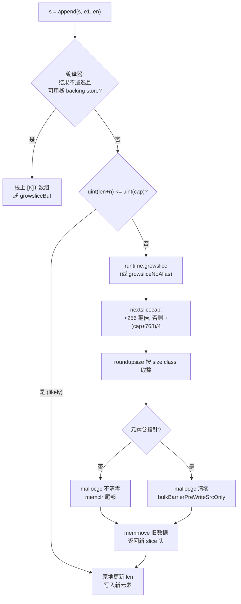
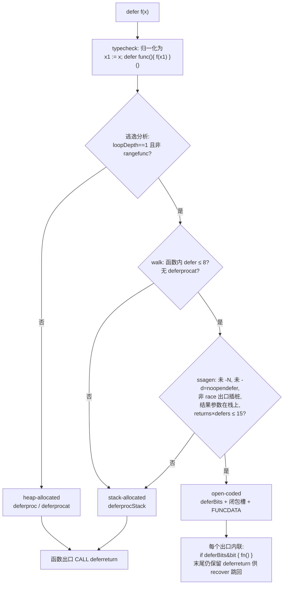

# Go 源码实现详解（十六）：slice、string、defer 与 panic

## 引言：四个"语法糖"背后的分工

slice、string、defer 和 panic/recover 是 Go 程序员每天都在用的语言特性，它们没有一个是"纯运行时"的：编译器先把语法降级成对少数运行时函数的调用（或者干脆内联成几条指令），运行时再负责分配、复制、遍历栈帧这些真正的脏活。读完这一篇，你应该能对下面几个结论有源码级的把握：

1. **slice 头就是三个机器字**，`append` 在容量足够时完全不进运行时；扩容走 `runtime.growslice`，新容量由 `nextslicecap`（小于 256 翻倍，之后平滑过渡到约 1.25 倍）算出后再按 malloc 的 size class 向上取整，所以你观察到的容量序列"不太规则"。当前主干还多了两条路径：`growsliceBuf` 允许把不逃逸的 append 结果放在栈上缓冲区里，`growsliceNoAlias` 配合 `runtimefreegc` 实验在扩容后立即释放旧底层数组。
2. **string 头是两个机器字**，字符串是只读的，因此 `[]byte(s)`/`string(b)` 默认要拷贝；编译器会在"结果不逃逸"时给运行时传一个 64 字节的栈缓冲区（`tmpBuf`），在"只读、且不会被记住"的场景（map 索引、比较、和非空字面量拼接、`range []byte(s)`）直接把 `OBYTES2STR` 改写成不拷贝的 `OBYTES2STRTMP`。
3. **defer 有三种实现**：开放编码（open-coded，把 defer 变成函数出口处按 `deferBits` 位图条件调用）、栈分配的 `_defer` 记录（`deferprocStack`）、堆分配记录（`deferproc`，配合 per-P 缓存池）。选择逻辑在编译器：不在循环里、函数内 defer 数 ≤ 8、`return 数 × defer 数 ≤ 15` 等条件都满足才开放编码；`-gcflags=-d=defer` 能把每条 defer 的类型打印出来。
4. **panic/recover 自 Go 1.22 起重写**：`_panic` 不再有 `argp`，而是一个带 `pc/sp/fp/retpc/deferBitsPtr/slotsPtr` 的栈遍历状态机，`gopanic`、`deferreturn`、`Goexit` 三者共用 `_panic.start` + `nextDefer` + `nextFrame` 这一套遍历逻辑；`gorecover` 判断"是否直接在 defer 函数中调用"的依据已经不是 `argp`，而是用 unwinder 数 `gopanic` 与 `gorecover` 之间恰好有一个非 wrapper 栈帧。
5. **边界检查的 panic 也变了**：主干上 amd64 等架构不再直接调用 `goPanicIndex` 一族，而是把失败类型和寄存器编号编进 `PCDATA_PanicBounds`，跳到一个汇编入口 `runtime.panicBounds`，由它保存全部整数寄存器后再交给 `panicBounds64` 解码构造 `boundsError`。`goPanic*` 家族现在只有 wasm 在用。

下面按 slice → string → defer → panic/recover → 运行时错误类型 → 观察手段的顺序展开，所有函数名与字段都以本文核对的主干源码为准。

## 一、slice：三个字的头与 growslice 的容量算术

### 1.1 slice 头结构

运行时和编译器各自定义了一份 slice 头，布局完全相同：一个指向底层数组的指针，加 len 和 cap 两个 int。

```go
// src/runtime/slice.go
type slice struct {
	array unsafe.Pointer
	len   int
	cap   int
}
```

```go
// src/internal/unsafeheader/unsafeheader.go
type Slice struct {
	Data unsafe.Pointer
	Len  int
	Cap  int
}

type String struct {
	Data unsafe.Pointer
	Len  int
}
```

`internal/unsafeheader` 是给 `reflect`、`unsafe` 相关标准库用的"无依赖"版本；`internal/abi` 里的 `SliceType` 则是 slice 的类型描述符（`Type` + `Elem`），与头结构无关。编译器在 SSA 里用 `OpSlicePtr/OpSliceLen/OpSliceCap` 三个操作把头拆开，`types.SliceLenOffset`、`types.SliceCapOffset` 给出字段偏移——后面看 append 的就地扩展时会用到。

### 1.2 makeslice：溢出检查与 mallocgc

`make([]T, len, cap)` 被降级为 `runtime.makeslice`（`cmd/compile/internal/walk/builtin.go` 中的 `walkMakeSlice`；64 位参数在 32 位平台上会先走 `makeslice64`）。它做的事非常直接：算出字节数、检查溢出与上限、调用 `mallocgc`。

```go
// src/runtime/slice.go  makeslice
func makeslice(et *_type, len, cap int) unsafe.Pointer {
	mem, overflow := math.MulUintptr(et.Size_, uintptr(cap))
	if overflow || mem > maxAlloc || len < 0 || len > cap {
		// NOTE: Produce a 'len out of range' error instead of a
		// 'cap out of range' error when someone does make([]T, bignumber).
		// ...
		mem, overflow := math.MulUintptr(et.Size_, uintptr(len))
		if overflow || mem > maxAlloc || len < 0 {
			panicmakeslicelen()
		}
		panicmakeslicecap()
	}

	return mallocgc(mem, et, true)
}
```

注意最后一个参数 `needzero=true`：`make` 出来的内存必须清零。相邻的 `makeslicecopy` 服务于 `append([]T(nil), src...)`/`make+copy` 这类模式（`walkMakeSliceCopy`），它对无指针元素用 `mallocgc(tomem, nil, false)` 免清零、只清尾部，对含指针元素则必须清零后再 `typedmemmove`。

### 1.3 growslice 与 nextslicecap

容量不够时 `append` 调用 `growslice`。签名是 `growslice(oldPtr, newLen, oldCap, num, et)`，注意它接收的是**新长度**，返回一个完整的 `slice` 头，但 `len` 已经是 `newLen`——调用方负责把新元素写进 `[oldLen, newLen)`。

```go
// src/runtime/slice.go  growslice
func growslice(oldPtr unsafe.Pointer, newLen, oldCap, num int, et *_type) slice {
	oldLen := newLen - num
	// ... race/msan/asan 检查
	if newLen < 0 {
		panic(errorString("growslice: len out of range"))
	}

	if et.Size_ == 0 {
		// append should not create a slice with nil pointer but non-zero len.
		return slice{unsafe.Pointer(&zerobase), newLen, newLen}
	}

	newcap := nextslicecap(newLen, oldCap)
	// ...
}
```

新容量的策略集中在 `nextslicecap`：

```go
// src/runtime/slice.go  nextslicecap
func nextslicecap(newLen, oldCap int) int {
	newcap := oldCap
	doublecap := newcap + newcap
	if newLen > doublecap {
		return newLen
	}

	const threshold = 256
	if oldCap < threshold {
		return doublecap
	}
	for {
		// Transition from growing 2x for small slices
		// to growing 1.25x for large slices. This formula
		// gives a smooth-ish transition between the two.
		newcap += (newcap + 3*threshold) >> 2

		// We need to check `newcap >= newLen` and whether `newcap` overflowed.
		if uint(newcap) >= uint(newLen) {
			break
		}
	}

	// Set newcap to the requested cap when
	// the newcap calculation overflowed.
	if newcap <= 0 {
		return newLen
	}
	return newcap
}
```

三条规则：

- 一次 append 需要的 `newLen` 超过旧容量两倍：直接用 `newLen`；
- 旧容量小于 256：翻倍；
- 否则每轮加 `(newcap + 768) / 4`。当 `newcap` 很大时这近似 1.25 倍，`newcap=256` 时第一轮是 `256 + (256+768)/4 = 512`，仍然是翻倍，随着容量增大系数平滑降到 1.25。

`uint(newcap) >= uint(newLen)` 这个比较同时处理了"够用了"和"溢出成负数"两种情况，是运行时里常见的一石二鸟写法。

### 1.4 roundupsize：按 size class 取整

`nextslicecap` 给出的只是"想要的"容量。`growslice` 接着按元素大小分四种情况把它换算成字节数，交给 `roundupsize` 对齐到 malloc 的 size class，再反算回容量：

```go
// src/runtime/slice.go  growslice（节选）
	noscan := !et.Pointers()
	switch {
	case et.Size_ == 1:
		lenmem = uintptr(oldLen)
		newlenmem = uintptr(newLen)
		capmem = roundupsize(uintptr(newcap), noscan)
		overflow = uintptr(newcap) > maxAlloc
		newcap = int(capmem)
	case et.Size_ == goarch.PtrSize:
		// ... 乘法被编译成移位
	case isPowerOfTwo(et.Size_):
		// ... 用变量移位
	default:
		lenmem = uintptr(oldLen) * et.Size_
		newlenmem = uintptr(newLen) * et.Size_
		capmem, overflow = math.MulUintptr(et.Size_, uintptr(newcap))
		capmem = roundupsize(capmem, noscan)
		newcap = int(capmem / et.Size_)
		capmem = uintptr(newcap) * et.Size_
	}

	if overflow || capmem > maxAlloc {
		panic(errorString("growslice: len out of range"))
	}
```

`roundupsize` 在 `src/runtime/msize.go`：

```go
// src/runtime/msize.go  roundupsize
func roundupsize(size uintptr, noscan bool) (reqSize uintptr) {
	reqSize = size
	if reqSize <= maxSmallSize-gc.MallocHeaderSize {
		// Small object.
		if !noscan && reqSize > gc.MinSizeForMallocHeader { // !noscan && !heapBitsInSpan(reqSize)
			reqSize += gc.MallocHeaderSize
		}
		// ...
		if reqSize <= gc.SmallSizeMax-8 {
			return uintptr(gc.SizeClassToSize[gc.SizeToSizeClass8[divRoundUp(reqSize, gc.SmallSizeDiv)]]) - (reqSize - size)
		}
		return uintptr(gc.SizeClassToSize[gc.SizeToSizeClass128[divRoundUp(reqSize-gc.SmallSizeMax, gc.LargeSizeDiv)]]) - (reqSize - size)
	}
	// Large object. Align reqSize up to the next page. Check for overflow.
	reqSize += pageSize - 1
	if reqSize < size {
		return size
	}
	return reqSize &^ (pageSize - 1)
}
```

这就是为什么 `append` 一个 `[]int` 从 5 个元素扩容得到 10 而不是 8——`8*8=64` 字节向上取整到 size class 后可能落到 80 字节，`80/8 = 10`。含指针的大对象还要扣掉 malloc header（`gc.MallocHeaderSize`），所以 `noscan` 参数会影响结果。

### 1.5 有指针与无指针元素：清零与拷贝策略不同

分配和搬运旧数据的部分体现了 GC 对"指针"的敏感：

```go
// src/runtime/slice.go  growslice（节选）
	var p unsafe.Pointer
	if !et.Pointers() {
		p = mallocgc(capmem, nil, false)
		// The append() that calls growslice is going to overwrite from oldLen to newLen.
		// Only clear the part that will not be overwritten.
		memclrNoHeapPointers(add(p, newlenmem), capmem-newlenmem)
	} else {
		// Note: can't use rawmem (which avoids zeroing of memory), because then GC can scan uninitialized memory.
		p = mallocgc(capmem, et, true)
		if lenmem > 0 && writeBarrier.enabled {
			// Only shade the pointers in oldPtr since we know the destination slice p
			// only contains nil pointers because it has been cleared during alloc.
			bulkBarrierPreWriteSrcOnly(uintptr(p), uintptr(oldPtr), lenmem-et.Size_+et.PtrBytes, et)
		}
	}
	memmove(p, oldPtr, lenmem)

	return slice{p, newLen, newcap}
```

- 无指针元素：`mallocgc(..., nil, false)` 不清零，只用 `memclrNoHeapPointers` 清掉 `[newLen, cap)` 这段——`[oldLen, newLen)` 马上会被 append 覆盖，没必要清；
- 含指针元素：必须让 `mallocgc` 清零整块（否则 GC 会扫描到脏指针），然后在 `memmove` 前对源区间做一次 `bulkBarrierPreWriteSrcOnly`（只 shade 旧数据里的指针，因为目标已知全是 nil）。

`reflect_growslice`（供 `reflect.Append` 通过 linkname 使用）在此基础上再把 `[oldCap, newLen)` 清零一遍，因为它的调用者不是 append，不会覆盖那段内存。

主干上还有两个变体值得知道：

- `growsliceNoAlias`：编译器证明旧底层数组没有别名（`n.AppendNoAlias`）时调用；在 `goexperiment.RuntimeFreegc` 开启时，扩容后立即 `freegc(oldPtr, ...)` 归还旧数组，而不是等 GC。目前只对无指针元素启用。
- `growsliceBuf`：接收一个**栈上**的缓冲区 `bufPtr/bufLen`，若 `newLen <= bufLen` 就把数据搬进栈缓冲区并把容量只推进到下一个 size class（不翻倍），只有放不下时才退化为普通 `growslice`。这是配合编译器"append 结果不逃逸时用栈上 backing store"的优化。

### 1.6 编译器对 append 的降级

`append` 在 walk 阶段几乎不做事，真正的展开在 SSA 生成阶段——`walkAppend` 只是保证参数已求值、类型已转换，然后"Leave for ssagen"：

```go
// src/cmd/compile/internal/walk/builtin.go  walkAppend（节选）
	argc := len(n.Args) - 1
	if argc < 1 {
		return nsrc
	}

	// General case, with no function calls left as arguments.
	// Leave for ssagen, except that instrumentation requires the old form.
	if !base.Flag.Cfg.Instrumenting || base.Flag.CompilingRuntime {
		return n
	}
```

只有在 race/msan 插桩或编译 runtime 自身时，它才把 append 手工展开成 `if uint(newLen) <= uint(s.cap) { s = s[:newLen] } else { s = growslice(...) }` 加逐元素赋值的 IR。`append(l1, l2...)` 则由 `walk/assign.go` 的 `appendSlice` 展开，尾部拷贝根据元素是否含指针选 `typedslicecopy` 或 `memmove`：

```go
// src/cmd/compile/internal/walk/assign.go  appendSlice（节选）
	// if uint(newLen) <= uint(oldCap)
	nif := ir.NewIfStmt(base.Pos, nil, nil, nil)
	nuint := typecheck.Conv(newLen, types.Types[types.TUINT])
	scapuint := typecheck.Conv(oldCap, types.Types[types.TUINT])
	nif.Cond = ir.NewBinaryExpr(base.Pos, ir.OLE, nuint, scapuint)
	nif.Likely = true

	// then { s = s[:newLen] }
	slice := ir.NewSliceExpr(base.Pos, ir.OSLICE, s, nil, newLen, nil)
	slice.SetBounded(true)
	nif.Body = []ir.Node{ir.NewAssignStmt(base.Pos, s, slice)}

	// else { s = growslice(oldPtr, newLen, oldCap, num, T) }
	call := walkGrowslice(walkstate, s, nif.PtrInit(), oldPtr, newLen, oldCap, num)
	nif.Else = []ir.Node{ir.NewAssignStmt(base.Pos, s, call)}
```

`uint(newLen) <= uint(cap)` 用无符号比较，是为了让 `newLen` 溢出成负数时也走到 `growslice`，由它来 panic。

SSA 阶段的 `state.append(n, inplace)` 注释写得非常清楚，`inplace=true` 对应 `s = append(s, ...)` 这种赋值回同一个变量的 fast path：

```go
// src/cmd/compile/internal/ssagen/ssa.go  (*state).append（注释节选）
	// If inplace is true, process as statement "s = append(s, e1, e2, e3)":
	//
	// a := &s
	// ptr, len, cap := s
	// len += 3
	// if uint(len) > uint(cap) {
	//    ptr, len, cap = growslice(ptr, len, cap, 3, typ)
	//    vardef(a)    // if necessary, advise liveness we are writing a new a
	//    *a.cap = cap // write before ptr to avoid a spill
	//    *a.ptr = ptr // with write barrier
	// }
	// *a.len = len
	// // with write barriers, if needed:
	// *(ptr+(len-3)) = e1
	// *(ptr+(len-2)) = e2
	// *(ptr+(len-1)) = e3
```

就地模式下，容量足够时只需更新 `len` 字段，指针和 cap 字段根本不碰，避免了写屏障和 spill。扩容分支 `b.Likely = ssa.BranchUnlikely`，放到冷路径。

同一函数里还有"栈上 backing store"逻辑：当 append 的结果不逃逸（`getBackingStoreInfoForAppend` 返回非 nil），第一次从空 slice append 且总长度不超过 K 时，直接在栈上开一个 `[K]T` 数组作为底层数组；若编译器判定该 slice 后面还会用到 cap 或最终会通过 `move2heap` 逃逸，则改为调用 `growsliceBuf`，让容量沿着 size class 阶梯一步步长，避免搬到堆上时浪费。

### 1.7 copy 与 clear

`copy(a, b)` 在 `walkCopy` 中按元素类型分三路：含指针走 `typedslicecopy`（带写屏障）；插桩模式走运行时 `slicecopy`；其余情况直接展开成 `n := min(len(a), len(b)); if a.ptr != b.ptr { memmove(a.ptr, b.ptr, n*size) }`，不进运行时。`slicecopy` 也顺手处理了 `copy([]byte, string)`：

```go
// src/runtime/slice.go  slicecopy（节选）
func slicecopy(toPtr unsafe.Pointer, toLen int, fromPtr unsafe.Pointer, fromLen int, width uintptr) int {
	if fromLen == 0 || toLen == 0 {
		return 0
	}

	n := fromLen
	if toLen < n {
		n = toLen
	}

	if width == 0 {
		return n
	}

	size := uintptr(n) * width
	// ... race/msan/asan
	if size == 1 { // common case worth about 2x to do here
		*(*byte)(toPtr) = *(*byte)(fromPtr) // known to be a byte pointer
	} else {
		memmove(toPtr, fromPtr, size)
	}
	return n
}
```

`clear(s)` 由 `walkClear` 交给 `arrayClear`，最终是 `memclrNoHeapPointers` 或 `memclrHasPointers`（含指针时要先处理写屏障）；`clear(m)` 则是 `mapClear`。

### 1.8 切片表达式的边界检查：boundsCheck、panicBounds 与 prove

`s[i:j:k]` 由 `(*state).slice` 生成，边界检查**从右往左**做——先检查 `k <= cap`，再 `j <= k`，最后 `i <= j`，这样每次比较的右侧都是已知非负的值（issue 28797）：

```go
// src/cmd/compile/internal/ssagen/ssa.go  (*state).slice（节选）
	// Panic if slice indices are not in bounds.
	// Make sure we check these in reverse order so that we're always
	// comparing against a value known to be nonnegative. See issue 28797.
	if three {
		if k != cap {
			kind := ssa.BoundsSlice3Alen
			if t.IsSlice() {
				kind = ssa.BoundsSlice3Acap
			}
			k = s.boundsCheck(k, cap, kind, bounded)
		}
		if j != k {
			j = s.boundsCheck(j, k, ssa.BoundsSlice3B, bounded)
		}
		i = s.boundsCheck(i, j, ssa.BoundsSlice3C, bounded)
	} else {
		if j != k {
			kind := ssa.BoundsSliceAlen
			if t.IsSlice() {
				kind = ssa.BoundsSliceAcap
			}
			j = s.boundsCheck(j, k, kind, bounded)
		}
		// ...
	}
```

`boundsCheck` 生成 `OpIsInBounds`/`OpIsSliceInBounds` 条件跳转，失败分支是一个 `OpPanicBounds`（wasm 例外，仍直接调用 `BoundsCheckFunc[kind]` 即 `goPanic*` 家族）。这里有一个和过去不同的实现细节：amd64 的 `PanicBounds` 会被 lower 成 `LoweredPanicBoundsRR/RC/CR/CC` 四种（R 表示操作数在寄存器，C 表示常量），最终在 `cmd/compile/internal/amd64/ssa.go` 里输出**一条 PCDATA 加一条 CALL**：

```go
// src/cmd/compile/internal/amd64/ssa.go  ssaGenValue（节选）
		c := abi.BoundsEncode(code, signed, xIsReg, yIsReg, xVal, yVal)
		p := s.Prog(obj.APCDATA)
		p.From.SetConst(abi.PCDATA_PanicBounds)
		// ...
		p = s.Prog(obj.ACALL)
		// ...
		p.To.Sym = ir.Syms.PanicBounds
```

编码规则在 `src/internal/abi/bounds.go`：bit0/bit1 标记 x、y 是否在寄存器，之后是寄存器号或 ≤ 31 的小常量，整体再乘以错误码个数并加上 `BoundsErrorCode`。运行时侧 `runtime.panicBounds` 是汇编（`src/runtime/asm_amd64.s`），把 14 个可能装着下标的整数寄存器全部压栈，再调用 Go 函数 `panicBounds64` 解码：

```go
// src/runtime/panic.go  panicBounds64（节选）
func panicBounds64(pc uintptr, regs *[16]int64) { // called from panicBounds on 64-bit archs
	f := findfunc(pc)
	v := pcdatavalue(f, abi.PCDATA_PanicBounds, pc-1)

	code, signed, xIsReg, yIsReg, xVal, yVal := abi.BoundsDecode(int(v))

	if code == abi.BoundsIndex {
		panicCheck1(pc, "index out of range")
	} else {
		panicCheck1(pc, "slice bounds out of range")
	}

	var e boundsError
	e.code = code
	e.signed = signed
	if xIsReg {
		e.x = regs[xVal]
	} else {
		e.x = int64(xVal)
	}
	// ...
	panic(e)
}
```

这样做的收益是每个边界检查失败点只剩一条 CALL 指令，不必再为把 x、y 搬进参数寄存器生成代码。源码注释明确写着"The goPanic{Index,Slice} functions are only used by wasm"，所以现在看到 `goPanicSliceB` 之类函数名，要知道它们在 amd64/arm64 上已经不在调用链里。

边界检查的消除发生在 `prove` pass。这个 pass 在主干上已经从 `cmd/compile/internal/ssa` 搬到了 `cmd/compile/internal/ssacompile/prove.go`（`ssa/prove.go` 只剩 `Limit`、`FitsInBitsU` 等基础设施）。它基于支配关系收集 `i < len(s)` 之类事实，能证明时把 `IsInBounds` 直接替换为常量 true。用 `-gcflags=-d=ssa/check_bce/debug=1` 可以让 `ssacompile/checkbce.go` 打印每一处仍然保留的 `Found IsInBounds`，`-d=ssa/prove/debug=1` 则打印 `Proved IsInBounds` 之类被消除的检查。

整个 append 的决策流程如下：



## 二、string：只读、两个字、尽量不拷贝

### 2.1 stringStruct

```go
// src/runtime/string.go
type stringStruct struct {
	str unsafe.Pointer
	len int
}
```

运行时通过 `stringStructOf(*string)` 做 unsafe 转换来读写头；编译器侧对应 `OpStringPtr/OpStringLen`。字符串常量的数据由链接器放进只读段（`go.string.*` 符号），所以 `unsafe.StringData` 拿到的指针不可写——写入会直接段错误而不是 panic。

### 2.2 拼接：concatstrings 与 64 字节栈缓冲区

`a + b + c` 由 `walk/expr.go` 的 `walkAddString` 降级：≤ 5 个操作数调用 `concatstring2..5`，更多则打包成 `[]string` 调用 `concatstrings`。关键优化是第一个参数 `buf`：

```go
// src/cmd/compile/internal/walk/expr.go  walkAddString（节选）
	case typ.IsString():
		if x.Esc() == ir.EscNone {
			sz := int64(0)
			for _, n1 := range x.List {
				if n1.Op() == ir.OLITERAL {
					sz += int64(len(ir.StringVal(n1)))
				}
			}

			// Don't allocate the buffer if the result won't fit.
			if sz < tmpstringbufsize {
				// Create temporary buffer for result string on stack.
				buf = stackBufAddr(walkstate, tmpstringbufsize, types.Types[types.TUINT8])
			}
		}

		args = []ir.Node{buf}
		fnsmall, fnbig = "concatstring%d", "concatstrings"
	case typ.IsSlice() && typ.Elem().IsKind(types.TUINT8): // Optimize []byte(str1+str2+...)
		if conv != nil && conv.Esc() == ir.EscNone {
			buf = stackBufAddr(walkstate, tmpstringbufsize, types.Types[types.TUINT8])
		}
		args = []ir.Node{buf}
		fnsmall, fnbig = "concatbyte%d", "concatbytes"
```

结果不逃逸时，编译器在栈上准备一个 `tmpBuf`，运行时优先往里写。主干上 `tmpStringBufSize` 是 **64**（旧版本是 32），`[]rune` 缓冲区 `tmpRuneBufSize` 仍是 32——注释解释了原因：rune 每个占 4 字节，超过 32 个 rune 的情况罕见，扩大只会白白撑大栈帧。另外 `[]byte(a+b)` 现在有专门的 `concatbytes`/`concatbyte2..5`，省掉中间字符串。

```go
// src/runtime/string.go  concatstrings
func concatstrings(buf *tmpBuf, a []string) string {
	idx := 0
	l := 0
	count := 0
	for i, x := range a {
		n := len(x)
		if n == 0 {
			continue
		}
		if l+n < l {
			throw("string concatenation too long")
		}
		l += n
		count++
		idx = i
	}
	if count == 0 {
		return ""
	}

	// If there is just one string and either it is not on the stack
	// or our result does not escape the calling frame (buf != nil),
	// then we can return that string directly.
	if count == 1 && (buf != nil || !stringDataOnStack(a[idx])) {
		return a[idx]
	}
	s, b := rawstringtmp(buf, l)
	for _, x := range a {
		n := copy(b, x)
		b = b[n:]
	}
	return s
}
```

两个细节：只有一个非空操作数时直接返回它（但如果它的数据在栈上而结果会逃逸，则必须拷贝，`stringDataOnStack` 就是查 `getg().stack` 范围）；`rawstringtmp` 在 `buf != nil && l <= 64` 时用栈缓冲，否则 `rawstring` 走 `mallocgc(size, nil, false)`——字符串数据无指针且马上会被覆盖，不清零。

### 2.3 `[]byte` 与 string 互转：何时可以不拷贝

`string(b)` 降级为 `slicebytetostring(buf, ptr, n)`（`walkBytesRunesToString`），同样带栈缓冲：

```go
// src/runtime/string.go  slicebytetostring（节选）
func slicebytetostring(buf *tmpBuf, ptr *byte, n int) string {
	if n == 0 {
		return ""
	}
	// ... race/msan/asan
	if n == 1 {
		p := unsafe.Pointer(&staticuint64s[*ptr])
		if goarch.BigEndian {
			p = add(p, 7)
		}
		return unsafe.String((*byte)(p), 1)
	}

	var p unsafe.Pointer
	if buf != nil && n <= len(buf) {
		p = unsafe.Pointer(buf)
	} else {
		p = mallocgc(uintptr(n), nil, false)
	}
	memmove(p, unsafe.Pointer(ptr), uintptr(n))
	return unsafe.String((*byte)(p), n)
}
```

单字节字符串复用全局表 `staticuint64s`，零分配。反向的 `stringtoslicebyte(buf, s)` 逻辑对称，但 `[]byte` 是可写的，所以栈缓冲必须先 `*buf = tmpBuf{}` 清零再切片。`[]byte("常量")` 则在 `walkStringToBytes` 里被展开为一个 `[n]byte` 数组的整体赋值加 `OSLICEARR`，连运行时都不进。

真正有意思的是"免拷贝"路径。运行时提供了 `slicebytetostringtmp`，它只是把 `[]byte` 的指针和长度包成 string 头，不复制：

```go
// src/runtime/string.go  slicebytetostringtmp（注释节选）
// Some internal compiler optimizations use this function.
//   - Used for m[T1{... Tn{..., string(k), ...} ...}] and m[string(k)]
//     where k is []byte, T1 to Tn is a nesting of struct and array literals.
//   - Used for "<"+string(b)+">" concatenation where b is []byte.
//   - Used for string(b)=="foo" comparison where b is []byte.
func slicebytetostringtmp(ptr *byte, n int) string {
	// ... race/msan/asan
	return unsafe.String(ptr, n)
}
```

编译器在 `walk/order.go` 里把满足条件的 `OBYTES2STR` 改写成 `OBYTES2STRTMP`，非插桩模式下后端直接把它当成 `OSTRINGHEADER` 处理（`walkBytesToStringTemp` 注释："Let the backend handle OBYTES2STRTMP directly"），连函数调用都省了。三处改写：

```go
// src/cmd/compile/internal/walk/order.go  (*orderState).expr 比较分支（节选）
	case ir.OEQ, ir.ONE, ir.OLT, ir.OLE, ir.OGT, ir.OGE:
		// ...
		t := n.X.Type()
		switch {
		case t.IsString():
			// Mark string(byteSlice) arguments to reuse byteSlice backing
			// buffer during conversion. String comparison does not
			// memorize the strings for later use, so it is safe.
			if n.X.Op() == ir.OBYTES2STR {
				n.X.(*ir.ConvExpr).SetOp(ir.OBYTES2STRTMP)
			}
			if n.Y.Op() == ir.OBYTES2STR {
				n.Y.(*ir.ConvExpr).SetOp(ir.OBYTES2STRTMP)
			}
```

- 比较：`string(b) == "foo"`，比较完就丢，安全；
- map 索引：`m[string(k)]`，`mapKeyReplaceStrConv` 递归处理结构体/数组字面量里嵌套的 `string(k)`；注意只对**读取**有效，`m[string(k)] = v` 需要把 key 存进 map，必须真拷贝。注释还提到 `s := string(k); m[s]` 这种写法交给 SSA 的 `generic.rules`（搜索 `runtime.slicebytetostring`）处理；
- 拼接：`"<" + string(b) + ">"`，条件是至少有一个**非空字面量**——否则 `concatstrings` 的 `count == 1` 快路径会把临时字符串原样返回给调用者，就不安全了。

反方向也有一个对称的 `OSTR2BYTESTMP`（`walkStringToBytesTemp`），目前唯一的使用者是 `for i, c := range []byte(s)`：range 循环只读，可以直接借用字符串数据。

### 2.4 intstring 与 slicerunetostring

`string(rune)` 走 `intstring(buf *[4]byte, v int64)`，缓冲区正好是 UTF-8 最大长度；超出 rune 范围的值编码为 `runeError`（U+FFFD）。`string([]rune)` 走 `slicerunetostring`，分两趟：先累加每个 rune 的编码长度，再分配 `size1+3` 字节并编码，第二趟里 `if size2 >= size1 { break }` 是为了防御并发修改 `[]rune` 导致的越界。`[]rune(s)` 走 `stringtoslicerune`，因为字符串不可变所以不需要这种防御。

### 2.5 比较：memequal 与 cmpstring

`walk/compare.go` 的 `walkCompareString` 先尝试把"和短常量比较"展开成长度检查加逐字（或按 2/4/8 字节）比较；一般情况下 `==`/`!=` 降级为 `len(a) == len(b) && memequal(a.ptr, b.ptr, len)`，`<`/`>` 等降级为 `cmpstring(a, b) <op> 0`：

```go
// src/cmd/compile/internal/walk/compare.go  walkCompareString（节选）
	var r ir.Node
	if n.Op() == ir.OEQ || n.Op() == ir.ONE {
		// prepare for rewrite below
		n.X = cheapExpr(walkstate, n.X, init)
		n.Y = cheapExpr(walkstate, n.Y, init)
		eqlen, eqmem := compare.EqString(n.X, n.Y)
		// quick check of len before full compare for == or !=.
		// memequal then tests equality up to length len.
		if n.Op() == ir.OEQ {
			// len(left) == len(right) && memequal(left, right, len)
			r = ir.NewLogicalExpr(base.Pos, ir.OANDAND, eqlen, eqmem)
		} else {
			// len(left) != len(right) || !memequal(left, right, len)
			eqlen.SetOp(ir.ONE)
			r = ir.NewLogicalExpr(base.Pos, ir.OOROR, eqlen, ir.NewUnaryExpr(base.Pos, ir.ONOT, eqmem))
		}
	} else {
		// sys_cmpstring(s1, s2) :: 0
		r = mkcall(walkstate, "cmpstring", types.Types[types.TINT], init, typecheck.Conv(n.X, types.Types[types.TSTRING]), typecheck.Conv(n.Y, types.Types[types.TSTRING]))
		r = ir.NewBinaryExpr(base.Pos, n.Op(), r, ir.NewInt(base.Pos, 0))
	}
```

`memequal` 和 `cmpstring` 都是 `runtime` 包的符号，但汇编实现放在 `src/internal/bytealg/` 下：`equal_amd64.s` 定义 `runtime·memequal<ABIInternal>`（还有给 map 用的 `memequal_varlen`），`compare_amd64.s` 定义 `runtime·cmpstring<ABIInternal>` 并和 `bytealg.Compare` 共用 `cmpbody`。`bytealg.CompareString` 通过 `//go:linkname abigen_runtime_cmpstring runtime.cmpstring` 借用同一份汇编；没有汇编的架构用 `compare_generic.go` 的逐字节循环。

### 2.6 unsafe.String / unsafe.StringData 与 strings.Builder

`unsafe.String(ptr, len)` 在 walk 阶段由 `walkUnsafeString` 内联展开长度检查（`len < 0`、`ptr == nil && len != 0`、`uintptr(len) > -uintptr(ptr)` 溢出），失败时调用 `panicunsafestringlen`/`panicunsafestringnilptr`；开 `-d=checkptr` 时改为调用 `unsafestringcheckptr`，多做一次"不得跨越多个堆对象"的检查（`checkptrStraddles`）。检查通过后就是一个 `OSTRINGHEADER` 节点，零开销。`unsafe.StringData` 由 `walkUnsafeData` 处理，等价于取头结构的第一个字。

`strings.Builder` 正是这个 API 的标准用法：

```go
// src/strings/builder.go
func (b *Builder) String() string {
	return unsafe.String(unsafe.SliceData(b.buf), len(b.buf))
}
```

Builder 的 `buf` 只增不改，所以已经交出去的字符串不会被后续写入破坏；`copyCheck` 用 `addr` 字段防止值拷贝后两个 Builder 共享同一底层数组。另一个标准库技巧是 `bytealg.MakeNoZero`，它 linkname 到 `runtime.bytealg_MakeNoZero`，分配一个**不清零**且容量按 size class 取整的 `[]byte`，供 `strings.Builder.grow`、`bytes.Buffer` 等"马上就会写满"的场景使用。

## 三、defer 的三种实现

### 3.1 `_defer` 结构

```go
// src/runtime/runtime2.go
type _defer struct {
	heap      bool
	rangefunc bool    // true for rangefunc list
	sp        uintptr // sp at time of defer
	pc        uintptr // pc at time of defer
	fn        func()  // can be nil for open-coded defers
	link      *_defer // next defer on G; can point to either heap or stack!
	// If rangefunc is true, *head is the head of the atomic linked list
	// during a range-over-func execution.
	head *atomic.Pointer[_defer]
}
```

和 Go 1.13 时代相比这个结构瘦了很多：没有 `siz`、`args`、`openDefer`、`fd`、`varp`、`framepc` 等字段。原因有二：一是 Go 1.17 起 defer 调用被统一归一化成无参无返回值的闭包（下一节），参数不再存在记录里；二是 Go 1.22 重构后开放编码 defer 的元信息全部由 `_panic` 在遍历栈时按需读取 FUNCDATA，不再塞进 `_defer`。`fn` 是一个 `func()`，`sp` 用于把记录和栈帧对应起来，`pc` 是 defer 语句之后的返回地址（`recovery` 需要它找到 `deferreturn` 调用点）。

### 3.2 语义归一化：参数在 defer 语句处求值

`defer f(x, y)` 在类型检查阶段（`typecheck/stmt.go` 的 `tcGoDefer` → `normalizeGoDeferCall`）被改写成：

```go
// src/cmd/compile/internal/typecheck/stmt.go  normalizeGoDeferCall（注释节选）
// For example, it normalizes:
//
//	f(x, y)
//
// into:
//
//	x1, y1 := x, y          // added to init
//	func() { f(x1, y1) }()  // result
```

这就是"defer 的参数在 defer 语句执行时求值、函数体在函数返回时执行"这条规则在实现层面的样子：`x1, y1 := x, y` 被放进 defer 语句的 init 列表，闭包捕获的是这些临时变量。`normalizeGoDeferCall` 对字面量、全局函数引用、全局变量地址、`unsafe.Pointer→uintptr` 转换、复合字面量的元素等做了特判，不必为它们分配闭包捕获槽。方法值、接口调用、闭包调用同样被包一层。`defer func(){...}()` 本身已经是零参零返回值的 `OCALLFUNC`，原样保留。

### 3.3 决策：谁来决定用哪种实现

三种实现的选择分散在三个阶段：

1. **逃逸分析**（`escape/call.go` 的 `goDeferStmt`）：`defer` 不在循环里（`loopDepth == 1`）且不是 range-over-func 内的 defer（`DeferAt == nil`）时，标记 `n.SetEsc(ir.EscNever)`，表示 `_defer` 记录可以放在栈上。

```go
// src/cmd/compile/internal/escape/call.go  goDeferStmt（节选）
	k := e.heapHole()
	if n.Op() == ir.ODEFER && e.loopDepth == 1 && n.DeferAt == nil {
		// Top-level defer arguments don't escape to the heap,
		// but they do need to last until they're invoked.
		k = e.later(e.discardHole())

		// force stack allocation of defer record, unless
		// open-coded defers are used (see ssa.go)
		n.SetEsc(ir.EscNever)
	}
```

2. **walk**（`walk/stmt.go`）：统计函数里的 defer 数并设置禁用开放编码的条件——超过 `maxOpenDefers`（`walk/walk.go` 中定义为 8，因为 `deferBits` 是一个字节）、需要 `deferprocat`、或者 defer 在循环里：

```go
// src/cmd/compile/internal/walk/stmt.go  walkStmt ODEFER 分支（节选）
	case ir.ODEFER:
		n := n.(*ir.GoDeferStmt)
		walkstate.curfunc.SetHasDefer(true)
		walkstate.curfunc.NumDefers++
		if walkstate.curfunc.NumDefers > maxOpenDefers || n.DeferAt != nil {
			// Don't allow open-coded defers if there are more than
			// 8 defers in the function, since we use a single
			// byte to record active defers.
			// Also don't allow if we need to use deferprocat.
			walkstate.curfunc.SetOpenCodedDeferDisallowed(true)
		}
		if n.Esc() != ir.EscNever {
			// If n.Esc is not EscNever, then this defer occurs in a loop,
			// so open-coded defers cannot be used in this function.
			walkstate.curfunc.SetOpenCodedDeferDisallowed(true)
		}
```

3. **SSA 生成**（`ssagen/ssa.go` 的 `buildssa`）：在上述基础上再加几条：`-N` 关闭优化时不用；`-d=noopendefer` 显式禁用；386 动态链接时禁用；race 插桩需要在函数出口打点时禁用；有结果参数逃逸到堆上时禁用；以及 `NumReturns * NumDefers > 15`——开放编码要在**每个 return 点**复制一遍 defer 调用序列，出口太多会让代码膨胀。

```go
// src/cmd/compile/internal/ssagen/ssa.go  buildssa（节选）
	s.hasOpenDefers = base.Flag.N == 0 && s.hasdefer && !s.curfn.OpenCodedDeferDisallowed()
	switch {
	case base.Debug.NoOpenDefer != 0:
		s.hasOpenDefers = false
	case s.hasOpenDefers && (base.Ctxt.Flag_shared || base.Ctxt.Flag_dynlink) && base.Ctxt.Arch.Name == "386":
		s.hasOpenDefers = false
	}
	if s.hasOpenDefers && s.instrumentEnterExit {
		s.hasOpenDefers = false
	}
	// ... 结果参数不在栈上时禁用
	if s.hasOpenDefers &&
		s.curfn.NumReturns*s.curfn.NumDefers > 15 {
		s.hasOpenDefers = false
	}
```

最终在 `ODEFER` 语句处分流，这里也是 `-d=defer` 的输出点：

```go
// src/cmd/compile/internal/ssagen/ssa.go  (*state).stmt ODEFER 分支
	case ir.ODEFER:
		n := n.(*ir.GoDeferStmt)
		if base.Debug.Defer > 0 {
			var defertype string
			if s.hasOpenDefers {
				defertype = "open-coded"
			} else if n.Esc() == ir.EscNever {
				defertype = "stack-allocated"
			} else {
				defertype = "heap-allocated"
			}
			base.WarnfAt(n.Pos(), "%s defer", defertype)
		}
		if s.hasOpenDefers {
			s.openDeferRecord(n.Call.(*ir.CallExpr))
		} else {
			d := callDefer
			if n.Esc() == ir.EscNever && n.DeferAt == nil {
				d = callDeferStack
			}
			s.call(n.Call.(*ir.CallExpr), d, false, n.DeferAt)
		}
```



### 3.4 堆分配：deferproc 与 defer 池

```go
// src/runtime/panic.go  deferproc
func deferproc(fn func()) {
	gp := getg()
	if gp.m.curg != gp {
		// go code on the system stack can't defer
		throw("defer on system stack")
	}

	d := newdefer()
	d.link = gp._defer
	gp._defer = d
	d.fn = fn
	d.pc = sys.GetCallerPC()
	// We must not be preempted between calling GetCallerSP and
	// storing it to d.sp because GetCallerSP's result is a
	// uintptr stack pointer.
	d.sp = sys.GetCallerSP()
}
```

记录头插进 `g._defer` 链表——这就是 LIFO 执行顺序的来源。`newdefer` 优先从 `p.deferpool` 取，池空了再从全局 `sched.deferpool` 批量搬一半过来，最后才 `new(_defer)`；释放侧 `popDefer` 对称地在本地池满时把一半归还全局。`d.heap = true` 标记这条记录需要归还池。

### 3.5 栈分配：deferprocStack

栈分配版本由编译器在函数栈帧里直接开一个 `_defer` 大小的槽（`deferstruct()` 构造的类型，字段布局必须与运行时一致），填好 `fn` 后把地址传给 `deferprocStack`：

```go
// src/runtime/panic.go  deferprocStack（节选）
//go:nosplit
func deferprocStack(d *_defer) {
	gp := getg()
	if gp.m.curg != gp {
		throw("defer on system stack")
	}

	// fn is already set.
	// The other fields are junk on entry to deferprocStack and
	// are initialized here.
	d.heap = false
	d.rangefunc = false
	d.sp = sys.GetCallerSP()
	d.pc = sys.GetCallerPC()
	// The lines below implement:
	//   d.link = gp._defer
	//   d.head = nil
	//   gp._defer = d
	// But without write barriers. ...
	*(*uintptr)(unsafe.Pointer(&d.link)) = uintptr(unsafe.Pointer(gp._defer))
	*(*uintptr)(unsafe.Pointer(&d.head)) = 0
	*(*uintptr)(unsafe.Pointer(&gp._defer)) = uintptr(unsafe.Pointer(d))
}
```

它必须 `nosplit`，因为记录里的指针字段在进入时是垃圾，栈增长时若被扫描会出问题；三处赋值绕过写屏障也是同样的考虑（前两处写的是栈，第三处写的 `g._defer` 由 GC 显式标记）。栈分配省掉了池操作和堆分配，但记录在栈上意味着栈拷贝时 `link` 指针要被调整——`popDefer` 里那段"不能在更新 `gp._defer` 和清空 `d.link` 之间拷贝栈"的注释就是在处理这个约束。

### 3.6 开放编码：deferBits、闭包槽与 FUNCDATA

开放编码 defer（Go 1.14 引入）根本不建 `_defer` 记录。`openDeferRecord` 在 defer 语句处做两件事：把函数值存进一个专门的栈槽（`openDeferSave`，槽由 `SetOpenDeferSlot` 标记，帧布局时保证连续），然后把 `deferBits` 的第 i 位置 1 并**写回栈**：

```go
// src/cmd/compile/internal/ssagen/ssa.go  openDeferRecord（节选）
	closureVal := s.expr(fn)
	closure := s.openDeferSave(fn.Type(), closureVal)
	opendefer.closureNode = closure.Aux.(*ir.Name)
	if !(fn.Op() == ir.ONAME && fn.(*ir.Name).Class == ir.PFUNC) {
		opendefer.closure = closure
	}
	index := len(s.openDefers)
	s.openDefers = append(s.openDefers, opendefer)

	// Update deferBits only after evaluation and storage to stack of
	// the function is successful.
	bitvalue := s.constInt8(types.Types[types.TUINT8], 1<<uint(index))
	newDeferBits := s.newValue2(ssaop.OpOr8, types.Types[types.TUINT8], s.variable(deferBitsVar, types.Types[types.TUINT8]), bitvalue)
	s.vars[deferBitsVar] = newDeferBits
	s.store(types.Types[types.TUINT8], s.deferBitsAddr, newDeferBits)
```

每个函数出口由 `openDeferExit` 生成一串倒序的条件调用，每调用一个就先把对应位清掉并写回栈——这样如果 defer 函数本身 panic，运行时不会重复执行它：

```go
// src/cmd/compile/internal/ssagen/ssa.go  openDeferExit（节选）
	// Test for and run defers in reverse order
	for i := len(s.openDefers) - 1; i >= 0; i-- {
		r := s.openDefers[i]
		// ...
		bitval := s.constInt8(types.Types[types.TUINT8], 1<<uint(i))
		andval := s.newValue2(ssaop.OpAnd8, types.Types[types.TUINT8], deferBits, bitval)
		eqVal := s.newValue2(ssaop.OpEq8, types.Types[types.TBOOL], andval, zeroval)
		// ... if (deferBits & bit) == 0 goto bEnd

		// Clear this bit in deferBits and force store back to stack, so
		// we will not try to re-run this defer call if this defer call panics.
		nbitval := s.newValue1(ssaop.OpCom8, types.Types[types.TUINT8], bitval)
		maskedval := s.newValue2(ssaop.OpAnd8, types.Types[types.TUINT8], deferBits, nbitval)
		s.store(types.Types[types.TUINT8], s.deferBitsAddr, maskedval)
		// ...
		if r.closure != nil {
			v := s.load(r.closure.Type.Elem(), r.closure)
			s.maybeNilCheckClosure(v, callDefer)
			codeptr := s.rawLoad(types.Types[types.TUINTPTR], v)
			aux := ssa.ClosureAuxCall(s.f.ABIDefault.ABIAnalyzeTypes(nil, nil))
			call = s.newValue2A(ssaop.OpClosureLECall, aux.LateExpansionResultType(), aux, codeptr, v)
		} else {
			aux := ssa.StaticAuxCall(fn.(*ir.Name).Linksym(), s.f.ABIDefault.ABIAnalyzeTypes(nil, nil))
			call = s.newValue0A(ssaop.OpStaticLECall, aux.LateExpansionResultType(), aux)
		}
```

正常返回路径完全不需要运行时参与。为了让 panic 时运行时也能找到这些 defer，`emitOpenDeferInfo` 把两个偏移量（`deferBits` 槽和第一个闭包槽相对 `varp` 的位置）以 varint 形式写进 `FUNCDATA_OpenCodedDeferInfo`：

```go
// src/cmd/compile/internal/ssagen/ssa.go  emitOpenDeferInfo（节选）
	x := base.Ctxt.Lookup(s.curfn.LSym.Name + ".opendefer")
	x.Set(obj.AttrContentAddressable, true)
	x.Align = 1
	s.curfn.LSym.Func().OpenCodedDeferInfo = x

	off := 0
	off = objw.Uvarint(x, off, uint64(-s.deferBitsTemp.FrameOffset()))
	off = objw.Uvarint(x, off, uint64(-firstOffset))
```

运行时侧 `_panic.initOpenCodedDefers` 读这两个 varint 定位 `deferBitsPtr` 和 `slotsPtr`（第四章）。开放编码函数的出口末尾仍然会有一条 `CALL runtime.deferreturn`——不是为正常返回准备的，而是 `recover` 之后跳回的落点。

### 3.7 deferreturn 与函数出口

非开放编码函数的每个出口（`(*state).exit`）都会插入 `CALL runtime.deferreturn`。链接器的 `computeDeferReturn`（`cmd/link/internal/ld/pcln.go`）扫描函数内对 `runtime.deferreturn` 的重定位，把该调用的 PC 偏移记进 `funcInfo.deferreturn`，`recovery` 靠它算出恢复地址。运行时里 `deferreturn` 本身已经是 `_panic` 状态机的一个薄壳：

```go
// src/runtime/panic.go  deferreturn
func deferreturn() {
	var p _panic
	p.deferreturn = true

	p.start(sys.GetCallerPC(), unsafe.Pointer(sys.GetCallerSP()))
	for {
		fn, ok := p.nextDefer()
		if !ok {
			break
		}
		fn()
	}
}
```

### 3.8 range-over-func 里的 defer：deferprocat

Go 1.23 的 range-over-func 让 loop body 变成一个闭包，body 里的 `defer` 语义上却要挂到外层函数。编译器为此在外层函数调用 `deferrangefunc()` 得到一个 `*atomic.Pointer[_defer]`（存在 `_defer.head` 里，记录标记 `rangefunc = true`），body 闭包里的 defer 变成 `deferprocat(fn, head)`，用 CAS 头插到这个原子链表；外层函数返回或 panic 时 `nextDefer` 遇到 `rangefunc` 记录就调用 `deferconvert`，把原子链表接回 `g._defer` 并把每条记录的 `sp/pc` 改成外层帧的值。`badDefer()` 返回的哨兵值 `uintptr(1)` 用来检测"迭代器在循环结束后还在往里塞 defer"的错误。看到 `deferrangefunc` 调用的函数被强制关闭开放编码（`walk/expr.go`），因为它的 defer 集合在编译期不可知。

## 四、panic 与 recover

### 4.1 `_panic` 结构：Go 1.22 之后的状态机

```go
// src/runtime/runtime2.go
type _panic struct {
	arg  any     // argument to panic
	link *_panic // link to earlier panic

	// startPC and startSP track where _panic.start was called.
	// (These are the SP and PC of the gopanic frame itself.)
	startPC uintptr
	startSP unsafe.Pointer

	// The current stack frame that we're running deferred calls for.
	pc uintptr
	sp unsafe.Pointer
	fp unsafe.Pointer

	// retpc stores the PC where the panic should jump back to, if the
	// function last returned by _panic.nextDefer() recovers the panic.
	retpc uintptr

	// Extra state for handling open-coded defers.
	deferBitsPtr *uint8
	slotsPtr     unsafe.Pointer

	recovered   bool // whether this panic has been recovered
	repanicked  bool // whether this panic repanicked
	goexit      bool
	deferreturn bool
}
```

和旧版本对照：`argp`、`lr`、`aborted`、`pad` 都没有了；新增 `startPC/startSP`（记录 `gopanic`/`Goexit` 自己的帧）、`pc/sp/fp`（当前正在处理 defer 的帧）、`retpc`、`deferBitsPtr/slotsPtr`（开放编码 defer 的位图与槽）、`repanicked`、以及两个模式位 `goexit` 和 `deferreturn`。注释强调 `_panic` 只能活在栈上——它就是 `gopanic` 的一个局部变量，通过 `noescape` 挂到 `g._panic` 链表。

### 4.2 gopanic：一个循环

```go
// src/runtime/panic.go  gopanic（节选）
func gopanic(e any) {
	if e == nil {
		if debug.panicnil.Load() != 1 {
			e = new(PanicNilError)
		} else {
			panicnil.IncNonDefault()
		}
	}

	gp := getg()
	if gp.m.curg != gp {
		print("panic: ")
		printpanicval(e)
		print("\n")
		throw("panic on system stack")
	}
	// ... mallocing / preemptoff / locks 三种状态下 throw

	var p _panic
	p.arg = e

	runningPanicDefers.Add(1)

	p.start(sys.GetCallerPC(), unsafe.Pointer(sys.GetCallerSP()))
	for {
		fn, ok := p.nextDefer()
		if !ok {
			break
		}
		fn()
	}
	// ...
	preprintpanics(&p)

	fatalpanic(&p)   // should not return
	*(*int)(nil) = 0 // not reached
}
```

`runningPanicDefers` 是一个全局计数器，`main` 返回时如果它不为零会稍等一下，让正在执行 defer 的 panic 有机会打印出来。整个 `gopanic` 的主体和 `deferreturn`、`Goexit` 一模一样：`start` + `for nextDefer { fn() }`，区别只在 `_panic` 的模式位。跑完所有 defer 都没有 recover，就 `preprintpanics`（提前调用 `Error()`/`String()`，因为冻结世界后不能再跑用户代码）然后 `fatalpanic`。

### 4.3 start / nextDefer / nextFrame：统一的遍历逻辑

`start` 把 `_panic` 挂进 `g._panic` 链并定位到第一个含 defer 的帧；`deferreturn` 模式下不入链，但会从 `gp.param` 取回 `recovery` 留下的 `savedOpenDeferState`，以便接着执行同一帧里剩余的开放编码 defer：

```go
// src/runtime/panic.go  (*_panic).start（节选）
	p.startPC = sys.GetCallerPC()
	p.startSP = unsafe.Pointer(sys.GetCallerSP())

	if p.deferreturn {
		p.sp = sp

		if s := (*savedOpenDeferState)(gp.param); s != nil {
			// recovery saved some state for us, so that we can resume
			// calling open-coded defers without unwinding the stack.
			gp.param = nil

			p.retpc = s.retpc
			p.deferBitsPtr = (*byte)(add(sp, s.deferBitsOffset))
			p.slotsPtr = add(sp, s.slotsOffset)
		}

		return
	}

	p.link = gp._panic
	gp._panic = (*_panic)(noescape(unsafe.Pointer(p)))

	p.pc, p.sp = pc, sp
	p.nextFrame()
```

`nextDefer` 是核心：先看当前帧有没有未执行的开放编码 defer（取 `deferBits` 最高位、清位、从槽里读闭包），再看 `g._defer` 链头是否属于当前帧（`d.sp == p.sp`），都没有就 `nextFrame` 向上找：

```go
// src/runtime/panic.go  (*_panic).nextDefer（节选）
	if !p.deferreturn {
		if gp._panic != p {
			throw("bad panic stack")
		}

		if p.recovered {
			mcall(recovery) // does not return
			throw("recovery failed")
		}
	}

	for {
		for p.deferBitsPtr != nil {
			bits := *p.deferBitsPtr
			if bits == 0 {
				p.deferBitsPtr = nil
				break
			}

			// Find index of top bit set.
			i := 7 - uintptr(sys.LeadingZeros8(bits))

			// Clear bit and store it back.
			bits &^= 1 << i
			*p.deferBitsPtr = bits

			return *(*func())(add(p.slotsPtr, i*goarch.PtrSize)), true
		}

	Recheck:
		if d := gp._defer; d != nil && d.sp == uintptr(p.sp) {
			if d.rangefunc {
				deferconvert(d)
				popDefer(gp)
				goto Recheck
			}

			fn := d.fn
			p.retpc = d.pc
			// Unlink and free.
			popDefer(gp)
			return fn, true
		}

		if !p.nextFrame() {
			return nil, false
		}
	}
```

注意 `recovered` 的检查位置：每次 defer 函数返回、再次进入 `nextDefer` 时才检查。也就是说 `recover()` 只是把标志置位，真正的栈恢复发生在那个 defer 函数**正常返回之后**。

`nextFrame` 在系统栈上用 `unwinder` 逐帧向上走，两个停止条件：帧的 sp 等于 `g._defer` 链头的 sp（有链表 defer），或者 `initOpenCodedDefers` 从 FUNCDATA 发现该帧有未执行的开放编码 defer。主干上还多了一个针对 issue 77062 的跳跃：如果走到了上一个（更早的）panic 的起始帧，就直接跳到它上次扫描到的位置，避免重复扫描。

```go
// src/runtime/panic.go  (*_panic).initOpenCodedDefers
func (p *_panic) initOpenCodedDefers(fn funcInfo, varp unsafe.Pointer) bool {
	fd := funcdata(fn, abi.FUNCDATA_OpenCodedDeferInfo)
	if fd == nil {
		return false
	}

	if fn.deferreturn == 0 {
		throw("missing deferreturn")
	}

	deferBitsOffset, fd := readvarintUnsafe(fd)
	deferBitsPtr := (*uint8)(add(varp, -uintptr(deferBitsOffset)))
	if *deferBitsPtr == 0 {
		return false // has open-coded defers, but none pending
	}

	slotsOffset, fd := readvarintUnsafe(fd)

	p.retpc = fn.entry() + uintptr(fn.deferreturn)
	p.deferBitsPtr = deferBitsPtr
	p.slotsPtr = add(varp, -uintptr(slotsOffset))

	return true
}
```

这里读的就是 3.6 节编译器写入的两个 varint。

### 4.4 gorecover：谁有资格 recover

规范说 recover 只在"直接由 panic 触发的 defer 函数"里有效。旧实现靠比较 `argp`（defer 函数的参数指针）；主干上的判据改成了**栈帧计数**：

```go
// src/runtime/panic.go  gorecover（节选）
func gorecover() any {
	gp := getg()
	p := gp._panic
	if p == nil || p.goexit || p.recovered {
		return nil
	}
	// ...
	// So our criteria is, there must be exactly one non-wrapper
	// frame between gopanic and gorecover.
	canRecover := false
	systemstack(func() {
		var u unwinder
		u.init(gp, 0)
		u.next() // skip systemstack_switch
		u.next() // skip gorecover
		nonWrapperFrames := 0
	loop:
		for ; u.valid(); u.next() {
			for iu, f := newInlineUnwinder(u.frame.fn, u.symPC()); f.valid(); f = iu.next(f) {
				sf := iu.srcFunc(f)
				switch sf.funcID {
				case abi.FuncIDWrapper:
					continue
				case abi.FuncID_gopanic:
					if u.frame.sp == uintptr(p.startSP) && nonWrapperFrames > 0 {
						canRecover = true
					}
					break loop
				default:
					nonWrapperFrames++
					if nonWrapperFrames > 1 {
						break loop
					}
				}
			}
		}
	})
	if !canRecover {
		return nil
	}
	p.recovered = true
	return p.arg
}
```

从 `gorecover` 向上数，跳过所有 `FuncIDWrapper`（方法值包装、`normalizeGoDeferCall` 生成的闭包等），碰到 `gopanic` 时若恰好数到 1 个非 wrapper 帧、且那个 `gopanic` 帧就是当前 panic 的 `startSP`，才允许恢复。源码注释列举了三种情况：`defer bar()` 里 `bar` 调 `recover` 可以；`defer func(){ func(){ recover() }() }()` 有两个非 wrapper 帧，不行；`defer recover()` 零个非 wrapper 帧，也不行。内联展开由 `newInlineUnwinder` 处理，所以被内联进 defer 闭包的 `recover` 也能正确计数。`p.goexit` 为真时直接返回 nil，这就是"Goexit 不可被 recover"的实现。

### 4.5 recovery：跳回 deferreturn

`nextDefer` 发现 `p.recovered` 后 `mcall(recovery)`，在 g0 栈上把当前 goroutine 的寄存器上下文改成"从 `deferreturn` 调用点继续执行"：

```go
// src/runtime/panic.go  recovery（节选）
func recovery(gp *g) {
	p := gp._panic
	pc, sp, fp := p.retpc, uintptr(p.sp), uintptr(p.fp)
	p0, saveOpenDeferState := p, p.deferBitsPtr != nil && *p.deferBitsPtr != 0

	// The linker records the f-relative address of a call to deferreturn in f's funcInfo.
	f := findfunc(pc)
	if f.deferreturn == 0 {
		throw("no deferreturn")
	}
	gotoPc := f.entry() + uintptr(f.deferreturn)

	// Unwind the panic stack.
	for ; p != nil && uintptr(p.startSP) < sp; p = p.link {
		// Don't allow jumping past a pending Goexit.
		// Instead, have its _panic.start() call return again.
		if p.goexit {
			gotoPc, sp = p.startPC, uintptr(p.startSP)
			saveOpenDeferState = false // goexit is unwinding the stack anyway
			break
		}

		runningPanicDefers.Add(-1)
	}
	gp._panic = p
	// ...
	if saveOpenDeferState {
		gp.param = unsafe.Pointer(&savedOpenDeferState{
			retpc: p0.retpc,
			deferBitsOffset: uintptr(unsafe.Pointer(p0.deferBitsPtr)) - uintptr(p0.sp),
			slotsOffset:     uintptr(p0.slotsPtr) - uintptr(p0.sp),
		})
	}
	// ...
	// branch directly to the deferreturn
	gp.sched.sp = sp
	gp.sched.pc = gotoPc
	gp.sched.lr = 0
	// ... 按架构恢复 bp
	gogo(&gp.sched)
}
```

要点：

- 目标 PC 是 `retpc` 所在函数的 `deferreturn` 调用点，SP/FP 恢复成该帧的值，然后 `gogo` 直接跳过去。被恢复的函数会**正常执行完 `deferreturn` 再返回**，返回值就是当时命名返回值的内容——这就是"defer 里 recover 后修改命名返回值"能生效的原因。
- 所有 `startSP` 低于（即晚于）恢复目标帧的 panic 都被弹出 `g._panic` 链，`runningPanicDefers` 相应递减；嵌套 panic 被外层 recover 时内层也一起消失。
- 如果沿途遇到 `Goexit` 的 `_panic`，不允许跳过它：改为跳回 `Goexit` 自己的帧，让它的 `start` 再返回一次继续跑剩余 defer。
- 若被恢复的帧里还有未执行的开放编码 defer，把 `retpc`、`deferBits` 与槽的 SP 相对偏移存进 `gp.param`（存偏移而不是指针，避免堆对象指向栈），`deferreturn` 里的 `start` 会取回它。

```mermaid
sequenceDiagram
    participant F as f() 用户函数
    participant GP as gopanic
    participant ND as _panic.nextDefer
    participant D as defer 闭包
    participant GR as gorecover
    participant RC as recovery (g0)
    F->>GP: panic(v)
    GP->>ND: start(); nextDefer()
    ND-->>GP: fn (来自 deferBits 或 g._defer)
    GP->>D: fn()
    D->>GR: recover()
    GR->>GR: unwinder 计数: gopanic 与 gorecover 之间恰好 1 个非 wrapper 帧
    GR-->>D: p.recovered = true; 返回 p.arg
    D-->>GP: 正常返回
    GP->>ND: nextDefer()
    ND->>RC: mcall(recovery)
    RC->>RC: 弹出 g._panic; 保存 savedOpenDeferState
    RC->>F: gogo 到 f 的 deferreturn 调用点
    F->>F: deferreturn 跑完剩余 defer, 正常 return
```

### 4.6 嵌套 panic、printpanics 与 fatalpanic

defer 函数里再次 panic 会产生第二个 `_panic`，通过 `link` 指向前一个。谁都没 recover 时 `fatalpanic` 打印整条链：

```go
// src/runtime/panic.go  printpanics
func printpanics(p *_panic) {
	if p.link != nil {
		printpanics(p.link)
		if p.link.repanicked {
			return
		}
		if !p.link.goexit {
			print("\t")
		}
	}
	if p.goexit {
		return
	}
	print("panic: ")
	printpanicval(p.arg)
	if p.recovered && p.repanicked {
		print(" [recovered, repanicked]")
	} else if p.recovered {
		print(" [recovered]")
	}
	print("\n")
}
```

递归先打印更早的 panic，后续的每条前面加一个制表符，所以输出形如：

```
panic: first
	panic: second [recovered]
	panic: third
```

`preprintpanics` 里有一个主干上的新逻辑：如果相邻两个 panic 的值完全相同（典型的 `defer func(){ r := recover(); ...; panic(r) }()` 重新抛出），就把前一个标记为 `repanicked`，打印时合并成 `[recovered, repanicked]` 而不是重复两行。

`fatalpanic` 切到系统栈，`startpanic_m` 把 `panicking` 计数加一（阻止 `main` 退出），然后 `printpanics`、`dopanic_m` 打印 goroutine 栈（就是熟悉的 `goroutine 1 [running]:` 段落），最后按 `GOTRACEBACK` 决定 `crash()` 还是 `exit(2)`。

### 4.7 throw 与 fatal

运行时自己有两种"不可恢复"出口，区别在于责任归属和回溯的详略：

```go
// src/runtime/panic.go  throw / fatal（注释节选）
// throw should be used for runtime-internal fatal errors where Go itself,
// rather than user code, may be at fault for the failure.
func throw(s string) {
	systemstack(func() {
		print("fatal error: ")
		printindented(s)
		print("\n")
	})
	fatalthrow(throwTypeRuntime)
}

// fatal is equivalent to throw, but is used when user code is expected to be
// at fault for the failure, such as racing map writes.
//
// fatal does not include runtime frames, system goroutines, or frame metadata
// (fp, sp, pc) in the stack trace unless GOTRACEBACK=system or higher.
func fatal(s string) {
	p := getg()._panic
	printlock()
	systemstack(func() {
		printPreFatalDeferPanic(p)
		print("fatal error: ")
		printindented(s)
		print("\n")
	})
	fatalthrow(throwTypeUser)
	printunlock()
}
```

`concurrent map writes`、`all goroutines are asleep - deadlock!`、`sync: unlock of unlocked mutex` 这类是 `fatal`（`sync`、`maps` 等包通过 linkname 调 `sync_fatal`、`maps_fatal`），栈里不会出现运行时内部帧；`throw` 用于运行时自身的不变量被破坏，会把运行时帧一并打出来。两者都是 `fatal error:` 前缀，并且**都不能被 recover**——它们根本不走 `_panic` 链。

### 4.8 runtime.Goexit 与 defer

```go
// src/runtime/panic.go  Goexit（节选）
func Goexit() {
	// Create a panic object for Goexit, so we can recognize when it might be
	// bypassed by a recover().
	var p _panic
	p.goexit = true

	p.start(sys.GetCallerPC(), unsafe.Pointer(sys.GetCallerSP()))
	for {
		fn, ok := p.nextDefer()
		if !ok {
			break
		}
		fn()
	}

	goexit1()
}
```

`Goexit` 复用同一个状态机，只是 `goexit = true`：`gorecover` 看到它直接返回 nil；如果 defer 里发生了 panic 又被 recover，`recovery` 不允许越过它，而是跳回 `Goexit` 的帧让 `start` 再次返回（注释："start may return multiple times"），继续把剩下的 defer 跑完再 `goexit1`。

### 4.9 panic(nil) 与 PanicNilError

`gopanic` 开头那几行是 Go 1.21 的行为变更：`panic(nil)` 不再让 `recover()` 返回 nil（这曾让调用方分不清"没有 panic"和"panic 了一个 nil"），而是包装成 `*runtime.PanicNilError`，其 `Error()` 返回 `"runtime error: panic called with nil argument"`。`GODEBUG=panicnil=1` 可退回旧行为，`internal/godebugs/table.go` 里登记为 `{Name: "panicnil", Package: "runtime", Changed: 21, Old: "1"}`，非默认用法会通过 `panicnil.IncNonDefault()` 计入 `runtime/metrics`。`PanicNilError` 结构体里那个 `_ [0]*PanicNilError` 字段是为了让它和任何其他空结构体在类型上不可互转（issue 56603）。

## 五、运行时错误类型

`src/runtime/error.go` 定义了 `runtime.Error` 接口——就是 `error` 加一个空方法 `RuntimeError()`，用来区分"运行时抛的"和"用户抛的"：

```go
// src/runtime/error.go
type Error interface {
	error

	// RuntimeError is a no-op function but
	// serves to distinguish types that are runtime
	// errors from ordinary errors: a type is a
	// runtime error if it has a RuntimeError method.
	RuntimeError()
}
```

几种具体类型：

- `errorString`：`Error()` 自动加 `"runtime error: "` 前缀，整数除零、`makeslice: len out of range`、`growslice: len out of range` 等都用它；
- `errorAddressString`：空指针解引用用的，多带一个 `addr` 字段，`Addr()` 方法配合 `debug.SetPanicOnFault` 使用；
- `plainError`：**不加**前缀的运行时错误（issue 14965），比如 `close of nil channel`、`send on closed channel`；
- `TypeAssertionError`：类型断言失败，`Error()` 拼出 `interface conversion: interface is X, not Y`，同名不同包时会附加 `(types from different packages)`，缺方法时附加 `missing method M`；
- `boundsError`：索引/切片越界。

`boundsError` 值得看一眼，它是"把格式化推迟到需要时"的典型：

```go
// src/runtime/error.go  boundsError
type boundsError struct {
	x int64
	y int
	// Values in an index or slice expression can be signed or unsigned.
	// That means we'd need 65 bits to encode all possible indexes, from -2^63 to 2^64-1.
	// Instead, we keep track of whether x should be interpreted as signed or unsigned.
	// y is known to be nonnegative and to fit in an int.
	signed bool
	code   abi.BoundsErrorCode
}

var boundsErrorFmts = [...]string{
	abi.BoundsIndex:      "index out of range [%x] with length %y",
	abi.BoundsSliceAlen:  "slice bounds out of range [:%x] with length %y",
	abi.BoundsSliceAcap:  "slice bounds out of range [:%x] with capacity %y",
	abi.BoundsSliceB:     "slice bounds out of range [%x:%y]",
	abi.BoundsSlice3Alen: "slice bounds out of range [::%x] with length %y",
	abi.BoundsSlice3Acap: "slice bounds out of range [::%x] with capacity %y",
	abi.BoundsSlice3B:    "slice bounds out of range [:%x:%y]",
	abi.BoundsSlice3C:    "slice bounds out of range [%x:%y:]",
	abi.BoundsConvert:    "cannot convert slice with length %y to array or pointer to array with length %x",
}
```

`Error()` 手工扫描格式串把 `%x`、`%y` 替换成数字（`x` 为负时改用 `boundsNegErrorFmts`，不再报告 `y`），不依赖 `fmt`，缓冲区固定 100 字节——注释算过最长消息是 99 字符。`abi.BoundsErrorCode` 与第 1.8 节 PCDATA 编码里的 code 是同一个枚举，所以 `s[:x]` 越界时你看到的是 `with capacity`，`s[x]` 是 `with length`，二者信息来源就是编译器生成检查时选定的 `BoundsKind`。

`printpanicval` 负责把 panic 值打印到 stderr：基础类型直接 `print`，字符串走 `printindented`（换行后补一个制表符，保证栈回溯可被工具无歧义解析），其他类型走 `printanycustomtype`——它只打印底层类型名和值，如 `main.MyErr{...}`，`Error()`/`String()` 的结果在 `preprintpanics` 里已经提前转成字符串。

## 六、观察手段

- **看 defer 类型**：`go build -gcflags=-d=defer ./...`。`base/debug.go` 中 `Defer int` 的帮助文本是 "print information about defer compilation"，输出形如 `./x.go:12:2: open-coded defer` / `stack-allocated defer` / `heap-allocated defer`。`-d=noopendefer` 可以全局关掉开放编码做对比。`-gcflags=-m` 不直接打印 defer 类型，但会告诉你 defer 闭包捕获的变量是否逃逸，这影响 `Esc()` 判定。
- **看边界检查**：`-gcflags=-d=ssa/check_bce/debug=1` 列出每个保留的 `IsInBounds`/`IsSliceInBounds`，`-d=ssa/prove/debug=1` 列出被证明消除的检查；`-gcflags=-B` 直接关闭边界检查（仅用于实验）。
- **看 append 是否用了栈缓冲**：`-gcflags=-m=2` 会报告 `make([]T, n)` 与 append 结果是否逃逸；不逃逸即有机会走 1.6 节的栈 backing store 或 `growsliceBuf`。
- **看 panic 输出格式**：`panic: <printpanicval 结果>` 一行（嵌套时缩进并可能带 `[recovered]`/`[recovered, repanicked]`），空一行，然后是 `goroutine N [状态]:` 加逐帧 `函数名(参数...)` / `文件:行 +0x偏移`。`GOTRACEBACK=all` 打印所有 goroutine，`system` 再加上运行时内部帧，`crash` 则 `SIGABRT` 产生 core。`fatal error:` 前缀表示 `throw`/`fatal`，不可 recover。
- **验证容量策略**：写一个循环 `s = append(s, 0)` 打印 `cap(s)` 变化，对照 `nextslicecap` 和 `roundupsize`——`[]int` 会得到 1,2,4,8,16,32,64,128,256,512,848,1280...，`848` 就是 `512 + (512+768)/4 = 832` 再取整到 size class 6784 字节的结果。

## 小结

- slice 头是 `{array, len, cap}` 三个字；`append` 容量足够时由编译器就地更新 `len`，不足时 `growslice` 用 `nextslicecap`（<256 翻倍，之后每轮加 `(cap+768)/4` 平滑过渡到 1.25 倍）算容量、`roundupsize` 按 size class 取整，然后按元素是否含指针决定是"不清零只清尾部"还是"清零加 `bulkBarrierPreWriteSrcOnly`"。主干新增了栈上 backing store、`growsliceBuf` 与 `growsliceNoAlias`（配合 `runtimefreegc` 实验）。
- 边界检查在 amd64/arm64 上已改为"PCDATA 编码 + `CALL runtime.panicBounds`"，由汇编入口保存寄存器后交给 `panicBounds64` 解码出 `boundsError`；`goPanicIndex` 一族只剩 wasm 在用。`prove` pass 已搬到 `cmd/compile/internal/ssacompile`。
- string 头是 `{str, len}`；拼接和 `[]byte`/`[]rune` 互转在结果不逃逸时用 64 字节栈缓冲 `tmpBuf`（rune 缓冲 32 个）；比较、map 读、与非空字面量拼接、`range []byte(s)` 四种只读场景下编译器把转换改写成不拷贝的 `OBYTES2STRTMP`/`OSTR2BYTESTMP`。`==` 降级为长度比较加 `memequal`，`<` 等降级为 `cmpstring`，汇编在 `internal/bytealg`。
- defer 先被 `normalizeGoDeferCall` 归一化为零参闭包（参数在 defer 语句处求值），再由逃逸分析（不在循环）、walk（≤8 个、无 `deferprocat`）、ssagen（非 `-N`、`returns×defers ≤ 15` 等）三级筛选决定开放编码、栈分配（`deferprocStack`）或堆分配（`deferproc` + per-P 池）。开放编码用一字节 `deferBits` 和连续闭包槽，元信息写入 `FUNCDATA_OpenCodedDeferInfo`。
- panic/recover 是一个由 `_panic.start/nextDefer/nextFrame` 驱动的栈遍历状态机，`gopanic`、`deferreturn`、`Goexit` 三者共用；`gorecover` 用 unwinder 数"`gopanic` 与 `gorecover` 之间恰好一个非 wrapper 帧"来判定合法性；`recovery` 通过 `gogo` 跳到被恢复函数的 `deferreturn` 调用点继续执行，必要时把未完成的开放编码 defer 状态经 `gp.param` 传给 `deferreturn`。`throw`/`fatal` 走 `fatalthrow`，不经过 `_panic` 链，无法 recover；`panic(nil)` 自 1.21 起变为 `*PanicNilError`。

## 延伸阅读

- src/runtime/slice.go：`slice` 头、`makeslice`、`growslice`、`nextslicecap`、`growsliceBuf`、`growsliceNoAlias`、`slicecopy`。
- src/runtime/msize.go：`roundupsize`，按 size class 取整并处理 malloc header。
- src/cmd/compile/internal/ssagen/ssa.go：`(*state).append` 的就地扩展与栈 backing store、`boundsCheck`、`slice`、开放编码 defer 的 `openDeferRecord/openDeferExit/emitOpenDeferInfo`、`ODEFER` 分流与 `-d=defer` 输出。
- src/cmd/compile/internal/walk/builtin.go、walk/assign.go：`walkAppend`、`appendSlice`、`walkCopy`、`walkClear`、`walkMakeSlice`、`walkUnsafeString`。
- src/cmd/compile/internal/walk/convert.go、walk/order.go、walk/expr.go、walk/compare.go：字符串转换与拼接的降级、`OBYTES2STRTMP` 改写、`walkAddString`、`walkCompareString`。
- src/runtime/string.go：`stringStruct`、`tmpBuf`、`concatstrings`、`slicebytetostring(tmp)`、`stringtoslicebyte`、`slicerunetostring`、`intstring`、`rawstring`。
- src/internal/bytealg/compare_amd64.s、equal_amd64.s、compare_generic.go：`runtime·cmpstring`、`runtime·memequal` 的汇编与通用实现。
- src/runtime/runtime2.go：`_defer` 与 `_panic` 结构、`savedOpenDeferState`。
- src/runtime/panic.go：`deferproc`、`deferprocStack`、`deferreturn`、`deferrangefunc/deferprocat/deferconvert`、`gopanic`、`(*_panic).start/nextDefer/nextFrame/initOpenCodedDefers`、`gorecover`、`recovery`、`printpanics`、`fatalpanic`、`throw`、`fatal`、`Goexit`、`PanicNilError`、`panicBounds64`。
- src/runtime/error.go：`Error` 接口、`errorString`、`plainError`、`TypeAssertionError`、`boundsError` 及其格式表、`printpanicval`。
- src/internal/abi/bounds.go、src/cmd/compile/internal/amd64/ssa.go、src/runtime/asm_amd64.s：边界检查失败信息的 PCDATA 编码、`LoweredPanicBounds*` 的指令生成、`runtime·panicBounds` 汇编入口。
- src/cmd/compile/internal/typecheck/stmt.go、escape/call.go、walk/stmt.go：`normalizeGoDeferCall`、`goDeferStmt`、`maxOpenDefers` 与开放编码禁用条件。
- src/cmd/compile/internal/ssacompile/prove.go、checkbce.go：边界检查消除与 `check_bce` 调试输出。

> 资料核对日期：2026-09-12，基于 golang/go master 提交 fdcd66b（Go 1.28 开发版）。
