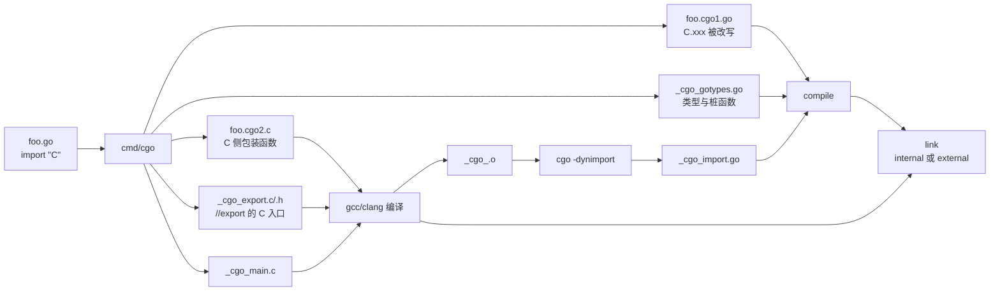
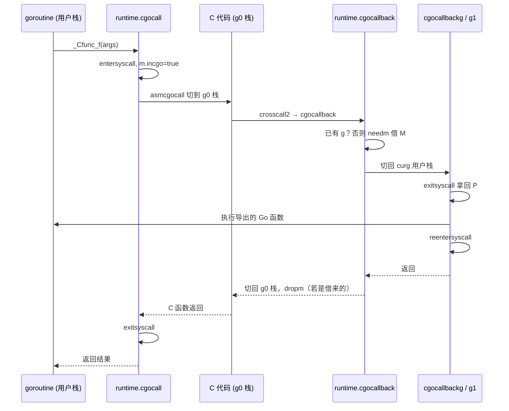
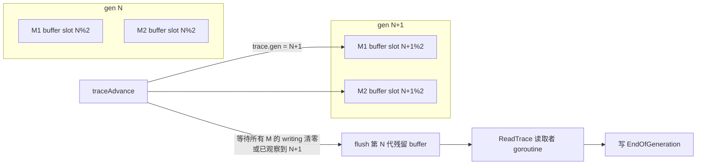
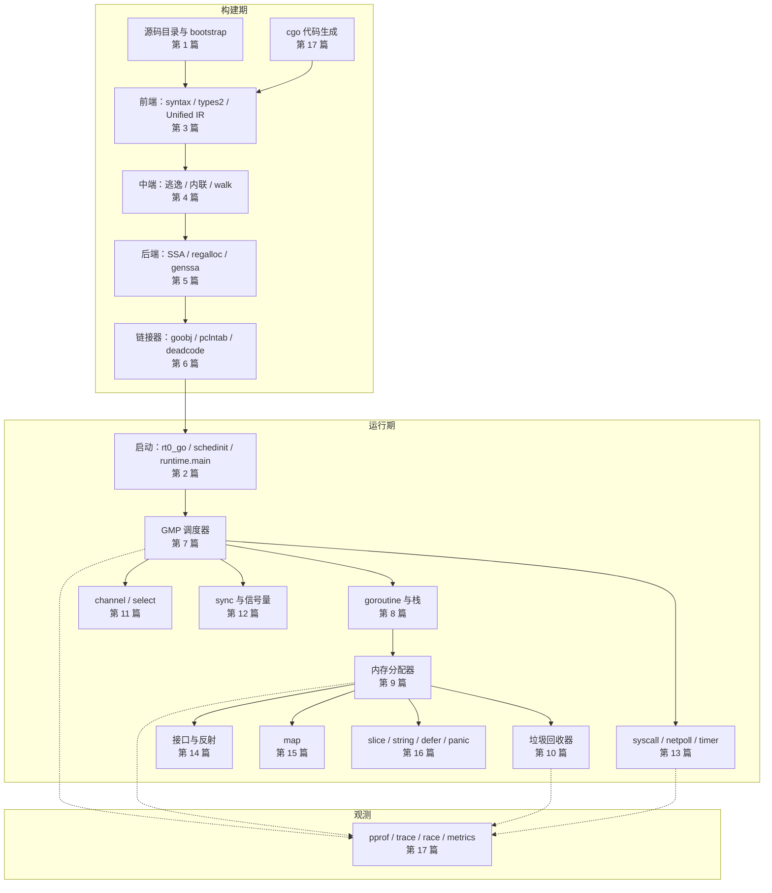

# Go 源码实现详解（十七）：cgo 与运行时可观测性

前十六篇讲的都是"Go 世界内部"：编译器怎么把源码变成机器码，运行时怎么调度、分配、回收。本篇处理两个"边界"问题：

1. **Go 如何与 C 世界互相调用**。cgo 不是语言特性，而是一个代码生成器加一组运行时约定。生成器负责把 `C.xxx` 改写成普通 Go 调用；运行时负责在调用 C 之前离开调度器、切到系统栈，在 C 回调 Go 时借一个 M 回来。
2. **Go 如何观测自己**。pprof、执行跟踪（trace）、race 检测和 `runtime/metrics` 都不是外挂工具，它们的采集端就埋在前面各篇讲过的 mallocgc、schedule、信号处理里。理解采集端，才知道这些数据能信到什么程度。

先给出全篇结论：

- cgo 调用的本质是 `entersyscall → 切 g0 栈 → 调 C → exitsyscall`。调用期间 P 可以被 sysmon 拿走，所以一次 cgo 调用的固定开销远大于一次函数调用，但不会阻塞其他 goroutine。
- C 回调 Go 时，如果当前线程不是 Go 创建的，运行时会从 `extraM` 链表借一个 M（`needm`），回调结束后归还（`dropm`）。Go 1.21 起可以通过 `cgoBindM` 把 M 绑定到 pthread，避免反复借还。
- pprof 的 CPU 采样靠每线程的 `timer_create(CLOCK_THREAD_CPUTIME_ID)` 触发 SIGPROF，在信号处理函数里做栈回溯并写入无锁的 `profBuf`；内存采样按分配字节数做泊松抽样，默认每 512KB 一次。
- 执行跟踪器采用"每 M 缓冲 + 分代"的设计。`traceAdvance` 推进世代号，并保证所有 M 都观察到新世代后才刷出旧缓冲，从而不依赖时间戳也能保证事件的偏序。
- race 检测是编译器在 SSA 构建阶段插入 `raceread`/`racewrite` 调用，加上一个用 cgo 链接进来的 ThreadSanitizer 运行时。
- GODEBUG 有两套消费方：运行时自己的 `dbgvars` 表在启动早期解析；标准库通过 `internal/godebug` 注册，可在运行中被 `os.Setenv` 更新。

## 一、cgo 工具链：从 `import "C"` 到生成文件

### 1.1 cmd/go 如何调用 cgo

当一个包含有 `import "C"` 的文件时，`go build` 不会直接把它交给编译器。`src/cmd/go/internal/work/exec.go` 中的构建动作会先运行 `cgo` 工具：

```go
// src/cmd/go/internal/work/exec.go（cgo 相关片段）
cgoExe := base.Tool("cgo")
// ...
if err := sh.run(p.Dir, p.ImportPath, cgoenv, cfg.BuildToolexec, cgoExe,
	"-objdir", objdir, "-importpath", p.ImportPath, cgoflags, ldflagsOption,
	"--", cgoCPPFLAGS, cgoCFLAGS, cgofiles); err != nil {
	return nil, nil, err
}
// ...
gofiles := []string{objdir + "_cgo_gotypes.go"}
cfiles := []string{objdir + "_cgo_export.c"}
for _, fn := range cgofiles {
	f := strings.TrimSuffix(filepath.Base(fn), ".go")
	gofiles = append(gofiles, objdir+f+".cgo1.go")
	cfiles = append(cfiles, objdir+f+".cgo2.c")
}
```

随后 `processCgoOutputs` 用系统 C 编译器编译所有 `.c` 文件，再调用 `dynimport` 让 cgo 以 `-dynimport` 模式分析链接出的 `_cgo_.o`，生成 `_cgo_import.go`，其中记录了动态库符号（`//go:cgo_import_dynamic` 指令），供链接器在内部链接模式下使用。

整个流程可以画成一张图：



### 1.2 cmd/cgo 的主流程

`src/cmd/cgo/main.go` 的 `main` 是一个很直白的管线：

```go
// src/cmd/cgo/main.go 的 main（节选）
p := newPackage(args[:i])
// ...
for i, input := range goFiles {
	// ...
	f := new(File)
	f.Edit = edit.NewBuffer(b)
	f.ParseGo(input, b)
	f.ProcessCgoDirectives()
	// ...
}
// ...
for _, f := range fs {
	p.Translate(f)
	// ...
	p.Record(f)
	if *godefs {
		os.Stdout.WriteString(p.godefs(f, osArgs))
	} else {
		p.writeOutput(f, input)
	}
}
if !*godefs {
	p.writeDefs()
}
```

- `ParseGo`（`ast.go`）用 `go/parser` 解析源文件，收集所有 `C.xxx` 引用（`Ref`）和 `import "C"` 前的注释块（序言，preamble）。
- `ProcessCgoDirectives` 抽取 `#cgo CFLAGS/LDFLAGS/pkg-config` 指令。
- `Translate`（`gcc.go`）是核心，负责弄清每个 `C.xxx` 到底是什么。
- `writeOutput` 与 `writeDefs`（`out.go`）输出生成文件。

### 1.3 Translate：用 C 编译器当"类型服务器"

cgo 自己不实现 C 解析器。`src/cmd/cgo/gcc.go` 的 `Translate` 完全依赖 gcc：

```go
// src/cmd/cgo/gcc.go 的 Translate
func (p *Package) Translate(f *File) {
	var conv typeConv
	conv.Init(p.PtrSize, p.IntSize)
	for _, d := range f.debugs {
		p.recordTypes(f, d, &conv)
	}
	p.prepareNames(f)
	if p.rewriteCalls(f) {
		f.Edit.Insert(f.offset(f.AST.Name.End()), "; import _cgo_unsafe \"unsafe\"")
	}
	p.rewriteRef(f)
}
```

在这之前，`guessKinds` 和 `loadDWARF` 已经做了两轮"探测式编译"：

1. **`guessKinds`**：把每个名字 `C.foo` 放进一段人造 C 代码，例如 `#line ... foo` 用作表达式、类型、常量等不同上下文，然后调用 `gccErrors` 编译它。根据 gcc 报错的行号，反推出 `foo` 是函数、变量、类型还是宏常量。
2. **`loadDWARF`**：生成一段 C 代码，对每个名字声明一个 `__typeof__(foo) *__cgo__N` 变量，用 `-g` 编译成目标文件，再读取其中的 DWARF 信息。DWARF 里的 `DW_TAG_typedef`、`DW_TAG_structure_type` 等条目给出精确的 C 类型，`typeConv` 再把它映射成 Go 类型（`_Ctype_int`、`_Ctype_struct_foo` 等）。

这就是 cgo 需要"真正的 C 编译器"而不能只看头文件的原因。

### 1.4 rewriteRef 与 rewriteCalls：把 `C.f(x)` 改写掉

`rewriteRef` 遍历所有引用，把 `C.foo` 替换成改写后的表达式，并用 `/*line :L:C*/` 注释保留原始位置，让报错和调试信息仍指向用户源码：

```go
// src/cmd/cgo/gcc.go 的 rewriteRef（节选）
for _, r := range f.Ref {
	// ...
	expr := p.rewriteName(f, r, false)
	// ...
	old := *r.Expr
	*r.Expr = expr

	if !r.Done {
		repl := " " + gofmtPos(expr, old.Pos())
		end := fset.Position(old.End())
		sub := 0
		if r.Name.Kind != "type" {
			sub = 1
		}
		if end.Column > sub {
			repl = fmt.Sprintf("%s /*line :%d:%d*/", repl, end.Line, end.Column-sub)
		}
		if r.Name.Kind != "type" {
			repl = "(" + repl + ")"
		}
		f.Edit.Replace(f.offset(old.Pos()), f.offset(old.End()), repl)
	}
}
```

`rewriteCalls` 处理的是指针检查：如果调用 `C.f(p)` 的实参可能是 Go 指针，它会把调用改写成一个立即执行的闭包，在其中先调用 `_cgoCheckPointer(p, ...)`，再真正调用。这就是 `GODEBUG=cgocheck=1`（默认开启）的编译期落点。

### 1.5 生成的 Go 桩函数与 C 包装函数

对每个被调用的 C 函数，`writeDefsFunc` 在 `_cgo_gotypes.go` 里生成一个 Go 函数：

```go
// src/cmd/cgo/out.go 的 writeDefsFunc 生成的形状（以 C.puts 为例，示意）
//go:cgo_import_static _cgo_xxxx_Cfunc_puts
//go:linkname __cgofn__cgo_xxxx_Cfunc_puts _cgo_xxxx_Cfunc_puts
var __cgofn__cgo_xxxx_Cfunc_puts byte
var _cgo_xxxx_Cfunc_puts = unsafe.Pointer(&__cgofn__cgo_xxxx_Cfunc_puts)

//go:cgo_unsafe_args
func _Cfunc_puts(p0 *_Ctype_char) (r1 _Ctype_int) {
	_cgo_runtime_cgocall(_cgo_xxxx_Cfunc_puts, uintptr(unsafe.Pointer(&p0)))
	if _Cgo_always_false {
		_Cgo_use(p0)
	}
	return
}
```

要点有三个：

- 参数被打包在栈上的连续内存里，只把首地址 `&p0` 传给 C，这就是 `//go:cgo_unsafe_args` 的含义（编译器会在 SSA 构建时设置 `s.cgoUnsafeArgs`，禁止把这些参数放进寄存器）。
- `_cgo_runtime_cgocall` 通过 `goProlog` 里的 linkname 指向 `runtime.cgocall`：

```go
// src/cmd/cgo/out.go 的 goProlog
//go:linkname _cgo_runtime_cgocall runtime.cgocall
func _cgo_runtime_cgocall(unsafe.Pointer, uintptr) int32

//go:linkname _cgoCheckPointer runtime.cgoCheckPointer
//go:noescape
func _cgoCheckPointer(interface{}, interface{})

//go:linkname _cgoCheckResult runtime.cgoCheckResult
//go:noescape
func _cgoCheckResult(interface{})
```

- `_Cgo_use(p0)` 放在永远为假的分支里，作用是让逃逸分析认为参数逃逸到堆，保证 C 代码执行期间它们不会被栈复制移动。当函数标注了 `#cgo noescape` 和 `#cgo nocallback` 时，改用 `_Cgo_keepalive`，只保活不逃逸。

C 侧的包装函数由 `writeOutputFunc` 写进 `.cgo2.c`：

```c
/* src/cmd/cgo/out.go 的 writeOutputFunc 生成的形状 */
CGO_NO_SANITIZE_THREAD
void
_cgo_xxxx_Cfunc_puts(void *v __attribute__((unused)))
{
	struct { char* p0; int r; char __pad[4]; } __attribute__((__packed__)) *_cgo_a = v;
	char *_cgo_stktop = _cgo_topofstack();
	__typeof__(_cgo_a->r) _cgo_r;
	_cgo_tsan_acquire();
	_cgo_r = puts(_cgo_a->p0);
	_cgo_tsan_release();
	_cgo_a = (void*)((char*)_cgo_a + (_cgo_topofstack() - _cgo_stktop));
	_cgo_a->r = _cgo_r;
	_cgo_msan_write(&_cgo_a->r, sizeof(_cgo_a->r));
}
```

注意 `_cgo_topofstack()` 那一行：C 函数执行期间如果发生了回调 Go 且 goroutine 栈被扩容复制，参数块的地址会变。包装函数通过比较调用前后 goroutine 栈顶的差值来修正 `_cgo_a`，再写回返回值。这是"C 代码里也要考虑 Go 栈会动"的一个直接证据。

## 二、运行时调用路径：Go 调用 C

### 2.1 cgocall

生成的桩函数最终进入 `src/runtime/cgocall.go` 的 `cgocall`：

```go
// src/runtime/cgocall.go 的 cgocall（去掉注释）
func cgocall(fn, arg unsafe.Pointer) int32 {
	if !iscgo && GOOS != "solaris" && GOOS != "illumos" && GOOS != "windows" {
		throw("cgocall unavailable")
	}
	if fn == nil {
		throw("cgocall nil")
	}
	if raceenabled {
		racereleasemerge(unsafe.Pointer(&racecgosync))
	}

	mp := getg().m
	mp.ncgocall++
	mp.cgoCallers[0] = 0

	entersyscall()

	osPreemptExtEnter(mp)
	mp.incgo = true
	mp.ncgo++

	errno := asmcgocall(fn, arg)

	mp.incgo = false
	mp.ncgo--
	osPreemptExtExit(mp)

	winsyscall := mp.winsyscall
	exitsyscall()
	getg().m.winsyscall = winsyscall
	// ...
	KeepAlive(fn)
	KeepAlive(arg)
	KeepAlive(mp)
	return errno
}
```

这段代码把 cgo 调用与第十三篇讲的系统调用统一了起来：

- `entersyscall` 把 G 置为 `_Gsyscall`、P 置为 `_Psyscall`，之后 sysmon 的 `retake` 可以把这个 P 交给其他 M 去跑别的 goroutine。
- `mp.incgo`、`mp.ncgo` 标记"此 M 正在 C 里"，供 `sigprof`、traceback 和回调路径判断。
- `osPreemptExtEnter` 在 Linux 上是空操作，在 Windows 上用于关闭异步抢占。
- 调用结束后 `exitsyscall` 尝试拿回 P；拿不到就让出 M，等调度。

因此，一次 cgo 调用的固定成本包括：一次 `entersyscall`/`exitsyscall`（若 P 被拿走则更贵）、一次 g0 栈切换、以及 C 侧的 `_cgo_tsan_acquire/release`。社区常引用的"几十纳秒到上百纳秒"量级就来自这里，而不是 C 函数本身。

### 2.2 asmcgocall：切到系统栈

C 代码不知道 Go 的可增长栈，所以必须在一个足够大的、不会被移动的栈上运行，这就是 M 的 g0 栈（cgo 模式下由 pthread 创建，通常 8MB 左右）。`src/runtime/asm_amd64.s` 的 `asmcgocall`：

```asm
// src/runtime/asm_amd64.s 的 asmcgocall（节选）
TEXT ·asmcgocall(SB),NOSPLIT,$0-20
	get_tls(CX)
	MOVQ	g(CX), DI
	CMPQ	DI, $0
	JEQ	nosave
	MOVQ	g_m(DI), R8
	MOVQ	m_gsignal(R8), SI
	CMPQ	DI, SI
	JEQ	nosave
	MOVQ	m_g0(R8), SI
	CMPQ	DI, SI
	JEQ	nosave
	// ...
	MOVQ	fn+0(FP), AX
	MOVQ	arg+8(FP), BX
	MOVQ	SP, DX

	// Switch to system stack.
	CALL	gosave_systemstack_switch<>(SB)
	MOVQ	SI, g(CX)
	MOVQ	(g_sched+gobuf_sp)(SI), SP

	// Now on a scheduling stack (a pthread-created stack).
	SUBQ	$16, SP
	ANDQ	$~15, SP	// alignment for gcc ABI
	MOVQ	DI, 8(SP)	// save g
	MOVQ	(g_stack+stack_hi)(DI), DI
	SUBQ	DX, DI
	MOVQ	DI, 0(SP)	// save depth in stack (can't just save SP, as stack might be copied during a callback)
	CALL	runtime·asmcgocall_landingpad(SB)
```

三处细节值得注意：

1. 先判断当前是否已在 g0 或 gsignal 栈上（`nosave` 分支），因为 `asmcgocall` 也被 `newm1` 用来创建线程，那时就已经在系统栈上了。
2. `gosave_systemstack_switch` 保存当前 goroutine 的 SP/PC 到 `g.sched`，这与第八篇讲的 `systemstack` 是同一套机制。
3. 保存的不是用户栈 SP 的绝对值，而是"距栈顶的深度"。原因写在注释里：C 代码可能回调 Go，回调期间 goroutine 栈可能被复制到新地址，返回时必须按深度重新计算 SP。

`asmcgocall_landingpad` 是一个小包装，负责在 C 函数以 `longjmp`/异常方式异常返回时兜底。

## 三、C 调用 Go：回调与 extra M

### 3.1 `//export` 与 crosscall2

被 `//export` 的 Go 函数，cgo 会在 `_cgo_export.c` 里生成同名 C 函数。它把参数打包后调用 `crosscall2`（`src/runtime/cgo/asm_amd64.s`），`crosscall2` 再按 Go 的 ABI0 调用 `runtime.cgocallback`。



### 3.2 cgocallback：有没有 g，是两条路

`src/runtime/asm_amd64.s` 的 `cgocallback` 首先判断当前线程有没有 Go 的 g：

```asm
// src/runtime/asm_amd64.s 的 cgocallback（节选）
TEXT ·cgocallback(SB),NOSPLIT,$24-24
	NO_LOCAL_POINTERS

	// Skip cgocallbackg, just dropm when fn is nil, and frame is the saved g.
	// It is used to dropm while thread is exiting.
	MOVQ	fn+0(FP), AX
	CMPQ	AX, $0
	JNE	loadg
	// Restore the g from frame.
	get_tls(CX)
	MOVQ	frame+8(FP), BX
	MOVQ	BX, g(CX)
	JMP	dropm

loadg:
	// If g is nil, Go did not create the current thread,
	// or if this thread never called into Go on pthread platforms.
	// Call needm to obtain one m for temporary use.
	get_tls(CX)
	MOVQ	g(CX), BX
	CMPQ	BX, $0
	JEQ	needm
	MOVQ	g_m(BX), BX
	MOVQ	BX, savedm-8(SP)	// saved copy of oldm
	JMP	havem
```

- 线程是 Go 创建的（或之前已绑定过 M）：TLS 里有 g，直接走 `havem`，把 SP 切到 `m.curg` 的栈继续。
- 线程是 C 创建的：TLS 里 g 为 nil，走 `needm`。
- `fn == nil` 是一个特殊约定：pthread 线程退出时，通过 pthread key 析构函数触发 `cgocallback(nil, g)`，用于归还绑定的 M。

### 3.3 needm 与 dropm：借 M 与还 M

`src/runtime/proc.go` 的 `needm` 从 `extraM` 链表拿一个预先创建好的 M：

```go
// src/runtime/proc.go 的 needm（节选）
func needm(signal bool) {
	if (iscgo || GOOS == "windows") && !cgoHasExtraM {
		writeErrStr("fatal error: cgo callback before cgo call\n")
		exit(1)
	}

	var sigmask sigset
	sigsave(&sigmask)
	sigblock(false)

	mp, last := getExtraM()
	mp.needextram = last
	mp.sigmask = sigmask

	osSetupTLS(mp)

	setg(mp.g0)
	sp := sys.GetCallerSP()
	callbackUpdateSystemStack(mp, sp, signal)

	mp.isExtraInC = false

	asminit()
	minit()
	// ...
	casgstatus(mp.curg, _Gdeadextra, _Gsyscall)
	sched.ngsys.Add(-1)
	addGSyscallNoP(mp)
	// ...
	mp.isExtraInSig = signal
}
```

几个设计点：

- **为什么必须预先创建**：`needm` 运行在一个没有 g 的 C 线程上，此时不能调用 `malloc`，也不能扩栈，所以 M 和它的 g0、curg 都必须在之前的某次 cgo 调用里由 `newextram` 准备好。`cgocallbackg1` 开头的 `if gp.m.needextram || extraMWaiters.Load() > 0 { systemstack(newextram) }` 就是在补充库存。
- **借来的 M 没有真正的 g0 栈信息**：`callbackUpdateSystemStack` 根据当前 C 线程的 SP 估算一段栈范围填入 `m.g0.stack`，供栈检查使用。
- **curg 的状态是 `_Gdeadextra`**：这是专门为 extra M 的 curg 定义的状态。`needm` 把它改为 `_Gsyscall`，看起来就像"一个 goroutine 正在系统调用中"，后续 `exitsyscall` 才能正常工作。

`dropm` 做相反的事：把 curg 改回 `_Gdeadextra`、`unminit`、`setg(nil)`、清空 g0 栈范围，然后 `putExtraM` 归还。

### 3.4 cgoBindM：把 M 绑在线程上

每次回调都借还 M 的成本不小（涉及 TLS 设置、`minit` 安装信号栈等）。Go 1.21 起，`cgocallbackg1` 之后若发现 `m.isextra`，会调用 `cgoBindM`：

```go
// src/runtime/proc.go 的 cgoBindM
func cgoBindM() {
	if GOOS == "windows" || GOOS == "plan9" {
		fatal("bindm in unexpected GOOS")
	}
	g := getg()
	if g.m.g0 != g {
		fatal("the current g is not g0")
	}
	if _cgo_bindm != nil {
		asmcgocall(_cgo_bindm, unsafe.Pointer(g))
	}
}
```

C 侧的 `x_cgo_bindm` 把 g 存进一个 pthread key，并注册析构函数。此后同一线程再次回调 Go 时 TLS 里已有 g，走 `havem` 快路径；线程退出时析构函数调用 `cgocallback(nil, g)` 触发 `dropm`。`m.isExtraInC` 标记 M 虽然绑定了线程但当前正在 C 里，这样 GC 和 goroutine profile 就知道它的 curg 不需要扫描。

### 3.5 cgocallbackg：从 g0 回到用户栈之后

汇编把 SP 切到 `m.curg` 的栈后调用 `cgocallbackg`：

```go
// src/runtime/cgocall.go 的 cgocallbackg（节选）
func cgocallbackg(fn, frame unsafe.Pointer, ctxt uintptr) {
	gp := getg()
	if gp != gp.m.curg {
		println("runtime: bad g in cgocallback")
		exit(2)
	}

	sp := gp.m.g0.sched.sp // system sp saved by cgocallback.
	oldStack := gp.m.g0.stack
	oldAccurate := gp.m.g0StackAccurate
	callbackUpdateSystemStack(gp.m, sp, false)

	lockOSThread()

	checkm := gp.m
	// ...
	savedsp := unsafe.Pointer(gp.syscallsp)
	savedpc := gp.syscallpc
	savedbp := unsafe.Pointer(gp.syscallbp)
	exitsyscall() // coming out of cgo call
	gp.m.incgo = false
	// ...
	if gp.nocgocallback {
		panic("runtime: function marked with #cgo nocallback called back into Go")
	}

	cgocallbackg1(fn, frame, ctxt)

	gp.m.incgo = true
	unlockOSThread()
	// ...
	reentersyscall(savedpc, uintptr(savedsp), uintptr(savedbp))
	// ...
}
```

- `lockOSThread`：回调期间 goroutine 必须留在这个线程上，因为 C 栈帧还在这个线程的栈里等着返回。
- `exitsyscall` / `reentersyscall`：回调开始时"从系统调用返回"以获取 P，回调结束再"重新进入系统调用"，保证外层的 `cgocall` 看到的状态一致。`savedsp`/`savedpc` 就是外层 `entersyscall` 记录的值。
- `#cgo nocallback` 标注的函数如果回调了 Go，这里会 panic。

`cgocallbackg1` 做剩下的事：补充 extra M、追加 `cgoCtxt`（供 C 侧 traceback 使用）、等待 `main` 包初始化完成（`mainInitDoneChan`）、同步 CPU profiler 频率、然后通过一个手工构造的 `funcval` 调用导出函数。`defer unwindm(&restore)` 处理回调中 panic 穿越 C 帧的情况。

### 3.6 cgo 模式下线程如何创建

开启 cgo 后，运行时不再直接 `clone`，而是让 C 用 pthread 创建线程，这样 C 库的 TLS、线程取消等机制才正常：

```go
// src/runtime/proc.go 的 newm1
func newm1(mp *m) {
	if iscgo && _cgo_thread_start != nil {
		var ts cgothreadstart
		ts.g.set(mp.g0)
		ts.tls = (*uint64)(unsafe.Pointer(&mp.tls[0]))
		ts.fn = unsafe.Pointer(abi.FuncPCABI0(mstart))
		// ...
		execLock.rlock() // Prevent process clone.
		asmcgocall(_cgo_thread_start, unsafe.Pointer(&ts))
		execLock.runlock()
		return
	}
	execLock.rlock() // Prevent process clone.
	newosproc(mp)
	execLock.runlock()
}
```

`_cgo_thread_start` 指向 `src/runtime/cgo/gcc_libinit_unix.c` 的 `x_cgo_thread_start`，它复制一份 `ThreadStart` 后交给平台相关的 `_cgo_sys_thread_start`（`gcc_linux_amd64.c` 等）去 `pthread_create`。新线程的入口 `threadentry` 设置 TLS 中的 g，再跳到 `mstart`。

`runtime/cgo` 包与 `runtime` 之间的桥接全部靠 `go:linkname`，`src/runtime/cgo/callbacks.go` 里把 C 符号 `x_cgo_*` 的地址赋给 `runtime` 里的 `_cgo_*` 变量；`src/runtime/cgo.go` 中声明了 `_cgo_init`、`_cgo_thread_start`、`_cgo_notify_runtime_init_done` 等。`iscgo` 变量也由 `runtime/cgo` 包在 init 时置为 true。

## 四、cgo 与 GC、调度器的交互

### 4.1 指针传递规则的运行时检查

cgo 文档规定：传给 C 的 Go 指针，其指向的内存不能再包含 Go 指针；C 也不能保存 Go 指针。运行时在两个位置检查：

**调用前检查**（`cgocheck=1`，默认）：`rewriteCalls` 插入的 `_cgoCheckPointer` 调用进入 `src/runtime/cgocall.go` 的 `cgoCheckPointer`：

```go
// src/runtime/cgocall.go 的 cgoCheckPointer（节选）
func cgoCheckPointer(ptr any, arg any) {
	if !goexperiment.CgoCheck2 && debug.cgocheck == 0 {
		return
	}

	ep := efaceOf(&ptr)
	t := ep._type

	top := true
	if arg != nil && (t.Kind() == abi.Pointer || t.Kind() == abi.UnsafePointer) {
		p := ep.data
		if !t.IsDirectIface() {
			p = *(*unsafe.Pointer)(p)
		}
		if p == nil || !cgoIsGoPointer(p) {
			return
		}
		// ... 根据 arg 的类型决定检查整块数组还是单个元素
	}

	cgoCheckArg(t, ep.data, !t.IsDirectIface(), top, cgoCheckPointerFail)
}
```

`cgoCheckArg` 按类型递归：对含指针的结构体逐字段检查，对未知类型用堆位图（第九篇的 `typePointers`）扫描，发现内部还有 Go 指针就 `panic("cgo argument has Go pointer to unpinned Go pointer")`。`cgoIsGoPointer` 判断地址是否落在 Go 堆、数据段或 BSS 中。

**写入时检查**（`GOEXPERIMENT=cgocheck2`）：编译器在写屏障处调用 `src/runtime/cgocheck.go` 的 `cgoCheckPtrWrite`，检查"把 Go 指针写到非 Go 内存"：

```go
// src/runtime/cgocheck.go 的 cgoCheckPtrWrite（节选）
func cgoCheckPtrWrite(dst *unsafe.Pointer, src unsafe.Pointer) {
	if !mainStarted {
		return
	}
	if !cgoIsGoPointer(src) {
		return
	}
	if cgoIsGoPointer(unsafe.Pointer(dst)) {
		return
	}
	// ...
	if isPinned(src) {
		return
	}
	if inPersistentAlloc(uintptr(unsafe.Pointer(dst))) {
		return
	}
	systemstack(func() {
		println("write of unpinned Go pointer", hex(uintptr(src)), "to non-Go memory", hex(uintptr(unsafe.Pointer(dst))))
		throw(cgoWriteBarrierFail)
	})
}
```

这个检查开销大，只在实验模式下启用。注意历史差异：Go 1.21 之前 `GODEBUG=cgocheck=2` 就能打开它，之后改为 `GOEXPERIMENT=cgocheck2`，需要重新编译。

### 4.2 runtime.Pinner：允许 C 持有 Go 指针

Go 1.21 加入的 `runtime.Pinner` 让上面的规则有了例外。`src/runtime/pinner.go` 的 `Pin`：

```go
// src/runtime/pinner.go 的 Pin（节选）
func (p *Pinner) Pin(pointer any) {
	if p.pinner == nil {
		mp := acquirem()
		if pp := mp.p.ptr(); pp != nil {
			p.pinner = pp.pinnerCache
			pp.pinnerCache = nil
		}
		releasem(mp)

		if p.pinner == nil {
			p.pinner = new(pinner)
			p.refs = p.refStore[:0]
			SetFinalizer(p.pinner, func(i *pinner) {
				if len(i.refs) != 0 {
					i.unpin()
					pinnerLeakPanic()
				}
			})
		}
	}
	ptr := pinnerGetPtr(&pointer)
	if setPinned(ptr, true) {
		p.refs = append(p.refs, ptr)
	}
}
```

`setPinned` 在对象所在 span 上分配一份 `pinnerBits`（与 `allocBits`、`gcmarkBits` 同构的位图），每个对象两位：pinned 和 multipinned；同一对象被多次 Pin 时，计数放在 span 的 special 记录里。GC 不会移动堆对象，所以 Pin 的意义不是"禁止移动"，而是：

- `cgoCheckPointer`/`cgoCheckPtrWrite` 看到 pinned 对象时放行；
- 忘记 `Unpin` 时 finalizer 会 panic 提醒泄漏。

`runtime.KeepAlive` 则是另一层保障：让编译器认为对象在该点仍然活跃，避免 C 还在用时 Go 侧已经回收。`cgocall` 末尾的三个 `KeepAlive` 就是这个用途。

### 4.3 代价清单

把前面的路径串起来，一次 cgo 调用的隐性成本可以列成表：

| 环节 | 来源 | 影响 |
| --- | --- | --- |
| entersyscall / exitsyscall | `cgocall` | P 可能被 sysmon 拿走，返回时需重新获取 |
| g0 栈切换 | `asmcgocall` | 两次寄存器保存/恢复 |
| 参数逃逸 | `_Cgo_use` | 传入的指针类参数分配到堆 |
| 指针检查 | `cgoCheckPointer` | 按参数类型递归扫描 |
| 线程占用 | 阻塞的 C 调用 | 每个阻塞中的 cgo 调用独占一个 OS 线程 |
| 回调借 M | `needm`/`dropm` | 非 Go 线程首次回调需安装 TLS、信号栈 |

因此高频小函数不适合 cgo，批量化接口更划算；长时间阻塞的 C 调用会推高线程数，需要用 `debug.SetMaxThreads` 或在 C 侧限流。

## 五、pprof：采样式剖析的采集端

`runtime/pprof` 只是编码器，真正的数据在 `runtime` 里产生。四种主要 profile 的采样机制各不相同。

### 5.1 内存 profile：按分配字节数抽样

第九篇讲 `mallocgc` 时提到过 `c.nextSample`。每个 mcache 维护"距下一次采样还有多少字节"：

```go
// src/runtime/malloc.go（各 mallocgc 变体中重复出现的片段）
c.nextSample -= int64(size)
if c.nextSample < 0 || MemProfileRate != c.memProfRate {
	profilealloc(mp, x, size)
}
```

```go
// src/runtime/malloc.go 的 profilealloc
func profilealloc(mp *m, x unsafe.Pointer, size uintptr) {
	c := getMCache(mp)
	if c == nil {
		throw("profilealloc called without a P or outside bootstrapping")
	}
	c.memProfRate = MemProfileRate
	c.nextSample = nextSample()
	mProf_Malloc(mp, x, size)
}
```

`nextSample` 按均值为 `MemProfileRate`（默认 512KB）的指数分布取随机数，实现泊松抽样，这样大对象和小对象被采中的概率都与其字节数成正比。`mProf_Malloc` 记录调用栈到 bucket：

```go
// src/runtime/mprof.go 的 mProf_Malloc（节选）
func mProf_Malloc(mp *m, p unsafe.Pointer, size uintptr) {
	if mp.profStack == nil {
		return
	}
	nstk := callers(3, mp.profStack[:debug.profstackdepth+2])
	index := (mProfCycle.read() + 2) % uint32(len(memRecord{}.future))

	b := stkbucket(memProfile, size, mp.profStack[:nstk], true)
	mr := b.mp()
	mpc := &mr.future[index]

	lock(&profMemFutureLock[index])
	mpc.allocs++
	unlock(&profMemFutureLock[index])

	systemstack(func() {
		setprofilebucket(p, b)
	})
}
```

两个关键设计：

- **bucket 按（调用栈，size）哈希**：`stkbucket` 在全局哈希表 `buckhash` 里查找或创建 bucket，同一位置分配的同一大小对象共享一个 bucket。
- **三阶段周期**：`memRecord.future` 是长度为 3 的环。分配时写入 `future[cycle+2]`，释放时（`mProf_Free`，由 sweep 发现对象死亡时通过 special 记录触发）写入对应周期；`mProf_NextCycle`/`mProf_Flush` 在 GC 边界推进周期。这样读取到的 in-use 统计总是对应一个完整的 GC 周期，避免"分配了但还没来得及被回收"造成的假象。

`setprofilebucket` 给对象挂一个 `specialProfile` 记录，这就是释放时能找回 bucket 的原因。

### 5.2 block 与 mutex profile

阻塞 profile 记录 goroutine 在 channel、锁、select 上等待的时间。`gopark` 返回后，各阻塞点调用 `blockevent`：

```go
// src/runtime/mprof.go 的 blockevent 与 blocksampled
func blockevent(cycles int64, skip int) {
	if cycles <= 0 {
		cycles = 1
	}
	rate := int64(atomic.Load64(&blockprofilerate))
	if blocksampled(cycles, rate) {
		saveblockevent(cycles, rate, skip+1, blockProfile)
	}
}

func blocksampled(cycles, rate int64) bool {
	if rate <= 0 || (rate > cycles && cheaprand64()%rate > cycles) {
		return false
	}
	return true
}
```

`SetBlockProfileRate(rate)` 的参数是纳秒，运行时把它换算成 CPU 周期数存入 `blockprofilerate`。采样规则是：阻塞超过 rate 的事件必录，短于 rate 的按 `cycles/rate` 的概率录，并在记录时按 `rate/cycles` 加权补偿，所以统计上无偏。

mutex profile 则在 `Unlock` 时由 `sync` 包通过 `runtime_SemreleaseMutex` → `mutexevent` 触发，按 `SetMutexProfileFraction(n)` 设定的 1/n 比例抽样：

```go
// src/runtime/mprof.go 的 mutexevent
func mutexevent(cycles int64, skip int) {
	if cycles < 0 {
		cycles = 0
	}
	rate := int64(atomic.Load64(&mutexprofilerate))
	if rate > 0 && cheaprand64()%rate == 0 {
		saveblockevent(cycles, rate, skip+1, mutexProfile)
	}
}
```

运行时内部锁（`lock2`）的争用也会进 mutex profile，路径是 `mLockProfile`（同文件 `mLockProfile.recordUnlock`），Go 1.22 加入。

### 5.3 CPU profile：每线程定时器 + SIGPROF

`pprof.StartCPUProfile` 调用 `runtime.SetCPUProfileRate(100)`，落到 `src/runtime/cpuprof.go`：

```go
// src/runtime/cpuprof.go 的 setCPUProfileRate（节选）
func setCPUProfileRate(hz int, warn bool) {
	// ...
	lock(&cpuprof.lock)
	if hz > 0 {
		if cpuprof.on || cpuprof.log != nil {
			// ...
			return
		}
		cpuprof.on = true
		cpuprof.log = newProfBuf(1, profBufWordCount, profBufTagCount)
		hdr := [1]uint64{uint64(hz)}
		cpuprof.log.write(nil, nanotime(), hdr[:], nil)
		setcpuprofilerate(int32(hz))
	} else if cpuprof.on {
		setcpuprofilerate(0)
		cpuprof.on = false
		cpuprof.addExtra()
		cpuprof.log.close()
	}
	unlock(&cpuprof.lock)
}
```

`setcpuprofilerate` 先设置进程级的 `setitimer(ITIMER_PROF)` 作为兜底，再为当前线程调用 `setThreadCPUProfiler`。Linux 上后者用的是 `timer_create`：

```go
// src/runtime/os_linux.go 的 setThreadCPUProfiler（节选）
spec := new(itimerspec)
spec.it_value.setNsec(1 + int64(cheaprandn(uint32(1e9/hz))))
spec.it_interval.setNsec(1e9 / int64(hz))

var timerid int32
var sevp sigevent
sevp.notify = _SIGEV_THREAD_ID
sevp.signo = _SIGPROF
sevp.sigev_notify_thread_id = int32(mp.procid)
ret := timer_create(_CLOCK_THREAD_CPUTIME_ID, &sevp, &timerid)
```

这是 Go 1.18 引入的改进：进程级 `setitimer` 在多核上最多每个 tick 发一个信号，多线程程序会严重低估 CPU 时间；`CLOCK_THREAD_CPUTIME_ID` 的每线程定时器按每个线程自己消耗的 CPU 时间触发，采样才准确。新线程在 `minit` 时、以及 extra M 在 `cgocallbackg1` 中，都会检查 `m.profilehz != sched.profilehz` 并补装定时器。初始延迟加了随机扰动，避免所有线程同相位采样。

信号到达后，`sighandler` 调用 `sigprof`：

```go
// src/runtime/proc.go 的 sigprof（节选）
var u unwinder
var stk [maxCPUProfStack]uintptr
n := 0
if mp.ncgo > 0 && mp.curg != nil && mp.curg.syscallpc != 0 && mp.curg.syscallsp != 0 {
	// 正在 C 里：先拷贝 C 侧栈（由 cgo traceback 函数填充的 cgoCallers），再从 syscall 现场回溯 Go 栈
	// ...
	u.initAt(mp.curg.syscallpc, mp.curg.syscallsp, 0, mp.curg, unwindSilentErrors)
} else if mp != nil && mp.vdsoSP != 0 {
	u.initAt(mp.vdsoPC, mp.vdsoSP, 0, gp, unwindSilentErrors|unwindJumpStack)
} else {
	u.initAt(pc, sp, lr, gp, unwindSilentErrors|unwindTrap|unwindJumpStack)
}
n += tracebackPCs(&u, 0, stk[n:])

if n <= 0 {
	n = 2
	if inVDSOPage(pc) {
		pc = abi.FuncPCABIInternal(_VDSO) + sys.PCQuantum
	} else if pc > firstmoduledata.etext {
		pc = abi.FuncPCABIInternal(_ExternalCode) + sys.PCQuantum
	}
	stk[0] = pc
	if mp.preemptoff != "" {
		stk[1] = abi.FuncPCABIInternal(_GC) + sys.PCQuantum
	} else {
		stk[1] = abi.FuncPCABIInternal(_System) + sys.PCQuantum
	}
}
```

这段解释了 pprof 图里几个"假函数"的来源：`runtime._ExternalCode`（PC 在 Go 文本段之外，通常是 C 代码）、`runtime._VDSO`、`runtime._System`、`runtime._GC`。它们都是回溯失败时的占位符。

采样最终通过 `cpuprof.add` 写入 `profBuf`：

```go
// src/runtime/cpuprof.go 的 add
func (p *cpuProfile) add(tagPtr *unsafe.Pointer, stk []uintptr) {
	for !prof.signalLock.CompareAndSwap(0, 1) {
		osyield()
	}

	if prof.hz.Load() != 0 { // implies cpuprof.log != nil
		if p.numExtra > 0 || p.lostExtra > 0 || p.lostAtomic > 0 {
			p.addExtra()
		}
		hdr := [1]uint64{1}
		cpuprof.log.write(tagPtr, nanotime(), hdr[:], stk)
	}

	prof.signalLock.Store(0)
}
```

`src/runtime/profbuf.go` 的 `profBuf` 是一个单写者（信号处理函数）单读者（`profileWriter` goroutine）的无锁环形缓冲。文件头注释说明了它的约束：写者可能在没有 g 的信号上下文运行，不能加锁、不能分配；读者追上写者时可以阻塞等待；缓冲满时写者丢弃事件并记录一条"overflow"条目（含丢弃数量和首个丢弃时间），保证 profile 里能看到丢样。`tagPtr` 指向 goroutine 的 `labels`，这就是 pprof labels 能附着到 CPU 样本上的机制。

`runtime/pprof` 侧的 `profileWriter` 每 100ms 调一次 `readProfile`（linkname 到 `runtime_pprof_readProfile`）取走数据，`StopCPUProfile` 后编码成 proto 格式。

### 5.4 goroutine profile：不再长时间 STW

Go 1.19 之前，goroutine profile 会在 STW 期间遍历所有 goroutine 并回溯栈，goroutine 数量大时停顿明显。现在的 `goroutineProfileWithLabelsConcurrent` 只做两次很短的 STW：

```go
// src/runtime/mprof.go 的 goroutineProfileWithLabelsConcurrent（节选）
stw := stopTheWorld(stwGoroutineProfile)
n = int(gcount(false))
// ...
if n > len(p) {
	startTheWorld(stw)
	semrelease(&goroutineProfile.sema)
	return n, false
}
// 先记录自己
systemstack(func() {
	saveg(pc, sp, ourg, &p[0], pcbuf)
})
ourg.goroutineProfiled.Store(goroutineProfileSatisfied)
goroutineProfile.offset.Store(1)

goroutineProfile.active = true
goroutineProfile.records = p
goroutineProfile.labels = labels
startTheWorld(stw)

forEachGRace(func(gp1 *g) {
	tryRecordGoroutineProfile(gp1, pcbuf, Gosched)
})

stw = stopTheWorld(stwGoroutineProfileCleanup)
endOffset := goroutineProfile.offset.Swap(0)
goroutineProfile.active = false
// ...
startTheWorld(stw)
```

第一次 STW 只做计数并打开 `goroutineProfile.active` 标志；之后并发遍历。为了保证每个 goroutine 恰好被记录一次且记录的是"profile 开始那一刻"的栈，每个 g 有 `goroutineProfiled` 状态（Absent / InProgress / Satisfied）：如果一个 goroutine 在被 profile 记录之前先被调度器唤醒，调度器会先调用 `tryRecordGoroutineProfileWB` 记录它当前的栈再让它跑，相当于一个"写屏障"。

## 六、执行跟踪器：每 M 缓冲与分代

`runtime/trace` 在 Go 1.22 被完全重写（trace v2）。`src/runtime/trace.go` 文件头的设计注释是最好的入门材料，核心思想有三点。

### 6.1 每 M 缓冲与写标志

每个 M 有自己的 `traceBuf`，写事件时先 `traceAcquire`：

```go
// src/runtime/traceruntime.go 的 traceAcquireEnabled
func traceAcquireEnabled() traceLocker {
	lockRankMayTraceFlush()

	mp := acquirem()

	if mp.trace.writing.Load() {
		mp.trace.reentered++
		return traceLocker{mp, mp.trace.entryGen}
	}

	mp.trace.writing.Store(true)

	gen := trace.gen.Load()
	if gen == 0 {
		mp.trace.writing.Store(false)
		releasem(mp)
		return traceLocker{}
	}
	mp.trace.entryGen = gen
	return traceLocker{mp, gen}
}
```

`writing` 标志和 `entryGen` 是整个设计的支点：M 在置位 `writing` 之后才读取 `trace.gen`，并且此后写入的所有事件都属于 `entryGen` 这一代。

### 6.2 分代：不用时间戳也能排序



`traceAdvance` 是唯一推进世代的地方。它的步骤（对照源码）：

1. 遍历所有 goroutine，对本代还没有发出状态事件的 G，用 `suspendG` 短暂挂起并记录其状态与栈（`traceStack`）。
2. `traceNextGen` 把 `trace.gen` 加一，并注册新一代的标签与原因字符串表。
3. 通过 `forEachP` 让每个 P 写出自己的 `ProcStatus`。
4. 等待所有 M 退出旧世代的写入（检查每个 M 的 `writing` 与 `entryGen`），然后把旧世代的 `traceBuf` 全部推入 `trace.full[gen%2]` 队列。
5. 刷出 CPU 样本、栈表、字符串表、类型表；通知读取者。

每个 M 拥有两个 buffer 槽（`gen%2`），旧世代刷出时新世代已经在写另一个槽，所以推进世代不需要停止世界。为了在读取时重建顺序，G 和 P 各有一个每代重置的序列号（`goroutine seq`、`P seq`），事件里携带它们，解析器据此恢复偏序；M 不需要序列号，因为同一个 M 的 buffer 天然有序。

`trace` 全局结构体里成对出现的字段（`full [2]`、`stackTab [2]`、`stringTab [2]`、`cpuLogRead [2]` 等）都是这套双缓冲的体现。

### 6.3 事件编码

`traceBuf` 是一块 `NotInHeap` 的固定大小内存（`tracev2.MaxBatchSize`）。事件格式极简：一个字节事件类型，后面跟若干 LEB128 varint。事件表在 `src/internal/trace/tracev2/events.go`：

```go
// src/internal/trace/tracev2/events.go（节选）
EvEventBatch // start of per-M batch of events [generation, M ID, timestamp, batch length]
EvStacks     // start of a section of the stack table [...EvStack]
EvStack      // stack table entry [ID, ...{PC, func string ID, file string ID, line #}]
EvStrings    // start of a section of the string dictionary [...EvString]
EvCPUSamples // start of a section of CPU samples [...EvCPUSample]
// Procs.
EvProcStart   // start of P [timestamp, P ID, P seq]
EvProcStop    // stop of P [timestamp]
EvProcSteal   // P was stolen [timestamp, P ID, P seq, M ID]
// Goroutines.
EvGoCreate            // goroutine creation [timestamp, new goroutine ID, new stack ID, stack ID]
EvGoStart             // goroutine starts running [timestamp, goroutine ID, goroutine seq]
EvGoBlock             // goroutine blocks [timestamp, reason, stack ID]
EvGoUnblock           // goroutine is unblocked [timestamp, goroutine ID, goroutine seq, stack ID]
EvGoSyscallBegin      // syscall enter [timestamp, P seq, stack ID]
// GC events.
EvGCBegin            // GC start [timestamp, seq, stack ID]
EvGCMarkAssistBegin  // GC mark assist start [timestamp, stack ID]
EvHeapAlloc          // gcController.heapLive change [timestamp, heap alloc in bytes]
// Annotations.
EvUserRegionBegin // trace.{Start,With}Region [timestamp, internal task ID, name string ID, stack ID]
EvUserLog         // trace.Log [timestamp, internal task ID, key string ID, value string ID, stack]
```

栈和字符串在一代内去重编号（`traceStackTable`、`traceStringTable`），事件只引用 ID。时间戳来自 `traceClockNow`（amd64 上是 `RDTSC`，其他平台是 `nanotime`），`EvFrequency` 记录换算系数。CPU profile 开着时，`sigprof` 里的 `traceCPUSample` 会把样本也写入 trace（`trace.cpuLogWrite`），所以 `go tool trace` 能在时间线上显示 CPU 采样。

### 6.4 runtime/trace 包与 Flight Recorder

`runtime/trace.Start(w)` 启动一个读取者 goroutine，循环调用 `runtime.ReadTrace` 把数据写到 `w`。Go 1.25 新增的 `FlightRecorder` 是另一种消费者：

```go
// src/runtime/trace/flightrecorder.go 的 FlightRecorder 与 FlightRecorderConfig（节选）
type FlightRecorder struct {
	err error

	header [16]byte
	active rawGeneration
	ringMu sync.Mutex
	ring   []rawGeneration
	freq   frequency

	targetSize   uint64
	targetPeriod time.Duration

	enabled bool
	writing sync.Mutex

	wantSize uint64
	wantDur  time.Duration
}

type FlightRecorderConfig struct {
	MinAge time.Duration
	MaxBytes uint64
}
```

它只在内存里保留最近若干代的原始数据（`ring []rawGeneration`），调用 `WriteTo` 时才写出。`src/runtime/trace/subscribe.go` 的 `traceMultiplexer` 让 `Start` 写出的文件和 Flight Recorder 可以同时订阅同一份运行时 trace，分代设计使得"只保留最近几代"成为自然的截断单位。生产环境可以常开 Flight Recorder，在检测到延迟尖峰时把最近几秒的 trace 落盘。

## 七、race 检测器：编译器插桩加 TSan 运行时

### 7.1 编译期插桩

`-race` 的插桩发生在 SSA 构建阶段。`src/cmd/compile/internal/ssagen/ssa.go` 在 `buildssa` 开头决定是否插桩：

```go
// src/cmd/compile/internal/ssagen/ssa.go 的 buildssa（节选）
if base.Flag.Cfg.Instrumenting && fn.Pragma&ir.Norace == 0 && !fn.Linksym().ABIWrapper() {
	if !base.Flag.Race || !objabi.LookupPkgSpecial(fn.Sym().Pkg.Path).NoRaceFunc {
		s.instrumentMemory = true
		if base.Flag.Race {
			s.instrumentEnterExit = true
		}
	}
}
```

- `instrumentEnterExit`：函数入口插 `racefuncenter`，返回前插 `racefuncexit`，供 TSan 维护影子调用栈。
- `instrumentMemory`：每次内存读写前插入检查调用。`instrument2` 根据模式和类型宽度选择函数：

```go
// src/cmd/compile/internal/ssagen/ssa.go 的 instrument2（节选）
if base.Flag.MSan {
	// ... Msanread / Msanwrite / Msanmove
} else if base.Flag.Race && t.NumComponents(types.CountBlankFields) > 1 {
	switch kind {
	case instrumentRead:
		fn = ir.Syms.Racereadrange
	case instrumentWrite:
		fn = ir.Syms.Racewriterange
	}
	needWidth = true
} else if base.Flag.Race {
	switch kind {
	case instrumentRead:
		fn = ir.Syms.Raceread
	case instrumentWrite:
		fn = ir.Syms.Racewrite
	}
} else if base.Flag.ASan {
	// ... Asanread / Asanwrite
}
```

单字段访问用 `raceread`/`racewrite`（地址即可），多字段结构体用带宽度的 `racereadrange`/`racewriterange`。`ssa.IsSanitizerSafeAddr` 会跳过已知安全的地址（栈上局部变量、只读数据等），减少开销。`runtime`、`internal/runtime/atomic` 等包被 `objabi.LookupPkgSpecial` 标记为 `NoRaceFunc`，不做函数级插桩，避免递归。

`walk` 阶段也有少量 race 相关处理，例如 `walk/compare.go` 中把字符串比较改成走运行时函数以便被检测，`walk/select.go` 中为 select 的 channel 访问补充同步事件。

### 7.2 运行时侧

`src/runtime/race.go` 是 Go 与 TSan 之间的胶水：

```go
// src/runtime/race.go 的 raceinit（节选）
func raceinit() (gctx, pctx uintptr) {
	lockInit(&raceFiniLock, lockRankRaceFini)

	if !iscgo && GOOS != "darwin" {
		throw("raceinit: race build must use cgo")
	}

	racecall(&__tsan_init, uintptr(unsafe.Pointer(&gctx)), uintptr(unsafe.Pointer(&pctx)), abi.FuncPCABI0(racecallbackthunk), 0)

	start := ^uintptr(0)
	end := uintptr(0)
	// ... 取 data/bss/noptrdata/noptrbss 的最小起点与最大终点
	racedatastart = start
	racedataend = end
	start = alignDown(start, _PageSize)
	end = alignUp(end, _PageSize)
	racecall(&__tsan_map_shadow, start, end-start, 0, 0)
	// ...
}
```

- TSan 运行时以预编译的 `.syso` 目标文件形式放在 `src/runtime/race/internal/` 下，`README` 记录了它们对应的 LLVM 提交。这也是 `-race` 必须开启 cgo 的原因：TSan 用 C++ 写成，需要 libc。
- `racecall`（`race_amd64.s`）负责切到 g0 栈并按 C ABI 调用 TSan 函数；`racecallbackthunk` 是 TSan 反向调用 Go（例如符号化 PC）的入口。
- `__tsan_map_shadow` 为数据段建立影子内存；堆内存则在 `mallocgc` 里通过 `racemalloc` 注册。
- 运行时在 `newproc1`、`chansend`/`chanrecv`、`sema` 等同步点调用 `raceacquire`/`racereleasemerge`，向 TSan 报告 happens-before 关系。`cgocall` 前后的 `racereleasemerge(&racecgosync)`/`raceacquire(&racecgosync)` 把所有 cgo 调用串成一个总序，避免误报。

`-msan` 和 `-asan` 走同一套插桩点（`instrument2` 里的分支），运行时胶水在 `src/runtime/msan.go`、`asan.go`，同样依赖 cgo 链接对应的 sanitizer 运行时。

## 八、runtime/metrics、runtime/debug 与 GODEBUG

### 8.1 runtime/metrics：拉取式指标表

`runtime/metrics.Read` 通过 linkname 调用 `runtime.readMetrics`。`src/runtime/metrics.go` 的 `initMetrics` 建立一张"指标名 → 计算函数"的表，本文核对时共 66 项：

```go
// src/runtime/metrics.go 的 initMetrics（节选）
metrics = map[string]metricData{
	"/cgo/go-to-c-calls:calls": {
		compute: func(_ *statAggregate, out *metricValue) {
			out.kind = metricKindUint64
			out.scalar = uint64(NumCgoCall())
		},
	},
	"/cpu/classes/gc/mark/assist:cpu-seconds": {
		deps: makeStatDepSet(cpuStatsDep),
		compute: func(in *statAggregate, out *metricValue) {
			out.kind = metricKindFloat64
			out.scalar = float64bits(nsToSec(in.cpuStats.GCAssistTime))
		},
	},
	// ...
}
```

```go
// src/runtime/metrics.go 的 readMetricsLocked
func readMetricsLocked(samplesp unsafe.Pointer, len int, cap int) {
	sl := slice{samplesp, len, cap}
	samples := *(*[]metricSample)(unsafe.Pointer(&sl))

	agg = statAggregate{}

	for i := range samples {
		sample := &samples[i]
		data, ok := metrics[sample.name]
		if !ok {
			sample.value.kind = metricKindBad
			continue
		}
		agg.ensure(&data.deps)
		data.compute(&agg, &sample.value)
	}
}
```

`deps` 声明该指标依赖哪些统计聚合（堆统计、CPU 统计、sysmem 统计等），`agg.ensure` 保证每类聚合在一次 `Read` 里只计算一次。与 `runtime.ReadMemStats` 需要 STW 不同，`readMetrics` 只加 `metricsSema`，代价小得多，适合高频采集。指标名带单位后缀（`:bytes`、`:cpu-seconds`、`:calls`），直方图类指标（如 `/sched/latencies:seconds`）用固定桶边界。

### 8.2 runtime/debug

`src/runtime/debug/garbage.go` 里的函数几乎都是运行时函数的薄封装：

```go
// src/runtime/debug/garbage.go
func SetGCPercent(percent int) int {
	return int(setGCPercent(int32(percent)))
}

func SetMemoryLimit(limit int64) int64 {
	return setMemoryLimit(limit)
}
```

`setGCPercent`/`setMemoryLimit` 在 `src/runtime/mgcpacer.go`，修改 `gcController` 的目标并触发一次 `gcControllerCommit`，与第十篇的 Pacer 直接相连。`SetMaxStack`、`SetMaxThreads`、`SetPanicOnFault`、`SetTraceback` 各自改一个运行时全局变量；`ReadBuildInfo` 解析链接器写入二进制的 `runtime.modinfo` 字符串。

### 8.3 GODEBUG 的两套消费方

**运行时自己的设置**在 `src/runtime/runtime1.go` 的 `dbgvars` 表：

```go
// src/runtime/runtime1.go 的 dbgvars（节选）
var dbgvars = []*dbgVar{
	{name: "adaptivestackstart", value: &debug.adaptivestackstart},
	{name: "asyncpreemptoff", value: &debug.asyncpreemptoff},
	{name: "cgocheck", value: &debug.cgocheck},
	{name: "containermaxprocs", value: &debug.containermaxprocs, def: 1},
	{name: "gctrace", value: &debug.gctrace},
	{name: "inittrace", value: &debug.inittrace},
	{name: "panicnil", atomic: &debug.panicnil},
	{name: "profstackdepth", value: &debug.profstackdepth, def: 128},
	{name: "sbrk", value: &debug.sbrk},
	{name: "scavtrace", value: &debug.scavtrace},
	// ...
}
```

`parsedebugvars` 在 `schedinit` 中很早就运行（第二篇），先应用编译进二进制的默认值（来自 `go.mod` 的 `godebug` 指令和 `//go:debug`），再解析环境变量。大多数项是普通 int32，只有像 `panicnil` 这样需要运行中修改的才用 atomic。

**标准库的设置**走 `src/internal/godebug`。每个包用 `godebug.New("http2client")` 声明，`Value()` 时惰性查表。运行时在 `parsedebugvars` 之后和每次 `os.Setenv("GODEBUG", ...)` 时调用 `godebugNotify`，触发 `internal/godebug.update`：

```go
// src/internal/godebug/godebug.go 的 parse
func parse(did map[string]bool, s string) {
	end := len(s)
	eq := -1
	for i := end - 1; i >= -1; i-- {
		if i == -1 || s[i] == ',' {
			if eq >= 0 {
				name, arg := s[i+1:eq], s[eq+1:end]
				if !did[name] {
					did[name] = true
					v := &value{text: arg}
					for j := 0; j < len(arg); j++ {
						if arg[j] == '#' {
							v.text = arg[:j]
							v.bisect, _ = bisect.New(arg[j+1:])
							break
						}
					}
					lookup(name).value.Store(v)
				}
			}
			eq = -1
			end = i
		} else if s[i] == '=' {
			eq = i
		}
	}
}
```

从后往前解析，所以同名设置以最后一个为准；`name=value#pattern` 语法支持 `bisect` 工具按调用栈二分定位是哪处调用受某个 GODEBUG 影响。`src/internal/godebugs/table.go` 是所有已注册设置的清单，包含它在哪个版本改变了默认值（`Changed`、`Old`）或被移除（`Removed`）。例如本次核对的表里，`asynctimerchan` 和 `gotypesalias` 已标记为在 Go 1.27 移除，说明对应的旧行为已不再可选。

每个非默认值的使用都会通过 `IncNonDefault` 计数，暴露为 `/godebug/non-default-behavior/<name>:events` 指标，运维可以据此发现"程序正依赖某个旧行为"。

## 九、全系列总览：从源码到运行

把十七篇串起来，一个 Go 程序的完整生命周期如下：



几条贯穿全系列的线索值得再强调：

1. **编译器与运行时是一体的**。`walk` 把语言特性降级成 `runtime.*` 调用（第四篇），`ssagen` 决定哪些能内联成 intrinsic（第五篇），`liveness` 生成的栈图被 GC 和栈复制消费（第八、十篇），`reflectdata` 生成的类型描述符被接口、map、GC 位图共同使用（第十四、十五篇）。改动任何一侧都要看另一侧。
2. **`entersyscall` 是所有"离开 Go 世界"的统一出口**。系统调用、cgo 调用、C 回调都建立在它之上（第十三篇与本篇）。
3. **观测数据的可信度取决于采集点**。CPU profile 是信号采样，看不到被信号屏蔽的区间；内存 profile 是按字节抽样，小对象的绝对计数有噪声；trace 事件精确但有开销；race 检测只能报告实际发生过的交错。知道采集点在哪里，才能正确解读输出。

### 继续深入的方向

- **设计文档**：`golang/proposal` 仓库的 `design/` 目录收录了 Pacer 重设计、Unified IR、trace v2、Swiss map、Green Tea GC 等文档，是理解"为什么这样做"的第一手资料。
- **issue tracker**：搜索 `NeedsFix`、`compiler/runtime` 标签下的长期 issue，很多设计权衡直接记录在讨论里。
- **运行时测试**：`src/runtime/*_test.go` 和 `src/runtime/testdata/testprog*` 覆盖了本系列大部分路径，`go test -run TestName ./src/runtime -v` 配合 `GODEBUG` 是最省力的实验方式。
- **提交历史**：`git log -L` 跟踪某个函数（例如 `findRunnable`）的演变，可以看到每一次改动的动机。

## 小结

- cgo 由 `cmd/cgo` 生成 Go 桩与 C 包装：桩通过 `runtime.cgocall` 进入运行时，包装函数在 C 侧解包参数并修正可能移动的参数块地址。
- `cgocall` = `entersyscall` + `asmcgocall` 切 g0 栈 + `exitsyscall`；调用期间 P 可被回收，阻塞的 C 调用独占线程。
- C 回调 Go 走 `cgocallback` → `cgocallbackg` → `cgocallbackg1`；非 Go 线程通过 `needm`/`dropm` 借还 extra M，`cgoBindM` 可把 M 绑定到 pthread 减少借还。
- `cgocheck` 在调用前递归检查参数中的 Go 指针；`Pinner` 用 span 上的位图标记允许被 C 持有的对象。
- pprof 的四类数据来源不同：内存按字节泊松抽样并按 GC 周期三阶段统计；block/mutex 按时长或比例抽样；CPU 用每线程 `timer_create` 触发 SIGPROF，在信号里回溯并写入无锁 `profBuf`；goroutine profile 只做两次短 STW。
- trace v2 用每 M 双缓冲和世代号组织事件，`traceAdvance` 推进世代并刷出旧缓冲，Flight Recorder 只保留最近几代。
- race 检测在 SSA 构建期插入 `raceread`/`racewrite`，运行时通过 `racecall` 调用以 `.syso` 形式链接的 TSan。
- `runtime/metrics` 是无 STW 的拉取式指标表；GODEBUG 由运行时 `dbgvars` 与 `internal/godebug` 两套机制消费，后者支持运行中更新与 bisect。

## 延伸阅读

- `src/cmd/cgo/main.go`：cgo 工具入口与文件处理管线。
- `src/cmd/cgo/gcc.go`：`guessKinds`、`loadDWARF`、`rewriteCalls`、`rewriteRef`，用 C 编译器推导类型并改写引用。
- `src/cmd/cgo/out.go`：生成 `_cgo_gotypes.go`、`.cgo1.go`、`.cgo2.c`、`_cgo_export.*` 的代码与各段 prolog 模板。
- `src/cmd/go/internal/work/exec.go`：cmd/go 调用 cgo、编译 C 文件、`dynimport` 的构建步骤。
- `src/runtime/cgocall.go`：`cgocall`、`cgocallbackg`、`cgocallbackg1`、`cgoCheckPointer`。
- `src/runtime/asm_amd64.s`：`asmcgocall`、`cgocallback` 的栈切换汇编。
- `src/runtime/proc.go`：`needm`、`dropm`、`newextram`、`cgoBindM`、`newm1`、`sigprof`、`setcpuprofilerate`。
- `src/runtime/cgo/`：C 侧线程创建、TLS 绑定与 `go:linkname` 桥接（`callbacks.go`、`gcc_libinit_unix.c`）。
- `src/runtime/cgocheck.go`、`src/runtime/pinner.go`：写入时指针检查与 `Pinner` 位图。
- `src/runtime/mprof.go`：内存、block、mutex、goroutine profile 的 bucket 与采样逻辑。
- `src/runtime/cpuprof.go`、`src/runtime/profbuf.go`、`src/runtime/os_linux.go`：CPU profile 的定时器与无锁缓冲。
- `src/runtime/trace.go`、`src/runtime/traceruntime.go`、`src/runtime/tracebuf.go`、`src/internal/trace/tracev2/events.go`：trace v2 的世代、缓冲与事件编码。
- `src/runtime/trace/flightrecorder.go`、`src/runtime/trace/subscribe.go`：Flight Recorder 与多订阅者。
- `src/cmd/compile/internal/ssagen/ssa.go`：`instrument2` 与 race/msan/asan 插桩点。
- `src/runtime/race.go`、`src/runtime/race/README`：TSan 胶水层与 `.syso` 来源。
- `src/runtime/metrics.go`、`src/runtime/debug/garbage.go`：指标表与调试开关。
- `src/runtime/runtime1.go`、`src/internal/godebug/godebug.go`、`src/internal/godebugs/table.go`：GODEBUG 的解析与注册表。

> 资料核对日期：2026-09-12，基于 golang/go master 提交 fdcd66b（Go 1.28 开发版）。
